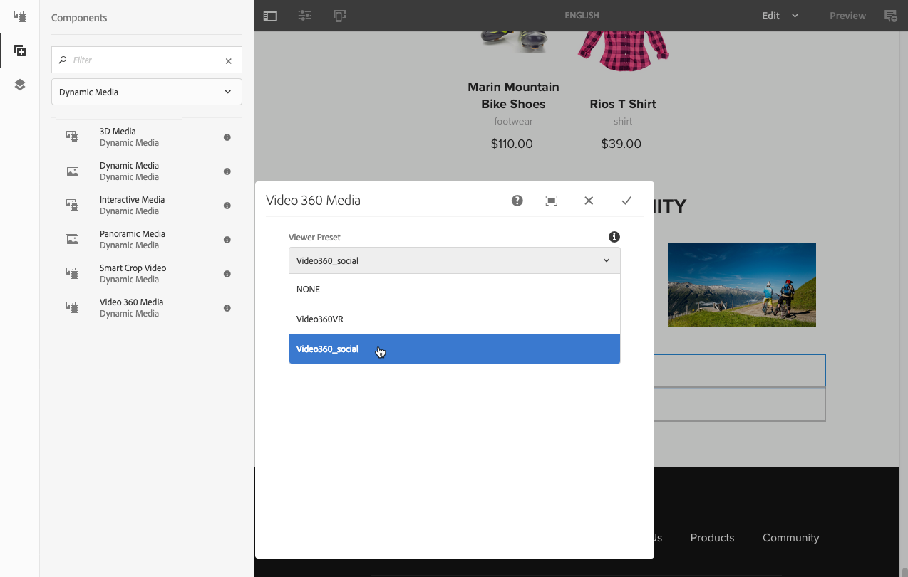

# 将 Dynamic Media 资源添加到页面{#adding-dynamic-media-assets-to-pages}

若要将Dynamic Media功能添加到您在网站上使用的资源，您可以直接在页面上添加&#x200B;**Dynamic Media**、**Interactive Media**、**Media**&#x200B;或&#x200B;**Video 360 Media**&#x200B;组件。 您可以通过进入布局模式并启用Dynamic Media组件来添加组件。 然后，您可以将这些组件添加到页面，并将资产添加到该组件。 Dynamic media组件是智能的——它们知道您添加的是图像还是视频，可用的配置选项会相应地发生更改。

如果您使用Dynamic Media作为WCM，则可以直接将Adobe Experience Manager资源添加到页面。 如果您为 WCM 使用第三方，请[链接](/help/assets/linking-urls-to-yourwebapplication.md)或[嵌入](/help/assets/embed-code.md)资产。有关响应式第三方网站，请参阅[将优化的图像交付到响应式网站](/help/assets/responsive-site.md)。

>[!NOTE]
>
>在将资源添加到Experience Manager中的页面之前，请务必先发布资源。 请参阅[Publish Dynamic Media资源](/help/assets/publishing-dynamicmedia-assets.md)。

## 将Dynamic Media组件添加到页面 {#adding-a-dynamic-media-component-to-a-page}

向页面添加3D媒体、Dynamic Media、Interactive Media、Media Panoramic Media、Smart Crop Video或Video 360 Media组件与向任何页面添加组件相同。 以下部分介绍了Dynamic Media组件。

**要将Dynamic Media组件添加到页面，请执行以下操作：**

1. 在Experience Manager中，打开要添加Dynamic Media组件的页面。
1. 在页面左侧的面板中（如有必要，切换侧面板的显示），选择&#x200B;**[!UICONTROL 组件]**&#x200B;图标。
1. 在&#x200B;**[!UICONTROL 组件]**&#x200B;标题下，在下拉列表中选择&#x200B;**[!UICONTROL Dynamic Media]**。

   如果没有可用的Dynamic Media组件列表，则必须启用要使用的Dynamic Media组件。 请参阅[启用Dynamic Media组件](#enabling-dynamic-media-components)。

   

1. 将您要使用的&#x200B;**[!UICONTROL Dynamic Media]**&#x200B;组件拖放到页面上所需的位置。

1. 将鼠标指针直接悬停在组件上。 当组件被蓝色框包围时，选择一次以显示组件的工具栏。 选择&#x200B;**[!UICONTROL 配置（扳手）]**&#x200B;图标。

   

1. 根据您拖放到页面上的Dynamic Media组件，将会打开配置对话框。 [根据需要设置组件的选项](/help/assets/adding-dynamic-media-assets-to-pages.md#dynamic-media-components)。

   下面的示例显示了Dynamic Media **[!UICONTROL Video 360 Media]**&#x200B;组件对话框以及“查看器预设”下拉列表中可用的选项。

   

   Dynamic Media Video 360媒体组件。

1. 完成后，在对话框的右上角，选中复选标记以保存更改。

### 启用Dynamic Media组件 {#enabling-dynamic-media-components}

如果没有可添加到页面的Dynamic Media组件，则可能意味着您必须首先启用要使用的组件。

**要启用Dynamic Media组件：**

1. 在Experience Manager中，打开要添加Dynamic Media组件的页面。
1. 在靠近页面顶部的工具栏左侧，选择“页面信息”图标，然后从下拉列表中选择&#x200B;**[!UICONTROL 编辑模板]**。

   

1. 在靠近页面顶部的工具栏右侧，从下拉列表中选择&#x200B;**[!UICONTROL 结构]**。

   

1. 在页面底部附近，选择&#x200B;**[!UICONTROL 布局容器]**&#x200B;以打开其工具栏，然后选择“策略”图标。
1. 在&#x200B;**[!UICONTROL 布局容器]**&#x200B;页面的&#x200B;**[!UICONTROL 属性]**&#x200B;标题下，确保选中&#x200B;**[!UICONTROL 允许的组件]**&#x200B;选项卡。

   

1. 滚动直到看到&#x200B;**[!UICONTROL Dynamic Media]**&#x200B;为止。
1. 选择&#x200B;**[!UICONTROL Dynamic Media]**&#x200B;左侧的>图标以展开列表，然后选择要启用的Dynamic Media组件。

   

1. 在&#x200B;**[!UICONTROL 布局容器]**&#x200B;页面的右上角附近，选择“完成”（复选标记）图标。

1. 在靠近页面顶部的工具栏右侧，从下拉列表中选择&#x200B;**[!UICONTROL 初始内容]**，然后照常[将Dynamic Media组件添加到页面](#adding-a-dynamic-media-component-to-a-page)。

## 本地化Dynamic Media组件 {#localizing-dynamic-media-components}

您可以通过以下两种方式之一本地化Dynamic Media组件：

* 在“站点”的网页中，打开“属 **[!UICONTROL 性]** ”，然后选择“ **[!UICONTROL 高级]** ”选项卡。 选择所需的本地化语言。

  

* 从站点选择器中，选择所需的页面或页面组。 选择&#x200B;**[!UICONTROL 属性]**&#x200B;并选择&#x200B;**[!UICONTROL 高级]**&#x200B;选项卡。 选择所需的本地化语言。

  >[!NOTE]
  >
  >并非当前已分配&#x200B;**[!UICONTROL 语言]**&#x200B;菜单中的所有可用语言。

## Dynamic Media组件 {#dynamic-media-components}

当您选择&#x200B;**[!UICONTROL 组件]**&#x200B;图标，然后在&#x200B;**[!UICONTROL Dynamic Media]**&#x200B;上筛选时，Dynamic Media组件可用。

可用的Dynamic Media组件包括：

* **[!UICONTROL Dynamic Media]** - 用于图像、视频、电子目录和旋转集等资产。
* **[!UICONTROL 交互式媒体]** — 用于任何交互式资产，例如交互式视频、交互式图像或传送集。
* **[!UICONTROL 全景媒体]** — 用于全景图像或全景VR图像资源。
* **[!UICONTROL Video 360媒体]** — 用于360视频和360 VR视频资产。

>[!NOTE]
>
>默认情况下，这些组件不可用；在使用它们之前，必须通过模板编辑器使其可用。 [在模板编辑器中](/help/sites-authoring/templates.md#editing-templates-template-authors)提供这些组件后，您可以像添加任何其他Experience Manager组件一样将这些组件添加到您的页面。

### Dynamic Media组件 {#dynamic-media-component}

Dynamic Media组件是智能的。 无论您是添加图像还是添加视频，您都有各种选项。 该组件支持图像预设、基于图像的查看器（如图像集、旋转集、混合媒体集和视频）。 此外，查看器具有响应性 — 屏幕大小根据屏幕大小自动更改。 所有查看者均为HTML5查看者。

>[!NOTE]
>
>如果您的网页具有以下内容：
>
>* 正在同一页面上使用的多个Dynamic Media组件实例。
>* 每个实例使用相同的资源类型。
>
>不支持为该页面上的每个Dynamic Media组件分配不同的查看器预设。
>
>但是，您可以为页面内使用相同类型资产的所有Dynamic Media组件使用相同的查看器预设。

添加Dynamic Media组件，**[!UICONTROL Dynamic Media设置]**&#x200B;为空或无法正确添加资源时，请检查以下内容：

* 您已启用[Dynamic Media](/help/assets/config-dynamic.md)。 默认情况下，Dynamic Media处于禁用状态。
* 图像具有金字塔tiff文件。 在启用Dynamic Media之前导入的图像没有金字塔tiff文件。

#### 使用图像时 {#when-working-with-images}

通过Dynamic Media组件，可添加动态图像，包括图像集、旋转集和混合媒体集。 您可以放大、缩小旋转集中的图像或从其他类型的旋转集中选择图像（如果适用）。

还可直接在组件中配置查看器预设、图像预设或图像格式。 要使图像具有响应性，您可以设置断点或应用响应式图像预设。

通过选择组件中的&#x200B;**[!UICONTROL 编辑]**&#x200B;图标，然后选择&#x200B;**[!UICONTROL Dynamic Media设置]**&#x200B;来编辑以下Dynamic Media设置。

>[!NOTE]
>
>默认情况下，Dynamic media图像组件是自适应的。 如果要使其变为固定大小，请在“高级”选项卡的组件中设置 **[!UICONTROL 它]** ，并使用“宽度”和“高 **** 度” ****。

* **[!UICONTROL 查看器预设]** — 从下拉菜单中选择现有的查看器预设。 如果您要查找的查看器预设不可见，则必须使其可见。 请参阅[管理查看器预设](/help/assets/managing-viewer-presets.md)。 如果您使用的是图像预设，则无法选择查看器预设，反之亦然。

  如果要查看图像集、旋转集或混合媒体集，此选项是唯一可用选项。 显示的查看器预设是智能的 — 仅显示相关的查看器预设。

* **[!UICONTROL 查看器修饰符]** — 查看器修饰符采用名称=值对与&amp;分隔符的形式，允许您更改查看器，如《查看器参考指南》中所述。 例如，查看器修饰符为`posterimage=img.jpg&caption=text.vtt,1`，该修饰符为视频缩略图设置不同的图像并将隐藏式字幕文件与视频关联。

* **[!UICONTROL 图像预设]** — 从下拉菜单中选择现有的图像预设。 如果您要查找的图像预设不可见，则必须使其可见。 请参阅管理图像预设。 如果您使用的是图像预设，则无法选择查看器预设，反之亦然。

  如果要查看图像集、旋转集或混合媒体集，则此选项不可用。

* **[!UICONTROL 图像修饰符]** — 您可以通过提供其他图像命令来应用图像效果。 这些效果在图像预设和图像服务命令参考中进行了描述。

  如果要查看图像集、旋转集或混合媒体集，则此选项不可用。

* **[!UICONTROL 断点]** — 如果您在响应式网站上使用此资源，则必须添加图像断点。 图像断点由逗号(，)分隔。 当图像预设中未定义高度或宽度时，此选项有效。

  如果要查看图像集、旋转集或混合媒体集，则此选项不可用。

  您可以通过选择组件中的&#x200B;**[!UICONTROL 编辑]**&#x200B;来编辑以下高级设置。

* **[!UICONTROL 针对更高分辨率的设备进行优化]** — 选中（默认）该复选框以允许DPR（设备像素比）优化。

  仅当满足以下条件时，才会显示&#x200B;**[!UICONTROL 为更高分辨率的设备优化]**&#x200B;选项：

   * 在预设类型下，已选择&#x200B;**[!UICONTROL 图像预设]**，并从&#x200B;**[!UICONTROL 图像预设]**&#x200B;下拉列表中选择&#x200B;**[!UICONTROL RESS_IP]**。

  图像预设的

  另请参阅[关于设备像素比优化](/help/assets/imaging-faq.md#dpr)。 任何Adobe Experience Manager Dynamic Media智能成像DPR值都将被忽略。

* **[!UICONTROL 标题]** — 更改图像的标题。

* **[!UICONTROL 替换文本]** — 为已关闭图形的用户在图像中添加标题。

  如果要查看图像集、旋转集或混合媒体集，则此选项不可用。

* **[!UICONTROL URL，在]**&#x200B;中打开 — 您可以将资产设置为打开链接。 设置URL，并在&#x200B;**在**&#x200B;中打开以指示您希望它是在同一窗口中打开还是在新窗口中打开。

  如果要查看图像集、旋转集或混合媒体集，则此选项不可用。

* **[!UICONTROL 宽度]** — 如果希望图像为固定大小，请输入像素值。 将此值保留为空可使资源具有自适应性。

* **[!UICONTROL 高度]** — 如果希望图像为固定大小，请输入像素值。 将此值保留为空可使资源具有自适应性。

#### 使用视频时 {#when-working-with-video}

使用Dynamic Media组件向网页添加动态视频。 编辑组件时，您可以选择使用预定义的视频查看器预设来播放页面上的视频。

通过在组件中选择&#x200B;**[!UICONTROL 编辑]**&#x200B;来编辑以下Dynamic Media设置。

>[!NOTE]
>
>默认情况下，Dynamic Media视频组件是自适应的。 如果要使其变为固定大小，请在&#x200B;**[!UICONTROL 高级]**&#x200B;选项卡中具有&#x200B;**[!UICONTROL 宽度]**&#x200B;和&#x200B;**[!UICONTROL 高度]**&#x200B;的组件中设置它。

* **[!UICONTROL 查看器预设]** — 从下拉菜单中选择现有的视频查看器预设。 如果您要查找的查看器预设不可见，则必须使其可见。 请参阅[管理查看器预设](/help/assets/managing-viewer-presets.md)。

* **[!UICONTROL 查看器修饰符]** — 查看器修饰符采用名称=值对与&amp;分隔符的形式，允许您更改查看器，如Adobe查看器参考指南中所述。 例如，查看器修饰符为`posterimage=img.jpg&caption=text.vtt,1`

  例如，使用查看器修饰符，您可以执行以下操作：

   * 将字幕文件与视频关联：[字幕](https://experienceleague.adobe.com/docs/dynamic-media-developer-resources/library/viewers-aem-assets-dmc/video/command-reference-url-video/r-html5-video-viewer-url-caption.html)
   * 将导航文件与视频关联： [导航](https://experienceleague.adobe.com/docs/dynamic-media-developer-resources/library/viewers-aem-assets-dmc/video/command-reference-url-video/r-html5-video-viewer-url-navigation.html)

     您可以通过选择组件中的&#x200B;**[!UICONTROL 编辑]**&#x200B;来编辑以下高级设置。

* **[!UICONTROL 标题]** — 更改视频的标题。

* **[!UICONTROL 宽度]** — 如果希望图像为固定大小，请输入像素值。 将此值保留为空可使资源具有自适应性。

* **[!UICONTROL 高度]** — 如果希望图像为固定大小，请输入像素值。 将此值保留为空可使资源具有自适应性。

#### 使用智能裁剪时 {#when-working-with-smart-crop}

使用Dynamic Media组件将智能裁剪图像资源添加到您的网页。 编辑组件时，您可以选择使用预定义的视频查看器预设来播放页面上的视频。

另请参阅[图像配置文件](/help/assets/image-profiles.md)。

通过选择组件中的&#x200B;**[!UICONTROL 编辑]**&#x200B;来编辑以下Dynamic Media设置。

>[!NOTE]
>
>默认情况下，Dynamic media图像组件是自适应的。 如果要使其变为固定大小，请在“高级”选项卡的组件中设置 **[!UICONTROL 它]** ，并使用“宽度”和“高 **** 度” ****。

* **[!UICONTROL 图像修饰符]** — 您可以通过提供其他图像命令来应用图像效果。 这些效果在图像预设和图像服务命令参考中进行了描述。

  如果要查看图像集、旋转集或混合媒体集，则此选项不可用。

  您可以通过选择组件中的&#x200B;**[!UICONTROL 编辑]**&#x200B;来编辑以下高级设置。

* **[!UICONTROL 启用宽高比匹配]** — 要让Dynamic Media选取一个宽高比最符合原始图像宽高比的智能裁剪演绎版，请选择此选项。

* **[!UICONTROL 针对更高分辨率的设备进行优化]** — 选中（默认）该复选框以允许DPR（设备像素比）优化。

  仅当满足以下条件时，才会显示&#x200B;**[!UICONTROL 为更高分辨率的设备优化]**&#x200B;选项：

   * 在预设类型下，已选择&#x200B;**[!UICONTROL 智能裁切]**&#x200B;选项。

  智能裁剪的

  另请参阅[关于设备像素比优化](/help/assets/imaging-faq.md#dpr)。 任何Adobe Experience Manager Dynamic Media智能成像DPR值都将被忽略。

* **[!UICONTROL 标题]** — 更改智能裁剪图像的标题。

* **[!UICONTROL 替换文本]** — 为已关闭图形的用户向智能裁剪图像添加标题。

  如果要查看图像集、旋转集或混合媒体集，则此选项不可用。

* **[!UICONTROL URL，在]**&#x200B;中打开 — 您可以将资产设置为打开链接。 在的“打开”中设置URL并指示您是要在同一窗口中打开还是要在新窗口中打开。

  如果要查看图像集、旋转集或混合媒体集，则此选项不可用。

* **[!UICONTROL 宽度]** — 如果希望图像为固定大小，请输入像素值。 将此值保留为空可使资源具有自适应性。

* **[!UICONTROL 高度]** — 如果希望图像为固定大小，请输入像素值。 将此值保留为空可使资源具有自适应性。

### 交互式媒体组件 {#interactive-media-component}

交互式媒体组件适用于具有交互性的资产，例如热点或图像映射。 如果您有交互式图像、交互式视频或传送横幅，请使用&#x200B;**[!UICONTROL 交互式媒体]**&#x200B;组件。

交互式媒体组件是智能的。 无论您是添加图像还是添加视频，您都有各种选项。 此外，查看器具有响应性 — 屏幕大小根据屏幕大小自动更改。 所有查看者均为HTML5查看者。

>[!NOTE]
>
>如果您的网页具有以下内容：
>
>* 同一页面上正在使用交互式媒体组件的多个实例。
>* 每个实例使用相同的资源类型。
>
>不支持为该页面上的每个交互式媒体组件分配不同的查看器预设。
>
>但是，您可以为页面内使用相同类型资产的所有交互式媒体组件使用相同的查看器预设。

通过选择组件中的&#x200B;**[!UICONTROL 编辑]**，可以编辑以下&#x200B;**[!UICONTROL 常规]**&#x200B;设置。

* **[!UICONTROL 查看器预设]** — 从下拉菜单中选择现有的查看器预设。 如果您要查找的查看器预设不可见，则必须使其可见。 必须先发布查看器预设，然后才能使用它们。 请参阅管理查看器预设。

* **[!UICONTROL 标题]** — 更改视频的标题。

* **[!UICONTROL 宽度]** — 如果希望图像为固定大小，请输入像素值。 将此值保留为空可使资源具有自适应性。

* **[!UICONTROL 高度]** — 如果希望图像为固定大小，请输入像素值。 将此值保留为空可使资源具有自适应性。

  您可以通过选择组件中的&#x200B;**[!UICONTROL 编辑]**&#x200B;来编辑以下&#x200B;**[!UICONTROL 添加到购物车]**&#x200B;设置。

* **[!UICONTROL 显示产品资产]** — 默认情况下选中此值。 产品资产会显示在Commerce模块中定义的产品图像。 清除复选标记，这样产品资产就不会显示。

* **[!UICONTROL 显示产品价格]** — 默认选择此值。 产品价格显示Commerce模块中定义的项目价格。 清除复选标记，这样就不会显示产品价格。

* **[!UICONTROL 显示产品表单]** — 默认情况下，未选择此值。 产品表单包括任何产品变体，如大小和颜色。 清除复选标记，以便不显示产品变型。

### 全景媒体组件 {#panoramic-media-component}

全景媒体组件适用于那些是球面全景图像的资源。 此类图像可提供房间、财产、位置或景观的360度观看体验。 要使图像符合球面全景的条件，该图像必须具有以下一项或两项之一：

* 长宽比为2:1。
* 已用关键字`equirectangular`或(`spherical` + `panorama`)或(`spherical` + `panoramic`)标记。 请参阅[使用标记](/help/sites-authoring/tags.md)。

纵横比和关键字条件都适用于资产详细信息页面和&#x200B;**[!UICONTROL 全景媒体]** WCM 组件的全景资产。

>[!NOTE]
>
>如果您的网页具有以下内容：
>
>* 正在同一页面上使用&#x200B;**[!UICONTROL 全景媒体]**&#x200B;组件的多个实例。
>* 每个实例使用相同的资源类型。
>
>不支持为该页面上的每个&#x200B;**[!UICONTROL 全景媒体]**&#x200B;组件分配不同的查看器预设。
>
>但是，您可以为页面内使用相同类型资产的所有全景媒体组件使用相同的查看器预设。

您可以通过选择组件中的&#x200B;**[!UICONTROL 配置]**&#x200B;来编辑以下设置。

* **[!UICONTROL 查看器预设]** — 从“查看器预设”下拉菜单中选择现有查看器。

如果您查找的查看器预设不可见，请检查以确保其已发布。 Publish查看器预设。 请参阅[管理查看器预设](/help/assets/managing-viewer-presets.md)。

### 视频360媒体组件 {#video-media-component}

使用&#x200B;**[!UICONTROL Video 360 Media]**&#x200B;组件在网页上渲染等长方形视频，获得房间、财产、位置、景观或医疗过程的沉浸式观看体验。

在平面显示器上播放期间，用户可控制视角；在移动设备上播放通常使用内置的陀螺仪控制。

查看器包含对360个视频资产交付的本机支持。 默认情况下，查看或播放无需其他配置。 您可以使用标准视频扩展名(如.mp4、.mkv和.mov)来交付360视频。 最常见的编解码器是H.264。

您可以通过选择组件中的&#x200B;**[!UICONTROL 配置]**&#x200B;来编辑以下设置。

* **[!UICONTROL 查看器预设]** — 从“查看器预设”下拉菜单中选择现有查看器。 对于使用虚拟现实眼镜的最终用户，请使用`Video360VR`。 它包括基本的视频播放控件和社交媒体功能。 使用包含基本视频播放控件的`Video360_social`。 视频渲染在立体声模式下完成。 手动视点控制已关闭，但陀螺控制已打开。 没有社交媒体功能。

如果您查找的查看器预设不可见，请检查以确保其已发布。 确保在使用查看器预设之前发布这些预设。 请参阅[管理查看器预设](/help/assets/managing-viewer-presets.md)。

### 使用HTTP/2交付Dynamic Media资源 {#using-http-to-delivery-dynamic-media-assets}

HTTP/2是新的、更新的Web协议，它改进了浏览器和服务器的通信方式。 它提供了更快的信息传输速度并减少所需的处理能力。 Dynamic Media资源的交付现在可以通过HTTP/2进行，从而缩短响应时间和加载时间。

有关将HTTP/2与Dynamic Media帐户结合使用的完整详细信息，请参阅[HTTP2内容交付](/help/assets/http2.md)。

>[!MORELIKETHIS]
>
>* [在Experience ManagerDynamic Media中使用视频播放器](https://experienceleague.adobe.com/docs/experience-manager-learn/assets/dynamic-media/video/dynamic-media-video-player-feature-video-use.html)
>* [在Experience ManagerDynamic Media中使用交互式视频](https://experienceleague.adobe.com/docs/experience-manager-learn/assets/dynamic-media/video/dynamic-media-interactive-video-feature-video-use.html)
>* [了解具有Experience ManagerDynamic Media的资源查看器](https://experienceleague.adobe.com/docs/experience-manager-learn/assets/dynamic-media/viewers/dynamic-media-viewer-feature-video-understand.html)
>* [在Experience ManagerDynamic Media中使用自定义视频缩略图](https://experienceleague.adobe.com/docs/experience-manager-learn/assets/dynamic-media/video/dynamic-media-video-thumbnails-feature-video-use.html)
>* [了解Dynamic MediaExperience Manager的色彩管理](https://experienceleague.adobe.com/docs/experience-manager-learn/assets/dynamic-media/images/dynamic-media-color-management-technical-video-setup.html)
>* [在Experience ManagerDynamic Media中使用图像锐化](https://experienceleague.adobe.com/docs/experience-manager-learn/assets/dynamic-media/images/dynamic-media-image-sharpening-feature-video-use.html)
