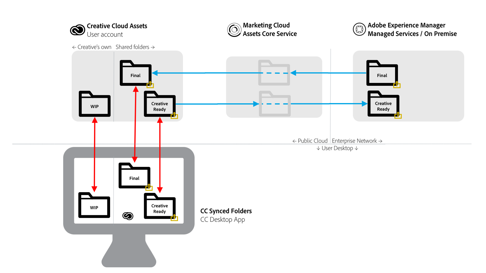

# [!DNL Adobe Experience Manager]到[!DNL Adobe Creative Cloud]文件夹共享 {#aem-to-creative-cloud-folder-sharing-best-practices}

>[!CAUTION]
>
>已弃用[!DNL Experience Manager]到[!DNL Creative Cloud]文件夹共享功能。 Adobe建议使用较新的功能，如[AdobeAsset Link](https://helpx.adobe.com/cn/enterprise/using/adobe-asset-link.html)或[Experience Manager桌面应用程序](https://experienceleague.adobe.com/docs/experience-manager-desktop-app/using/using.html)。 在[Experience Manager和Creative Cloud集成最佳实践](/help/assets/aem-cc-integration-best-practices.md)中了解更多信息。

可以将[!DNL Adobe Experience Manager]配置为允许[!DNL Assets]中的用户与[!DNL Adobe Creative Cloud]应用的用户共享文件夹，以便这些文件夹在[!DNL Adobe Creative Cloud]资源服务中作为共享文件夹使用。 此功能可用于在创意团队和[!DNL Assets]用户之间交换文件，尤其是当创意用户无权访问[!DNL Assets]部署（他们不在企业网络上）时。

此类型的集成可用于以下用例，特别是当使用无法直接访问[!DNL Assets]的用户时：

* [!DNL Assets]用户与[!DNL Adobe Creative Cloud]个文件的用户共享一组特定的数字资产（例如，为新的营销活动的设计工作提供创意简报和一组批准的资产）。
* [!DNL Assets]用户收到[!DNL Adobe Creative Cloud]应用用户创建的新文件。

>[!NOTE]
>
>在阅读本文档之前，您可以查看整个[Experience Manager和Creative Cloud集成最佳实践](/help/assets/aem-cc-integration-best-practices.md)以了解集成概述。

## 概述 {#overview}

[!DNL Experience Manager]到[!DNL Creative Cloud]的文件夹共享依赖于[!DNL Assets]和[!DNL Creative Cloud]帐户之间文件夹和文件的服务器端共享。 在其桌面上使用[!DNL Creative Cloud]桌面应用程序的创意专业人士还可以使用[!DNL Adobe CreativeSync]技术直接在其磁盘上提供共享文件夹。

下图提供了集成的概述。

该集成包括以下元素：

* 在企业网络(Managed Services或内部部署)中部署了&#x200B;**[!DNL Experience Manager Assets]**：已在此处启动文件夹共享。
* **[!DNL Adobe Experience Cloud Assets]核心服务**：充当介于[!DNL Experience Manager]和[!DNL Creative Cloud]存储服务之间的中介。 使用该集成的组织管理员必须在Experience Cloud组织与[!DNL Assets]部署之间建立信任关系。 他们还[定义了一个已批准的Creative Cloud协作者列表](https://experienceleague.adobe.com/docs/core-services/interface/services/assets/t-admin-add-cc-user.html)，为了增加安全性，[!DNL Assets]用户也可以共享文件夹。

* **[!DNL Creative Cloud]Assets Web服务** （存储空间和[!DNL Creative Cloud]文件Web UI）：在这里，共享了[!DNL Assets]文件夹的特定Creative Cloud应用程序用户将能够接受邀请并在其Creative Cloud帐户存储中看到该文件夹。
* **Creative Cloud桌面应用程序**： （可选）允许通过与[!DNL Creative Cloud] Assets存储同步，从创意用户的桌面直接访问共享文件夹/文件。

## 特性和限制 {#characteristics-and-limitations}

* **更改的单向传播：**&#x200B;文件更改仅在一个方向上传播 — 从最初创建（上传）资产的系统（[!DNL Experience Manager]或[!DNL Creative Cloud Assets]）。 集成不提供两个系统之间的完全自动化的双向同步。
* **版本控制：**

   * 如果文件源自[!DNL Experience Manager]并在其中更新，则[!DNL Experience Manager]仅在更新时创建资产的版本。
   * [!DNL Creative Cloud] Assets提供它自己的[版本控制功能](https://helpx.adobe.com/creative-cloud/help/versioning-faq.html)，该功能面向工作进行中的更新（基本上，最多可存储10天的更新）

* **空间限制：**&#x200B;所交换文件的大小和卷受创意Creative Cloud的特定[Assets配额](https://helpx.adobe.com/creative-cloud/kb/file-storage-quota.html)的限制（取决于订阅级别）和最大文件大小5 GB的限制。 空间还受到组织在Adobe Experience Cloud Assets核心服务中拥有的资源配额的限制。

* **空间要求：**&#x200B;共享文件夹中的文件还必须物理存储在[!DNL Experience Manager]中，然后存储在[!DNL Creative Cloud]帐户中，并在[!DNL Experience Cloud Assets]核心服务中缓存副本。
* **网络和带宽：**&#x200B;共享文件夹中的文件和所有更新必须通过网络在系统之间传输。 确保仅共享相关文件和更新。
* **文件夹类型**：在[!DNL Adobe Experience Cloud]中共享的上下文中不支持共享类型为`sling:OrderedFolder`的[!DNL Assets]文件夹。 如果要共享文件夹，在[!DNL Assets]中创建该文件夹时，请不要选择[!UICONTROL 已排序]选项。

## 最佳实践 {#best-practices}

使用[!DNL Experience Manager]到[!DNL Creative Cloud]文件夹共享的最佳实践包括：

* **卷注意事项：** [!DNL Experience Manager]和[!DNL Creative Cloud]文件夹共享应该用于共享较小数量的文件，例如，与特定促销活动或活动相关的文件。 要共享更大的资产集（如组织中所有批准的资产），请使用其他分发方法（例如，[!DNL Assets Brand Portal]）或[!DNL Experience Manager]桌面应用程序。
* **避免共享深层层次结构：**&#x200B;共享以递归方式工作，不允许选择性取消共享。 通常，只应考虑没有子文件夹或层次结构较浅（如一个子文件夹级别）的文件夹进行共享。
* **用于单向共享的单独文件夹：**&#x200B;应该使用单独的文件夹共享从[!DNL Assets]到[!DNL Creative Cloud]文件的最终资源，以及将创意就绪的资源从[!DNL Creative Cloud]文件共享回[!DNL Assets]。 再加上这些文件夹的良好命名约定，它为[!DNL Assets]和[!DNL Creative Cloud]用户都创建了一个更容易理解的工作环境。
* **避免共享文件夹中的WIP：**&#x200B;不要将共享文件夹用于正在进行的工作 — 在Creative Cloud文件中使用单独的文件夹来执行需要频繁更改文件的工作。
* **在共享文件夹之外启动新工作：**&#x200B;新设计（创意文件）应在Creative Cloud文件的单独WIP文件夹中启动，当它们准备好与[!DNL Assets]用户共享时，应将其移动或保存到共享文件夹。
* **简化共享结构：**&#x200B;要获得更易于管理的操作设置，请考虑简化共享结构。 不应与所有创意用户共享，而应仅与团队代表（如创意总监或团队经理）共享[!DNL Assets]文件夹。 创意方面的经理将接收最终资产，决定工作分配，然后让设计人员在其自己的Creative Cloud帐户中处理WIP资产。 他们可以使用Creative Cloud协作功能协调工作，最后选择准备共享回[!DNL Assets]的资源并将其放入其创意就绪的共享文件夹中。

下图说明了基于[!DNL Assets]中的现有最终资源创建设计的示例配置。

