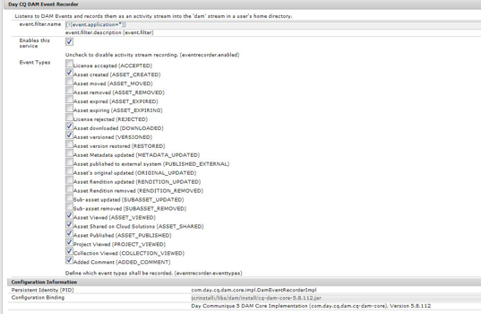
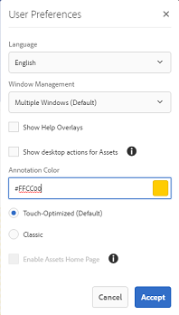

# [!DNL Adobe Experience Manager Assets]主页体验 {#aem-assets-home-page-experience}

个性化[!DNL Adobe Experience Manager Assets]主页以获得丰富的欢迎屏幕体验，包括有关资产的最近活动的快照。

[!DNL Assets]主页提供了丰富且个性化的欢迎屏幕体验，其中包括最近活动的快照，例如最近查看或上传的资产。

默认情况下，[!DNL Assets]主页处于禁用状态。 要启用该功能，请执行以下步骤：

1. 打开[!DNL Experience Manager]配置管理器`https://[aem_server]:[port]/system/console/configMgr`。
1. 打开&#x200B;**[!UICONTROL Day CQ DAM事件记录器]**&#x200B;服务。
1. 选择&#x200B;**[!UICONTROL 启用此服务]**&#x200B;以启用活动录制。

   

1. 从&#x200B;**[!UICONTROL 事件类型]**&#x200B;列表中，选择要记录的事件，并保存更改。

   >[!CAUTION]
   >
   >启用“已查看资产”、“已查看项目”和“已查看收藏集”选项会显着增加记录的事件数。

1. 从Configuration Manager `https://[aem_server]:[port]/system/console/configMgr`中打开&#x200B;**[!UICONTROL DAM资产主页功能标志]**&#x200B;服务。
1. 选择`isEnabled.name`选项以启用[!DNL Assets]主页功能。 保存更改。

   

1. 打开&#x200B;**[!UICONTROL 用户首选项]**&#x200B;对话框，然后选择&#x200B;**[!UICONTROL 启用Assets主页]**。 保存更改。

   

启用[!DNL Assets]主页后，从导航页面导航到[!DNL Assets]用户界面，或直接从URL `https://[aem_server]:[port]/aem/assetshome.html/content/dam`访问它。

单击&#x200B;**[!UICONTROL 单击此处配置您的体验链接]**&#x200B;以添加您的用户名、背景图像和配置文件图像。

[!DNL Assets]主页包含以下部分：

* 欢迎部分
* 构件部分

**欢迎节**

如果您的配置文件存在，“欢迎”部分将显示一则发送给您的欢迎消息。 此外，它会显示您的个人资料图片和欢迎图像（如果已配置）。

如果您的配置文件不完整，欢迎部分将显示通用欢迎消息和配置文件图片的占位符。

**小组件部分**

此部分显示在欢迎部分下方，并在以下部分下显示现成的构件：

* 活动
* 最近
* 发现

**活动**：在此部分下，**[!UICONTROL 我的活动]**&#x200B;构件显示登录用户最近使用资产（包括没有演绎版的资产）执行的活动，例如，资产上传、下载、资产创建、编辑、评论、注释和共享。

**最近**：此分区下的&#x200B;**[!UICONTROL 最近查看的项目]**&#x200B;小组件显示登录用户最近访问的实体，包括文件夹、收藏集和项目。

**发现**：此部分下的&#x200B;**[!UICONTROL 新]**&#x200B;构件显示最近上载到[!DNL Assets]部署的资源和演绎版。

要启用清除用户活动数据，请从配置管理器中启用&#x200B;**[!UICONTROL DAM事件清除服务]**。 启用此服务后，系统会删除登录用户超出指定数量的活动。

“欢迎”屏幕提供了简单的导航帮助，例如，工具栏上的图标可访问文件夹、收藏集和目录。

>[!NOTE]
>
>启用[!UICONTROL Day CQ DAM事件记录器]和[!UICONTROL DAM事件清除]服务会增加对JCR的写入操作和搜索索引，这会显着增加[!DNL Experience Manager]服务器上的负载。 [!DNL Experience Manager]服务器上的额外负载可能会影响其性能。

>[!CAUTION]
>
>捕获、筛选和清除[!DNL Assets]主页所需的用户活动会对性能造成额外开销。 因此，管理员应该为目标用户有效地配置主页。
>
>Adobe建议执行批量操作的管理员和用户避免使用资产主页功能，以防止用户活动增加。 此外，通过从[!UICONTROL 配置管理器]配置[!UICONTROL Day CQ DAM事件记录器]，管理员可以排除特定用户的录制活动。
>
>如果使用该功能，Adobe建议您根据服务器负载安排清除频率。
