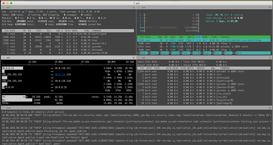

# 要監控的最佳實務 [!DNL Adobe Experience Manager Assets] 部署 {#assets-monitoring-best-practices}

從 [!DNL Experience Manager Assets] 從觀點來看，監控應包括觀察和報告以下流程和技術：

* 系統CPU
* 系統記憶體使用量
* 系統磁碟IO和IO等候時間
* 系統網路IO
* 用於棧積利用和非同步程式（例如工作流程）的JMX MBean
* OSGi主控台健康情況檢查

通常， [!DNL Experience Manager Assets] 監控方式有兩種：即時監控和長期監控。

## 即時監視 {#live-monitoring}

您應在開發的效能測試階段或高負載情況下執行即時監視，以瞭解環境的效能特性。 通常應使用一套工具來執行即時監視。 以下是一些建議：

* [Visual VM](https://visualvm.github.io/)：Visual VM可讓您檢視詳細的Java VM資訊，包括CPU使用量、Java記憶體使用量。 此外，它可讓您取樣並評估在部署上執行的程式碼。
* [上](https://man7.org/linux/man-pages/man1/top.1.html)：Top是開啟控制面板的Linux命令，其中顯示使用狀況統計資料，包括CPU、記憶體和IO使用狀況。 它提供執行個體上所發生事件的整體概觀。
* [Htop](https://hisham.hm/htop/)： Htop是互動式程式檢視器。 除了Top所提供的功能外，還提供詳細的CPU和記憶體使用量。 Htop可安裝在大多數Linux系統上，使用 `yum install htop` 或 `apt-get install htop`.

* Iotop： Iotop是磁碟IO使用情況的詳細儀表板。 它會顯示長條和公尺，描繪使用磁碟IO的處理序及其使用量。 Iotop可使用安裝在大多數Linux系統上 `yum install iotop` 或 `apt-get install iotop`.

* [Iftop](https://www.ex-parrot.com/pdw/iftop/)： Iftop顯示有關乙太網路/網路使用情況的詳細資訊。 Iftop會針對使用乙太網路的實體，顯示每個通訊通道的統計資料，以及實體使用的頻寬量。 Iftop可使用安裝在大部分的Linux系統上 `yum install iftop` 或 `apt-get install iftop`.

* Java Flight Recorder (JFR)：Oracle的商業工具，您可在非生產環境中自由使用。 如需詳細資訊，請參閱 [如何使用Java Flight Recorder來診斷CQ執行階段問題](https://cq-ops.tumblr.com/post/73865704329/how-to-use-java-flight-recorder-to-diagnose-cq).
* [!DNL Experience Manager] `error.log` 檔案：您可以調查 [!DNL Experience Manager] `error.log` 檔案以取得系統中記錄的錯誤詳細資料。 使用命令 `tail -F quickstart/logs/error.log` 以識別要調查的錯誤。
* [工作流程主控台](/help/sites-administering/workflows.md)：運用工作流程主控台來監視落後或卡住的工作流程。

通常，您會搭配使用這些工具，全面瞭解您的電腦的效能 [!DNL Experience Manager] 部署。

>[!NOTE]
>
>這些工具是標準工具，Adobe不直接支援。 它們不需要額外的授權。

*圖：使用Visual VM工具的即時監視。*

## 長期監視 {#long-term-monitoring}

長期監控 [!DNL Experience Manager] 部署涉及對即時監控的相同部分進行較長時間監控。 其中也包括定義特定於您環境的警報。

### 記錄彙總與報告 {#log-aggregation-and-reporting}

有數個工具可用於彙總記錄，例如Splunk(TM)和Elastic Search、Logstash和Kabana (ELK)。 若要評估您的應用程式的 [!DNL Experience Manager] 部署時，請務必瞭解系統特定的記錄事件，並根據這些事件建立警報。 瞭解您的開發和營運實務有助於您進一步瞭解如何調整記錄彙總程式，以產生嚴重警示。

### 環境監視 {#environment-monitoring}

環境監控包括監控以下專案：

* 網路輸送量
* 磁碟IO
* 内存
* CPU使用率
* JMX MBeans
* 外部網站

您需要外部工具(例如NewRelic(TM)和AppDynamics(TM))來監視每個專案。 使用這些工具，您可以定義系統特定的警示，例如高系統使用率、工作流程備份、健康情況檢查失敗，或未驗證網站存取權。 Adobe不建議使用任何特定工具來取代其他工具。 找到適合您的工具，並運用它來監控所討論的專案。

#### 內部應用程式監視 {#internal-application-monitoring}

內部應用程式監控包括監控組成以下專案的應用程式元件： [!DNL Experience Manager] 棧疊，包括JVM、內容存放庫，以及透過平台上建置的自訂應用程式程式碼進行監控。 一般而言，這項工作會透過JMX Mbeans執行，而許多常用的監控解決方案(例如SolarWinds (TM)、HP OpenView (TM)、Hyperic (TM)、Zabbix (TM)和其他解決方案，都可直接監控這項工作。 對於不支援直接連線至JMX的系統，您可以編寫Shell指令碼來擷取JMX資料，並以這些系統原生可理解的格式將其公開給這些系統。

預設不會啟用JMX Mbean的遠端存取。 如需透過JMX進行監控的詳細資訊，請參閱 [使用JMX技術進行監控和管理](https://docs.oracle.com/javase/7/docs/technotes/guides/management/agent.html).

在許多情況下，需要基準線來有效監控統計資料。 若要建立基準線，請在正常工作條件下觀察系統預先決定的期間，然後識別正常數度。

**JVM監視**

和任何以Java為基礎的應用程式棧疊一樣， [!DNL Experience Manager] 取決於透過基礎Java虛擬機器器向其提供的資源。 您可以透過JVM公開的Platform MXBean監控許多這些資源的狀態。 如需有關MXBean的詳細資訊，請參閱 [使用Platform MBean Server和Platform MXBean](https://docs.oracle.com/javase/7/docs/technotes/guides/management/mxbeans.html).

以下是您可以針對JVM監控的一些基準引數：

内存

* `MBean: lava.lang:type=Memory`
* URL: `/system/console/jmx/java.lang:type=Memory`
* 執行個體：所有伺服器
* 警報臨界值：當棧積或非棧積記憶體使用率超過對應最大記憶體的75%時。
* 警報定義：可能是系統記憶體不足，或是程式碼中有記憶體遺漏。 分析執行緒傾印以得出定義。

>[!NOTE]
>
>此Bean提供的資訊以位元組表示。

執行緒

* MBean： `java.lang:type=Threading`
* URL: `/system/console/jmx/java.lang:type=Threading`
* 執行個體：所有伺服器
* 警報臨界值：執行緒數目超過基準的150%時。
* 警報定義：可能是因為有作用中的失控程式，或是低效的作業會消耗大量資源。 分析執行緒傾印以得出定義。

**監視[!DNL Experience Manager]**

[!DNL Experience Manager] 也會透過JMX公開一組統計資料和作業。 這些功能有助於評估系統健康狀況，並在潛在問題影響使用者之前識別它們。 如需詳細資訊，請參閱 [檔案](/help/sites-administering/jmx-console.md) 於 [!DNL Experience Manager] JMX MBean。

以下是您可以監控的一些基準線引數 [!DNL Experience Manager]：

復寫代理

* MBean： `com.adobe.granite.replication:type=agent,id="<AGENT_NAME>"`
* URL: `/system/console/jmx/com.adobe.granite.replication:type=agent,id="<AGENT_NAME>"`
* 執行個體：一個作者和所有發佈執行個體（適用於排清代理程式）
* 警報臨界值：當 `QueueBlocked` 是 `true` 或的值 `QueueNumEntries` 大於基準的150%。

* 警報定義：系統中存在封鎖的佇列，表示複製目標已關閉或無法連線。 網路或基礎架構問題通常會造成過多專案排入佇列，進而對系統效能造成負面影響。

>[!NOTE]
>
>對於MBean和URL引數，請取代 `<AGENT_NAME>` 包含您要監督之復寫代理程式的名稱。

工作階段計數器

* MBean： `org.apache.jackrabbit.oak:id=7,name="OakRepository Statistics",type="RepositoryStats"`
* URL： */system/console/jmx/org.apache.jackrabbit.oak：id=7，name=&quot;OakRepository Statistics&quot;，type*=&quot;RepositoryStats&quot;
* 執行個體：所有伺服器
* 警報臨界值：當開啟的工作階段超過基準線50%以上時。
* 警報定義：工作階段可透過程式碼片段開啟，但永不關閉。 隨著時間推移，這種情況可能會慢慢發生，最終導致系統中的記憶體流失。 雖然系統上的工作階段數量會波動，但不應持續增加。

运行状况检查

可在下列位置使用的健康情況檢查： [操作控制面板](/help/sites-administering/operations-dashboard.md#health-reports) 有對應的JMX MBean用於監視。 不過，您可以撰寫自訂健康情況檢查來公開其他系統統計資料。

以下是一些現成的健康情況檢查，這些檢查對監控很有幫助：

* 系统检查
   * MBean： `org.apache.sling.healthcheck:name=systemchecks,type=HealthCheck`
   * URL: `/system/console/jmx/org.apache.sling.healthcheck:name=systemchecks,type=HealthCheck`
   * 例項：單一作者，所有發佈伺服器
   * 警報臨界值：當狀態不是「正常」時
   * 警報定義：其中一個量度的狀態為WARN或CRITICAL。 檢查記錄屬性以取得問題原因的詳細資訊。

* 復寫佇列

   * MBean： `org.apache.sling.healthcheck:name=replicationQueue,type=HealthCheck`
   * URL: `/system/console/jmx/org.apache.sling.healthcheck:name=replicationQueue,type=HealthCheck`
   * 例項：單一作者，所有發佈伺服器
   * 警報臨界值：當狀態不是「正常」時
   * 警報定義：其中一個量度的狀態為WARN或CRITICAL。 檢查記錄屬性，以取得造成問題的佇列詳細資訊。

* 回應效能

   * MBean： `org.apache.sling.healthcheck:name=requestsStatus,type=HealthCheck`
   * URL: `/system/console/jmx/org.apache.sling.healthcheck:name=requestsStatus,type=HealthCheck`
   * 執行個體：所有伺服器
   * 警示持續時間：狀態不是「正常」時
   * 警報定義：其中一個測量結果的狀態為WARN或CRITICAL。 檢查記錄屬性，以取得造成問題的佇列詳細資訊。

* 查詢效能

   * MBean： `org.apache.sling.healthcheck:name=queriesStatus,type=HealthCheck`
   * URL: `/system/console/jmx/org.apache.sling.healthcheck:name= queriesStatus,type=HealthCheck`
   * 例項：單一作者，所有發佈伺服器
   * 警報臨界值：當狀態不是「正常」時
   * 警報定義：一或多個查詢在系統中執行緩慢。 檢查記錄屬性，以取得導致問題的查詢的詳細資訊。

* 活动包

   * MBean： `org.apache.sling.healthcheck:name=inactiveBundles,type=HealthCheck`
   * URL: `/system/console/jmx/org.apache.sling.healthcheck:name=inactiveBundles,type=HealthCheck`
   * 執行個體：所有伺服器
   * 警報臨界值：當狀態不是「正常」時
   * 警報定義：系統上存在非使用中或未解析的OSGi組合。 檢查記錄屬性，以取得導致問題的套件組合的相關資訊。

* 日志错误

   * MBean： `org.apache.sling.healthcheck:name=logErrorHealthCheck,type=HealthCheck`
   * URL: `/system/console/jmx/org.apache.sling.healthcheck:name=logErrorHealthCheck,type=HealthCheck`
   * 執行個體：所有伺服器
   * 警報臨界值：當狀態不是「正常」時
   * 警報定義：記錄檔中有錯誤。 檢查記錄屬性以取得問題原因的詳細資訊。

## 常見問題與解決方法  {#common-issues-and-resolutions}

在監控過程中，如果您遇到問題，您可以執行以下一些疑難排解任務，以解決的常見問題 [!DNL Experience Manager] 部署：

* 如果使用TarMK，請經常執行Tar壓縮。 如需詳細資訊，請參閱 [維護存放庫](/help/sites-deploying/storage-elements-in-aem-6.md#maintaining-the-repository).
* Check `OutOfMemoryError` 記錄。 如需詳細資訊，請參閱 [分析記憶體問題](https://experienceleague.adobe.com/docs/experience-cloud-kcs/kbarticles/KA-17482.html).

* 檢查記錄檔中是否有未編制索引的查詢、樹狀結構周遊或索引周遊的任何參考。 這些表示未索引的查詢或索引不足的查詢。 如需最佳化查詢和索引效能的最佳實務，請參閱 [查詢和建立索引的最佳實務](/help/sites-deploying/best-practices-for-queries-and-indexing.md).
* 使用工作流程主控台，確認您的工作流程如預期般執行。 如有可能，請將多個工作流程壓縮為單一工作流程。
* 重新造訪即時監控，並尋找任何特定資源的其他瓶頸或高使用者。
* 調查從使用者端網路匯出的點以及匯入點到 [!DNL Experience Manager] 部署網路，包括Dispatcher。 這些通常是瓶頸區域。 如需詳細資訊，請參閱 [資產網路考量事項](/help/assets/assets-network-considerations.md).
* 放大您的 [!DNL Experience Manager] 伺服器。 您可能沒有足夠的容量 [!DNL Experience Manager] 部署。 Adobe客戶支援可協助您識別伺服器是否大小不足。
* 檢查 `access.log` 和 `error.log` 發生錯誤時的專案檔案。 尋找可能表示自訂程式碼異常的模式。 將它們新增至您監視的事件清單。
