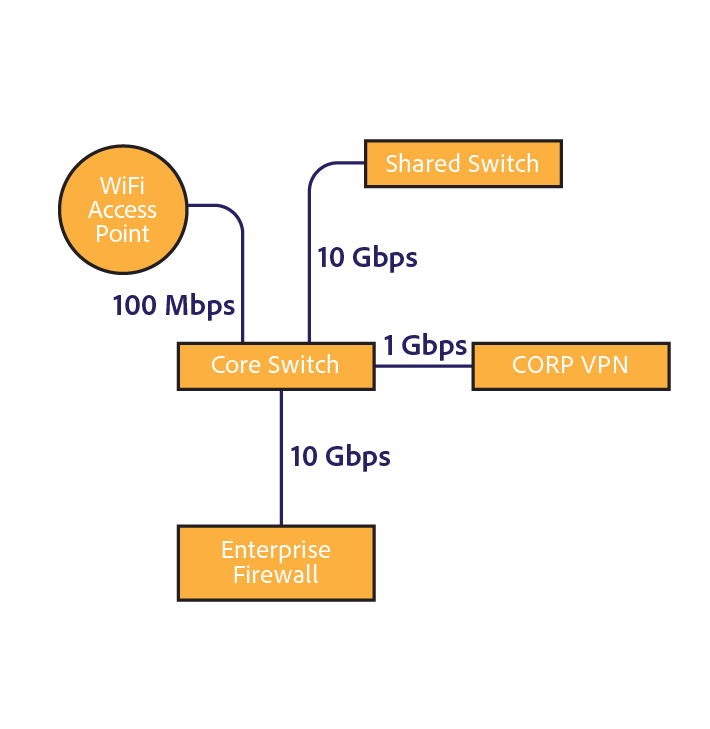

# [!DNL Assets]网络注意事项 {#assets-network-considerations}

了解您的网络与了解[!DNL Adobe Experience Manager Assets]一样重要。 网络可能会影响上传、下载和用户体验。 绘制网络拓扑图有助于识别网络中的瓶颈点和次优化区域，您必须修复这些区域才能提高网络性能和改善用户体验。

请确保网络图中包含以下内容：

* 从客户端设备（例如，计算机、移动设备和平板电脑）到网络的连接。
* 公司网络的拓扑。
* 从公司网络和[!DNL Experience Manager]环境上行到Internet。
* [!DNL Experience Manager]环境的拓扑。
* 定义[!DNL Experience Manager]网络接口的并发使用者。
* 已定义[!DNL Experience Manager]部署的工作流。

## 从客户端设备到公司网络的连接 {#connectivity-from-the-client-device-to-the-corporate-network}

首先绘制单个客户端设备与公司网络之间的连接图。 在此阶段，识别共享资源，如WiFi连接，其中多个用户访问同一点或以太网交换机以上传和下载资产。

客户端设备通过多种方式连接到公司网络，如共享WiFi、到共享交换机的以太网以及VPN。 识别和了解此网络上的阻塞点对于[!DNL Assets]规划和修改网络非常重要。

在图表的左上角，将三个设备描述为共享48 Mbps WiFi接入点。 如果所有设备同时上传，则在这些设备之间共享WiFi网络带宽。 与系统整体相比，用户可能在这个分割的信道上遇到三个客户端的不同扼流点。

测量WiFi网络的真实速度是一项挑战，因为慢速设备可能会影响接入点上的其他客户端。 如果您计划使用WiFi进行资产交互，请同时从多个客户端执行速度测试以评估吞吐量。

该图的左下角显示了通过独立通道连接到公司网络的两台设备。 因此，每台设备的最低速度可以是10 Mbps和100 Mbps。

右侧显示的计算机通过速度为1 Mbps的VPN到达公司网络的上行链路有限。 1Mbps连接的用户体验与1Gbps连接的用户体验大不相同。 根据用户与之交互的资产的大小，他们的VPN上行链路可能不足以完成任务。

## 公司网络的拓扑 {#topology-of-the-corporate-network}

该图显示了公司网络内比通常使用的上行链路速度更高的上行链路速度。 这些管道是共享资源。 如果共享交换机需要处理50个客户端，则它可能是瓶颈。 在初始图表中，只有两台计算机共享特定连接。

## 从公司网络和[!DNL Experience Manager]环境上行到互联网 {#uplink-to-the-internet-from-the-corporate-network-and-aem-environment}

请务必考虑Internet和VPC连接上的未知因素，因为由于高峰负载或大规模提供商的中断，Internet上的带宽可能会受损。 一般来说，Internet连接是可靠的。 但是，它有时可能会引入瓶颈。

在从企业网络到互联网的上行链路上，可以使用带宽进行其他服务。 了解可为Assets专用或优先使用的带宽量非常重要。 例如，如果1 Gbps链路的利用率已经达到80%，则您最多只能为[!DNL Experience Manager Assets]分配20%的带宽。

企业防火墙和代理还可以通过多种不同的方式影响带宽。 这种类型的设备可以使用服务质量、每个用户的带宽限制或每个主机的比特率限制来确定带宽优先级。 这些是需要检查的重要瓶颈，因为它们会显着影响[!DNL Assets]用户体验。

在此示例中，企业具有10 Gbps的上行链路。 它应该足够大以容纳多个客户。 此外，防火墙还设置了10 Mbps的主机速率限制。 即使到Internet的上行链路速度为10 Gbps，此限制仍可能会将单台主机的流量限制为10 Mbps。

这是最小的面向客户的瓶颈。 但是，您可以通过负责此防火墙的网络操作组来评估更改或配置允许列表。

从示例图中，您可以得出以下结论：6台设备共享一个10Mbps的概念信道。 根据所用资源的规模，这可能不足以达到用户的期望。

## [!DNL Experience Manager]环境的拓扑 {#topology-of-the-aem-environment}

设计[!DNL Experience Manager]环境的拓扑需要详细了解系统配置以及用户环境中网络的连接方式。

此示例场景包括一个具有五台服务器的发布场、一个配置了S3二进制存储区和Dynamic Media。

Dispatcher与两个实体（外部世界和[!DNL Experience Manager]部署）共享其100Mbps连接。 对于同时上载和下载操作，应将此数字除以2。 连接的外部存储使用单独的连接。

[!DNL Experience Manager]部署与多个服务共享其1Gbps连接。 从网络拓扑的角度来看，它等同于与不同的服务共享单个通道。

审查从客户端设备到[!DNL Experience Manager]部署的网络时，最小的瓶颈似乎是10 Mbit企业防火墙瓶颈。 您可以在[Assets大小调整指南](assets-sizing-guide.md)的大小计算器中使用这些值来确定用户体验。

## [!DNL Experience Manager]部署的已定义工作流 {#defined-workflows-of-the-aem-deployment}

在考虑网络性能时，可能必须考虑将在系统中发生的工作流和发布。 此外， S3或您使用和I/O请求的其他网络连接存储占用网络带宽。 因此，即使在完全优化的网络中，性能也可能受到磁盘I/O的限制。

要简化有关资产摄取的流程（特别是在上传大量资产时），请探索资产工作流并了解关于其配置的更多信息。

在评估内部工作流拓扑时，应分析以下内容：

* 编写资产的过程
* 修改资产/元数据时触发的工作流/事件
* 读取资产的过程

以下是需要考虑的一些项目：

* XMP元数据读/写
* 自动激活和复制
* 水印
* 子资产提取/页面提取
* 重叠的工作流。

以下是定义资产工作流的客户示例。

