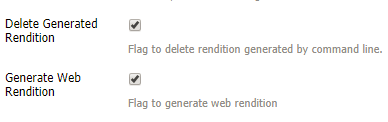

# 安装和配置ImageMagick以用于[!DNL Experience Manager Assets] {#install-and-configure-imagemagick-to-work-with-aem-assets}

ImageMagick是一个用于创建、编辑、合成或转换位图图像的软件插件。 它可以读写各种格式（超过200种）的图像，包括PNG、JPEG、JPEG-2000、GIF、TIFF、DPX、EXR、WebP、Postscript、PDF和SVG。 使用ImageMagick调整图像大小、翻转、镜像、旋转、扭曲、剪切和变换图像。 也可以使用ImageMagick调整图像颜色、应用各种特殊效果或绘制文本、线条、多边形、椭圆和曲线。

使用命令行中的[!DNL Adobe Experience Manager]媒体处理程序通过ImageMagick处理图像。 要使用ImageMagick处理各种文件格式，请参阅[Assets文件格式最佳实践](/help/assets/assets-file-format-best-practices.md)。 要了解所有支持的文件格式，请参阅[Assets支持的格式](/help/assets/assets-formats.md)。

要使用ImageMagick处理大型文件，请考虑比平常更高的内存要求、IM策略所需的潜在更改以及总体性能影响。 内存需求取决于分辨率、位深度、颜色配置文件和文件格式等多种因素。 如果您打算使用ImageMagick处理非常大的文件，请对[!DNL Experience Manager]服务器进行正确的基准测试。 最后提供了一些有用的资源。

>[!NOTE]
>
>如果您在[!DNL Experience Manager] (AMS)上使用[!DNL Adobe Managed Services]，如果您计划处理许多高分辨率PSD或PSB文件，请联系Adobe客户支持。 [!DNL Experience Manager]不能处理超过30000 x 23000像素的超高分辨率PSB文件。

## 安装ImageMagick {#installing-imagemagick}

ImageMagic安装文件的多个版本可用于各种操作系统。 使用适用于您的操作系统的相应版本。

1. 下载适用于您的操作系统的ImageMagick安装文件(`https://www.imagemagick.org/script/download.php website`)。
1. 要在托管[!DNL Experience Manager]服务器的磁盘上安装ImageMagick，请启动安装文件。

1. 将路径Environment变量设置为ImageMagic安装目录。
1. 要检查安装是否成功，请执行`identify -version`命令。

## 设置命令行流程步骤 {#set-up-the-command-line-process-step}

您可以为特定用例设置命令行流程步骤。 每次将JPEG图像文件添加到`/content/dam`服务器上的[!DNL Experience Manager]时，执行以下步骤可生成翻转的图像和缩略图（140x100、48x48、319x319和1280x1280）：

1. 在[!DNL Experience Manager]服务器上，转到“工作流”控制台(`https://[aem_server]:[port]/workflow`)并打开&#x200B;**[!UICONTROL DAM更新资产]**&#x200B;工作流模型。
1. 从&#x200B;**[!UICONTROL DAM更新资产]**&#x200B;工作流模型中，打开&#x200B;**[!UICONTROL EPS缩略图（由ImageMagick提供支持）]**&#x200B;步骤。
1. 在&#x200B;**[!UICONTROL 参数选项卡]**&#x200B;中，将`image/jpeg`添加到&#x200B;**[!UICONTROL Mime类型]**&#x200B;列表。

   

1. 在&#x200B;**[!UICONTROL 命令]**&#x200B;框中，输入以下命令：

   `convert ./${filename} -flip ./${basename}.flipped.jpg`

1. 选择&#x200B;**[!UICONTROL 删除生成的演绎版]**&#x200B;和&#x200B;**[!UICONTROL 生成Web演绎版]**&#x200B;标志。

   

1. 在&#x200B;**[!UICONTROL 启用Web的图像]**&#x200B;选项卡中，指定尺寸为1280x1280像素的演绎版的详细信息。 此外，请在`image/jpeg`Mimetype **[!UICONTROL 框中指定]**。

   

1. 单击&#x200B;**[!UICONTROL 确定]**&#x200B;以保存更改。

   >[!NOTE]
   >
   >`convert`命令不能与某些Windows版本（例如，Windows SE）一起运行，因为它与Windows安装中的本机`convert`实用程序冲突。 在这种情况下，请提及ImageMagick实用程序的完整路径。 例如，指定
   >
   >
   >`"C:\Program Files\ImageMagick-6.8.9-Q16\convert.exe" -define jpeg:size=319x319 ./${filename} -thumbnail 319x319 cq5dam.thumbnail.319.319.png`

1. 打开&#x200B;**[!UICONTROL 进程缩略图]**&#x200B;步骤，并在`image/jpeg`跳过MIME类型&#x200B;**[!UICONTROL 下添加MIME类型]**。

   

1. 在&#x200B;**[!UICONTROL 启用Web的图像]**&#x200B;选项卡中，在`image/jpeg`跳过列表&#x200B;**[!UICONTROL 下添加MIME类型]**。 单击&#x200B;**[!UICONTROL 确定]**&#x200B;以保存更改。

   

1. 保存工作流。

1. 要验证是否进行了正确处理，请将JPG图像上传到[!DNL Assets]。 处理完成后，检查是否生成了翻转的图像和演绎版。

## 减少安全漏洞 {#mitigating-security-vulnerabilities}

使用ImageMagick处理图像存在多个安全漏洞。 例如，处理用户提交的图像涉及远程代码执行(RCE)的风险。

此外，各种图像处理插件依赖于ImageMagick库，包括但不限于PHP的imagick 、 Ruby的rmagick和paperclip ，以及nodejs的imagemagick。

如果您使用ImageMagick或受影响的库，Adobe建议您通过执行以下至少一项任务（但最好是两项任务）来缓解已知漏洞：

1. 在发送到ImageMagick进行处理之前，请验证所有图像文件是否以预期的[“幻字节”](https://en.wikipedia.org/wiki/List_of_file_signatures)开头，该幻字节与您支持的图像文件类型相对应。
1. 使用策略文件禁用易受攻击的ImageMagick编码器。 在`/etc/ImageMagick`处找到ImageMagick的全局策略。
