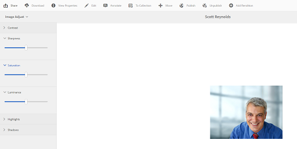

# 使用[!DNL Adobe Camera Raw]处理图像 {#camera-raw-support}

您可以启用[!DNL Adobe Camera Raw]支持以处理原始文件格式（如CR2、NEF和RAF），并以JPEG格式呈现图像。 使用Software Distribution提供的[Camera Raw包](https://experience.adobe.com/#/downloads/content/software-distribution/en/aem.html?package=/content/software-distribution/en/details.html/content/dam/aem/public/adobe/packages/aem630/product/assets/aem-assets-cameraraw-pkg)的[!DNL Adobe Experience Manager Assets]支持该功能。

>[!NOTE]
>
>该功能仅支持JPEG呈现。 它在Windows 64位、Mac OS和RHEL 7.x上受支持。

要在[!DNL Experience Manager Assets]中启用[!DNL Camera Raw]支持，请执行以下步骤：

1. 从[!DNL Software Distribution]下载[[!DNL Camera Raw] 包](https://experience.adobe.com/#/downloads/content/software-distribution/en/aem.html?package=/content/software-distribution/en/details.html/content/dam/aem/public/adobe/packages/cq650/product/assets/aem-assets-cameraraw-pkg-1.4.8.zip)。
1. 访问`https://[aem_server]:[port]/workflow`。 打开&#x200B;**[!UICONTROL DAM更新资产]**&#x200B;工作流。
1. 编辑&#x200B;**[!UICONTROL 进程缩略图]**&#x200B;步骤。
1. 在&#x200B;**[!UICONTROL 缩略图]**&#x200B;选项卡中提供以下配置：

   * **[!UICONTROL 缩略图]**： `140:100:false, 48:48:false, 319:319:false`
   * **[!UICONTROL 跳过Mime类型]**： `skip:image/dng, skip:image/x-raw-(.*)`

   

1. 在&#x200B;**[!UICONTROL 启用Web的图像]**&#x200B;选项卡的&#x200B;**[!UICONTROL 跳过列表]**&#x200B;字段中，指定`audio/mpeg, video/(.*), image/dng, image/x-raw-(.*)`。

   

1. 从侧面板中，在&#x200B;**[!UICONTROL 进程缩略图]**&#x200B;步骤下方添加&#x200B;**[!UICONTROL Camera Raw/DNG处理程序]**&#x200B;步骤。
1. 在&#x200B;**[!UICONTROL Camera Raw/DNG处理程序]**&#x200B;步骤中，在&#x200B;**[!UICONTROL 参数]**&#x200B;选项卡中添加以下配置：

   * **[!UICONTROL Mime类型]**： `image/dng`和`image/x-raw-(.*)`
   * **[!UICONTROL 命令]**：

      * `DAM_Raw_Converter ${directory}/${filename} ${directory} cq5dam.web.1280.1280.jpeg 1280 1280`
      * `DAM_Raw_Converter ${directory}/${filename} ${directory} cq5dam.thumbnail.319.319.jpeg 319 319`
      * `DAM_Raw_Converter ${directory}/${filename} ${directory} cq5dam.thumbnail.140.100.jpeg 140 100`
      * `DAM_Raw_Converter ${directory}/${filename} ${directory} cq5dam.thumbnail.48.48.jpeg 48 48`

   

1. 单击&#x200B;**[!UICONTROL 保存]**。

>[!NOTE]
>
>确保上述配置与&#x200B;**[!UICONTROL 具有Camera Raw和DNG处理步骤的示例DAM更新资产]**&#x200B;配置相同。

您现在可以将Camera Raw文件导入Assets。 安装Camera Raw包并配置所需的工作流后，**[!UICONTROL 图像调整]**&#x200B;选项会显示在侧窗格的列表中。

*图：侧窗格中的选项。*

*图：使用选项对您的图像进行轻量级编辑。*

将编辑内容保存到[!DNL Camera Raw]图像后，将为该图像生成新的演绎版`AdjustedPreview.jpg`。 对于[!DNL Camera Raw]以外的其他图像类型，更改会反映在所有演绎版中。

## 最佳实践、已知问题和限制 {#best-practices}

该功能具有以下限制：

* 该功能仅支持JPEG呈现。 它在Windows 64位、Mac OS和RHEL 7.x上受支持。
* RAW和DNG格式不支持元数据写回。
* [!DNL Camera Raw]库一次可处理的总像素数存在限制。 目前，它最多可在文件的长边处理65000个像素，或者处理任何先满足条件的文件，最大为512 MP。
