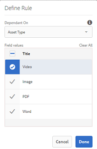

# 串联元数据 {#cascading-metadata}

在捕获资产的元数据信息时，用户会在各种可用字段中提供信息。 您可以显示特定元数据字段或字段值，这些字段或字段值取决于在其他字段中选择的选项。 此类元数据的条件显示称为级联元数据。 换句话说，您可以在特定元数据字段／值与一个或多个字段和／或其值之间创建依赖关系。

使用元数据模式定义用于显示级联元数据的规则。 例如，如果您的元数据模式包含资产类型字段，则可以根据用户选择的资产类型定义要显示的相关字段集。

以下是一些可以为其定义级联元数据的使用案例：

* 在需要用户位置时，根据用户对国家／地区和州的选择显示相关城市名称。
* 根据用户对产品列表的选择，在类别中加载相关品牌名称。
* 根据在另一个字段中指定的值切换特定字段的可见性。 例如，如果用户希望将发运交付到其他地址，则显示单独的发运地址字段。
* 根据在另一个字段中指定的值将字段指定为必填字段。
* 根据在另一个字段中指定的值更改为特定字段显示的选项。
* 根据在其他字段中指定的值，在特定字段中设置默认元数据值。

## 在 [!DNL Experience Manager]{#configure-cascading-metadata-in-aem}

请考虑要根据所选资产类型显示级联元数据的方案。 一些示例

* 对于视频，显示适用的字段，如格式、编解码器、持续时间等。
* 对于Word或PDF文档，显示页面计数、作者等字段。

无论选择的资产类型如何，都可以将版权信息显示为必填字段。

1. 在界 [!DNL Experience Manager] 面中，转到工 **[!UICONTROL 具]** >资 **[!UICONTROL 产]** >元数 **[!UICONTROL 据模式]**。
1. In the **[!UICONTROL Schema Forms]** page, select a schema form and then click **[!UICONTROL Edit]** from the toolbar to edit the schema.

   

1. （可选）在元数据模式编辑器中，创建一个要条件化的新字段。 在“设置”选项卡中指定名称和属 **[!UICONTROL 性路径]** 。

   要创建新选项卡，请单 `+` 击以添加选项卡，然后添加元数据字段。

   

1. 为资产类型添加下拉列表字段。 在“设置”选项卡中指定名称和属 **[!UICONTROL 性路径]** 。 添加可选说明。

   

1. 键值对是提供给表单用户的选项。 您可以手动或从JSON文件提供键值对。

   * 要手动指定值，请选择“手 **[!UICONTROL 动添加]**”，然后单击“ **[!UICONTROL 添加选择]** ”并指定选项文本和值。 例如，指定视频、PDF、Word和图像资产类型。

   * 要从JSON文件动态获取值，请选择“ **[!UICONTROL 通过JSON路径添加]** ”并提供JSON文件的路径。 [!DNL Experience Manager] 当向用户显示表单时，实时获取键值对。
   两个选项互斥。 无法从JSON文件导入选项并手动编辑。

   

   >[!NOTE]
   >
   >添加JSON文件时，键值对不会显示在元数据模式编辑器中，但在已发布的表单中可用。

   >[!NOTE]
   >
   >添加选项时，如果单击“下拉框”字段，则界面会扭曲，且选项的删除图标将停止工作。 保存更改前，不要单击下拉列表。 如果您遇到此问题，请保存模式并再次打开它以继续编辑。

1. （可选）添加其他必填字段。 例如，资产类型视频的格式、编解码器和持续时间。

   同样，为其他资产类型添加从属字段。 例如，为文档资产（如PDF和Word文件）添加字段页数和作者。

   

1. 要在资产类型字段和其他字段之间创建依赖关系，请选择相关字段，然后打开“规 **[!UICONTROL 则]** ”选项卡。

   

1. Under **[!UICONTROL Requirement]**, choose the **[!UICONTROL Required, based on new rule]** option.
1. Click **[!UICONTROL Add Rule]** and choose the **[!UICONTROL Asset Type]** field to create a dependency. 还可以选择创建依赖关系时所依据的字段值。 在这种情况下，请选择“ **[!UICONTROL 视频]**”。 Click **[!UICONTROL Done]** to save the changes.

   

   >[!NOTE]
   >
   >具有手动预定义值的下拉列表可与规则一起使用。 已配置JSON路径的下拉菜单不能与使用预定义值应用条件的规则一起使用。 如果这些值在运行时从JSON加载，则无法应用预定义的规则。

1. 在“可 **[!UICONTROL 见性]**”下，根据新 **[!UICONTROL 规则选项选择“可见]** ”。

1. Click **[!UICONTROL Add Rule]** and choose the **[!UICONTROL Asset Type]** field to create a dependency. 还可以选择创建依赖关系时所依据的字段值。 在这种情况下，请选择“ **[!UICONTROL 视频]**”。 Click **[!UICONTROL Done]** to save the changes.

   

   >[!NOTE]
   >
   >单击空格（或除值之外的任何位置）将重置这些值。 如果发生这种情况，请重新选择这些值。

   >[!NOTE]
   >
   >您可以应用&#x200B;**[!UICONTROL 要求]**&#x200B;条件和&#x200B;**[!UICONTROL 可见性]**&#x200B;条件，二者相互独立。

1. 同样，在“资产类型”字段中的值“视频”与其他字段（如编解码器和持续时间）之间创建依赖关系。
1. 重复这些步骤，以在“资产类型”字段中的文档资产（PDF和Word）与“页数”和“作者”等字段之间创 [!UICONTROL 建依赖关系]。
1. 单击&#x200B;**[!UICONTROL 保存]**。将元数据模式应用到文件夹。

1. 导航到应用了元数据模式的文件夹，然后打开资产的属性页面。 根据您在资产类型字段中的选择，将显示相关的级联元数据字段。

   

   *图：视频的级联元数据。*

   

   *图：文档的级联元数据。*
