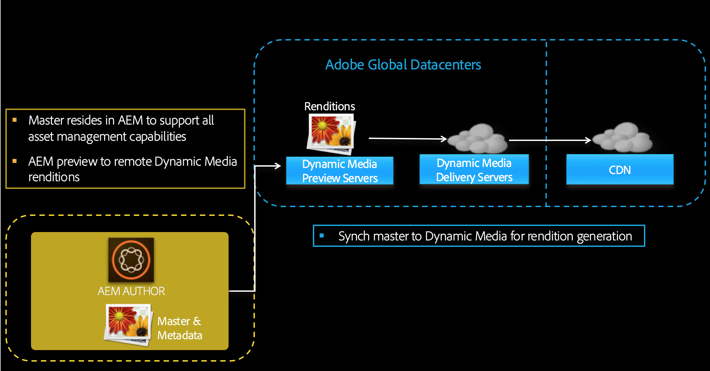
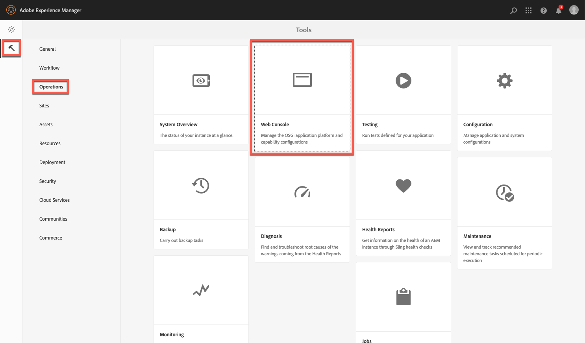
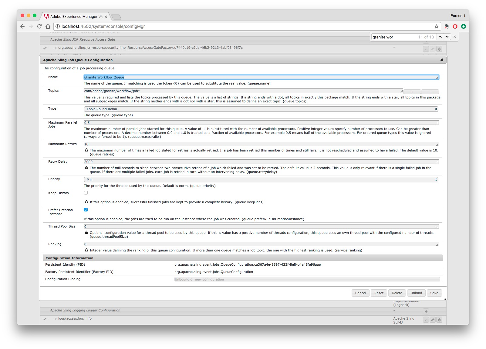

# 配置Dynamic Media - Scene7模式{#configuring-dynamic-media-scene-mode}

如果您使用为不同环境（如用于开发的Adobe Experience Manager、用于暂存的Adobe Experience Manager和用于实时生产的Adobe Experience Manager）进行设置，则需要为每个环境配置Dynamic Media Cloud Services。

## Dynamic Media的架构图- Scene7模式 {#architecture-diagram-of-dynamic-media-scene-mode}

以下架构图描述了Dynamic Media - Scene7模式的工作方式。

借助新的体系结构，AEM负责主资产并与Dynamic Media同步以处理和发布资产：

1. 主资产上传到AEM后，会将其复制到Dynamic Media。 此时，Dynamic Media将处理所有资产处理和再现生成，如图像的视频编码和动态变型。 <!-- (In Dynamic Media - Scene7 mode, be aware that you can only upload assets whose file sizes are 2 GB or less.) Jira ticket CQ-4286561 fixed this issue. DM-S7 NOW SUPPORTS THE UPLOAD OF ASSETS LARGER THAN 2 GB. -->
1. 生成演绎版后，AEM可以安全访问和预览远程Dynamic Media演绎版（不会将二进制文件发回到AEM实例）。
1. 在内容可供发布和批准后，它会触发Dynamic Media服务，将内容推送到投放服务器并缓存CDN中的内容。



## 在Scene7模式下启用Dynamic Media {#enabling-dynamic-media-in-scene-mode}

[默认情况](https://www.adobe.com/solutions/web-experience-management/dynamic-media.html) 下，Dynamic Media处于禁用状态。 要利用Dynamic Media功能，您需要启用它。

>[!NOTE]
>
>Dynamic Media - Scene7模式仅适用于AEM作者实例。 因此，您必须在AEM `runmode=dynamicmedia_scene7` 作者实例上进行配置， *而不是* AEM发布实例。

要启用Dynamic Media，您必须在终端窗口 `dynamicmedia_scene7` 中输入以下内容（使用的示例端口为4502），从命令行使用运行模式启动AEM:

```shell
java -Xms4096m -Xmx4096m -Doak.queryLimitInMemory=500000 -Doak.queryLimitReads=500000 -jar cq-quickstart-6.5.0.jar -gui -r author,dynamicmedia_scene7 -p 4502
```

## （可选）将Dynamic Media预设和配置从6.3迁移到6.5零停机时间 {#optional-migrating-dynamic-media-presets-and-configurations-from-to-zero-downtime}

如果您要将AEM Dynamic Media从6.3升级到6.4或6.5（现在包括零停机时间部署功能），则需要运行以下curl命令，以将所有预设和配置从CRXDE Lite迁移 `/etc` 到 `/conf` CRXDE Lite。

>[!NOTE]
>
>如果在兼容模式下运行AEM实例（即已安装兼容性打包），则无需运行这些命令。

对于所有具有或没有兼容性包的升级，您都可以通过运行以下Linux curl命令复制Dynamic Media最初附带的现成默认查看器预设：

`curl -u admin:admin -X POST https://<server_address>:<server_port>/libs/settings/dam/dm/presets/viewer.pushviewerpresets.json`

要将您创建的任何自定义查看器预设和配置从迁移 `/etc` 到 `/conf`，请运行以下Linux curl命令：

`curl -u admin:admin -X POST https://<server_address>:<server_port>/libs/settings/dam/dm/presets.migratedmcontent.json`

## 安装功能包18912以进行批量资产迁移 {#installing-feature-pack-for-bulk-asset-migration}

安装功能包18912是可选 *的*。

功能包18912允许您通过FTP批量摄取资产，或在AEM上将资产从Dynamic Media —— 混合模式或Dynamic Media Classic迁移到Dynamic Media - Scene7模式。 可从Adobe Professional [Services获得](https://www.adobe.com/experience-cloud/consulting-services.html)。

有关 [详细信息，请参阅安装功能包18912](/help/assets/bulk-ingest-migrate.md) ，以实现批量资产迁移。

## 创建Dynamic Media配置 {#configuring-dynamic-media-cloud-services}

**在配置Dynamic Media之前**: 在您收到包含Dynamic Media凭据的供应电子邮件后，必 [须登录](https://www.adobe.com/marketing-cloud/experience-manager/scene7-login.html) Dynamic Media Classic以更改密码。 供应电子邮件中提供的密码是系统生成的，并且仅用于临时密码。 请务必更新密码，以便Dynamic Media Cloud服务设置正确的凭据。


**创建Dynamic Media配置**

1. 在AEM中，点按AEM徽标以访问全局导航控制台，然后点按或单击工具图标，然 **[!UICONTROL 后点按云服务> Dynamic Media配置]**。
1. 在 Dynamic Media 配置浏览器页面的左侧窗格中，点按&#x200B;**[!UICONTROL 全局]**（请勿点按或选择&#x200B;**[!UICONTROL 全局]**&#x200B;左侧的文件夹图标），然后点按&#x200B;**[!UICONTROL 创建]**。
1. 在“创建Dynamic Media配置”页面中，输入标题、Dynamic Media帐户电子邮件地址和密码，然后选择您所在的区域。 Adobe在供应电子邮件中向您提供这些内容。 如果您未收到此信息，请与支持部门联系。

   Click **[!UICONTROL Connect to Dynamic Media]**.

   >[!NOTE]
   >
   >在您收到包含Dynamic Media凭据的供应电子邮件后，请 [登录](https://www.adobe.com/marketing-cloud/experience-manager/scene7-login.html) Dynamic Media Classic以更改您的密码。 供应电子邮件中提供的密码是系统生成的，并且仅用于临时密码。 请务必更新密码，以便Dynamic Media云服务设置正确的凭据。

1. 连接成功时，还可以设置以下内容：

   * **[!UICONTROL 公司]** - Dynamic Media帐户的名称。 您可能为不同的子品牌、部门或不同的分阶段／生产环境拥有多个Dynamic Media帐户。

   * **[!UICONTROL 公司根文件夹路径]**

   * **[!UICONTROL 发布资产]** -您可以从以下三个选项中进行选择：
      * **[!UICONTROL 立即]** ，意味着上传资产时，系统会立即收录资产并提供URL/Embed。 发布资产不需要用户干预。
      * **[!UICONTROL 激活]** ，即您需要在提供URL/嵌入链接之前先显式发布资产。
   * **[!UICONTROL 安全预览服务器]** -允许您指定到安全再现预览服务器的URL路径。 也就是说，在生成演绎版后，AEM可以安全访问和预览远程Dynamic Media演绎版（不会将二进制文件发回到AEM实例）。
除非您有特殊安排来使用您自己的公司服务器或特殊服务器，否则Adobe Systems建议您保留指定的设置。

   * **[!UICONTROL 同步所有内容]** - <!-- NEW OPTION, CQDOC-15371, Added March 4, 2020-->默认为选中。 如果要在同步到Dynamic Media时有选择地包括或排除资产，请取消选择此选项。 取消选择此选项后，您可以从以下两种Dynamic Media同步模式中进行选择：

   * **[!UICONTROL Dynamic Media 同步模式]**
      * **[!UICONTROL 默认为启用]** -默认情况下，该配置将应用于所有文件夹，除非您专门为排除标记文件夹。 <!-- you can then deselect the folders that you do not want the configuration applied to.-->
      * **[!UICONTROL 默认禁用]** -在明确标记选定文件夹以同步到Dynamic Media之前，该配置不会应用于任何文件夹。
要将选定的文件夹标记为同步到Dynamic Media，请选择资产文件夹，然后在工具栏中单击 **[!UICONTROL 属性]**。 在“详 **[!UICONTROL 细信息]** ”选项卡 **[!UICONTROL 的“Dynamic Media同步模式]** ”下拉列表中，从以下三个选项中进行选择。 完成后，点按保 **[!UICONTROL 存]**。 *记住： 如果您之前选择了“同步所有内容”，则这&#x200B;**三个选项将不可**用。*
         * **[!UICONTROL 继承]** -文件夹上没有显式同步值； 相反，文件夹会从其上级文件夹之一或云配置中的默认模式继承同步值。 通过工具提示显示继承的详细状态。
         * **[!UICONTROL 为子文件夹启用]** -在此子树中包含所有内容，以便同步到Dynamic Media。 特定于文件夹的设置将覆盖云配置中的默认模式。
         * **[!UICONTROL 对子文件夹禁用]** -排除此子树中的所有内容，使其无法同步到Dynamic Media。
   >[!NOTE]
   >
   >DMS7中不支持版本控制。 此外，仅当“编辑 Dynamic Media 配置”页面中的&#x200B;**[!UICONTROL 发布资产]**&#x200B;设置为&#x200B;**[!UICONTROL 激活时]**&#x200B;时，并且直到首次激活资产时延迟激活才适用。
   >
   >
   >激活资产后，所有更新都将立即实时发布到S7投放。

1. 点按&#x200B;**[!UICONTROL 保存]**。
1. 要在发布Dynamic Media内容之前安全地预览它，您需要将AEM作者实例“列入白名单”才能连接到Dynamic Media:

   * 登录您的Dynamic Media Classic帐户： [https://www.adobe.com/marketing-cloud/experience-manager/scene7-login.html](https://www.adobe.com/marketing-cloud/experience-manager/scene7-login.html)。 您的凭据和登录是在配置时由Adobe提供的。 如果您没有此信息，请与技术支持联系。
   * 在页面右上方的导航栏上，单击“设置”>“应 **[!UICONTROL 用程序设置”>“发布设置”>“图像服务器]**”。

   * 在“图像服务器发布”页面的“发布上下文”下拉列表中，选择“测 **[!UICONTROL 试图像服务”]**。
   * 对于“客户端地址筛选器”，点 **[!UICONTROL 按添加]**。
   * 选中此复选框以启用（打开）该地址，然后输入AEM作者实例的IP地址（而非调度程序IP）。
   * 单击&#x200B;**[!UICONTROL 保存]**。

现在您已完成基本配置； 您已准备好使用Dynamic Media - Scene7模式。

如果要进一步自定义配置，您可以选择在Dynamic Media - Scene7模式中 [配置高级设置下完成任何任务](#optionalconfigurationofadvancedsettingindynamicmediascene7mode)。

## （可选）在Dynamic Media - Scene7模式中配置高级设置 {#optional-configuring-advanced-settings-in-dynamic-media-scene-mode}

如果要进一步自定义Dynamic Media - Scene7模式的配置和设置，或优化其性能，您可以完成以下一个或多个可选 *任务* :

* [（可选）Dynamic Media的设置和配置- Scene7模式设置](#optionalsetupandconfigurationofdynamicmediascene7modesettings)

* [（可选）调整Dynamic Media - Scene7模式的性能](#optional-tuning-the-performance-of-dynamic-media-scene-mode)

* [（可选）筛选要复制的资产](#optional-filtering-assets-for-replication)

### （可选）Dynamic Media的设置和配置- Scene7模式设置</p> {#optional-setup-and-configuration-of-dynamic-media-scene-mode-settings-p}

在运行模式 `dynamicmedia_scene7`下，可使用Dynamic Media Classic(Scene7)用户界面更改Dynamic Media设置。

以上某些任务要求您在以下位置登录Dynamic Media Classic(Scene7): [https://www.adobe.com/marketing-cloud/experience-manager/scene7-login.html](https://www.adobe.com/marketing-cloud/experience-manager/scene7-login.html)

设置和配置任务包括：

* [图像服务器的发布设置](#publishing-setup-for-image-server)
* [配置应用程序常规设置](#configuring-application-general-settings)
* [配置颜色管理](#configuring-color-management)
* [配置资产处理](#configuring-asset-processing)
* [为不支持的格式添加自定义MIME类型](#adding-custom-mime-types-for-unsupported-formats)
* [创建批集预设以自动生成图像集和旋转集](#creating-batch-set-presets-to-auto-generate-image-sets-and-spin-sets)

#### 图像服务器的发布设置 {#publishing-setup-for-image-server}

默认情况下，“发布设置”设置会确定如何从Dynamic Media传送资产。 如果未指定任何设置，Dynamic Media会根据发布设置中定义的默认设置传送资产。 例如，传送不包含分辨率属性的图像的请求将生成具有默认对象分辨率设置的图像。

配置发布设置： 在Dynamic Media Classic中，单击“设置”>“ **[!UICONTROL 应用程序设置”>“发布设置”>“图像服务器”]**。

“图像服务器”屏幕为传送图像建立了默认设置。 有关每个设置的说明，请参阅UI屏幕。

* **[!UICONTROL 请求属性]** -这些设置对可以从服务器传送的图像施加限制。
* **[!UICONTROL 默认请求属性]** -这些设置与图像的默认外观有关。
* **[!UICONTROL 常见缩略图属性]** -这些设置与缩略图图像的默认外观有关。
* **[!UICONTROL 目录字段的默认值]**-这些设置与图像的分辨率和默认缩略图类型有关。
* **[!UICONTROL 颜色管理属性]** -这些设置决定使用哪些ICC颜色用户档案。
* **[!UICONTROL 兼容性属性]** -通过此设置，文本图层中的前导和尾部段落可以像在版本3.6中一样处理，以实现向后兼容性。
* **[!UICONTROL 本地化支持]** -这些设置允许您管理多个区域设置属性。 它还允许您指定区域设置映射字符串，以便定义要在查看器中支持各种工具提示的语言。 有关设置本地化支持的 **详细信息**]，请 [参阅设置本地化资产时的注意事项](https://help.adobe.com/en_US/scene7/using/WS997f1dc4cb0179f034e07dc31412799d19a-8000.html)。

#### 配置应用程序常规设置 {#configuring-application-general-settings}

要打开“应用程序常规设置”页面，请在Dynamic Media Classic全局导航栏中，单 **[!UICONTROL 击“设置”>“应用程序设置”>“常规设置]**”。

**服务器- **在进行帐户配置时，Dynamic Media会自动为您的公司提供分配的服务器。 这些服务器用于为您的网站和应用程序构建URL字符串。 这些URL调用特定于您的帐户。 除非AEM支持明确指示，否则不要更改任何服务器名称。

**[!UICONTROL 覆盖图像]** - Dynamic Media不允许两个文件具有相同的名称。 每个项目的URL ID（文件名减去扩展名）必须是唯一的。 这些选项指定了如何上传替换资产： 是替换原件还是成为重复。 重复资产使用“-1”重命名（例如，chair.tif更名为chair-1.tif）。 这些选项影响上传到与原始文件夹不同的文件夹的资产，或文件扩展名与原始文件夹不同的资产（如JPG、TIF或PNG）。

* **[!UICONTROL 在当前文件夹中覆盖，基本图像名称／扩展名相同]** -此选项是最严格的替换规则。 它要求您将替换图像上传到与原始图像相同的文件夹，并且替换图像的文件扩展名与原始图像的扩展名相同。 如果这些要求不满足，则会创建重复。

>[!NOTE]
>
>要保持与AEM的一致性，请始终选择以下设置： **在当前文件夹中覆盖，基本图像名称／扩展名相同**

* **[!UICONTROL 在任何文件夹中覆盖相同的基本资源名称／扩展名]** -要求替换图像的文件扩展名与原始图像相同（例如，chair.jpg必须替换chair.jpg，而不是chair.tif）。 但是，您可以将替换图像上传到与原始图像不同的文件夹。 更新后的图像驻留在新文件夹中； 在文件的原始位置再也找不到该文件
* **[!UICONTROL 在任意文件夹中覆盖相同的基本资产名称，而不考虑扩展名]** -此选项是最包含内容的替换规则。 您可以将替换图像上传到与原始图像不同的文件夹，以其他文件扩展名上传文件，然后替换原始文件。 如果原始文件位于其他文件夹中，则替换图像将驻留在其上传到的新文件夹中。

**[!UICONTROL 默认颜色用户档案]** -有 [关详细信息](#configuring-color-management) ，请参阅配置颜色管理。

>[!NOTE]
>
>默认情况下，当您选择&#x200B;**[!UICONTROL 呈现]**&#x200B;时，系统会显示 15 种呈现形式，当您在资产的详细信息视图中选择&#x200B;**[!UICONTROL 查看器]**&#x200B;时，系统会显示 15 个查看器预设。您可以提高此限制。See [Increasing the number of image presets that display](/help/assets/managing-image-presets.md#increasingthenumberofimagepresetsthatdisplay) or [Increasing the number of viewer presets that display](/help/assets/managing-viewer-presets.md#increasing-the-number-of-viewer-presets-that-display).


#### 配置颜色管理 {#configuring-color-management}

Dynamic Media颜色管理允许您对资产进行颜色校正。 通过颜色校正，摄取的资源保留其色彩空间（RGB、CMYK、灰色）和嵌入的颜色用户档案。 当您请求动态再现时，图像颜色会使用CMYK、RGB或灰色输出校正为目标色彩空间。 See [Configuring Image Presets](/help/assets/managing-image-presets.md).

配置默认颜色属性以在请求图像时启用颜色校正：

1. [使用在设置过程中提供的凭据](https://www.adobe.com/marketing-cloud/experience-manager/scene7-login.html) ，登录到Dynamic Media Classic。 导航到“设 **[!UICONTROL 置”>“应用程序设置]**”。
1. 展开&#x200B;**[!UICONTROL 发布设置]**&#x200B;区域，然后选择&#x200B;**[!UICONTROL 图像服务器]**。设置发布实例的默认设置时，将&#x200B;**[!UICONTROL 发布上下文]**&#x200B;设置为&#x200B;**[!UICONTROL 图像提供]**。
1. 滚动到需要更改的属性，例如“颜色管理属性”区 **[!UICONTROL 域中的属性]** 。

   可以设置以下颜色校正属性：

   * **[!UICONTROL CMYK默认色彩空间]** -默认CMYK颜色用户档案的名称
   * **[!UICONTROL 灰阶默认色彩空间]** -默认灰色用户档案的名称
   * **[!UICONTROL RGB默认色彩空间]** -默认RGB色彩用户档案的名称
   * **[!UICONTROL 颜色转换渲染方法]** -指定渲染方法。 Acceptable values are: **[!UICONTROL perceptual]**, **[!UICONTROL relative colometric]**, **[!UICONTROL saturation]**, **[!UICONTROL absolute colometric]**. Adobe recommends **[!UICONTROL relative]]**as the default.

1. 点按&#x200B;**[!UICONTROL 保存]**。

例如，可以将 **[!UICONTROL RGB 默认色彩空间]**&#x200B;设置为 *sRGB*，将 **[!UICONTROL CMYK 默认色彩空间]**&#x200B;设置为 *WebCoated*。

这样做将执行以下操作：

* 启用RGB和CMYK图像的颜色校正。
* 将假定没有颜色用户档案的RGB图像在sRGB *颜色空* 间中。
* 将假定没有颜色用户档案的CMYK图像在WebCoated颜色 *空间中* 。
* 返回RGB输出的动态演绎版将在*sRGB *色彩空间中返回它。
* 返回CMYK输出的动态演绎版将在WebCoated颜色空 *间中* 返回它。

#### 配置资产处理 {#configuring-asset-processing}

您可以定义Dynamic Media应处理的资产类型，并自定义高级资产处理参数。 例如，您可以指定资产处理参数以执行以下操作：

* 将Adobe PDF转换为电子目录资产。
* 将Adobe Photoshop文档(.PSD)转换为横幅模板资产以进行个性化。
* 栅格化Adobe Illustrator文件(.AI)或Adobe Photoshop封装的Postscript文件(.EPS)。
* 注意： 视频用户档案和成像用户档案可分别用于定义视频和图像的处理。

请参阅[上传资产](/help/assets/managing-assets-touch-ui.md#uploading-assets)。

**配置资产处理**

1. 在AEM中，单击AEM徽标以访问全局导航控制台，然后单击“工 **[!UICONTROL 具”>“常规”>“CRXDE Lite]**”。
1. 在左边栏中，导航到以下内容：

   `/conf/global/settings/cloudconfigs/dmscene7/jcr:content/mimeTypes`

   

1. 在mimeTypes文件夹下，选择MIME类型。
1. 在CRXDE Lite页面的右侧，在下半部分：

   * 多次-单击“ **[!UICONTROL 启用]** ”字段。 默认情况下，所有资产MIME类型均处于启用状 **[!UICONTROL 态]**（设置为true），这意味着资产将同步到Dynamic Media进行处理。 如果要排除此资产MIME类型，请将此设置更改为 **[!UICONTROL false]**。

   * 多次单 **[!UICONTROL 击]** jobParam以打开其关联的文本字段。 请参 [阅支持的Mime类型](/help/assets/assets-formats.md#supported-mime-types) ，以了解可用于给定MIME类型的允许处理参数值的列表。

1. 执行下列操作之一：

   * 重复步骤3-4以编辑其他MIME类型。
   * 在CRXDE Lite页面的菜单栏上，单击“全部 **[!UICONTROL 保存”]**。

1. 在页面的左上角，点按 **[!UICONTROL CRXDE Lite]** ，返回AEM。

#### 为不支持的格式添加自定义MIME类型 {#adding-custom-mime-types-for-unsupported-formats}

您可以为 AEM Assets 中不支持的格式添加自定义 MIME 类型。要确保 AEM 不会删除您在 CRXDE Lite 中添加的任何新节点，务必确保将 MIME 类型移动到 `image_` 之前，并将其值设置为 **[!UICONTROL false]**。

**为不支持的格式添加自定义MIME类型**

1. From AEM, tap **[!UICONTROL Tools > Operations > Web Console]**.

   

1. Adobe Experience Manager Web Console配置页 **[!UICONTROL 面将打开新的浏览器选项卡]** 。

   

1. 在页面上，向下滚动到名称 *Adobe CQ Scene7 Asset MIME 类型服务*，如下面的屏幕截图所示。在名称的右侧，点按&#x200B;**[!UICONTROL 编辑配置值]**（铅笔图标）。

   

1. 在Adobe **CQ Scene7资产MIME类型服务页** ，单击任意加号图标&lt;+>。 在表中单击加号以添加新MIME类型的位置很琐碎。

   

1. 在刚 `DWG=image/vnd.dwg` 添加的空文本字段中键入内容。

   请注意，此示 `DWG=image/vnd.dwg` 例仅用于说明目的。 您在此处添加的MIME类型可以是任何其他不受支持的格式。

   

1. In the lower-right corner of the page, tap **[!UICONTROL Save]**.

   此时，您可以关闭浏览器选项卡，该选项卡具有打开的Adobe Experience Manager Web Console配置页。

1. 返回到打开AEM控制台的浏览器选项卡。
1. From AEM, tap **[!UICONTROL Tools > General > CRXDE Lite]**.

   

1. 在左边栏中，导航到以下内容：

   `conf/global/settings/cloudconfigs/dmscene7/jcr:content/mimeTypes`

1. 将MIME类型拖 `image_vnd.dwg` 放到树中 `image_` 的正上方，如以下屏幕截图所示。

   

1. 保持 mime 类型 `image_vnd.dwg` 仍被选中，在&#x200B;**[!UICONTROL 属性]**&#x200B;选项卡的&#x200B;**[!UICONTROL 已启用]**&#x200B;行中，双击&#x200B;**[!UICONTROL 值]**&#x200B;列标题下的值，以打开&#x200B;**[!UICONTROL 值]**&#x200B;下拉列表。
1. 在字 `false` 段中键入(或 **[!UICONTROL 从下拉]** 列表中选择false)。

   

1. 在CRXDE Lite页面的左上角附近，单击“全部 **[!UICONTROL 保存”]**。

#### 创建批集预设以自动生成图像集和旋转集 {#creating-batch-set-presets-to-auto-generate-image-sets-and-spin-sets}

在资产上传到Dynamic Media时，使用批量集预设自动创建图像集或旋转集。

首先，定义资产在集合中的分组方式的命名约定。 然后，您可以创建批集预设，该预设是一组唯一命名的自包含说明，这些说明定义了如何使用与预设菜谱中定义的命名约定相匹配的图像构建该集。

上传文件时，Dynamic Media会自动创建一个集，其中包含与活动预设中定义的命名约定相匹配的所有文件。

**配置默认命名**

创建用于任何批集预设处方的默认命名约定。 在批集预设定义中选择的默认命名约定可能是您的公司批量生成集所需的全部。 系统会创建批集预设，以使用您定义的默认命名约定。 在公司定义的默认命名存在例外的情况下，您可以创建具有特定内容集所需的替代自定义命名约定的任意批集预设。

虽然使用批量集预设功能不需要设置默认的命名约定，但最佳实践是建议您使用默认的命名约定来定义要在集合中分组的命名约定的任意多个元素，以便简化批量集创建。

另外，请注意，您可以使用没 **[!UICONTROL 有可用表单]** 字段的视图代码。 在此视图中，您可以完全使用常规表达式创建命名约定定义。

两个元素可用于定义：“匹配”和“基名”。 这些字段允许您定义命名约定的所有元素，并标识用于命名包含这些元素的集合的约定部分。 公司的单个命名约定可对这些元素使用一行或多行定义。 您可以为您的唯一定义使用多行，并将它们分组为不同的元素，如主图像、颜色元素、替代视图元素和色板元素。

**配置默认命名**

1. 登录您的Dynamic Media Classic(Scene7)帐户： [https://www.adobe.com/marketing-cloud/experience-manager/scene7-login.html](https://www.adobe.com/marketing-cloud/experience-manager/scene7-login.html)

   您的凭据和登录是在配置时由Adobe提供的。 如果您没有此信息，请与技术支持联系。

1. 在页面顶部附近的导航栏上，点按设置> **[!UICONTROL 应用程序设置>批集预设>默认命名]**。
1. 选择&#x200B;**[!UICONTROL 查看表单]**&#x200B;或&#x200B;**[!UICONTROL 查看代码]**，以指定要查看的方式并输入有关每个元素的信息。

   您可以选中“ **[!UICONTROL 视图代码]** ”复选框，将常规表达式值构建与表单选择一起视图。 如果表单视图因任何原因限制您，您可以输入或更改这些值以帮助定义命名约定的元素。 如果无法在表单视图中分析您的值，则表单字段将变为非活动状态。

   >[!NOTE]
   >
   >取消激活的表单字段不会执行任何验证，确认您的常规表达式正确。 您将看到在“结果”行之后为每个元素构建的常规表达式的结果。 完整的常规表达式显示在页面底部。

1. 根据需要展开每个元素并输入要使用的命名约定。
1. 根据需要，执行以下任一操作：

   * 点按 **[!UICONTROL 添加]** ，为元素添加其他命名约定。
   * 点按 **[!UICONTROL 删除]** ，以删除元素的命名约定。

1. 执行下列操作之一：

   * 点按 **[!UICONTROL 另存为]** ，然后键入预设的名称。
   * 如果 **[!UICONTROL 要编辑]** 现有预设，请点按保存。

**创建批集预设**

Dynamic Media使用批量集预设将资产组织为一组图像（替代图像、颜色选项、360旋转），以便在查看器中显示。 批集预设会在Dynamic Media中与资产上传流程一起自动运行。

您可以创建、编辑和管理批集预设。 有两种形式的批集预设定义： 一个用于您可能已设置的默认命名约定，另一个用于您动态创建的自定义命名约定。

您可以使用表单字段方法来定义批集预设或代码方法，它允许您使用常规表达式。 与默认命名一样，您可以在表单视图中定义的同时选择视图代码，并使用常规表达式来构建定义。 或者，您也可以取消选中视图以使用其中一种或只使用另一种。

**要创建批集预设，请执行以下操作：**

1. 登录您的Dynamic Media Classic(Scene7)帐户： [https://www.adobe.com/marketing-cloud/experience-manager/scene7-login.html](https://www.adobe.com/marketing-cloud/experience-manager/scene7-login.html)

   您的凭据和登录是在配置时由Adobe提供的。 如果您没有此信息，请与技术支持联系。

1. 在页面顶部附近的导航栏上，点按设置> **[!UICONTROL 应用程序设置>批集预设>批集预设]**。

   请注 **[!UICONTROL 意]**,视图表单（如“详细信息”页面右上角所设置）是默认视图。

1. 在预设列表面板中，点 **[!UICONTROL 按]** “添加”以激活屏幕右侧“详细信息”面板中的定义字段。
1. 在“详细信息”面板的“预设名称”字段中，键入预设的名称。
1. 在批集类型下拉菜单中，选择预设类型。
1. 执行下列操作之一：

   * If you are using a default naming convention that you previously set up under **[!UICONTROL Application Setup > Batch Set Presets > Default Naming]**, expand **[!UICONTROL Asset Naming Conventions]**, and then in the File Naming drop-down list, tap **[!UICONTROL Default]**.

   * To define a new naming convention as you set up the preset, expand **[!UICONTROL Asset Naming Conventions]**, and then in the File Naming drop-down list, click **[!UICONTROL Custom]**.

1. 对于“序列”顺序，定义在Dynamic Media中将图像集组合在一起后图像的显示顺序。

   默认情况下，资产按字母数字顺序排序。 但是，您可以使用逗号分隔的常规列表来定义顺序。

1. 对于“设置命名和创建约定”，指定您在“资产命名约定”中定义的基本名称的后缀或前缀。 此外，定义在Dynamic Media文件夹结构中创建集的位置。

   如果您定义了大量集，您可能希望将这些集与包含资产自己的文件夹分开。 例如，您可以创建图像集文件夹并将生成的集放在此处。

1. 在“详细信息”面板中，点按 **[!UICONTROL 保存]**。
1. 点按 **[!UICONTROL 新预设]** 名称旁边的“活动”。

   激活预设可确保在您将资产上传到Dynamic Media时，会应用批集预设来生成该集。

**为自动生成2D旋转集创建批集预设**

您可以使用批集类 **[!UICONTROL 型多轴旋转集]** ，创建可自动生成2D旋转集的处方。 图像分组使用行和列规则表达式，以便图像资产在多维数组中的相应位置正确对齐。 在多轴旋转集中，不存在最少或最大行数或列数。

例如，假定要创建名为的多轴旋转集 `spin-2dspin`。 您有一组包含三行的旋转集图像，每行12个图像。 图像的名称如下：

```
spin-01-01
 spin-01-02
 …
 spin-01-12
 spin-02-01
 …
 spin-03-12
```

利用此信息，您的“批集类型”菜谱可能创建如下：


旋转集的共享资产名称部分的分组将添加到“匹 **配** ”字段（高亮显示）。 资产名称中包含行和列的变量部分将分别添加到 **行** 和 **列字段** 。

上传和发布旋转集后，您可以激活&#x200B;**上传作业选项**&#x200B;对话框中&#x200B;**批集预设**&#x200B;下方 2D 旋转集方法的名称。

**要创建批量集预设以自动生成2D旋转集，请执行以下操作：**

1. 登录您的Dynamic Media Classic(Scene7)帐户： [https://www.adobe.com/marketing-cloud/experience-manager/scene7-login.html](https://www.adobe.com/marketing-cloud/experience-manager/scene7-login.html)

   您的凭据和登录是在配置时由Adobe提供的。 如果您没有此信息，请与技术支持联系。

1. 在页面顶部附近的导航栏上，单击“[! **UICONTROL设置>应用程序设置>批集预设>批集预设**”。

   请注 **[!UICONTROL 意]**,视图表单（如“详细信息”页面右上角所设置）是默认视图。

1. 在“预设”列表面板 **[!UICONTROL 中]** ，单击“添加”以激活屏幕右侧“详细信息”面板中的定义字段。
1. 在“详细信息”面板的“预设名称”字段中，键入预设的名称。
1. 在“批集类型”下拉菜单中，选择&#x200B;**[!UICONTROL 资产集]**。
1. 在子类型下拉列表中，选择 **[!UICONTROL 多轴旋转集]**。
1. 展开 **[!UICONTROL 资产命名约定]**，然后在文件命名下拉列表中，单击自 **[!UICONTROL 定义]**。
1. 使用&#x200B;**[!UICONTROL 匹配]**&#x200B;和（可选）**[!UICONTROL 基本名称]**&#x200B;属性定义组成分组的图像资产命名的正则表达式。

   例如，您的文本“匹配”常规表达式可能如下所示：

   `(w+)-w+-w+`

1. 展 **[!UICONTROL 开行列位置]**，然后为2D旋转集数组中的图像资产的位置定义名称格式。

   使用括号将行或列在文件名中的位置括起来。

   例如，对于行常规表达式，它可能如下所示：

   `\w+-R([0-9]+)-\w+`

   或

   `\w+-(\d+)-\w+`

   对于列常规表达式，可能如下所示：

   `\w+-\w+-C([0-9]+)`

   或

   `\w+-\w+-C(\d+)`

   记住，这些只是示例。 您可以创建常规表达式，但是您希望满足自己的需求。

   >[!NOTE]
   >
   >如果行和列的常规表达式组合无法确定资产在多维旋转集阵列中的位置，则该资产不会添加到该集，并会记录错误。

1. 对于“设置命名和创建约定”，指定您在“资产命名约定”中定义的基本名称的后缀或前缀。

   此外，定义在Dynamic Media Classic文件夹结构中创建旋转集的位置。

   如果您定义了大量集，您可能希望将这些集与包含资产自己的文件夹分开。 例如，创建一个旋转集文件夹，将生成的集放在此处。

1. 在“详细信息”面板中，单击“ **[!UICONTROL 保存]**”。
1. 单击 **[!UICONTROL 新预设]** 名称旁边的“活动”。

   激活预设可确保在您将资产上传到Dynamic Media时，会应用批集预设来生成该集。

### （可选）调整Dynamic Media - Scene7模式的性能 {#optional-tuning-the-performance-of-dynamic-media-scene-mode}

**优化作业参数**

上传文件时，您可以调整作业参数以加快处理速度。 例如，如果您上传的是PSD文件，但不想将它们作为模板进行处理，则可以将图层提取设置为false（关闭）。 在这种情况下，调整的作业参数将显示为 `process=None&createTemplate=false`。

Adobe建议对PSD、PDF和Postscript文件使用以下“调整”作业参数：

| 文件类型 | 建议的作业参数 |
| ---| ---|
| PDF | `pdfprocess=Rasterize&resolution=150&colorspace=Auto&pdfbrochure=false&keywords=false&links=false` |
| Postscript | `psprocess=Rasterize&psresolution=150&pscolorspace=Auto&psalpha=false&psextractsearchwords=false&aiprocess=Rasterize&airesolution=150&aicolorspace=Auto&aialpha=false` |
| PSD | `process=None&layerNaming=Layername&anchor=Center&createTemplate=false&extractText=false&extendLayers=false` |

要更新任何这些参数，请按照启用基 [于MIME类型的资产/Dynamic Media Classic上传作业参数支持中的步骤操作](#enabling-mime-type-based-assets-scene-upload-job-parameter-support)。

**同步性能／可伸缩性微调提示**

为了使Dynamic Media - Scene7模式平稳运行，Adobe建议使用以下同步性能／可伸缩性微调提示：

* 更新预定义的Granite工作流（视频资产）队列工作线程。
* 更新预定义的Granite临时工作流（图像和非视频资产）队列工作线程。
* 更新到Dynamic Media Classic服务器的最大上传连接数。

#### 更新Granite临时工作流队列 {#updating-the-granite-transient-workflow-queue}

Granite传输工作流队列用于DAM更 **[!UICONTROL 新资产工作流]** 。 在Dynamic Media中，它用于图像摄取和处理。

**更新Granite临时工作流队列**

1. 导航 [到https://&lt;server>/system/console/configMgr](https://localhost:4502/system/console/configMgr) ，并搜索 **队列： Granite临时工作流队列**。

   >[!NOTE]
   >
   >由于OSGi PID是动态生成的，因此必须进行文本搜索，而不是直接URL。

1. 在“最 **[!UICONTROL 大并行作业]** ”字段中，将数字更改为所需值。

   默认情况下，并行作业的最大数量取决于可用CPU核心的数量。 例如，在4核服务器上，它分配2个工作线程。 （介于0.0和1.0之间的值是基于比率的，或者任何大于1的数字将指定工作线程的数量。）

   Adobe建议将32 **[!UICONTROL 个最大并行作业]** 配置为充分支持将文件重量上传到Dynamic Media Classic(Scene7)。

   

1. 点按&#x200B;**[!UICONTROL 保存]**。

#### 更新Granite工作流队列 {#updating-the-granite-workflow-queue}

Granite工作流队列用于非临时工作流。 在Dynamic Media中，它用于使用Dynamic Media编码视频工 **[!UICONTROL 作流处理视频]** 。

**更新Granite工作流队列**

1. 导航到 `https://<server>/system/console/configMgr` 并搜索队 **列： Granite工作流队列**。

   >[!NOTE]
   >
   >由于OSGi PID是动态生成的，因此必须进行文本搜索，而不是直接URL。

1. 在“最 **[!UICONTROL 大并行作业]** ”字段中，将数字更改为所需值。

   默认情况下，并行作业的最大数量取决于可用CPU核心的数量。 例如，在4核服务器上，它分配2个工作线程。 （介于0.0和1.0之间的值是基于比率的，或者任何大于1的数字将指定工作线程的数量。）

   对于大多数用例，0.5默认设置已足够。

   

1. 点按&#x200B;**[!UICONTROL 保存]**。

#### 更新Dynamic Media Classic上传连接 {#updating-the-scene-upload-connection}

Scene7上传连接设置将AEM资产同步到Dynamic Media Classic服务器。

**更新Dynamic Media Classic上传连接**

1. 导航至 `https://<server>/system/console/configMgr/com.day.cq.dam.scene7.impl.Scene7UploadServiceImpl`
1. 在连接 **[!UICONTROL 数字字段]** 和／或活动作 **[!UICONTROL 业超时字段中]** ，根据需要更改该数字。

   “ **[!UICONTROL 连接数]** ”设置控制AEM上传Dynamic Media所允许的最大HTTP连接数； 通常，10个连接的预定义值就足够了。

   活动 **[!UICONTROL 作业超时]** (Active job timeout)设置决定在投放服务器中发布已上传Dynamic Media资产的等待时间。 默认情况下，此值为2100秒或35分钟。

   对于大多数用例，设置2100就足够了。

   

1. 点按&#x200B;**[!UICONTROL 保存]**。

### （可选）筛选要复制的资产 {#optional-filtering-assets-for-replication}

在非Dynamic Media部署中，您可 *以将* 所有资产（图像和视频）从AEM创作环境复制到AEM发布节点。 此工作流是必需的，因为AEM发布服务器也会传送资产。

但是，在Dynamic Media部署中，由于资产是通过云服务交付的，因此无需将这些资产复制到AEM发布节点。 这种“混合发布”工作流程可避免复制资产的额外存储成本和更长的处理时间。 其他内容（如站点页面）将继续从AEM发布节点提供。

这些过滤器为您提供了一种方 *法* ，可以排除资产被复制到AEM发布节点。

#### 使用默认资产过滤器进行复制 {#using-default-asset-filters-for-replication}

如果您使用Dynamic Media进行成像和／或视频，则可以使用我们按原样提供的默认过滤器。 默认情况下，以下过滤器处于活动状态：

<table>
 <tbody>
  <tr>
   <td> </td>
   <td><strong>筛选器</strong></td>
   <td><strong>Mime 类型</strong></td>
   <td><strong>演绎版</strong></td>
  </tr>
  <tr>
   <td>Dynamic Media图像投放</td>
   <td><p>滤镜图像</p> <p>过滤器集</p> <p> </p> </td>
   <td><p>开始 <strong>/图像</strong></p> <p>包 <strong>含应用</strong> 程序／以 <strong>集结尾</strong>。</p> </td>
   <td>现成的“滤镜图像”（适用于单个图像资产，包括交互式图像）和“滤镜集”（适用于旋转集、图像集、混合媒体集和旋转集）将：
    <ul>
     <li>从复制中排除原始图像和静态图像演绎版。</li>
    </ul> </td>
  </tr>
  <tr>
   <td>动态媒体视频投放</td>
   <td>过滤视频</td>
   <td>开始 <strong>视频/</strong></td>
   <td>现成的“过滤器——视频”将：
    <ul>
     <li>从复制中排除原始视频和静态缩略图再现。<br /> <br /> </li>
    </ul> </td>
  </tr>
 </tbody>
</table>

>[!NOTE]
>
>过滤器应用于mime类型，不能特定于路径。

#### 自定义用于复制的资产过滤器 {#customizing-asset-filters-for-replication}

1. 在AEM中，点按AEM徽标以访问全局导航控制台，然后点 **[!UICONTROL 按工具>常规> CRXDE Lite]**。
1. 在左侧文件夹树中，导 `/etc/replication/agents.author/publish/jcr:content/damRenditionFilters` 航以查看过滤器。

   

1. 要定义筛选器的MIME类型，可以按如下方式查找Mime类型：

   在左边栏中，展 `content > dam > <locate_your_asset> > jcr:content > metadata`开，然后在表中找到 `dc:format`。

   下图是资产路径的示例 `dc:format`。

   

   请注意， `dc:format` 资产的 `Fiji Red.jpg` 属性 `image/jpeg`是

   要使此滤镜应用于所有图像（无论其格式如何），请将值设 `image/*` 置 `*` 为应用于任何格式的所有图像的常规表达式。

   要使滤镜仅应用于JPEG类型的图像，请输入值 `image/jpeg`。

1. 定义要包括或从复制中排除的演绎版。

   可用于筛选复制的字符包括：

<table>
 <tbody>
  <tr>
   <td><strong>要使用的字符</strong></td>
   <td><strong>如何过滤器资产进行复制</strong></td>
  </tr>
  <tr>
   <td>*</td>
   <td>通配符<br /> </td>
  </tr>
  <tr>
   <td>+</td>
   <td>包括用于复制的资产。</td>
  </tr>
  <tr>
   <td>-</td>
   <td>从复制中排除资产。</td>
  </tr>
 </tbody>
</table>

导航至 `content/dam/<locate your asset>/jcr:content/renditions`.

下图是资产演绎版的示例。


如果您只想复制原件，则输入 `+original`。

