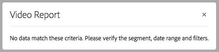

# 配置Dynamic Media — 混合模式 {#configuring-dynamic-media-hybrid-mode}

## Dynamic Media — 混合附加组件包(AEM 6.5.23及更高版本)

从AEM 6.5 Service Pack 23开始，提供了适用于Dynamic Media — 混合模式的新附加组件包。 此包中包含与Dynamic Media — 混合运行模式特别兼容的`cq-scene7-imaging`捆绑包。

**包含密钥修复**

修复了Dynamic Media — 混合部署中的一个问题：尽管复制成功且没有错误，但`/conf/global/settings/dam/dm/imageserver`下对`catalog.expiration`参数的更新未反映在服务器或创作URL上。 此更新可确保CRX/DE、服务器响应和公共交付URL之间的过期值保持一致。 反过来，它改进了缓存行为以及映像转换的可靠性。 (ASSETS-44837)

**重要注意事项**

* 基本AEM 6.5.23（及更高版本）安装中的`cq-scene7-imaging`捆绑包&#x200B;*与Dynamic Media — 混合运行模式不兼容*。
* 仅安装Service Pack 23（及更高版本）不会&#x200B;*自动更新为Dynamic Media — 混合（`-r dynamicmedia`运行模式）配置的AEM实例上的*&#x200B;现有`cq-scene7-imaging`捆绑包。

**何时安装混合附加组件包**

* 从AEM 6.5.19或更低版本直接升级到AEM 6.5.23（及更高版本）时。
* 当需要特定于Dynamic Media — 混合功能的修复时。
* 直接从AEM 6.5 GA（正式发布）部署新的Dynamic Media — 混合实例到Service Pack 23（及更高版本）时。

**下载混合附加组件包**

从2025年5月22日星期四开始，混合附加组件包在Adobe Software Distribution上公开发布，正式版本为AEM 6.5.23。通过在Software Distribution中搜索&#x200B;**AEM 6.5 Dynamic Media混合加载项包**，用户可以找到它。


## 停止对SSL 2.0和3.0以及TLS 1.0和1.1的支持。

停止对Secure Socket Layer 2.0和3.0以及Transport Layer Security 1.0和1.1的支持。

自2024年4月30日起，Adobe Dynamic Media停止支持以下内容：

* SSL（安全套接字层）2.0
* SSL 3.0
* TLS（传输层安全性）1.0 和 1.1
* TLS 1.2 中的以下弱密码：
  `TLS_ECDHE_RSA_WITH_AES_256_CBC_SHA384`
  `TLS_ECDHE_RSA_WITH_AES_256_CBC_SHA`
  `TLS_RSA_WITH_AES_256_GCM_SHA384`
  `TLS_RSA_WITH_AES_256_CBC_SHA256`
  `TLS_RSA_WITH_AES_256_CBC_SHA`
  `TLS_ECDHE_RSA_WITH_AES_128_CBC_SHA256`
  `TLS_ECDHE_RSA_WITH_AES_128_CBC_SHA`
  `TLS_RSA_WITH_AES_128_GCM_SHA256`
  `TLS_RSA_WITH_AES_128_CBC_SHA256`
  `TLS_RSA_WITH_AES_128_CBC_SHA`
  `TLS_RSA_WITH_CAMELLIA_256_CBC_SHA`
  `TLS_RSA_WITH_CAMELLIA_128_CBC_SHA`
  `TLS_ECDHE_RSA_WITH_3DES_EDE_CBC_SHA`
  `TLS_RSA_WITH_SDES_EDE_CBC_SHA`

另请参阅[Dynamic Media限制](/help/assets/limitations.md)。

<!-- FOR ABOVE - CQDOC-19433 (original ticket)
and CQDOC-19792 (removed as per this ticket December 5, 2022) -->


必须启用并配置Dynamic Media-Hybrid才能使用。 根据您的用例，Dynamic Media具有多个[支持的配置](#supported-dynamic-media-configurations)。

>[!NOTE]
>
>如果打算在Scene7运行模式下配置和运行Dynamic Media，请参阅[配置Dynamic Media - Scene7模式](/help/assets/config-dms7.md)。
>
>如果要在混合运行模式下配置和运行Dynamic Media，请按照本页上的说明操作。

了解有关在Dynamic Media中使用[视频](/help/assets/video.md)的更多信息。

>[!NOTE]
>
>如果您使用针对不同环境（例如一个用于开发、暂存和实时生产的环境）设置的Adobe Experience Manager，请为每个环境配置Dynamic Media云服务。

>[!NOTE]
>
>如果您的Dynamic Media配置存在问题，请查看特定于Dynamic Media的日志文件。 启用Dynamic Media时，会自动安装以下文件：
>
>* `s7access.log`
>* `ImageServing.log`
>
>它们记录在[监视和维护您的Experience Manager实例](/help/sites-deploying/monitoring-and-maintaining.md)中。

混合发布和投放是Adobe Experience Manager中添加的Dynamic Media的核心功能。 混合发布允许您从云而不是Experience Manager发布节点交付Dynamic Media资产，例如图像、集和视频。

Experience Manager发布节点将继续提供其他内容，例如Dynamic Media查看器、网站页面和静态内容。

如果您是Dynamic Media的客户，则需要使用混合投放作为所有Dynamic Media内容的投放机制。

## 视频的混合发布架构 {#hybrid-publishing-architecture-for-videos}


## 图像的混合发布架构 {#hybrid-publishing-architecture-for-images}


## 支持的Dynamic Media配置 {#supported-dynamic-media-configurations}

后面的配置任务引用了以下术语：

| **术语** | **已启用Dynamic Media** | **描述** |
|---|---|---|
| Experience Manager Author节点 | 绿色圆圈中的白色复选标记 | 您部署到On-Premise或通过Managed Services的创作节点。 |
| Experience Manager发布节点 | 红色正方形中的“X”白色。 | 您部署到On-Premise或通过Managed Services的发布节点。 |
| 图像服务发布节点 | 绿色圆圈中的白色复选标记。 | 在由Adobe管理的数据中心上运行的发布节点。 是指图像服务URL。 |

您可以选择仅对图像实施Dynamic Media，仅对视频实施，或者同时对图像和视频实施。 要确定针对特定方案配置Dynamic Media的步骤，请参阅下表。

<table>
 <tbody>
  <tr>
   <td><strong>场景</strong></td>
   <td ><strong>工作原理</strong></td>
   <td><strong>配置步骤</strong></td>
  </tr>
  <tr>
   <td>仅在生产中投放图像</td>
   <td>图像通过Adobe全球数据中心的服务器交付，然后通过CDN缓存，以实现可扩展的性能和全球范围。</td>
   <td>
    <ol>
     <li>在Experience Manager <strong>作者</strong>节点上，<a href="#enabling-dynamic-media">启用Dynamic Media</a>。</li>
     <li>在<a href="#configuring-dynamic-media-cloud-services">Dynamic Media云服务</a>中配置映像。</li>
     <li><a href="#configuring-image-replication">配置映像复制</a>。</li>
     <li><a href="#replicating-catalog-settings">复制目录设置</a>。</li>
     <li><a href="#replicating-viewer-presets">复制查看器预设</a>。</li>
     <li><a href="#using-default-asset-filters-for-replication">对复制使用默认资源筛选器</a>。</li>
     <li><a href="#configuring-dynamic-media-image-server-settings">配置Dynamic Media图像服务器设置</a>。</li>
     <li><a href="#delivering-assets">交付资产</a>。</li>
    </ol> </td>
  </tr>
  <tr>
   <td>仅在预生产环境中交付图像（开发、QE、暂存等）</td>
   <td>图像通过Experience Manager发布节点交付。 在此场景中，由于流量最小，因此无需将图像传送到Adobe的数据中心。 它还允许在生产启动之前安全预览内容。</td>
   <td>
    <ol>
     <li>在Experience Manager <strong>作者</strong>节点上，<a href="#enabling-dynamic-media">启用Dynamic Media</a>。</li>
     <li>在Experience Manager <strong>发布</strong>节点上，<a href="#enabling-dynamic-media">启用Dynamic Media</a>。</li>
     <li><a href="#replicating-viewer-presets">复制查看器预设</a>。</li>
     <li>为非生产图像设置<a href="#setting-up-asset-filters-for-imaging-in-non-production-deployments">资源筛选器</a>。</li>
     <li><a href="#configuring-dynamic-media-image-server-settings">配置Dynamic Media图像服务器设置。</a></li>
     <li><a href="#delivering-assets">交付资产。</a></li>
    </ol> </td>
  </tr>
  <tr>
   <td>仅在任何环境（生产、开发、QE、暂存等）中投放视频</td>
   <td>视频通过CDN交付和缓存，以实现可扩展性能和全球覆盖。 视频海报图像（在开始播放之前显示的视频缩略图）由Experience Manager发布实例投放。</td>
   <td>
    <ol>
     <li>在Experience Manager <strong>作者</strong>节点上，<a href="#enabling-dynamic-media">启用Dynamic Media</a>。</li>
     <li>在Experience Manager <strong>发布</strong>节点上，<a href="#enabling-dynamic-media">启用Dynamic Media</a>（发布实例提供视频海报图像并提供视频播放元数据）。</li>
     <li>在<a href="#configuring-dynamic-media-cloud-services">Dynamic Media云服务中配置视频。</a></li>
     <li><a href="#replicating-viewer-presets">复制查看器预设</a>。</li>
     <li>为纯视频设置<a href="#setting-up-asset-filters-for-video-only-deployments">资源筛选器</a>。</li>
     <li><a href="#delivering-assets">交付资产。</a></li>
    </ol> </td>
  </tr>
  <tr>
   <td>在生产环境中交付图像和视频</td>
   <td><p>视频通过CDN交付和缓存，以实现可扩展性能和全球覆盖。 图像和视频海报图像通过Adobe全球数据中心的服务器交付，然后由CDN缓存以实现可扩展性能和全球范围。</p> <p>请参阅之前的部分，以在预生产环境中设置图像或视频。 </p> </td>
   <td>
    <ol>
     <li>在Experience Manager <strong>作者</strong>节点上，<a href="#enabling-dynamic-media">启用Dynamic Media</a>。</li>
     <li>在<a href="#configuring-dynamic-media-cloud-services">Dynamic Media云服务中配置视频。</a></li>
     <li>在<a href="#configuring-dynamic-media-cloud-services">Dynamic Media云服务中配置映像。</a></li>
     <li><a href="#configuring-image-replication">配置映像复制</a>。</li>
     <li><a href="#replicating-catalog-settings">复制目录设置</a>。</li>
     <li><a href="#replicating-viewer-presets">复制查看器预设</a>。</li>
     <li><a href="#using-default-asset-filters-for-replication">使用默认的资源过滤器进行复制。</a></li>
     <li><a href="#configuring-dynamic-media-image-server-settings">配置Dynamic Media图像服务器设置。</a></li>
     <li><a href="#delivering-assets">交付资产。</a></li>
    </ol> </td>
  </tr>
 </tbody>
</table>

## 启用Dynamic Media {#enabling-dynamic-media}

默认情况下已禁用[Dynamic Media](https://business.adobe.com/products/experience-manager/assets/dynamic-media.html)。 要利用Dynamic Media功能，您必须使用`dynamicmedia`运行模式启用Dynamic Media，就像使用`publish`运行模式一样。 在启用之前，请确保查看[技术要求](/help/sites-deploying/technical-requirements.md#requirements-for-aem-dynamic-media-add-on)。

>[!NOTE]
>
>通过运行模式启用Dynamic Media将取代Experience Manager 6.1和Experience Manager 6.0中的功能，在这些功能中，您通过将`dynamicMediaEnabled`标志设置为&#x200B;**[!UICONTROL true]**&#x200B;启用了Dynamic Media。 此标记在Experience Manager 6.2及更高版本中没有功能。 此外，您无需重新启动快速入门即可启用Dynamic Media。

通过启用Dynamic Media，Dynamic Media功能在UI中可用，并且每个上传的图像资产都会接收用于快速交付动态图像演绎版的&#x200B;*cqdam.pyramid.tiff*&#x200B;演绎版。 这些PTIFF具有下列显着优势：

* 仅管理单个主源映像并动态生成无限演绎版的能力，无需任何额外存储。
* 能够使用交互式可视化图表，例如缩放、平移和旋转。

如果要在Experience Manager中使用Dynamic Media Classic，请不要启用Dynamic Media，除非您使用[特定方案](/help/sites-administering/scene7.md#aem-scene-integration-versus-dynamic-media)。 除非通过运行模式启用Dynamic Media，否则将禁用Dynamic Media。

要启用Dynamic Media，必须从命令行或快速启动文件名启用Dynamic Media运行模式。

**启用Dynamic Media：**

1. 在命令行上，启动快速启动时，执行以下操作：

   * 启动jar文件时将`-r dynamicmedia`添加到命令行末尾。

   ```shellsession {.line-numbers}
   java -Xmx4096m -Doak.queryLimitInMemory=500000 -Doak.queryLimitReads=500000 -jar cq-quickstart-6.5.0.jar -r dynamicmedia
   ```

   如果要发布到s7delivery，则还必须包含以下trustStore参数：

   ```shellsession {.line-numbers}
   -Djavax.net.ssl.trustStore=<absoluteFilePath>/customerTrustStoreFileName>
   
    -Djavax.net.ssl.trustStorePassword=<passwordForTrustStoreFile>
   ```

1. 请求`https://localhost:4502/is/image`并确保映像服务器正在运行。

   >[!NOTE]
   >
   >要对Dynamic Media问题进行故障诊断，请参阅`crx-quickstart/logs/`目录中的以下日志：
   >
   >* ImageServer-&lt;PortId>-&lt;yyyy>&lt;mm>&lt;dd>.log - ImageServer日志提供用于分析内部ImageServer进程行为的统计和分析信息。
   >
   >映像服务器日志文件名的示例： `ImageServer-57346-2020-07-25.log`
   >
   >* s7access-&lt;yyyy>&lt;mm>&lt;dd>.log - s7access日志记录通过`/is/image`和`/is/content`向Dynamic Media发出的每个请求。
   >
   >这些日志仅在启用Dynamic Media时使用。 它们未包含在从`system/console/status-Bundlelist`页面生成的&#x200B;**下载完整**&#x200B;包中；如果您有Dynamic Media问题，在调用客户支持时，将这两个日志附加到问题中。

### 如果您将Experience Manager安装到其他端口或上下文路径…… {#if-you-installed-aem-to-a-different-port-or-context-path}

如果要将[Experience Manager部署到应用程序服务器](/help/sites-deploying/application-server-install.md)并启用Dynamic Media，则必须在Externalizer中配置&#x200B;**自域**。 否则，资产的缩略图生成操作将无法正常用于Dynamic Media资产。

此外，如果您在其他端口或上下文路径上运行快速入门，则还必须更改&#x200B;**自域**。

启用Dynamic Media后，将使用Dynamic Media生成图像资源的静态缩略图演绎版。 为了使缩略图生成功能在Dynamic Media中正常工作，Experience Manager必须对其自身执行URL请求，并且必须知道端口号和上下文路径。

在Experience Manager中：

* [外部化器](/help/sites-developing/externalizer.md)中的&#x200B;**自域**&#x200B;用于检索端口号和上下文路径。
* 如果未配置&#x200B;**自域**，将从Jetty HTTP服务检索端口号和上下文路径。

在Experience Manager QuickStart WAR部署中，无法派生端口号和上下文路径，因此您必须配置&#x200B;**自域**。 有关如何配置&#x200B;**自域**&#x200B;的信息，请参阅[外部化器文档](/help/sites-developing/externalizer.md)。

>[!NOTE]
>
>在[Experience Manager Quickstart独立部署](/help/sites-deploying/deploy.md)中，通常无需配置&#x200B;**自域**，因为可以自动配置端口号和上下文路径。 但是，如果所有网络接口都已关闭，则必须配置&#x200B;**自域**。

## 禁用Dynamic Media  {#disabling-dynamic-media}

默认情况下，不启用Dynamic Media。 但是，如果您之前启用了Dynamic Media，则可以稍后将其关闭。

要在启用Dynamic Media后禁用它，请删除`-r dynamicmedia`运行模式标志。

**禁用Dynamic Media：**

1. 在命令行上，启动快速启动时，可以执行以下任一操作：

   * 启动jar文件时不要将`-r dynamicmedia`添加到命令行。

   ```shellsession {.line-numbers}
   java -Xmx4096m -Doak.queryLimitInMemory=500000 -Doak.queryLimitReads=500000 -jar cq-quickstart-6.5.0.jar
   ```

1. 请求`https://localhost:4502/is/image`。 您会收到一条消息，指出Dynamic Media已禁用。

   >[!NOTE]
   >
   >禁用Dynamic Media运行模式后，将自动跳过生成`cqdam.pyramid.tiff`演绎版的工作流步骤。 它还禁用动态演绎版支持和其他Dynamic Media功能。
   >
   >另请注意，配置Experience Manager服务器后禁用Dynamic Media运行模式时，在该运行模式下上传的所有资源现在无效。

## （可选）将Dynamic Media预设和配置从6.3迁移到6.5，零停机时间 {#optional-migrating-dynamic-media-presets-and-configurations-from-to-zero-downtime}

如果您要将Experience Manager - Dynamic Media从6.3升级到6.5（现在包括零停机部署功能），则必须运行以下curl命令。 该命令会将您的所有预设和配置从CRXDE Lite中的`/etc`迁移到`/conf`。

>[!NOTE]
>
>如果您以兼容模式运行Experience Manager实例 — 即已安装兼容包 — 则无需运行这些命令。

对于所有升级（无论是否带有兼容包），您可以通过运行以下Linux® curl命令来复制最初随Dynamic Media一起提供的默认现成查看器预设：

`curl -u admin:admin -X POST https://<server_address>:<server_port>/libs/settings/dam/dm/presets/viewer.pushviewerpresets.json`

要将已创建的任何自定义查看器预设和配置从`/etc`迁移到`/conf`，请运行以下Linux® curl命令：

`curl -u admin:admin -X POST https://<server_address>:<server_port>/libs/settings/dam/dm/presets.migratedmcontent.json`

## 配置映像复制 {#configuring-image-replication}

Dynamic Media图像投放的工作方式为：从Experience Manager Author发布图像资产（包括视频缩略图），并将其复制到Adobe的按需复制服务（复制服务URL）。 随后，Assets将通过按需图像投放服务（图像服务URL）投放。

执行以下操作：

1. [设置身份验证](#setting-up-authentication)。
1. [配置复制代理](#configuring-the-replication-agent)。

复制代理会发布Dynamic Media资源（如图像、视频元数据），并将设置为由Adobe托管的图像服务。 默认情况下不启用复制代理。

配置复制代理后，必须[验证并测试它是否已成功设置](#validating-the-replication-agent-for-dynamic-media)。 本节将介绍这些过程。

>[!NOTE]
>
>在所有工作流中，创建PTIFF的默认内存限制为3 GB。 例如，您可以处理一个需要3 GB内存的映像，同时暂停其他工作流，或者您可以并行处理10个映像，每个映像需要300 MB内存。
>
>内存限制是可配置的，并且适合系统资源可用性和正在处理的图像内容的类型。 如果您有许多大型资产，并且系统上具有足够的内存，则可以增加此限制以确保并行处理图像。
>
>需要超过最大内存限制的映像将被拒绝。
>
>要更改PTIFF创建的内存限制，请导航到&#x200B;**[!UICONTROL 工具]** > **[!UICONTROL 操作]** > **[!UICONTROL Web控制台]** > **[!UICONTROL Adobe CQ Scene7 PTiffManager]**，并更改&#x200B;**[!UICONTROL maxMemory]**&#x200B;值。

### 设置身份验证 {#setting-up-authentication}

在作者上设置复制身份验证，以便将图像复制到Dynamic Media图像投放服务。 您首先获取一个KeyStore，然后将其保存在&#x200B;**[!UICONTROL dynamic-media-replication]**&#x200B;用户下并进行配置。 您的公司管理员在配置过程中收到一封欢迎电子邮件，其中包含KeyStore文件和必要的凭据。 如果您没有收到此信息，请联系Adobe客户支持。

**要设置身份验证：**

1. 如果您还没有KeyStore文件和密码，请联系Adobe客户支持以获取该文件和密码。 此信息是预配的必要部分。 它将密钥关联到您的帐户。

1. 在Experience Manager中，选择Experience Manager徽标以访问全局导航控制台，然后导航到&#x200B;**[!UICONTROL 工具]** > **[!UICONTROL 安全性]** > **[!UICONTROL 用户]**。

1. 在“用户管理”页面上，导航到&#x200B;**[!UICONTROL dynamic-media-replication]**&#x200B;用户，然后选择以打开。

   

1. 在“编辑Dynamic-media-replication的用户设置”页中，选择&#x200B;**[!UICONTROL 密钥库]**&#x200B;选项卡，然后选择&#x200B;**[!UICONTROL 创建密钥库]**。

   

1. 在&#x200B;**[!UICONTROL 设置KeyStore访问密码]**&#x200B;对话框中输入密码并确认密码。

   >[!NOTE]
   >
   >请记住该密码，因为以后配置复制代理时必须再次输入该密码。

   

1. 在&#x200B;**[!UICONTROL 编辑Dynamic-media-replication的用户设置]**&#x200B;页面上，展开&#x200B;**从KeyStore文件添加私钥**&#x200B;区域并添加以下内容（查看后面的图像）：

   * 在&#x200B;**[!UICONTROL 新建别名]**&#x200B;字段中，输入要稍后在复制配置中使用的别名的名称。 例如，您可以使用`replication`作为别名。
   * 选择&#x200B;**[!UICONTROL 密钥存储文件]**。 导航到Adobe提供给您的KeyStore文件，选择该文件，然后选择&#x200B;**[!UICONTROL 打开]**。
   * 在&#x200B;**[!UICONTROL KeyStore文件密码]**&#x200B;字段中，输入KeyStore文件密码。 此密码&#x200B;**不是**&#x200B;您在步骤5中创建的KeyStore密码，而是Adobe在预配期间发送给您的欢迎电子邮件中提供的KeyStore文件密码。 如果您未收到KeyStore文件密码，请联系Adobe客户支持。
   * 在&#x200B;**[!UICONTROL 私钥密码]**&#x200B;字段中，输入私钥密码（可以是上一步中提供的相同私钥密码）。 Adobe在配置期间发送给您的欢迎电子邮件中提供私钥密码。 如果您未收到私钥密码，请联系Adobe客户支持。
   * 在&#x200B;**[!UICONTROL 私钥别名]**&#x200B;字段中输入私钥别名。 例如，`*companyname*-alias`。Adobe在配置期间发送给您的欢迎电子邮件中提供私钥别名。 如果您未收到私钥别名，请联系Adobe客户支持。

   

1. 选择&#x200B;**[!UICONTROL 保存并关闭]**&#x200B;以将更改保存到此用户。

   接下来，您必须[配置复制代理](#configuring-the-replication-agent)。

### 配置复制代理 {#configuring-the-replication-agent}

1. 在Experience Manager中，选择Experience Manager徽标以访问全局导航控制台，然后导航到&#x200B;**[!UICONTROL 工具]** > **[!UICONTROL 部署]** > **[!UICONTROL 复制]** > **[!UICONTROL 作者代理]**。
1. 在创作页面上的“代理”上，选择&#x200B;**[!UICONTROL Dynamic Media混合图像复制(s7delivery)]**。
1. 选择&#x200B;**[!UICONTROL 编辑]**。
1. 选择&#x200B;**[!UICONTROL 设置]**&#x200B;选项卡，然后输入以下内容：

   * **[!UICONTROL 已启用]** — 选中此复选框可启用复制代理。
   * **[!UICONTROL 区域]** — 设置为相应的区域：北美洲、欧洲或亚洲
   * **[!UICONTROL 租户ID]** — 此值是发布到复制服务的公司/租户的名称。 此值是Adobe在配置期间发送给您的欢迎电子邮件中提供的租户ID。 如果您没有收到此信息，请联系Adobe客户支持。
   * **[!UICONTROL 密钥存储别名]** — 此值与在[设置身份验证](#setting-up-authentication)中生成密钥时设置的&#x200B;**新别名**&#x200B;值相同；例如`replication`。 （请参阅[设置身份验证](#setting-up-authentication)中的步骤7。）
   * **[!UICONTROL 密钥库密码]** — 在您点按&#x200B;**[!UICONTROL 创建KeyStore]**&#x200B;时创建的KeyStore密码。 Adobe不提供此密码。 请参阅[的步骤5设置身份验证](#setting-up-authentication)。

   下图显示了包含示例数据的复制代理：

   

1. 选择&#x200B;**[!UICONTROL 确定]**。

### 验证Dynamic Media的复制代理 {#validating-the-replication-agent-for-dynamic-media}

要验证Dynamic Media的复制代理，请执行以下操作：

选择&#x200B;**[!UICONTROL 测试连接]**。 示例输出如下所示：

```shell
11.03.2016 10:57:55 - Transferring content for ReplicationAction{type=TEST, path[0]='/content/dam', time=1457722675402, userId='admin', revision='null'}
11.03.2016 10:57:55 - * Auth User: replication-receiver
11.03.2016 10:57:55 - * HTTP Version: 1.1
11.03.2016 10:57:55 - * Using OAuth 2.0 Authorization Grants
11.03.2016 10:57:55 - * OAuth 2.0 User: dynamic-media-replication
11.03.2016 10:57:55 - * OAuth 2.0 Token: '*****' initialized
11.03.2016 10:57:55 - Publishing: POST[https://replicate-na.assetsadobe.com:8580/is-publish/publish-receiver?Cmd=Test&RootId=xfpuu-6613]
11.03.2016 10:57:55 - Publish response: OK[]
11.03.2016 10:57:55 - Transfer succeeded in 141 ms for ReplicationAction{type=TEST, path[0]='/content/dam', time=1457722675402, userId='admin', revision='null'}
-------------------------------------------------------------------------------------------------------------------------------
Replication test succeeded
```

>[!NOTE]
>
>您还可以通过执行以下操作之一来检查：
>
>* 检查复制日志，确保已复制资产。
>* 发布图像。 选择图像并在下拉菜单中选择&#x200B;**[!UICONTROL 查看器]**，然后选择查看器预设。 选择&#x200B;**[!UICONTROL URL]**。 要验证您是否可以看到图像，请在浏览器中复制并粘贴URL路径。
>

### 身份验证疑难解答 {#troubleshooting-authentication}

设置身份验证时，您可能会遇到以下问题及其解决方案。 在检查这些问题之前，请确保已设置复制。

#### 问题：HTTP状态代码401，消息 — 需要授权 {#problem-http-status-code-with-message-authorization-required}

此问题可能是由于未能为`dynamic-media-replication`用户设置KeyStore所导致。

```shell
Replication test to s7delivery:https://s7bern.macromedia.com:8580/is-publish/
17.06.2016 18:54:43 - Transferring content for ReplicationAction{type=TEST, path[0]='/content/dam', time=1466214883309, userId='admin', revision='null'}
17.06.2016 18:54:43 - * Auth User: replication-receiver
17.06.2016 18:54:43 - * HTTP Version: 1.1
17.06.2016 18:54:43 - * Using OAuth 2.0 Authorization Grants
17.06.2016 18:54:43 - * OAuth 2.0 User: dynamic-media-replication
17.06.2016 18:54:43 - No OAuth token available. OAuth not initialized
17.06.2016 18:54:43 - * Using Client Auth SSL alias - replication-alias *
17.06.2016 18:54:43 - Publishing: POST[https://<localhost>:8580/is-publish//publish-receiver?Cmd=Test&RootId=brough]
17.06.2016 18:54:43 - Transfer failed for ReplicationAction{type=TEST, path[0]='/content/dam', time=1466214883309, userId='admin', revision='null'}. java.io.IOException: Failed to execute request
'https://<localhost>:8580/is-publish//publish-receiver?Cmd=Test&RootId=brough':
 Server returned status code 401 with message: Authorization required.
17.06.2016 18:54:43 - Error while replicating: com.day.cq.replication.ReplicationException: Transfer failed for ReplicationAction{type=TEST, path[0]='/content/dam', time=1466214883309,
 userId='admin', revision='null'}. java.io.IOException: Failed to execute request
'https://<localhost>:8580/is-publish//publish-receiver?Cmd=Test&RootId=brough':
 Server returned status code 401 with message: Authorization required.
```

**解决方案：**
检查`KeyStore`是否已保存到&#x200B;**dynamic-media-replication**&#x200B;用户并且已提供正确的密码。

#### 问题：无法解密密钥 — 无法解密数据 {#problem-could-not-decrypt-key-could-not-decrypt-data}

```xml
Replication test to s7delivery:https://<localhost>:8580/is-publish/
17.06.2016 19:00:16 - Transferring content for ReplicationAction{type=TEST, path[0]='/content/dam', time=1466215216662, userId='admin', revision='null'}
17.06.2016 19:00:16 - * Auth User: replication-receiver
17.06.2016 19:00:16 - * HTTP Version: 1.1
17.06.2016 19:00:16 - * Using OAuth 2.0 Authorization Grants
17.06.2016 19:00:16 - * OAuth 2.0 User: dynamic-media-replication
17.06.2016 19:00:16 - No OAuth token available. OAuth not initialized
17.06.2016 19:00:16 - * Using Client Auth SSL alias - replication-alias *
17.06.2016 19:00:16 - Transfer failed for ReplicationAction{type=TEST, path[0]='/content/dam', time=1466215216662, userId='admin', revision='null'}. java.lang.SecurityException: java.security.UnrecoverableKeyException: Could not decrypt key: Could not decrypt data.
```

**解决方案：**
检查密码。 保存在复制代理中的密码与用于创建密钥库的密码不同。

#### 问题： InvalidAlgorithmParameterException {#problem-invalidalgorithmparameterexception}

此问题是由您的Experience Manager创作实例中的配置错误引起的。 作者上的Java™进程未获得正确的`javax.net.ssl.trustStore`。 您在复制日志中看到此错误：

```shell
14.04.2016 09:37:43 - Transfer failed for ReplicationAction{type=TEST, path[0]='/content/dam', time=1460651862089, userId='admin', revision='null'}. java.io.IOException: Failed to execute request 'https://<localhost>:8580/is-publish/publish-receiver?Cmd=Test&RootId=rbrough-osx2': java.lang.RuntimeException: Unexpected error: java.security.InvalidAlgorithmParameterException: the trustAnchors parameter must be non-empty
14.04.2016 09:37:43 - Error while replicating: com.day.cq.replication.ReplicationException: Transfer failed for ReplicationAction{type=TEST, path[0]='/content/dam', time=1460651862089, userId='admin', revision='null'}. java.io.IOException: Failed to execute request 'https://<localhost>:8580/is-publish/publish-receiver?Cmd=Test&RootId=rbrough-osx2': java.lang.RuntimeException: Unexpected error: java.security.InvalidAlgorithmParameterException: the trustAnchors parameter must be non-empty
```

或者错误日志：

```shell
07.25.2019 12:00:59.893 *ERROR* [sling-threadpool-db2763bb-bc50-4bb5-bb64-10a09f432712-(apache-sling-job-thread-pool)-90-com_day_cq_replication_job_s7delivery(com/day/cq/replication/job/s7delivery)] com.day.cq.replication.Agent.s7delivery.queue Error during processing of replication.

java.io.IOException: Failed to execute request 'https://replicate-na.assetsadobe.com:8580/is-publish/publish-receiver?Cmd=Test&RootId=rbrough-osx': java.lang.RuntimeException: Unexpected error: java.security.InvalidAlgorithmParameterException: the trustAnchors parameter must be non-empty
        at com.scene7.is.catalog.service.publish.atomic.PublishingServiceHttp.executePost(PublishingServiceHttp.scala:195)
```

**解决方案：**
请确保Experience Manager Author上的Java™进程已将system属性`-Djavax.net.ssl.trustStore=`设置为有效的truststore。

#### 问题： KeyStore未设置或未初始化 {#problem-keystore-is-either-not-set-up-or-it-is-not-initialized}

此问题可能是由修补程序或者功能包覆盖dynamic-media-user或keystore节点导致的。

复制日志示例：

```shell
Replication test to s7delivery:https://replicate-na.assetsadobe.com/is-publish
02.08.2016 14:37:44 - Transferring content for ReplicationAction{type=TEST, path[0]='/content/dam', time=1470173864834, userId='admin', revision='null'}
02.08.2016 14:37:44 - * Auth User: replication-receiver
02.08.2016 14:37:44 - * HTTP Version: 1.1
02.08.2016 14:37:44 - * Using OAuth 2.0 Authorization Grants
02.08.2016 14:37:44 - * OAuth 2.0 User: dynamic-media-replication
02.08.2016 14:37:44 - Transfer failed for ReplicationAction{type=TEST, path[0]='/content/dam', time=1470173864834, userId='admin', revision='null'}. com.adobe.granite.keystore.KeyStoreNotInitialisedException: Uninitialised key store for user dynamic-media-replication
```

**解决方案：**

1. 定位至“用户管理”页：
   `localhost:4502/libs/granite/security/content/useradmin.html`
1. 在用户管理页面上，导航到`dynamic-media-replication`用户，然后选择以打开。
1. 选择&#x200B;**[!UICONTROL KeyStore]**&#x200B;选项卡。 如果出现&#x200B;**[!UICONTROL 创建KeyStore]**&#x200B;按钮，则必须重新执行之前[设置身份验证](#setting-up-authentication)下的步骤。
1. 如果必须重做KeyStore设置，则还必须再次执行[配置复制代理](/help/assets/config-dynamic.md#configuring-the-replication-agent)。

   重新配置s7delivery复制代理。
   `localhost:4502/etc/replication/agents.author/s7delivery.html`

1. 选择&#x200B;**[!UICONTROL 测试连接]**，以便您可以验证配置是否有效。

#### 问题：发布代理使用的是SSL而不是OAuth {#problem-publish-agent-is-using-ssl-instead-of-oauth}

此问题可能是由修补程序或功能包未正确安装或覆盖设置导致的。

复制日志示例：

```shell
01.08.2016 18:42:59 - Transferring content for ReplicationAction{type=TEST, path[0]='/content/dam', time=1470073379634, userId='admin', revision='null'}
01.08.2016 18:42:59 - * Auth User: replication-receiver
01.08.2016 18:42:59 - * HTTP Version: 1.1
01.08.2016 18:42:59 - * Using Client Auth SSL alias - replication-receiver *
01.08.2016 18:42:59 - Publishing: POST[https://replicate-eu.assetsadobe2.com:443/is-publish/publish-receiver?Cmd=Test&RootId=altayerstaging]
01.08.2016 18:42:59 - Transfer failed for ReplicationAction{type=TEST, path[0]='/content/dam', time=1470073379634, userId='admin', revision='null'}. java.io.IOException: Failed to execute request 'https://replicate-eu.assetsadobe2.com:443/is-publish/publish-receiver?Cmd=Test&RootId=rbroughstaging': Server returned status code 401 with message: Authorization required.
01.08.2016 18:42:59 - Error while replicating: com.day.cq.replication.ReplicationException: Transfer failed for ReplicationAction{type=TEST, path[0]='/content/dam', time=1470073379634, userId='admin', revision='null'}. java.io.IOException: Failed to execute request 'https://replicate-eu.assetsadobe2.com:443/is-publish/publish-receiver?Cmd=Test&RootId=rbroughstaging': Server returned status code 401 with message: Authorization required.
```

**解决方案：**

1. 在Experience Manager中，导航到&#x200B;**[!UICONTROL 工具]** > **[!UICONTROL 常规]** > **[!UICONTROL CRXDE Lite]**。

   `localhost:4502/crx/de/index.jsp`

1. 导航到s7delivery Replication Agent节点。
   `localhost:4502/crx/de/index.jsp#/etc/replication/agents.author/s7delivery/jcr:content`

1. 将此设置添加到复制代理（值设置为&#x200B;**[!UICONTROL True]**&#x200B;的布尔值）：

   `enableOauth=true`

1. 在页面的左上角附近，选择&#x200B;**[!UICONTROL 全部保存]**。

### 测试您的配置 {#testing-your-configuration}

Adobe建议您对配置执行端到端测试。

在开始此测试之前，请确保您已完成以下操作：

* 添加了图像预设。
* 在Cloud Services下配置&#x200B;**[!UICONTROL Dynamic Media配置（早于6.3版本）]**。 此测试需要图像服务URL

**测试您的配置：**

1. 上传图像资源。 (在Assets中，导航到&#x200B;**[!UICONTROL 创建]** > **[!UICONTROL 文件]**，然后选择该文件。)
1. 等待工作流完成。
1. 发布图像资源。 （选择资产，然后选择&#x200B;**[!UICONTROL 快速发布]**。）
1. 通过打开图像并点按&#x200B;**[!UICONTROL 演绎版]**，导航到该图像的演绎版。

   

1. 选择任意动态演绎版。
1. 要获取此资源的URL，请选择&#x200B;**[!UICONTROL URL]**。
1. 导航到选定的URL，并检查图像是否按预期运行。

测试资产是否已送达的另一种方法是，将req=exists附加到您的URL中。

## 配置Dynamic Media云服务 {#configuring-dynamic-media-cloud-services}

Dynamic Media Cloud Service支持图像和视频、视频分析和视频编码等的混合发布和交付。

作为配置的一部分，必须输入注册ID、视频服务URL、图像服务URL、复制服务URL并设置身份验证。 此信息是作为帐户设置过程的一部分通过电子邮件发送给您的。 如果您未收到此信息，请联系Adobe Experience Manager管理员或Adobe客户支持以获取此信息。

>[!NOTE]
>
>在设置Dynamic Media云服务之前，请确保已设置发布实例。 在配置Dynamic Media云服务之前，还必须设置复制。

**配置Dynamic Media云服务：**

1. 在Experience Manager中，选择Experience Manager徽标以访问全局导航控制台，然后导航到&#x200B;**[!UICONTROL 工具]** > **[!UICONTROL 云服务]** > **[!UICONTROL Dynamic Media配置（早于6.3版本）]**。
1. 在“Dynamic Media配置浏览器”页面的左窗格中，选择&#x200B;**[!UICONTROL 全局]**，然后选择&#x200B;**[!UICONTROL 创建]**。
1. 在&#x200B;**[!UICONTROL 创建Dynamic Media配置]**&#x200B;对话框的“标题”字段中，键入标题。
1. 如果要为视频配置Dynamic Media，

   * 在&#x200B;**[!UICONTROL 注册ID]**&#x200B;字段中，键入您的注册ID。
   * 在&#x200B;**[!UICONTROL 视频服务URL]**&#x200B;字段中，输入Dynamic Media网关的视频服务URL。

1. 如果要配置Dynamic Media进行成像，请在&#x200B;**[!UICONTROL 图像服务URL]**&#x200B;字段中，输入Dynamic Media网关的图像服务URL。
1. 选择&#x200B;**[!UICONTROL 保存]**&#x200B;以返回Dynamic Media配置浏览器页面。
1. 要访问全局导航控制台，请选择Experience Manager徽标。

## 配置视频报表 {#configuring-video-reporting}

您可以使用Dynamic Media Hybrid在Experience Manager的多个安装中配置视频报表。

**何时使用：**&#x200B;在配置Dynamic Media配置（早于6.3版本）时，将启动多项功能，包括视频报告。 该配置会在地区性Analytics公司中创建报表包。 如果配置多个作者节点，请为每个节点创建单独的报表包。 因此，各安装之间的报表数据不一致。 此外，如果每个作者节点引用同一混合发布服务器，则上次的作者安装操作会更改所有视频报表的目标报表包。 此问题会使Analytics系统过载并且导致报表包过多。

**开始使用：**&#x200B;完成以下三个任务以配置视频报告。

1. 在第一个创作节点上配置Dynamic Media配置（早于6.3版本）之后，创建Video Analytics预设包。 此初始任务很重要，因为它允许新配置继续使用同一报表包。
1. 在配置Dynamic Media配置（早于6.3版本）之前，将Video Analytics预设包安装到任何&#x200B;***新***&#x200B;作者节点&#x200B;***。***
1. 验证并调试软件包安装。

### 在配置第一个作者节点后创建Video Analytics预设包 {#creating-a-video-analytics-preset-package-after-configuring-the-first-author-node}

完成此任务后，您将获得一个包含Video Analytics预设的包文件。 这些预设包含一个报表包、跟踪服务器、跟踪命名空间和Experience Cloud组织ID（如果可用）。

1. 如果尚未配置Dynamic Media配置（早于6.3版本），请执行此操作。
1. （可选）查看和复制报表包ID（您必须有权访问JCR）。 虽然无需具有报表包ID，但它可以简化验证。
1. 使用包管理器创建包。
1. 编辑包以包含过滤器。

   在Experience Manager中： `/conf/global/settings/dam/dm/presets/analytics/jcr:content/userdata`

1. 构建包。
1. 下载或共享Video Analytics预设包，以便与后续的新作者节点共享。

### 在配置更多创作节点之前，请安装Video Analytics预设包 {#installing-the-video-analytics-preset-package-before-you-configure-additional-author-nodes}

请确保在配置Dynamic Media配置（早于6.3版本）之前&#x200B;***完成此任务***。 否则，会导致创建另一个未使用的报表包。 此外，即使视频报表可继续正常使用，数据收集仍未得到优化。

确保在新的作者节点上可以访问第一个作者节点中的Video Analytics预设包。

1. 将您之前创建的Video Analytics预设包上传到包管理器。
1. 安装Video Analytics预设包。
1. 配置Dynamic Media配置（早于6.3版本）。

### 验证并调试软件包安装 {#verifying-and-debugging-the-package-installation}

1. 执行以下任一操作以验证软件包安装，并在必要时调试软件包安装：

   * **通过JCR检查Video Analytics预设**
要通过JCR检查Video Analytics预设，您必须有权访问CRXDE Lite。

     Experience Manager — 在CRXDE Lite中，导航到`/conf/global/settings/dam/dm/presets/analytics/jcr:content/userdata`

     作为`https://localhost:4502/crx/de/index.jsp#/conf/global/settings/dam/dm/presets/analytics/jcr%3Acontent/userdata`

     如果您无权在“创作”节点上访问CRXDE Lite，则可以通过“发布”服务器检查预设。

   * **通过图像服务器检查视频分析预设**

     您可以通过发出图像服务器req=userdata请求来直接验证Video Analytics预设。
例如，要查看创作节点上的Analytics预设，您可以提出以下请求：

     `https://localhost:4502/is/image/conf/global/settings/dam/dm/presets/analytics?req=userdata`

     要在发布服务器上验证预设，您可以向发布服务器发出类似的直接请求。 在“创作”和“发布”节点上，响应是相同的。 响应类似于以下内容：

     ```
     marketingCloudOrgId=0FC4E86B573F99CC7F000101
      reportSuite=aemaem6397618-2018-05-23
      trackingNamespace=aemvideodal
      trackingServer=aemvideodal.d2.sc.omtrdc.net
     ```

   * **通过Experience Manager中的视频报表工具检查Video Analytics预设**
导航到&#x200B;**[!UICONTROL 工具]** > **[!UICONTROL Assets]** > **[!UICONTROL 视频报告]**

     `https://localhost:4502/mnt/overlay/dam/gui/content/s7dam/videoreports/videoreport.html`

     如果您看到以下错误消息，则表示报表包可用，但未填充。 在系统收集任何数据之前，在新安装中，此错误是正确的，而且是必需的。

   

   要生成报表数据，请上传并发布一个视频。 使用&#x200B;**[!UICONTROL 复制URL]**&#x200B;并运行视频至少一次。

   从视频查看器使用情况填充报表数据最多可能需要12小时。

   如果出现错误，且报表包设置不正确，则会显示以下警报。

   

   如果在配置Dynamic Media配置（早于6.3版本）服务之前运行视频报告，也会显示此错误。

### 视频报表配置疑难解答 {#troubleshooting-the-video-reporting-configuration}

* 在安装期间，有时与Analytics API服务器的连接会超时。 安装将重试连接20次，但仍会失败。 发生这种情况时，日志文件记录多个错误。 搜索`SiteCatalystReportService`。
* 不首先安装Analytics预设包可能会导致创建新报表包。
* 从Experience Manager 6.3升级到Experience Manager 6.4或Experience Manager 6.4.1，然后配置Dynamic Media配置（早于6.3版本），仍会创建报表包。 此问题已知，预定会在Experience Manager 6.4.2中修复。

### 关于Video Analytics预设 {#about-the-video-analytics-preset}

Video Analytics预设（有时简称为Analytics预设）存储在Dynamic Media中的查看器预设旁边。 它基本上与查看器预设相同，但包含用于配置AppMeasurement和视频心率报表的信息。

预设的属性如下：

* `reportSuite`
* `trackingServer`
* `trackingNamespace`
* `marketingCloudOrgId` (在旧版Experience Manager中不存在)

Experience Manager 6.4及更高版本将此预设保存在`/conf/global/settings/dam/dm/presets/analytics/jcr:content/userdata`

## 复制目录设置 {#replicating-catalog-settings}

在设置过程中通过JCR发布您自己的默认目录设置。 要复制目录设置，请执行以下操作：

1. 在“终端”窗口中，运行以下命令：

   `curl -u admin:admin localhost:4502/libs/settings/dam/dm/presets/viewer.pushviewerpresets`

1. 在Experience Manager中，导航到CRXDE Lite中的以下位置（需要管理员权限）：

   `https://<*server*>:<*port*>/crx/de/index.jsp#/conf/global/settings/dam/dm/imageserver/`

1. 选择&#x200B;**[!UICONTROL 复制]**&#x200B;选项卡。
1. 选择&#x200B;**[!UICONTROL 复制]**。

## 复制查看器预设 {#replicating-viewer-presets}

要交付包含查看器预设的&#x200B;*资源，必须复制/发布*&#x200B;查看器预设。 (必须激活&#x200B;*和*所有查看器预设，才能获取资产的URL或嵌入代码。
有关详细信息，请参阅[发布查看器预设](/help/assets/managing-viewer-presets.md#publishing-viewer-presets)。

>[!NOTE]
>
>默认情况下，当您选择&#x200B;**[!UICONTROL 呈现版本]**&#x200B;时，系统会显示各种呈现版本，当您在资产的详细信息视图中选择&#x200B;**[!UICONTROL 查看器]**&#x200B;时，系统会显示各种查看器预设。 您可以增加或减少看到的数量。 请参阅[增加显示的图像预设数](/help/assets/managing-image-presets.md#increasing-or-decreasing-the-number-of-image-presets-that-display)或[增加显示的查看器预设数](/help/assets/managing-viewer-presets.md#increasing-the-number-of-viewer-presets-that-display)。

## 筛选要复制的资产 {#filtering-assets-for-replication}

在非Dynamic Media部署中，您将&#x200B;*所有*&#x200B;资源（图像和视频）从Experience Manager创作环境复制到Experience Manager发布节点。 此工作流是必要的，因为Experience Manager发布服务器也交付资产。

但是，在Dynamic Media部署中，由于资产是通过云交付的，因此无需将这些相同的资产复制到Experience Manager发布节点。 这种“混合发布”工作流可以避免复制资产所需的额外存储成本和较长的处理时间。 Experience Manager发布节点将继续提供其他内容，例如Dynamic Media查看器、网站页面和静态内容。

除了复制资产外，还会复制以下非资产：

* Dynamic Media投放配置：`/conf/global/settings/dam/dm/imageserver/jcr:content`
* 图像预设： `/conf/global/settings/dam/dm/presets/macros`
* 查看器预设： `/conf/global/settings/dam/dm/presets/viewer`

这些筛选器提供了一种方法，让您&#x200B;*排除*&#x200B;个资源，以免将其复制到Experience Manager发布节点。

### 使用默认资源筛选器进行复制 {#using-default-asset-filters-for-replication}

如果您将Dynamic Media用于生产&#x200B;*中的(1)成像或* (2)成像和视频，则可以使用Adobe按原样提供的默认滤镜。 默认情况下，以下筛选器处于活动状态：

<table>
 <tbody>
  <tr>
   <td> </td>
   <td><strong>过滤器</strong></td>
   <td><strong>Mime 类型</strong></td>
   <td><strong>演绎版</strong></td>
  </tr>
  <tr>
   <td>Dynamic Media图像投放</td>
   <td><p>滤镜图像</p> <p>筛选集</p> <p> </p> </td>
   <td><p>以<strong>图像/</strong>开头</p> <p>包含<strong>application/</strong>且以<strong>set</strong>结尾。</p> </td>
   <td>开箱即用的“过滤器图像”（适用于单个图像资产，包括交互式图像）和“过滤器集”（适用于旋转集、图像集、混合媒体集和轮播集）将：
    <ul>
     <li>包含PTIFF图像和元数据以进行复制（任何以<strong>cqdam</strong>开头的演绎版）。</li>
     <li>从复制中排除原始图像和静态图像演绎版。</li>
    </ul> </td>
  </tr>
  <tr>
   <td>Dynamic Media视频交付</td>
   <td>filter-video</td>
   <td>以<strong>视频/</strong>开头</td>
   <td>现成的“filter-video”将：
    <ul>
     <li>包含用于复制的代理视频演绎版、视频缩略图/海报图像、元数据（在父视频和视频演绎版中均有）（任何以<strong>cqdam</strong>开头的演绎版）。</li>
     <li>从复制中排除原始视频和静态缩略图呈现。<br /> <br /> <strong>注意：</strong>代理视频演绎版不包含二进制文件，而只是节点属性。 因此，对发布者存储库大小没有影响。</li>
    </ul> </td>
  </tr>
  <tr>
   <td>Dynamic Media Classic (Scene7)集成</td>
   <td><p>滤镜图像</p> <p>筛选集</p> <p>filter-video</p> </td>
   <td><p>以<strong>图像/</strong>开头</p> <p>包含<strong>application/</strong>且以<strong>set</strong>结尾。</p> <p>以<strong>视频/</strong>开头</p> </td>
   <td><p>您可以配置传输URI以指向您的Experience Manager发布服务器，而不是Adobe Dynamic Media云复制服务URL。 通过设置此过滤器，Dynamic Media Classic可以交付资源，而不是Experience Manager发布实例。</p> <p>现成的“filter-images”、“filter-set”和“filter-video”将：</p>
    <ul>
     <li>包括PTIFF图像、代理视频呈现版本和用于复制的元数据。 但是，由于它们不存在于运行Experience Manager的JCR中，因此Dynamic Media Classic集成，它实际上不执行任何操作。</li>
     <li>从复制中排除原始图像、静态图像演绎版、原始视频和静态缩略图演绎版。 相反，Dynamic Media Classic交付图像和视频资源。</li>
    </ul> </td>
  </tr>
 </tbody>
</table>

>[!NOTE]
>
>过滤器适用于MIME类型，且不能特定于路径。

### 为纯视频部署设置资产过滤器 {#setting-up-asset-filters-for-video-only-deployments}

如果您将Dynamic Media用于纯视频，请按照以下步骤为复制设置资产过滤器：

1. 在Experience Manager中，选择Experience Manager徽标以访问全局导航控制台，然后导航到&#x200B;**[!UICONTROL 工具]** > **[!UICONTROL 部署]** > **[!UICONTROL 复制]** > **[!UICONTROL 作者代理]**。
1. 在“作者上的代理”页面上，选择&#x200B;**[!UICONTROL 默认代理（发布）]**。
1. 选择&#x200B;**[!UICONTROL 编辑]**。
1. 在&#x200B;**[!UICONTROL 代理设置]**&#x200B;对话框的&#x200B;**[!UICONTROL 设置]**&#x200B;选项卡中，选中&#x200B;**[!UICONTROL 已启用]**&#x200B;以启用代理。
1. 选择&#x200B;**[!UICONTROL 确定]**。
1. 在Experience Manager中，导航到&#x200B;**[!UICONTROL 工具]** > **[!UICONTROL 常规]** > **[!UICONTROL CRXDE Lite]**。
1. 在左文件夹树中，导航到`/etc/replication/agents.author/dynamic_media_replication/jcr:content/damRenditionFilters`
1. 找到&#x200B;**[!UICONTROL 滤镜视频]**，右键单击它，然后选择&#x200B;**[!UICONTROL 复制]**。
1. 在左文件夹树中，导航到`/etc/replication/agents.author/publish`
1. 找到`jcr:content`，右键单击它，然后选择&#x200B;**[!UICONTROL 粘贴]**。

这些步骤可设置Experience Manager发布实例，在视频本身由Dynamic Media Cloud Service交付时，交付视频海报图像和播放所需的视频元数据。 该过滤器还从复制中排除原始视频和静态缩略图演绎版，在发布实例上不需要这些演绎版。

### 设置资产过滤器以便在非生产部署中进行成像 {#setting-up-asset-filters-for-imaging-in-non-production-deployments}

如果您使用Dynamic Media在非生产部署中进行成像，请按照以下步骤设置资产过滤器以进行复制：

1. 在Experience Manager中，选择Experience Manager徽标以访问全局导航控制台，然后导航到&#x200B;**[!UICONTROL 工具]** > **[!UICONTROL 部署]** > **[!UICONTROL 复制]** > **[!UICONTROL 作者代理]**。
1. 在“作者上的代理”页面上，选择&#x200B;**[!UICONTROL 默认代理（发布）]**。
1. 选择&#x200B;**[!UICONTROL 编辑]**。
1. 在&#x200B;**[!UICONTROL 代理设置]**&#x200B;对话框的&#x200B;**[!UICONTROL 设置]**&#x200B;选项卡中，选中&#x200B;**[!UICONTROL 已启用]**&#x200B;以启用代理。
1. 选择&#x200B;**[!UICONTROL 确定]**。
1. 在Experience Manager中，导航到&#x200B;**[!UICONTROL 工具]** > **[!UICONTROL 常规]** > **[!UICONTROL CRXDE Lite]**。
1. 在左文件夹树中，导航到`/etc/replication/agents.author/dynamic_media_replication/jcr:content/damRenditionFilters`

   

1. 找到&#x200B;**[!UICONTROL 筛选器图像]**，右键单击它，然后选择&#x200B;**[!UICONTROL 复制]**。
1. 在左文件夹树中，导航到`/etc/replication/agents.author/publish`
1. 找到`jcr:content`，右键单击它，然后转到&#x200B;**[!UICONTROL 创建]** > **[!UICONTROL 创建节点]**。 输入类型为`nt:unstructured`的名称`damRenditionFilters`。
1. 找到`damRenditionFilters`，右键单击它，然后选择&#x200B;**[!UICONTROL 粘贴]**。

这些步骤将设置Experience Manager发布实例，以将图像交付到您的非生产环境。 该过滤器还从复制中排除原始图像和静态演绎版，在发布实例上不需要它们。

>[!NOTE]
>
>如果创作实例中有许多不同的过滤器，则每个代理都需要为其分配不同的用户。 granite代码强制每个用户一个过滤器的模型。 每个过滤器设置始终使用不同的用户。
>
>您是否在一个服务器上使用多个过滤器？ 例如，一个筛选器用于复制到发布，另一个筛选器用于s7delivery。 如果是，则必须确保这两个筛选器在`jcr:content`节点中分配了不同的&#x200B;**userId**。 请参阅下面的图像：


### 自定义用于复制的资产过滤器（可选） {#customizing-asset-filters-for-replication}

1. 在Experience Manager中，选择Experience Manager徽标以访问全局导航控制台，然后导航到&#x200B;**[!UICONTROL 工具]** > **[!UICONTROL 常规]** > **[!UICONTROL CRXDE Lite]**。
1. 在左文件夹树中，导航到`/etc/replication/agents.author/dynamic_media_replication/jcr:content/damRenditionFilters`以查看筛选器。

   

1. 要定义过滤器的Mime类型，您可以按如下方式查找Mime类型：

   在左边栏中展开`content > dam > <locate_your_asset> >  jcr:content > metadata`，然后在表中找到`dc:format`。

   下图是资产到`dc:format`的路径的一个示例。

   

   请注意，资源`Fiji Red.jpg`的`dc:format`是`image/jpeg`。

   若要将此筛选器应用于所有图像，而不管其格式如何，请将该值设置为`image/*`，其中`*`是应用于任何格式的所有图像的正则表达式。

   要使筛选器仅应用于JPEG类型的图像，请输入值`image/jpeg`。

1. 定义要在复制中包含或排除的演绎版。

   可用于筛选复制的字符包括：

   | 要使用的字符 | 它如何筛选资产以进行复制 |
   | --- | --- |
   | `*` | 通配符 |
   | `+` | 包括用于复制的资产 |
   | `-` | 从复制中排除资产 |

   导航到 `content/dam/<locate your asset>/jcr:content/renditions`。

   下图是资产的演绎版的一个示例。

   

   根据以上示例，如果您只想复制PTIFF(金字塔TIFF)，则可以输入`+cqdam,*`，其中包含以`cqdam`开头的所有演绎版。 在示例中，该演绎版为`cqdam.pyramid.tiff`。

   如果您只想复制原始文件，则可以输入`+original`。

## 配置Dynamic Media图像服务器设置 {#configuring-dynamic-media-image-server-settings}

配置Dynamic Media图像服务器涉及编辑Adobe CQ Scene7 ImageServer捆绑包和Adobe CQ Scene7 PlatformServer捆绑包。

>[!NOTE]
>
>Dynamic Media在启用[&#128279;](#enabling-dynamic-media)后可开箱即用。 但是，您可以选择通过配置Dynamic Media映像服务器来满足某些规范或要求来微调安装。

**先决条件** - *在*&#x200B;之前，配置Dynamic Media映像服务器，请确保您的Windows®虚拟机包括Microsoft® Visual C++库的安装。 运行Dynamic Media图像服务器需要库。 您可以[在此处](https://www.microsoft.com/en-us/download/details.aspx?id=26999)下载Microsoft® Visual C++ 2010可再发行软件包(x64)。

要配置Dynamic Media图像服务器设置，请执行以下操作：

1. 在Experience Manager的左上角，选择&#x200B;**[!UICONTROL Adobe Experience Manager]**&#x200B;以访问全局导航控制台，然后导航到&#x200B;**[!UICONTROL 工具]** > **[!UICONTROL 操作]** > **[!UICONTROL Web控制台]**。
1. 在“Adobe Experience Manager Web控制台配置”页面上，转到&#x200B;**[!UICONTROL OSGi]** > **[!UICONTROL 配置]**&#x200B;以列出当前在Experience Manager中运行的所有包。

   Dynamic Media投放服务器位于列表中的以下名称下：

   * `Adobe CQ Scene7 ImageServer`
   * `Adobe CQ Scene7 PlatformServer`

1. 在Adobe CQ Scene7 ImageServer右侧的包列表中，选择&#x200B;**[!UICONTROL 编辑]**&#x200B;图标。
1. 在Adobe CQ Scene7 ImageServer对话框中，设置以下配置值：

   >[!NOTE]
   >
   >通常，无需更改默认值。 但是，如果确实更改了缺省值，则必须重新启动包以使更改生效。

   | 属性 | 默认值 | 描述 |
   | --- | --- | --- |
   | `TcpPort.name` | *`empty`* | 用于与ImageServer进程通信的端口号。 默认情况下，会自动检测自由端口。 |
   | `AllowRemoteAccess.name` | *`empty`* | 允许或禁止远程访问ImageServer进程。 如果为false，则图像服务器仅在localhost上侦听。<br>指向本地主机的默认外部化程序设置必须指定特定VM实例的实际域或IP地址。 原因是本地主机指向VM的父系统。<br>虚拟机的域或IP地址必须具有主机文件条目，以便它能够自行解析。 |
   | `MaxRenderRgnPixels` | 16兆帕 | 渲染的最大大小（以MB为单位）。 |
   | `MaxMessageSize` | 16 MB | 投放的最大消息大小（以MB为单位）。 |
   | `RandomAccessUrlTimeout` | 20 | 超时值，图像服务器等待JCR响应范围磁贴请求的时间，以秒为单位。 |
   | `WorkerThreads` | 10 | 工作线程数。 |

1. 选择&#x200B;**[!UICONTROL 保存]**。
1. 在Adobe CQ Scene7 PlatformServer右侧的包列表中，选择&#x200B;**[!UICONTROL 编辑]**&#x200B;图标。
1. 在Adobe CQ Scene7 PlatformServer对话框中，设置以下默认值选项：

   >[!NOTE]
   >
   >Dynamic Media映像服务器使用自己的磁盘缓存来缓存响应。 Experience Manager HTTP缓存和Dispatcher无法用于缓存来自Dynamic Media图像服务器的响应。

   | 属性 | 默认值 | 描述 |
   |---|---|---|
   | 已启用缓存 | 已选中 | 是否已启用响应缓存 |
   | 缓存根 | 缓存 | 响应缓存文件夹的一个或多个路径。 相对路径针对内部s7映像包文件夹解析。 |
   | 缓存最大大小 | 200000000 | 响应缓存的最大大小（字节）。 |
   | 缓存最大条目数 | 100000 | 缓存中允许的最大条目数。 |

### 默认清单设置 {#default-manifest-settings}

通过默认清单，可配置用于生成Dynamic Media投放响应的默认值。 您可以微调质量(JPEG质量、分辨率、重新取样模式)、缓存（过期时间），并防止呈现过大图像(defaultpix、defaultthumbpix、maxpix)。

默认清单配置的位置是从&#x200B;**[!UICONTROL Adobe CQ Scene7 PlatformServer]**&#x200B;捆绑包的&#x200B;**[!UICONTROL 目录根]**&#x200B;默认值中获取的。 默认情况下，此值位于&#x200B;**[!UICONTROL 工具]** > **[!UICONTROL 常规]** > **[!UICONTROL CRXDE Lite]**&#x200B;中的以下路径

`/conf/global/settings/dam/dm/imageserver/`


通过输入新值，可以更改属性的值，如下表所述。

完成更改默认清单后，在页面的左上角，选择&#x200B;**[!UICONTROL 全部保存]**。

请确保选择&#x200B;**[!UICONTROL 访问控制]**&#x200B;选项卡（在“属性”选项卡的右侧），然后将每个用户和Dynamic-media复制用户的访问控制权限设置为`jcr:read`。


清单设置及其默认值的表：

| 属性 | 默认值 | 描述 |
| --- | --- | --- |
| `bkgcolor` | `FFFFFF` | 默认背景颜色。 RGB值，用于填充不包含实际图像数据的回复图像的任意区域。 另请参阅图像服务API中的[BkgColor](https://experienceleague.adobe.com/docs/dynamic-media-developer-resources/image-serving-api/image-serving-api/attributes/r-bkgcolor.html#image-serving-api)。 |
| `defaultpix` | `300,300` | 默认视图大小。 如果请求未使用wid=、hei=或scl=明确指定视图大小，服务器将限制回复图像不超过此宽度和高度。<br>指定为两个整数，0或更大，用逗号分隔。 宽度和高度（像素）。 可以将任一值或两个值都设置为0以使其不受约束。 不适用于嵌套/嵌入的请求。<br>另请参阅图像服务API中的[DefaultPix](https://experienceleague.adobe.com/docs/dynamic-media-developer-resources/image-serving-api/image-serving-api/attributes/r-defaultpix.html#image-serving-api)。<br>但是，您通常使用查看器预设或图像预设来交付资产。 默认像素仅适用于未使用查看器预设或图像预设的资产。 |
| `defaultthumbpix` | `100,100` | 默认缩略图大小。 用于缩略图请求(`req=tmb`)，而不是attribute：：DefaultPix。<br>服务器限制回复图像不超过此宽度和高度。 如果缩略图请求(`req=tmb`)未明确指定大小，并且未使用`wid=`、`hei=`或`scl=`明确指定视图大小，则此操作为true。<br>指定为两个整数，0或更大，用逗号分隔。 宽度和高度（像素）。 可以将任一值或两个值都设置为0以使其不受约束。<br>不适用于嵌套/嵌入的请求。<br>另请参阅图像服务API中的[DefaultThumbPix](https://experienceleague.adobe.com/docs/dynamic-media-developer-resources/image-serving-api/image-serving-api/attributes/r-defaultthumbpix.html#image-serving-api)。 |
| `expiration` | `36000000` | 默认客户端缓存生存时间。 提供特定目录记录中不包含有效catalog：：Expiration值时的默认过期时间间隔。<br>实数，0或更大。 自生成回复数据以来到到期为止的毫秒数。 设置为0将始终使回复图像立即过期，这样可以有效禁用客户端缓存。 默认情况下，此值设置为10小时，这意味着如果发布新图像，则旧图像需要10小时才能离开用户的缓存。 如果您需要提前清除缓存，请联系客户支持。<br>另请参阅图像服务API中的[过期](https://experienceleague.adobe.com/docs/dynamic-media-developer-resources/image-serving-api/image-serving-api/attributes/r-expiration.html)。 |
| `jpegquality` | `80` | 默认的JPEG编码属性。 指定JPEG回复图像的默认属性。<br>用逗号分隔的整数和标志。 第一个值在1至100的范围内，用于定义质量。 第二个值可以为0，表示正常行为；也可以为1，表示禁用JPEG编码器采用的RGB色度缩减像素采样。<br>另请参阅图像服务API中的[JpegQuality](https://experienceleague.adobe.com/docs/dynamic-media-developer-resources/image-serving-api/image-serving-api/attributes/r-jpegquality.html#image-serving-api)。 |
| `maxpix` | `2000,2000` | 回复图像大小限制。 返回到客户端的最大回复图像宽度和高度。<br>如果请求导致回复图像的宽度或高度大于attribute：：MaxPix，服务器将返回错误。<br>另请参阅图像服务API中的[MaxPix](https://experienceleague.adobe.com/docs/dynamic-media-developer-resources/image-serving-api/image-serving-api/attributes/r-maxpix.html#image-serving-api)。 |
| `resmode` | `SHARP2` | 默认重新取样模式。 指定用于缩放图像数据的默认重新取样和插值属性。<br>在请求中未指定`resMode=`时使用。<br>允许的值包括`BILIN`、`BICUB`或`SHARP2`。<br>枚举。 对于`bilin`，设置为2，`bicub`设置为3，或者`sharp2`插值模式设置为4。 使用`sharp2`以获得最佳结果。<br>另请参阅图像服务API中的[ResMode](https://experienceleague.adobe.com/docs/dynamic-media-developer-resources/image-serving-api/image-serving-api/attributes/r-is-cat-resmode.html#image-serving-api)。 |
| `resolution` | `72` | 默认对象分辨率。 提供特定目录记录中不包含有效catalog：：Resolution值时的默认对象分辨率。<br>实数，大于0。 通常以每英寸像素数表示，但也可以以其他单位表示，例如每米像素数。<br>另请参阅图像服务API中的[分辨率](https://experienceleague.adobe.com/docs/dynamic-media-developer-resources/image-serving-api/image-serving-api/attributes/r-resolution.html#image-serving-api)。 |
| `thumbnailtime` | `1%,11%,21%,31%,41%,51%,61%,71%,81%,91%` | 这些值表示视频播放时间的快照，并传递给[encoding.com](https://www.encoding.com/)。 有关详细信息，请参阅[关于视频缩略图](/help/assets/video.md#about-video-thumbnails-in-dynamic-media-hybrid-mode)。 |

## 配置Dynamic Media颜色管理 {#configuring-dynamic-media-color-management}

通过Dynamic Media色彩管理，您可以对资源进行色彩校正以供预览。

通过颜色校正，摄取的资产会保留其颜色空间(RGB、CMYK、灰色)并在生成的金字塔TIFF演绎版中嵌入颜色配置文件。 请求动态演绎版时，图像颜色将被校正到目标颜色空间中。 您可以在JCR的Dynamic Media发布设置中配置输出颜色配置文件。

Adobe的色彩管理使用ICC（国际色彩联盟）配置文件，该格式由ICC定义。

您可以使用CMYK、RGB或灰度输出配置Dynamic Media色彩管理并配置图像预设。 请参阅[配置图像预设](/help/assets/managing-image-presets.md)。

高级用例可以使用手动配置`icc=`修饰符来显式选择输出颜色配置文件：

* `icc` - [https://experienceleague.adobe.com/docs/dynamic-media-developer-resources/image-serving-api/image-serving-api/http-protocol-reference/command-reference/r-icc.html](https://experienceleague.adobe.com/docs/dynamic-media-developer-resources/image-serving-api/image-serving-api/http-protocol-reference/command-reference/r-icc.html)

* `iccEmbed` - [https://experienceleague.adobe.com/docs/dynamic-media-developer-resources/image-serving-api/image-serving-api/http-protocol-reference/command-reference/r-iccembed.html](https://experienceleague.adobe.com/docs/dynamic-media-developer-resources/image-serving-api/image-serving-api/http-protocol-reference/command-reference/r-iccembed.html)

>[!NOTE]
>
>仅当您安装了Software Distribution[&#128279;](https://experience.adobe.com/#/downloads/content/software-distribution/en/aem.html?package=/content/software-distribution/en/details.html/content/dam/aem/public/adobe/packages/cq630/featurepack/cq-6.3.0-featurepack-12445)中的Feature Pack 12445时，才可使用Adobe的标准颜色配置文件集。 所有功能包和Service Pack均可在[软件分发](https://experience.adobe.com/#/downloads/content/software-distribution/en/aem.html)中获取。 功能包12445提供了Adobe的颜色配置文件。


### 安装功能包12445 {#installing-feature-pack}

要使用Dynamic Media色彩管理功能，请安装功能包12445。

**要安装功能包12445：**

1. 导航到[软件分发](https://experience.adobe.com/#/downloads/content/software-distribution/en/aem.html)并下载`cq-6.3.0-featurepack-12445`。

   有关在[!DNL Adobe Experience Manager]中使用包的详细信息，请参阅[如何使用包](/help/sites-administering/package-manager.md)。

1. 安装功能包。

### 配置默认颜色配置文件 {#configuring-the-default-color-profiles}

安装功能包后，请配置相应的默认颜色配置文件，以便在请求RGB或CMYK图像数据时启用颜色校正。

**配置默认颜色配置文件：**

1. 在&#x200B;**[!UICONTROL 工具]** > **[!UICONTROL 常规]** > **[!UICONTROL CRXDE Lite]**&#x200B;中，导航到包含默认Adobe Color配置文件的`/conf/global/settings/dam/dm/imageserver/jcr:content`。

   

1. 通过滚动到&#x200B;**[!UICONTROL 属性]**&#x200B;选项卡的底部来添加颜色校正属性。 手动输入属性名称、类型和值，如下表所述。 输入值后，选择&#x200B;**[!UICONTROL 添加]**，然后选择&#x200B;**[!UICONTROL 全部保存]**&#x200B;以保存值。

   颜色校正属性&#x200B;**颜色校正属性**&#x200B;表中进行了说明。 您可以分配给颜色校正属性的值位于&#x200B;**颜色配置文件**&#x200B;表中。

   例如，在&#x200B;**[!UICONTROL Name]**&#x200B;中，添加`iccprofilecmyk`，选择&#x200B;**[!UICONTROL Type]** `String`，然后添加`WebCoated`作为&#x200B;**[!UICONTROL Value]**。 然后选择&#x200B;**[!UICONTROL 添加]**，然后选择&#x200B;**[!UICONTROL 全部保存]**&#x200B;以保存您的值。

   

   **颜色校正属性表**

<table>
 <tbody>
  <tr>
   <td><strong>属性</strong></td>
   <td><strong>类型</strong></td>
   <td><strong>默认</strong></td>
   <td><strong>描述</strong></td>
  </tr>
  <tr>
   <td><a href="https://experienceleague.adobe.com/docs/dynamic-media-developer-resources/image-serving-api/image-serving-api/attributes/r-iccprofilergb.html">iccprofilergb</a></td>
   <td>字符串</td>
   <td>&lt;空&gt;</td>
   <td>默认RGB颜色配置文件的名称。</td>
  </tr>
  <tr>
   <td><a href="https://experienceleague.adobe.com/docs/dynamic-media-developer-resources/image-serving-api/image-serving-api/attributes/r-iccprofilecmyk.html">iccprofilecmyk</a></td>
   <td>字符串</td>
   <td>&lt;空&gt;</td>
   <td>默认CMYK颜色配置文件的名称。</td>
  </tr>
  <tr>
   <td><a href="https://experienceleague.adobe.com/docs/dynamic-media-developer-resources/image-serving-api/image-serving-api/attributes/r-iccprofilegray.html">iccprofilegray</a></td>
   <td>字符串</td>
   <td>&lt;空&gt;</td>
   <td>默认灰色颜色配置文件的名称。</td>
  </tr>
  <tr>
   <td><a href="https://experienceleague.adobe.com/docs/dynamic-media-developer-resources/image-serving-api/image-serving-api/attributes/r-iccprofilesrcrgb.html">iccprofilesrcrgb</a></td>
   <td>字符串</td>
   <td>&lt;空&gt;</td>
   <td>用于没有嵌入颜色配置文件的RGB图像的默认RGB颜色配置文件的名称</td>
  </tr>
  <tr>
   <td><a href="https://experienceleague.adobe.com/docs/dynamic-media-developer-resources/image-serving-api/image-serving-api/attributes/r-iccprofilesrccmyk.html">iccprofilesrccmyk</a></td>
   <td>字符串</td>
   <td>&lt;空&gt;</td>
   <td>用于没有嵌入颜色配置文件的CMYK图像的默认CMYK颜色配置文件的名称。</td>
  </tr>
  <tr>
   <td><a href="https://experienceleague.adobe.com/docs/dynamic-media-developer-resources/image-serving-api/image-serving-api/attributes/r-iccprofilesrcgray.html">iccprofilesrcgray</a></td>
   <td>字符串</td>
   <td>&lt;空&gt;</td>
   <td>用于没有嵌入颜色配置文件的CMYK图像的默认灰度颜色配置文件的名称。</td>
  </tr>
  <tr>
   <td><a href="https://experienceleague.adobe.com/docs/dynamic-media-developer-resources/image-serving-api/image-serving-api/attributes/r-iccblackpointcompensation.html">iccblackpointcompensation</a></td>
   <td>布尔值</td>
   <td>真</td>
   <td>指定在颜色校正期间是否进行黑点补偿。 Adobe建议启用此设置。</td>
  </tr>
  <tr>
   <td><a href="https://experienceleague.adobe.com/docs/dynamic-media-developer-resources/image-serving-api/image-serving-api/attributes/r-iccdither.html">iccdither</a></td>
   <td>布尔值</td>
   <td>假</td>
   <td>指定在颜色校正期间是否执行仿色。</td>
  </tr>
  <tr>
   <td><a href="https://experienceleague.adobe.com/docs/dynamic-media-developer-resources/image-serving-api/image-serving-api/attributes/r-iccrenderintent.html">iccrenderintent</a></td>
   <td>字符串</td>
   <td>相对</td>
   <td><p>指定渲染方法。 可接受的值为：<strong>可感知、相对、饱和度、绝对。 </strong><i></i>Adobe建议使用<strong>相对</strong><i></i>作为默认值。</p> </td>
  </tr>
 </tbody>
</table>

>[!NOTE]
>
>属性名称区分大小写，且必须全部小写。

**颜色配置文件表**

安装了以下颜色配置文件：

<table>
 <tbody>
  <tr>
   <th><p>名称</p> </th>
   <th><p>颜色间距</p> </th>
   <th><p>描述</p> </th>
  </tr>
  <tr>
   <td>Adobe RGB</td>
   <td>RGB</td>
   <td>Adobe RGB (1998)</td>
  </tr>
  <tr>
   <td>AppleRGB</td>
   <td>RGB</td>
   <td>Apple RGB</td>
  </tr>
  <tr>
   <td>CIERGB</td>
   <td>RGB</td>
   <td>CIE RGB</td>
  </tr>
  <tr>
   <td>CoatedFogra27</td>
   <td>CMYK</td>
   <td>涂层的FOGRA27 (ISO 12647-2:2004)</td>
  </tr>
  <tr>
   <td>CoatedFogra39</td>
   <td>CMYK</td>
   <td>涂层纸FOGRA39 (ISO 12647-2:2004)</td>
  </tr>
  <tr>
   <td>CoatedGraCol</td>
   <td>CMYK</td>
   <td>涂层纸GRACoL 2006 (ISO 12647-2:2004)</td>
  </tr>
  <tr>
   <td>ColorMatchRGB</td>
   <td>RGB</td>
   <td>ColorMatch RGB</td>
  </tr>
  <tr>
   <td>欧洲ISOCoated</td>
   <td>CMYK</td>
   <td>欧洲ISO铜版FOGRA27</td>
  </tr>
  <tr>
   <td>EuroscaleCoated</td>
   <td>CMYK</td>
   <td>欧元标尺Coated v2</td>
  </tr>
  <tr>
   <td>EuroscaleUncoated</td>
   <td>CMYK</td>
   <td>欧元规模无涂层版本2</td>
  </tr>
  <tr>
   <td>JapanColorCoated</td>
   <td>CMYK</td>
   <td>Japan Color 2001涂布</td>
  </tr>
  <tr>
   <td>JapanColorPaper</td>
   <td>CMYK</td>
   <td>《日本彩色2002报纸》</td>
  </tr>
  <tr>
   <td>JapanColorUncoated</td>
   <td>CMYK</td>
   <td>Japan Color 2001无涂层</td>
  </tr>
  <tr>
   <td>JapanColorWebCoated</td>
   <td>CMYK</td>
   <td>Japan Color 2003 Web Coated</td>
  </tr>
  <tr>
   <td>Japanawebcoated</td>
   <td>CMYK</td>
   <td>日本Web Coated (Ad)</td>
  </tr>
  <tr>
   <td>新闻纸快照2007</td>
   <td>CMYK</td>
   <td>美国新闻纸(SNAP 2007)</td>
  </tr>
  <tr>
   <td>NTSC</td>
   <td>RGB</td>
   <td>NTSC （1953年）</td>
  </tr>
  <tr>
   <td>PAL</td>
   <td>RGB</td>
   <td>PAL/SECAM</td>
  </tr>
  <tr>
   <td>ProPhoto</td>
   <td>RGB</td>
   <td>ProPhoto RGB</td>
  </tr>
  <tr>
   <td>PS4默认</td>
   <td>CMYK</td>
   <td>Photoshop 4默认CMYK</td>
  </tr>
  <tr>
   <td>PS5默认</td>
   <td>CMYK</td>
   <td>Photoshop 5默认CMYK</td>
  </tr>
  <tr>
   <td>SheetfedCoated</td>
   <td>CMYK</td>
   <td>U.S. Sheetfed Coated v2</td>
  </tr>
  <tr>
   <td>SheetfedUncoated</td>
   <td>CMYK</td>
   <td>U.S. Sheetfed Uncoated v2</td>
  </tr>
  <tr>
   <td>SMPTE</td>
   <td>RGB</td>
   <td>SMPTE-C</td>
  </tr>
  <tr>
   <td>sRGB</td>
   <td>RGB</td>
   <td>sRGB IEC61966-2.1</td>
  </tr>
  <tr>
   <td>UncoatedFogra29</td>
   <td>CMYK</td>
   <td>无涂层的FOGRA29 (ISO 12647-2:2004)</td>
  </tr>
  <tr>
   <td>WebCoat</td>
   <td>CMYK</td>
   <td>U.S. Web Coated (SWOP) v2</td>
  </tr>
  <tr>
   <td>WebCoatedFogra28</td>
   <td>CMYK</td>
   <td>网页涂层的FOGRA28 (ISO 12647-2:2004)</td>
  </tr>
  <tr>
   <td>WebCoatedGrade3</td>
   <td>CMYK</td>
   <td>Web涂层的SWOP 2006 3级纸</td>
  </tr>
  <tr>
   <td>WebCoatedGrade5</td>
   <td>CMYK</td>
   <td>Web涂层的SWOP 2006 5级纸</td>
  </tr>
  <tr>
   <td>WebUncoated</td>
   <td>CMYK</td>
   <td>U.S. Web Uncoated v2</td>
  </tr>
  <tr>
   <td>宽色域RGB</td>
   <td>RGB</td>
   <td>宽色域RGB</td>
  </tr>
 </tbody>
</table>

1. 选择&#x200B;**[!UICONTROL 全部保存]**。

例如，您可以将&#x200B;**[!UICONTROL iccprofilegb]**&#x200B;设置为`sRGB`，将&#x200B;**[!UICONTROL iccprofilecmyk]**&#x200B;设置为&#x200B;**[!UICONTROL WebCoated]**。

这样做将执行以下操作：

* 为RGB和CMYK图像启用颜色校正。
* 假定没有颜色配置文件的RGB图像在&#x200B;*sRGB*&#x200B;色彩空间中。
* 假定没有颜色配置文件的CMYK图像在&#x200B;*WebCoated*&#x200B;色彩空间中。
* 返回RGB输出的动态演绎版，以*sRGB *色彩空间返回。
* 返回CMYK输出的动态演绎版，在&#x200B;*WebCoated*&#x200B;色彩空间中返回它。

## 投放Assets {#delivering-assets}

完成上述所有任务后，将从图像或视频服务中提供激活的Dynamic Media资产。 在Experience Manager中，此功能显示在&#x200B;**[!UICONTROL 复制图像URL]**、**[!UICONTROL 复制查看器URL]**、**[!UICONTROL 嵌入查看器代码]**&#x200B;以及WCM中。

请参阅[传送Dynamic Media Assets](/help/assets/delivering-dynamic-media-assets.md)。

<table>
 <tbody>
  <tr>
   <td><strong>当您……</strong></td>
   <td><strong>结果</strong></td>
  </tr>
  <tr>
   <td>复制图像URL</td>
   <td><p>“复制URL”对话框显示类似于以下内容的URL（URL仅用于演示目的）：</p> <p><code>https://IMAGESERVICEPUBLISHNODE/is/image/content/dam/path/to/Image.jpg?$preset$</code></p> <p>其中<code>IMAGESERVICEPUBLISHNODE</code>引用图像服务URL。</p> <p>另请参阅<a href="/help/assets/delivering-dynamic-media-assets.md">传送Dynamic Media Assets</a>。</p> </td>
  </tr>
  <tr>
   <td>复制查看器URL</td>
   <td><p>“复制URL”对话框显示类似于以下内容的URL（URL仅用于演示目的）：</p> <p><code>https://PUBLISHNODE/etc/dam/viewers/s7viewers/html5/BasicZoomViewer.html?asset=/content/dam/path/to/Image.jpg&amp;config=/conf/global/settings/dam/dm/presets/viewer/Zoom_dark&amp;serverUrl=https://IMAGESERVICEPUBLISHNODE/is/image/&amp;contentRoot=%2F</code></p> <p>其中<code>PUBLISHNODE</code>引用常规Experience Manager发布节点，<code>IMAGESERVICEPUBLISHNODE</code>引用图像服务URL。</p> <p>另请参阅<a href="/help/assets/delivering-dynamic-media-assets.md">传送Dynamic Media Assets</a>。</p> </td>
  </tr>
  <tr>
   <td>复制查看器的嵌入代码</td>
   <td><p>复制嵌入代码对话框会显示类似于以下内容的代码片段（代码示例仅用于演示目的）：</p> <p><code class="code">&lt;style type="text/css"&gt;
       &#x200B;#s7basiczoom_div.s7basiczoomviewer&lbrace;
       width:100%;
       height:auto;
       &rbrace;
       &lt;/style&gt;
       &lt;script
       type="text/javascript" src="https://PUBLISHNODE/etc/dam/viewers/s7viewers/html5/js/BasicZoomViewer.js"&gt;&lt;/script&gt;
       &lt;div id="s7basiczoom_div"&gt;&lt;/div&gt;
       &lt;script type="text/javascript"&gt;
       var s7basiczoomviewer = new s7viewers.BasicZoomViewer(&lbrace;
       "containerId" : "s7basiczoom_div",
       "params" : &lbrace;
       "serverurl" : "https://IMAGESERVICEPUBLISHNODE/is/image/",
       "contenturl" : "https://PUBLISHNODE/",
       "config" : "/conf/global/settings/dam/dm/presets/viewer/Zoom_dark",
       "asset" : "/content/dam/path/to/Image.jpg" &rbrace;
       &rbrace;).init();
       &lt;/script&gt;</code></p> <p>其中<code>PUBLISHNODE</code>引用常规Experience Manager发布节点，<code>IMAGESERVICEPUBLISHNODE</code>引用图像服务URL。</p> <p>另请参阅<a href="/help/assets/delivering-dynamic-media-assets.md">传送Dynamic Media Assets</a>。</p> </td>
  </tr>
 </tbody>
</table>

### WCM动态媒体和交互式媒体组件 {#wcm-dynamic-media-and-interactive-media-components}

引用Dynamic Media和Interactive Media组件的WCM页面引用投放服务。
