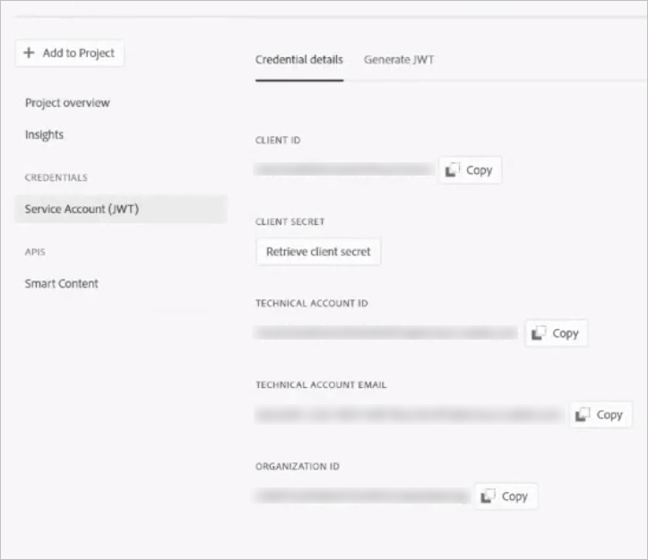

# OAuth凭据的智能标记疑难解答 {#oauth-config}

需要开放授权配置才能同意[!DNL Adobe Experience Manager]应用程序以安全方式与智能内容服务交互。

>[!NOTE]
>
> 从2024年6月起，您无法创建新的JWT凭据。 今后，仅创建OAuth服务器到服务器凭据。
> JWT集成仅对现有AMS和内部部署用户持续工作至2025年1月。

## 新AMS用户的OAuth配置 {#oauth-config-existing-ams-users}

有关新用户的OAuth服务的配置，请参阅[智能内容服务的配置](#integrate-adobe-io)。 完成后，请按照以下[步骤操作](#prereqs-config-oauth-onprem)。

>[!NOTE]
>
>如果需要，您可以按照[支持流程](https://experienceleague.adobe.com/?lang=en&amp;support-tab=home#support)提交支持票证。

## 现有AMS用户的OAuth配置 {#oauth-config-new-ams-users}

在执行此方法中的任何步骤之前，您需要实施以下内容：

### 先决条件 {#prereqs-config-oauth-onprem}

OAuth配置需要以下先决条件：

* 在[Developer Console](https://developer.adobe.com/console/user/servicesandapis)中创建新的OAuth集成。 在以下步骤中使用`ClientID`、`ClientSecret`、`OrgID`和其他属性：
* 在此路径`/apps/system/config in crx/de`上可找到以下文件：
   * `com.adobe.granite.auth.oauth.accesstoken.provider.<randomnumbers>.config`
   * `com.adobe.granite.auth.ims.impl.IMSAccessTokenRequestCustomizerImpl.<randomnumber>.config`

### 现有AMS和On Prem用户的OAuth配置 {#steps-config-oauth-onprem}

以下步骤可由系统管理员在&#x200B;**CRXDE**&#x200B;中执行。 在[支持流程](https://experienceleague.adobe.com/?lang=en&amp;support-tab=home#support)之后，AMS客户可以联系Adobe代表或提交支持工单。

1. 在`com.adobe.granite.auth.oauth.accesstoken.provider.<randomnumbers>.config`中添加或更新以下属性：

   * `auth.token.provider.authorization.grants="client_credentials"`
   * `auth.token.provider.orgId="<OrgID>"`
   * `auth.token.provider.default.claims=("\"iss\"\ :\ \"<OrgID>\"")`
   * `auth.token.provider.scope="read_pc.dma_smart_content,\ openid,\ AdobeID,\ additional_info.projectedProductContext"`
     `auth.token.validator.type="adobe-ims-similaritysearch"`
   * 使用新OAuth配置的客户端ID更新`auth.token.provider.client.id`。
   * 将`auth.access.token.request`更新至`"https://ims-na1.adobelogin.com/ims/token/v3"`
1. 将文件重命名为`com.adobe.granite.auth.oauth.accesstoken.provider-<randomnumber>.config`。

   >[!IMPORTANT]
   >
   >将点(.)替换为连字符(-)作为`<randomnumber>`的前缀。

1. 在`com.adobe.granite.auth.ims.impl.IMSAccessTokenRequestCustomizerImpl.<randomnumber>.config`中执行以下步骤：
   * 通过新的OAuth集成，使用客户端密钥更新属性auth.ims.client.secret。
   * 将文件重命名为`com.adobe.granite.auth.ims.impl.IMSAccessTokenRequestCustomizerImpl-<randomnumber>.config`
1. 在内容存储库开发控制台（例如，CRXDE）中保存所有更改。
<!--
1. Navigate to `/system/console/configMgr` and replace the OSGi configuration from `.<randomnumber>` to `-<randomnumber>`.
1. Delete the old OSGi configuration for `"Access Token provider name: adobe-ims-similaritysearch"` in `/system/console/configMgr`.
-->
1. 在`System/console/configMgr`中，您可以查看旧配置文件和新配置文件。 删除`com.adobe.granite.auth.ims.impl.IMSAccessTokenRequestCustomizerImpl`和访问令牌提供程序名称`adobe-ims-similaritysearch`的旧配置。 确保仅实施已更新的配置，而不实施旧配置。
1. 重新启动控制台。

## 验证配置 {#validate-the-configuration}

完成配置后，可以使用JMX MBean来验证配置。 要进行验证，请执行以下步骤。

1. 访问位于`https://[aem_server]:[port]`的[!DNL Experience Manager]服务器。

1. 转到&#x200B;**[!UICONTROL 工具]** > **[!UICONTROL 操作]** > **[!UICONTROL Web控制台]**&#x200B;以打开OSGi控制台。 单击&#x200B;**[!UICONTROL 主] > [!UICONTROL JMX]**。

1. 单击 `com.day.cq.dam.similaritysearch.internal.impl`. 它会打开&#x200B;**[!UICONTROL SimilaritySearch其他任务]**。

1. 单击 `validateConfigs()`. 在&#x200B;**[!UICONTROL 验证配置]**&#x200B;对话框中，单击&#x200B;**[!UICONTROL 调用]**。

验证结果将显示在同一对话框中。

>[!NOTE]
>
>如果发生`unsupported_grant_type`错误，请尝试安装Granite修补程序。 请参阅[从服务帐户(JWT)迁移到OAuth服务器到服务器凭据](https://experienceleague.adobe.com/en/docs/experience-cloud-kcs/kbarticles/ka-24660)。

## 与Adobe Developer Console集成 {#integrate-adobe-io}

作为新用户，当您与Adobe Developer Console集成时，[!DNL Experience Manager]服务器会先通过Adobe Developer Console网关验证您的服务凭据，然后再将您的请求转发到智能内容服务。 要集成，您需要一个拥有组织管理员权限的Adobe ID帐户，以及一个已购买并为您的组织启用的Smart Content Service许可证。

要配置智能内容服务，请按照以下顶级步骤操作：

<!---->

1. 若要生成公钥，请在[!DNL Experience Manager]中[创建智能内容服务](#oauth-config)配置。 [下载用于OAuth集成的公共证书](#oauth-config)。

1. *[如果您是现有用户，则不适用]* [在Adobe Developer Console中创建集成](#create-adobe-i-o-integration)。

1. [使用Adobe Developer Console中的API密钥和其他凭据配置您的部署](#configure-smart-content-service)。

1. [测试配置](#validate-the-configuration)。

## 通过创建智能内容服务配置下载公共证书 {#download-public-certificate}

公共证书允许您在Adobe Developer Console上验证配置文件。

1. 在[!DNL Experience Manager]用户界面中，访问&#x200B;**[!UICONTROL 工具]** > **[!UICONTROL Cloud Service]** > **[!UICONTROL 旧版Cloud Service]**。

1. 在“Cloud Service”页面中，单击&#x200B;**[!UICONTROL Assets智能标记]**&#x200B;下的&#x200B;**[!UICONTROL 立即配置]**。

1. 在&#x200B;**[!UICONTROL 创建配置]**&#x200B;对话框中，指定智能标记配置的标题和名称。 单击&#x200B;**[!UICONTROL 创建]**。

1. 在&#x200B;**[!UICONTROL AEM Smart Content Service]**&#x200B;对话框中，使用以下值：

   **[!UICONTROL 服务URL]**： `https://smartcontent.adobe.io/<region where your Experience Manager author instance is hosted>`

   例如，`https://smartcontent.adobe.io/apac`。您可以将`na`、`emea`或`apac`指定为承载Experience Manager创作实例的区域。

   >[!NOTE]
   >
   >如果Experience Manager托管服务是在2022年9月1日之前配置的，请使用以下服务URL：
   >`https://mc.adobe.io/marketingcloud/smartcontent`

   **[!UICONTROL 授权服务器]**： `https://ims-na1.adobelogin.com`

   其他字段暂时留空（稍后提供）。 单击&#x200B;**[!UICONTROL 确定]**。

   

   *图：用于提供内容服务URL的Smart Content Service对话框*

   >[!NOTE]
   >
   >提供为[!UICONTROL 服务URL]的URL无法通过浏览器访问，并生成404错误。 使用[!UICONTROL 服务URL]参数的相同值时，配置工作正常。 有关整体服务状态和维护计划，请参阅[https://status.adobe.com](https://status.adobe.com)。

1. 单击&#x200B;**[!UICONTROL 下载OAuth集成的公共证书]**，然后下载公共证书文件`AEM-SmartTags.crt`。 此外，您不再需要在Adobe Developer控制台中上传此证书。

   

   *图：智能标记服务的设置。*

## 创建Adobe Developer Console集成 {#create-adobe-i-o-integration}

要使用Smart Content Service API，请在Adobe Developer Console中创建集成，以获取[!DNL Experience Manager]中云配置的[!UICONTROL Assets智能标记服务设置]的[!UICONTROL API密钥](在Adobe Developer Console集成的[!UICONTROL 客户端ID]字段中生成)、[!UICONTROL 技术帐户ID]、[!UICONTROL 组织ID]和[!UICONTROL 客户端密钥]。

1. 在浏览器中访问[https://developer.adobe.com/console/](https://developer.adobe.com/console/)。 选择相应的帐户并验证关联的组织角色是否为系统管理员。

1. 创建具有任何所需名称的项目。单击&#x200B;**[!UICONTROL 添加 API]**。

1. 在&#x200B;**[!UICONTROL 添加 API]** 页面中，依次选择 **[!UICONTROL Experience Cloud]** 和&#x200B;**[!UICONTROL 智能内容]**。单击&#x200B;**[!UICONTROL 下一步]**。

1. 选择&#x200B;**[!UICONTROL OAuth服务器到服务器]**&#x200B;身份验证方法。

1. 根据需要添加/修改&#x200B;**[!UICONTROL 凭据名称]**。 单击&#x200B;**[!UICONTROL 下一步]**。

1. 选择产品配置文件&#x200B;**[!UICONTROL 智能内容服务]**。 单击&#x200B;**[!UICONTROL 保存配置的API]**。 OAuth API将添加到连接的凭据以供进一步使用。 您可以从中复制[!UICONTROL API密钥（客户端ID）]或[!UICONTROL 生成访问令牌]。
<!--
1. On the **[!UICONTROL Select product profiles]** page, select **[!UICONTROL Smart Content Services]**. Click **[!UICONTROL Save configured API]**.

   A page displays more information about the configuration. Keep this page open to copy and add these values in [!UICONTROL Assets Smart Tagging Service Settings] of cloud configuration in [!DNL Experience Manager] to configure smart tags.

   

   *Figure: Details of integration in Adobe Developer Console*
-->

*图：在Adobe Developer Console中配置了OAuth服务器到服务器*

## 配置智能内容服务 {#configure-smart-content-service}

要配置集成，请使用Adobe Developer Console集成中的[!UICONTROL 技术帐户ID]、[!UICONTROL 组织ID]、[!UICONTROL 客户端密钥]和[!UICONTROL 客户端ID]字段的值。 创建智能标记云配置允许来自[!DNL Experience Manager]部署的API请求的身份验证。

1. 在[!DNL Experience Manager]中，导航到&#x200B;**[!UICONTROL 工具]** > **[!UICONTROL Cloud Service]** > **[!UICONTROL 旧版Cloud Services]**&#x200B;以打开[!UICONTROL Cloud Services]控制台。

1. 在&#x200B;**[!UICONTROL Assets智能标记]**&#x200B;下，打开上面创建的配置。 在服务设置页面上，单击&#x200B;**[!UICONTROL 编辑]**。

1. 在 **[!UICONTROL AEM 智能内容服务]**&#x200B;对话框中，为&#x200B;**[!UICONTROL 服务 URL]** 和&#x200B;**[!UICONTROL 授权服务器]**&#x200B;字段使用预填充的值。

1. 对于字段[!UICONTROL Api密钥]、[!UICONTROL 技术帐户ID]、[!UICONTROL 组织ID]和[!UICONTROL 客户端密钥]，请复制并使用在[Adobe Developer Console集成](#create-adobe-i-o-integration)中生成的以下值。

   | [!UICONTROL Assets智能标记服务设置] | [!DNL Adobe Developer Console]集成字段 |
   |--- |--- |
   | [!UICONTROL Api密钥] | [!UICONTROL 客户端ID] |
   | [!UICONTROL 技术帐户ID] | [!UICONTROL 技术帐户ID] |
   | [!UICONTROL 组织ID] | [!UICONTROL 组织ID] |
   | [!UICONTROL 客户端密码] | [!UICONTROL 客户端密钥] |

>[!MORELIKETHIS]
>
>* [概述以及如何培训智能标记](enhanced-smart-tags.md)
>* [配置智能标记](config-smart-tagging.md)
>* [有关智能标记的视频教程](https://experienceleague.adobe.com/docs/experience-manager-learn/assets/metadata/image-smart-tags.html)
