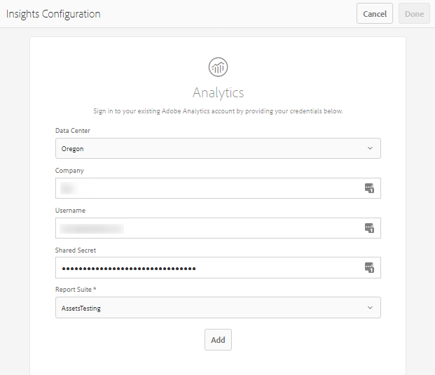

# 配置Assets分析 {#configure-asset-insights}

[!DNL Adobe Experience Manager Assets]从[!DNL Adobe Analytics]中获取有关第三方网站使用的数字资产的使用情况数据。 要启用Assets Insights以检索此数据并生成见解，请首先配置该功能以与[!DNL Adobe Analytics]集成。 要在内部部署安装中使用此功能，请单独购买[!DNL Adobe Analytics]许可证。 [!DNL Managed Services]上的客户将收到与[!DNL Experience Manager]捆绑的[!DNL Analytics]许可证。 请参阅[Managed Services产品说明](https://helpx.adobe.com/legal/product-descriptions/adobe-experience-manager-managed-services.html)。

>[!NOTE]
>
>仅支持图像并提供见解。

1. 在[!DNL Experience Manager]中，单击&#x200B;**[!UICONTROL 工具]** > **[!UICONTROL Assets]**。

   

1. 单击&#x200B;**[!UICONTROL 分析配置]**&#x200B;卡。
1. 在向导中，选择一个数据中心并提供您的凭据，包括组织名称、用户名和共享密钥。

   

   *图：在[!DNL Experience Manager].*&#x200B;中为Assets Insights配置[!DNL Adobe Analytics]

1. 单击&#x200B;**[!UICONTROL 身份验证]**。
1. [!DNL Experience Manager]对您的凭据进行身份验证后，从&#x200B;**[!UICONTROL 报表包]**&#x200B;列表中，选择希望Assets Insights从中获取数据的[!DNL Adobe Analytics]报表包。 单击&#x200B;**[!UICONTROL 添加]**。
1. 在[!DNL Experience Manager]设置报表包后，单击&#x200B;**[!UICONTROL 完成]**。

## 页面跟踪器 {#page-tracker}

配置[!DNL Adobe Analytics]帐户后，将为您生成页面跟踪器代码。 要启用Assets Insights以跟踪第三方网站中使用的[!DNL Experience Manager]资源，请在网站代码中包含页面跟踪器代码。 在[!DNL Experience Manager Assets]中使用[!UICONTROL 页面跟踪器]实用程序生成页面跟踪器代码。 有关如何将页面跟踪器代码包含在第三方网页中的更多信息，请参阅[在网页中使用页面跟踪器和嵌入代码](/help/assets/use-page-tracker.md)。

1. 在[!DNL Experience Manager]中，单击&#x200B;**[!UICONTROL 工具]** > **[!UICONTROL Assets]**。

   

1. 从&#x200B;**[!UICONTROL 导航]**&#x200B;页面中，单击&#x200B;**[!UICONTROL 分析页面跟踪器]**&#x200B;卡。
1. 单击&#x200B;**[!UICONTROL 下载]**&#x200B;以下载页面跟踪器代码。
