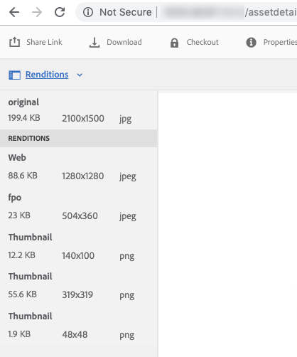

# 为Adobe InDesign生成“仅用于置入”演绎版 {#fpo-renditions}

| 版本 | 文章链接 |
| -------- | ---------------------------- |
| AEM as a Cloud Service | [单击此处](https://experienceleague.adobe.com/docs/experience-manager-cloud-service/content/assets/admin/configure-fpo-renditions.html?lang=en) |
| AEM 6.5 | 本文 |

将大型资源从Experience Manager置入Adobe InDesign文档时，创意专业人士在[置入资源](https://helpx.adobe.com/indesign/using/placing-graphics.html)后必须等待相当长的时间。 同时，用户被阻止使用InDesign。 这会中断创作流并对用户体验产生负面影响。 Adobe功能允许从InDesign文档开始临时放置小型演绎版。 在需要最终输出时（例如，对于打印和发布工作流），原始的全分辨率资产会在后台替换临时演绎版。 这种后台异步更新可加快设计流程以提高工作效率，且不会阻碍创作过程。

Adobe Experience Manager (AEM)提供仅用于置入(FPO)的演绎版。 这些FPO呈现版本的文件大小较小，但纵横比相同。 如果FPO演绎版不可用于某个资源，Adobe InDesign将改用原始资源。 此回退机制可确保创意工作流不间断地进行。

## 生成FPO呈现版本的方法 {#approach-to-generate-fpo-renditions}

Experience Manager允许使用多种方法来处理可用于生成FPO呈现形式的图像。 最常用的两种方法是使用内置的Experience Manager工作流和使用ImageMagick。 使用这两种方法，您可以配置新上传的资源以及Experience Manager中存在的资源的演绎版生成。

您可以使用ImageMagick处理图像，包括生成FPO演绎版。 这种再现被缩减采样，即，如果原始图像的PPI大于72，则再现的像素尺寸按比例减小。 请参阅[安装和配置ImageMagick以用于Experience Manager Assets](best-practices-for-imagemagick.md)。

|  | 使用Experience Manager的内置工作流程 | 使用ImageMagick工作流 | 备注 |
|--- |--- |---|--- |
| 对于新资产 | 启用FPO演绎版（[帮助](#generate-renditions-of-new-assets-using-aem-workflow)） | 在Experience Manager工作流中添加ImageMagick命令行（[帮助](#generate-renditions-of-new-assets-using-imagemagick)） | Experience Manager对每次上传执行DAM更新Assets工作流。 |
| 对于现有资源 | 在新的专用Experience Manager工作流中启用FPO演绎版（[帮助](#generate-renditions-of-existing-assets-using-aem-workflow)） | 在新的专用Experience Manager工作流中添加ImageMagick命令行（[帮助](#generate-renditions-of-existing-assets-using-imagemagick)） | 现有资产的FPO演绎版可按需或批量创建。 |

>[!CAUTION]
>
>创建工作流以通过修改默认工作流的副本来生成演绎版。 它可以防止在Experience Manager更新时覆盖更改，例如通过安装新的Service Pack。

## 使用Experience Manager工作流生成新资源的演绎版 {#generate-renditions-of-new-assets-using-aem-workflow}

以下是配置DAM更新资产工作流模型以启用演绎版生成的步骤：

1. 单击&#x200B;**[!UICONTROL 工具]** > **[!UICONTROL 工作流]** > **[!UICONTROL 模型]**。 选择&#x200B;**[!UICONTROL DAM更新资产]**&#x200B;模型，然后单击&#x200B;**[!UICONTROL 编辑]**。

1. 选择&#x200B;**[!UICONTROL 进程缩略图]**&#x200B;步骤，然后单击&#x200B;**[!UICONTROL 配置]**。

1. 单击&#x200B;**[!UICONTROL FPO呈现版本]**&#x200B;选项卡。 选择&#x200B;**[!UICONTROL 启用FPO呈现版本创建]**。

   

1. 调整&#x200B;**[!UICONTROL 质量]**&#x200B;并根据需要添加或修改&#x200B;**[!UICONTROL 格式列表]**&#x200B;值。 默认情况下，用于生成FPO演绎版的MIME类型列表为pjpeg、jpeg、jpg、gif、png、x-png和tiff。 单击&#x200B;**[!UICONTROL 完成]**。

   >[!NOTE]
   >
   >JPEG、GIF、PNG、TIFF、PSD和BMP等文件类型支持生成演绎版。

1. 要激活这些更改，请单击&#x200B;**[!UICONTROL 同步]**。

>[!NOTE]
>
>一侧大于1280像素的图像不会保留FPO演绎版中的像素尺寸。

## 使用ImageMagick生成新资源的演绎版 {#generate-renditions-of-new-assets-using-imagemagick}

在Experience Manager中，当上传新资源时，将执行DAM更新资源工作流。 要使用ImageMagick处理新上传资源的演绎版，请向工作流模型添加新命令。

1. 单击&#x200B;**[!UICONTROL 工具]** > **[!UICONTROL 工作流]** > **[!UICONTROL 模型]**。

1. 选择&#x200B;**[!UICONTROL DAM更新资产]**&#x200B;模型，然后单击&#x200B;**[!UICONTROL 编辑]**。

1. 单击左上角的&#x200B;**[!UICONTROL 切换侧面板]**&#x200B;并搜索命令行步骤。

1. 拖动&#x200B;**[!UICONTROL 命令行]**&#x200B;步骤并将其添加到&#x200B;**[!UICONTROL 进程缩略图]**&#x200B;步骤之前。

1. 选择&#x200B;**[!UICONTROL 命令行]**&#x200B;步骤并单击&#x200B;**[!UICONTROL 配置]**。

1. 将所需信息添加为自定义&#x200B;**[!UICONTROL 标题]**&#x200B;和&#x200B;**[!UICONTROL 描述]**。 例如，FPO演绎版（由ImageMagick提供支持）。

1. 在&#x200B;**[!UICONTROL 参数]**&#x200B;选项卡中，添加相关的&#x200B;**[!UICONTROL Mime类型]**&#x200B;以提供命令适用的文件格式列表。

   

1. 在&#x200B;**[!UICONTROL 参数]**&#x200B;选项卡的&#x200B;**[!UICONTROL 命令]**&#x200B;部分中，添加相关的ImageMagick命令以生成FPO呈现版本。

   下面是一个示例命令，该命令以JPEG格式生成FPO呈现版本，以10%质量设置缩减采样到72 PPI，并通过拼合输出来处理多层Adobe Photoshop文件：

   `convert -quality 10% -units PixelsPerInch ${filename} -resample 72 -flatten cq5dam.fpo.jpeg`

1. 要激活这些更改，请单击&#x200B;**[!UICONTROL 同步]**。

有关ImageMagick命令行功能的详细信息，请参阅[https://imagemagick.org](https://imagemagick.org)。

## 使用Experience Manager工作流生成现有资源的演绎版 {#generate-renditions-of-existing-assets-using-aem-workflow}

要使用Experience Manager工作流生成现有资源的FPO演绎版，请创建一个使用内置FPO演绎版选项的专用工作流模型。

1. 单击&#x200B;**[!UICONTROL 工具]** > **[!UICONTROL 工作流]** > **[!UICONTROL 模型]**。

1. 要创建模型，请单击&#x200B;**[!UICONTROL 创建]** > **[!UICONTROL 创建模型]**。

1. 添加有意义的&#x200B;**[!UICONTROL 标题]**&#x200B;和&#x200B;**[!UICONTROL 名称]**。

1. 选择模型并单击&#x200B;**[!UICONTROL 编辑]**。 单击&#x200B;**[!UICONTROL 页面信息]** > **[!UICONTROL 打开属性]**，然后选择&#x200B;**[!UICONTROL 临时工作流]**。 这提高了可扩展性和性能。

1. 单击&#x200B;**[!UICONTROL 保存]**&#x200B;和&#x200B;**[!UICONTROL 关闭]**。

1. 单击左上角的&#x200B;**[!UICONTROL 切换侧面板]**&#x200B;并搜索流程缩略图步骤。

1. 选择&#x200B;**[!UICONTROL 进程缩略图]**&#x200B;并单击&#x200B;**[!UICONTROL 配置]**。 按照[配置使用Experience Manager工作流](#generate-renditions-of-new-assets-using-aem-workflow)生成新资源的演绎版。

1. 要激活这些更改，请单击&#x200B;**[!UICONTROL 同步]**。

## 使用ImageMagick生成现有资源的演绎版 {#generate-renditions-of-existing-assets-using-imagemagick}

要使用ImageMagick处理功能生成现有资产的FPO演绎版，请创建使用ImageMagick命令行执行此操作的专用工作流模型。

1. 按照[配置中的步骤1到步骤3，使用Experience Manager工作流](#generate-renditions-of-existing-assets-using-aem-workflow)部分生成现有资源的演绎版。

1. 按照[配置中的步骤4到步骤8操作，使用ImageMagick](#generate-renditions-of-new-assets-using-imagemagick)部分生成新资源的演绎版。

## 查看FPO呈现版本 {#view-fpo-renditions}

您可以在工作流完成后检查生成的FPO呈现版本。 在Experience Manager Assets用户界面中，单击资源以打开大型预览。 打开左边栏并选择“格式副本”。 或者，在预览打开时使用键盘快捷键`Alt + 3`。

单击&#x200B;**[!UICONTROL FPO呈现版本]**&#x200B;以加载其预览。 或者，您也可以右键单击该演绎版并将其保存到您的文件系统。

## 提示和限制 {#tips-limitations}

* 要使用基于ImageMagick的配置，请将ImageMagick安装在Experience Manager所在的计算机上。
* 要生成许多资产或整个存储库的FPO演绎版，请在低流量持续期间规划和执行工作流。 为大量资源生成FPO演绎版是一项资源密集型工作，Experience Manager服务器必须具有足够的处理能力和可用内存。
* 有关性能和可扩展性，请参阅[微调ImageMagick](performance-tuning-guidelines.md)。
* 有关资产的通用命令行处理，请参阅用于处理资产的命令行处理程序。
