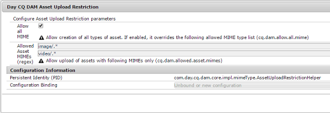

# 配置资产上传限制 {#configuring-asset-upload-restrictions}

您可以将[!DNL Adobe Experience Manager Assets]配置为限制用户可以上传的资源类型。 它有助于防止意外上传不需要的格式和恶意文件。 通过`Day CQ DAM Asset Upload Restriction`服务，您可以控制用户可以上传的文件类型。 默认情况下，[!DNL Assets]允许用户上传所有MIME类型的资产。 但是，您可以将服务配置为限制用户仅上载特定MIME类型的文件。

1. 打开Configuration Manager web控制台。 访问`https://[aem_server]:[port]/system/console/configMgr`。
1. 在编辑模式下打开&#x200B;**[!UICONTROL Day CQ DAM资产上传限制]**&#x200B;服务。 默认情况下，**允许所有MIME**&#x200B;选项处于选中状态，该选项允许用户上传所有MIME类型的文件。

   

1. 要限制用户仅上载某些MIME类型的文件，请取消选中&#x200B;**[!UICONTROL 允许所有MIME]**&#x200B;选项，并使用正则表达式在&#x200B;**[!UICONTROL 允许的资产MIME (regex)]**&#x200B;字段中指定允许的MIME类型。

   

1. 单击&#x200B;**[!UICONTROL 保存]**&#x200B;以保存更改。 如果为允许的MIME类型指定MIME字符串，则对于任何MIME类型与这些字段中配置的MIME字符串不匹配的资源，上传操作都将失败。
