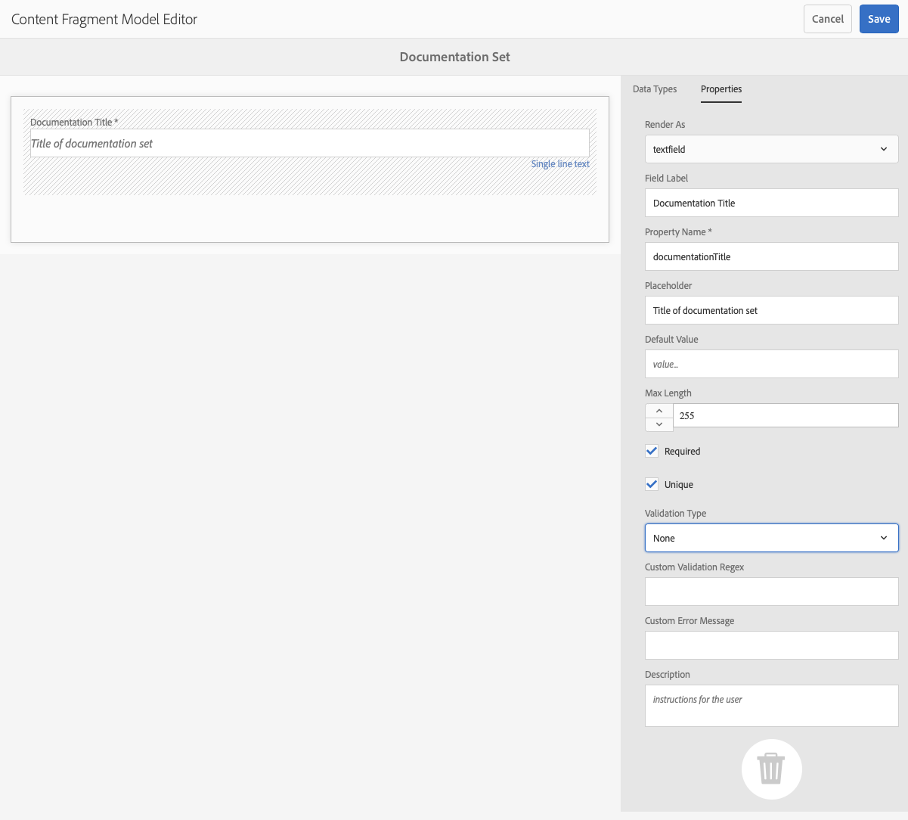

# 内容片段模型 {#content-fragment-models}

AEM中的内容片段模型为您的定义了内容结构 [内容片段，](/help/assets/content-fragments/content-fragments.md) 作为Headless内容的基础。

要使用内容片段模型，您可以：

1. [为您的实例启用内容片段模型功能](/help/assets/content-fragments/content-fragments-configuration-browser.md).
1. [创建](#creating-a-content-fragment-model)、和 [配置](#defining-your-content-fragment-model)，您的内容片段模型。
1. [启用您的内容片段模型](#enabling-disabling-a-content-fragment-model) 以便在创建内容片段时使用。
1. 通过配置[策略](#allowing-content-fragment-models-assets-folder)，**允许在所需的 Assets 文件夹上创建内容片段模型**。

## 创建内容片段模型 {#creating-a-content-fragment-model}

1. 导航到 **工具**， **资产**，然后打开 **内容片段模型**.
1. 导航到适合您的文件夹 [配置](/help/assets/content-fragments/content-fragments-configuration-browser.md).
1. 使用&#x200B;**创建**&#x200B;打开向导。

   >[!CAUTION]
   >
   >如果 [未启用内容片段模型](/help/assets/content-fragments/content-fragments-configuration-browser.md)， **创建** 选项不可用。

1. 指定&#x200B;**模型标题**。您还可以添加 **标记**， a **描述**，并选择 **启用模型** 到 [启用模型](#enabling-disabling-a-content-fragment-model) 如有必要。

   

1. 使用&#x200B;**创建**&#x200B;保存空模型。随后将显示一条消息，指示操作成功，您可选择&#x200B;**打开**&#x200B;以立即编辑模型或选择&#x200B;**完成**&#x200B;以返回控制台。

## 定义内容片段模型 {#defining-your-content-fragment-model}

内容片段模型通过选择&#x200B;**[“数据类型”](#data-types)**，有效地定义了结果内容片段的结构。使用模型编辑器，您可以添加数据类型的实例，然后对其进行配置以创建必填字段：

>[!CAUTION]
>
>编辑现有内容片段模型可能会影响从属片段。

1. 导航到 **工具**， **资产**，然后打开 **内容片段模型**.

1. 导航到包含内容片段模型的文件夹。

1. 打开所需的模型进行&#x200B;**“编辑”**；使用快速操作或选择模型，然后从工具栏中选择操作。

   打开模型编辑器后，会显示：

   * 左：字段已定义
   * 右侧：可用于创建字段的&#x200B;**数据类型**（可在创建字段后使用的&#x200B;**属性**）

   >[!NOTE]
   >
   >当字段为&#x200B;**必填**&#x200B;时，左侧窗格中指示的&#x200B;**标记**&#x200B;会标有星号 (**&#42;**)。

   

1. **添加字段**

   * 将字段的必需数据类型拖到所需位置：

     

   * 将字段添加到模型后，右侧面板将显示可以为该特定数据类型定义的&#x200B;**属性**。您可以在此定义该字段的必需内容。

      * 许多属性的含义一目了然，有关更多详细信息，请参阅[属性](#properties)。
      * 键入&#x200B;**字段标签**&#x200B;将自动补全&#x200B;**属性名称** - 如果为空，则以后可手动更新它。

        >[!CAUTION]
        >
        手动更新属性时 **属性名称** 对于数据类型，名称必须仅包含A - Z、a - z、0 - 9和下划线“_”作为特殊字符。
        >
        如果在 AEM 早期版本中创建的模型包含非法字符，请移除或更新这些字符。

     例如：

     

1. **移除字段**

   选择必填字段，然后单击垃圾桶图标。 系统会要求您确认该操作。

   

1. 添加所有必填字段，并根据需要定义相关属性。 例如：

   

1. 选择&#x200B;**“保存”**&#x200B;来保留定义。

## 数据类型 {#data-types}

有一批数据类型可用于定义您的模型：

* **单行文本**
   * 添加单行文本的一个或多个字段；可以定义最大长度
* **多行文本**
   * 一个文本区域，它可为富文本、纯文本或 Markdown
* **数字**
   * 添加一个或多个数字字段
* **布尔型**
   * 添加布尔复选框
* **日期和时间**
   * 添加日期和/或时间
* **枚举**
   * 添加一组复选框、单选按钮或下拉字段
* **标记**
   * 允许片段作者访问和选择标记区域
* **内容引用**
   * 引用任何类型的其他内容；可用于[创建嵌套内容](#using-references-to-form-nested-content)
   * 如果图像被引用，您可以选择显示缩略图
* **片段引用**
   * 引用其他内容片段；可用于[创建嵌套内容](#using-references-to-form-nested-content)
   * 数据类型可配置为允许片段作者执行以下操作：
      * 直接编辑引用的片段。
      * 根据相应的模型创建内容片段
* **JSON 对象**
   * 允许内容片段作者在片段的相应元素中输入 JSON 语法。
      * 允许AEM存储您从其他服务复制并粘贴的直接JSON。
      * JSON 将被传递，并在 GraphQL 中作为 JSON 输出。
      * 内容片段编辑器中包括JSON语法高亮显示、自动完成和错误高亮显示。
* **制表符占位符**
   * 允许引入选项卡，以在编辑内容片段内容时使用。
这会在模型编辑器中显示为分隔符，用于分隔内容数据类型列表的各个部分。 每个实例表示新选项卡的开头。
在片段编辑器中，每个实例都会显示为一个选项卡。

     >[!NOTE]
     >
     此数据类型仅用于格式设置，因此 AEM GraphQL 架构会忽略此数据类型。

## 属性 {#properties}

许多属性含义一目了然，对于某些属性，其他详细信息如下：


* **属性名称**

  为数据类型手动更新此属性时，名称 **必须** contain *仅限* A-Z、a-z、0-9和下划线“_”作为特殊字符。

  >[!CAUTION]
  >
  如果在 AEM 早期版本中创建的模型包含非法字符，请移除或更新这些字符。

* **呈现为**
用于在片段中实现/呈现字段的各种选项。通常，这允许您定义作者是否能看到字段的单个实例，还是允许作者创建多个实例。

* **字段标签**
输入 **字段标签** 自动生成 **属性名称**，如有必要，可以手动更新。

* **验证**
基本验证可由以下机制提供： **必需** 属性。某些数据类型具有额外的验证字段。 请参阅[验证](#validation)，了解更多详细信息。

* 对于数据类型&#x200B;**多行文本**，可将&#x200B;**默认类型**&#x200B;定义为以下任一类型：

   * **富文本**
   * **Markdown**
   * **纯文本**

  如果未指定，则默认值&#x200B;**富文本**&#x200B;用于此字段。

  更改 **默认类型** 在内容片段模型中，仅当在编辑器中打开并保存现有的相关内容片段后，该片段才会生效。

* **独特**
对于从当前模型创建的所有内容片段，内容（适用于特定字段）必须是唯一的。

  用于确保内容作者不能重复已添加到同一模型的另一个片段中的内容。

  例如，内容片段模型中名为 `Country` 的&#x200B;**单行文本**&#x200B;字段在两个相关内容片段中不能具有值`Japan`。尝试第二个实例时会发出警告。

  >[!NOTE]
  >
  确保每个语言根的唯一性。

  >[!NOTE]
  >
  变体可以具有与同一片段变体相同的&#x200B;*唯一*&#x200B;值，但与其他片段变体中使用的值不同。

* 有关特定数据类型及其属性的更多详细信息，请参阅&#x200B;**[内容参考](#content-reference)**。

* 有关特定数据类型及其属性的更多详细信息，请参阅&#x200B;**[片段引用（嵌套片段）](#fragment-reference-nested-fragments)**。

<!--
* **Translatable**
  Checking the **Translatable** checkbox on a field in the Content Fragment Model editor does the following:

  * Ensures that the field's property name is added to the translation configuration, context `/content/dam/<sites-configuration>`, if not already present. 
  * For GraphQL: sets a `<translatable>` property on the Content Fragment field to `yes`, to allow GraphQL query filter for JSON output with only translatable content.
-->

## 验证 {#validation}

现在，各种数据类型都可以定义在结果片段中输入内容时的验证要求：

* **单行文本**
   * 与预定义正则表达式进行比较。
* **数字**
   * 检查特定值。
* **内容引用**
   * 测试特定类型的内容。
   * 只能引用指定文件大小或更小的资源。
   * 只能引用预定义的宽度和/或高度范围（以像素为单位）内的图像。
* **片段引用**
   * 测试特定内容片段模型。

## 使用引用表单嵌套内容 {#using-references-to-form-nested-content}

内容片段可以使用以下任一数据类型形成嵌套内容：

* **[内容引用](#content-reference)**
   * 提供对其他内容的简单引用；任何类型的。
   * 可以为一个引用或多个引用（在生成的片段中）配置它。

* **[片段引用](#fragment-reference-nested-fragments)**（嵌套片段）
   * 引用其他片段，具体取决于指定的特定模型。
   * 让您包含/检索结构化数据。

     >[!NOTE]
     >
     此方法特别值得关注 [使用带有GraphQL的内容片段的Headless内容投放](/help/assets/content-fragments/content-fragments-graphql.md).
   * 可以为一个引用或多个引用（在生成的片段中）配置它。

>[!NOTE]
>
AEM 具有以下重复保护：
>
* 内容引用这会阻止用户添加对当前片段的引用。 这可能导致出现空的片段引用选取器对话框。
>
* GraphQL中的片段引用如果您创建的深层查询返回多个相互引用的内容片段，则该查询在第一次出现时返回null。

### 内容引用 {#content-reference}

内容引用允许您呈现来自其他源的内容；例如，图像或内容片段。

除了标准属性之外，您还可以指定：

* 任何引用内容的&#x200B;**根路径**
* 可引用的内容类型
* 文件大小限制
* 如果引用了图像：
   * 显示缩略图
   * 图像高度和宽度的限制


### 片段引用（嵌套片段） {#fragment-reference-nested-fragments}

“片段引用”会引用一个或多个内容片段。在检索应用程序中使用的内容时，此功能特别有意义，因为它允许您检索具有多个层的结构化数据。

例如：

* 定义员工详细信息的模型；这包括：
   * 对定义雇主（公司）的模型的引用

```xml
type EmployeeModel {
    name: String
    firstName: String
    company: CompanyModel
}

type CompanyModel {
    name: String
    street: String
    city: String
}
```

>[!NOTE]
>
以下内容特别令人感兴趣 [使用带有GraphQL的内容片段的Headless内容投放](/help/assets/content-fragments/content-fragments-graphql.md).

除了标准属性之外，您还可以定义：

* **呈现为**:

   * **多字段** – 片段作者可以创建多个单个引用

   * **片段** – 允许片段作者选择对片段的单个引用

* **模型类型**
可以选择多个模型。创作内容片段时，必须使用这些模型创建任何引用的片段。

* **根路径**
这会为引用的任何片段指定根路径。

* **允许创建片段**

  这将允许片段作者根据相应的模型创建片段。

   * **片段引用组合** – 允许片段作者通过选择多个片段来构建复合

  

>[!NOTE]
>
已建立重复保护机制。它禁止用户在片段引用中选择当前内容片段。这可能导致出现空的片段引用选取器对话框。
>
GraphQL 还对片段引用提供了定期保护。如果在两个互相引用的内容片段之间创建深层查询，则它返回 null。

## 启用或禁用内容片段模型 {#enabling-disabling-a-content-fragment-model}

要完全控制内容片段模型的使用，可以设置其状态。

### 启用内容片段模型 {#enabling-a-content-fragment-model}

创建模型后，必须启用该模型，以便：

* 在创建内容片段时，可以选择该属性。
* 可以从内容片段模型中引用它。
* 它可供GraphQL使用；这样即会生成架构。

要启用标记为以下任一类型的模型：

* **草稿**：mew（从未启用）。
* **已禁用** ：已禁用。

您可以使用 **启用** 选项来自：

* 选择所需的“模型”时，顶部工具栏。
* 相应的快速操作（将鼠标悬停在所需模型上）。


### 禁用内容片段模型 {#disabling-a-content-fragment-model}

也可以禁用模型，这样：

* 该模型将无法再用来创建&#x200B;*新*&#x200B;内容片段。
* 但是:
   * GraphQL架构一直在生成，并且仍可查询（以避免影响JSON API）。
   * 仍可以从 GraphQL 端点查询和返回任何基于模型的内容片段。
* 该模型无法再次引用，但现有引用将保持不变，并且仍可以从 GraphQL 端点查询和返回。

要禁用标为&#x200B;**已启用**&#x200B;的模型，可从以下任意一处使用&#x200B;**禁用**&#x200B;选项：

* 选择所需的“模型”时，顶部工具栏。
* 相应的快速操作（将鼠标悬停在所需模型上）。


## 允许在 Assets 文件夹中使用内容片段模型 {#allowing-content-fragment-models-assets-folder}

要实施内容管理，您可以配置 **策略** ，以控制允许在该文件夹中创建片段的内容片段模型。

>[!NOTE]
>
该机制类似于[允许在页面的高级属性](/help/sites-authoring/templates.md#allowing-a-template-author)中为页面及其子页面设置页面模板。

要为&#x200B;**允许的内容片段模型**&#x200B;配置&#x200B;**策略**：

1. 导航并打开&#x200B;**属性**，以访问所需的 Assets 文件夹。

1. 打开&#x200B;**策略**&#x200B;选项卡，您可以在其中配置：

   * **继承自`<folder>`**

     创建子文件夹时，会自动继承策略；如果子文件夹需要允许与父文件夹不同的模型，则可以重新配置策略（并中断继承）。

   * **按照路径允许的内容片段模型**

     可以允许使用多个模型。

   * **按标记允许的内容片段模型**

     可以允许使用多个模型。

   

1. **保存**&#x200B;任何更改。

文件夹允许的内容片段模型解析如下：

* 针对&#x200B;**允许的内容片段模型**&#x200B;的&#x200B;**策略**。
* 如果为空，请尝试使用继承规则确定策略。
* 如果继承链未投放结果，请查看 **Cloud Services** 文件夹的配置（也请先直接配置，然后通过继承配置）。
* 如果以上所有内容均未提供任何结果，则该文件夹不允许使用模型。

## 删除内容片段模型 {#deleting-a-content-fragment-model}

>[!CAUTION]
>
删除内容片段模型可能会影响从属片段。

要删除内容片段模型，请执行以下操作：

1. 导航到 **工具**， **资产**，然后打开 **内容片段模型**.

1. 导航到包含内容片段模型的文件夹。
1. 选择您的模型，然后从工具栏中&#x200B;**删除**。

   >[!NOTE]
   >
   如果引用了模型，则会发出警告。采取适当措施。

## 发布内容片段模型 {#publishing-a-content-fragment-model}

在发布任何相关内容片段时/之前，必须发布内容片段模型。

要发布内容片段模型，请执行以下操作：

1. 导航到 **工具**， **资产**，然后打开 **内容片段模型**.

1. 导航到包含内容片段模型的文件夹。
1. 选择您的模型，然后从工具栏中&#x200B;**“发布”**。
控制台中会指示已发布状态。

   >[!NOTE]
   >
   如果发布的内容片段的模型尚未发布，则会显示一个选择列表来指示该情况，并且模型会随该片段一起发布。

## 取消发布内容片段模型 {#unpublishing-a-content-fragment-model}

如果任何片段未引用内容片段模型，则可以取消发布这些模型。

要取消发布内容片段模型，请执行以下操作：

1. 导航到 **工具**， **资产**，然后打开 **内容片段模型**.

1. 导航到包含内容片段模型的文件夹。
1. 选择您的模型，然后从工具栏中选择&#x200B;**取消发布**。控制台中会指示已发布状态。

## 内容片段模型 – 属性 {#content-fragment-model-properties}

您可以编辑内容片段模型的&#x200B;**“属性”**：

* **基本**
   * **模型标题**
   * **标记**
   * **描述**
   * **上传图像**
