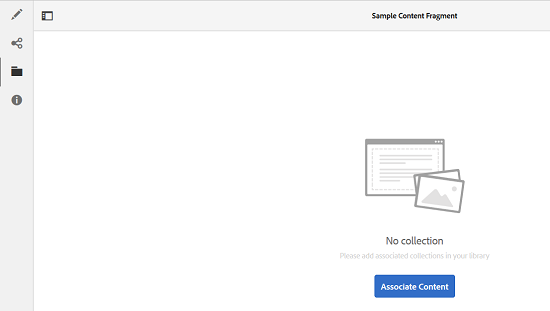
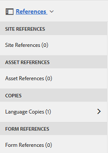
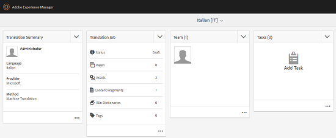
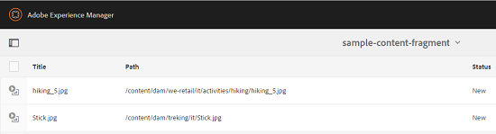

# 为内容片段创建翻译项目 {#creating-translation-projects-for-content-fragments}

除了资源之外，Adobe Experience Manager (AEM) Assets还支持[内容片段](/help/assets/content-fragments/content-fragments.md)（包括变体）的语言复制工作流。 对内容片段运行语言复制工作流无需进行其他优化。 在每个工作流中，会发送整个内容片段以供翻译。

您可以在内容片段上运行的工作流类型与您为资产运行的工作流类型完全相似。 此外，每个工作流类型中可用的选项与资产的相应工作流类型下可用的选项相匹配。

您可以在内容片段上运行以下类型的语言复制工作流：

**创建并翻译**

在此工作流中，要翻译的内容片段将被复制到要翻译的语言的语言根中。 此外，根据您选择的选项，将在项目控制台中为内容片段创建翻译项目。 根据设置，可以手动启动翻译项目，也可以允许在创建翻译项目后立即自动运行翻译项目。

**更新语言副本**

更新或修改源内容片段时，相应的区域设置/语言特定的内容片段需要重新翻译。 更新语言副本工作流会翻译另一组内容片段，并将其包含在特定区域设置的语言副本中。 在这种情况下，会将已翻译的内容片段添加到已包含先前已翻译的内容片段的目标文件夹。

## 创建和翻译工作流 {#create-and-translate-workflow}

创建和翻译工作流包含以下选项。 与每个选项关联的程序步骤与资产相应选项关联的步骤类似。

* 仅创建结构：有关过程步骤，请参阅[仅为资源创建结构](translation-projects.md#create-structure-only)。
* 创建翻译项目：有关过程步骤，请参阅[为资产创建翻译项目](translation-projects.md#create-a-new-translation-project)。
* 添加到现有翻译项目：有关过程步骤，请参阅[添加到资产的现有翻译项目](translation-projects.md#add-to-existing-translation-project)。

## 更新语言副本工作流 {#update-language-copies-workflow}

更新语言副本工作流包含以下选项。 与每个选项关联的程序步骤与资产相应选项关联的步骤类似。

* 创建翻译项目：有关过程步骤，请参阅[为资产创建翻译项目](translation-projects.md#create-a-new-translation-project)（更新工作流）。
* 添加到现有翻译项目：有关过程步骤，请参阅[添加到资产的现有翻译项目](translation-projects.md#add-to-existing-translation-project)（更新工作流）。

您还可以创建片段的临时语言副本，其方式与创建资产的临时副本类似。 有关详细信息，请参阅[创建资产的临时语言副本](translation-projects.md#creating-temporary-language-copies)。

## 翻译混合媒体片段 {#translating-mixed-media-fragments}

AEM允许您翻译包含各种媒体资产和收藏集的内容片段。 如果您翻译包含内联资源的内容片段，则这些资源的翻译副本将存储在目标语言根下。

如果内容片段包括集合，则集合中的资产将随内容片段一起翻译。 资产的翻译副本存储在相应的目标语言根中，该根位于与源语言根下的源资产的物理位置相匹配的位置。

为了能够翻译包含混合媒体的内容片段，请首先编辑默认翻译框架以启用与内容片段关联的内联资产和收藏集的翻译。

1. 单击AEM徽标，然后导航到&#x200B;**[!UICONTROL 工具>部署>Cloud Service]**。
1. 在&#x200B;**[!UICONTROL Adobe Marketing Cloud]**&#x200B;下找到&#x200B;**[!UICONTROL 翻译集成]**，然后单击&#x200B;**[!UICONTROL 显示配置]**。

   

1. 从可用配置列表中，单击&#x200B;**[!UICONTROL 默认配置（翻译集成配置）]**&#x200B;以打开&#x200B;**[!UICONTROL 默认配置]**&#x200B;页面。

   

1. 单击工具栏中的&#x200B;**[!UICONTROL 编辑]**&#x200B;以显示&#x200B;**[!UICONTROL 翻译配置]**&#x200B;对话框。

   

1. 导航到&#x200B;**[!UICONTROL Assets]**&#x200B;选项卡，并从&#x200B;**[!UICONTROL 翻译内容片段Assets]**&#x200B;列表中选择&#x200B;**[!UICONTROL 内联媒体Assets和关联的收藏集]**。 单击&#x200B;**[!UICONTROL 确定]**&#x200B;以保存更改。

   

1. 从英语根文件夹中，打开内容片段。

   

1. 单击&#x200B;**[!UICONTROL 插入资产]**&#x200B;图标。

   

1. 将资产插入内容片段。

   

1. 单击&#x200B;**[!UICONTROL 关联内容]**&#x200B;图标。

   

1. 单击&#x200B;**[!UICONTROL 关联内容]**。

   

1. 选择一个收藏集并将其包含在内容片段中。 单击&#x200B;**[!UICONTROL 保存]**。

   

1. 选择内容片段，然后单击&#x200B;**[!UICONTROL GlobalNav]**&#x200B;图标。
1. 从菜单中选择&#x200B;**[!UICONTROL 引用]**&#x200B;以显示&#x200B;**[!UICONTROL 引用]**&#x200B;窗格。

   

1. 单击&#x200B;**[!UICONTROL 副本]**&#x200B;下的&#x200B;**[!UICONTROL 语言副本]**&#x200B;以显示语言副本。

   

1. 从面板底部单击&#x200B;**[!UICONTROL 创建并翻译]**&#x200B;以显示&#x200B;**[!UICONTROL 创建并翻译]**&#x200B;对话框。

   

1. 从&#x200B;**[!UICONTROL 目标语言]**&#x200B;列表中选择目标语言。

   

1. 从&#x200B;**[!UICONTROL 项目]**&#x200B;列表中选择翻译项目类型。

   

1. 在&#x200B;**[!UICONTROL 项目标题]**&#x200B;框中指定项目标题，然后单击&#x200B;**创建**。

   

1. 导航到&#x200B;**[!UICONTROL 项目]**&#x200B;控制台，然后打开您创建的翻译项目的项目文件夹。

   

1. 单击项目拼贴以打开项目详细信息页面。

   

1. 在翻译作业拼贴中，验证要翻译的资产数量。
1. 从&#x200B;**[!UICONTROL 翻译作业]**&#x200B;拼贴中，启动翻译作业。

   

1. 单击翻译作业拼贴底部的省略号以显示翻译作业的状态。

   

1. 单击内容片段以检查已翻译关联资产的路径。

   

1. 在“收藏集”控制台中查看收藏集的语言副本。

   

   请注意，仅翻译收藏集的内容。 收藏集本身不会进行翻译。

1. 导航到已翻译关联资产的路径。 请注意，已翻译的资产存储在目标语言根下。

   

1. 导航到收藏集中与内容片段一起翻译的资产。 请注意，资产的翻译副本存储在相应的目标语言根中。

   

   >[!NOTE]
   >
   >将内容片段添加到现有项目或执行更新工作流的过程与资产的相应过程类似。 有关这些程序的指导，请参阅为资产描述的程序。
