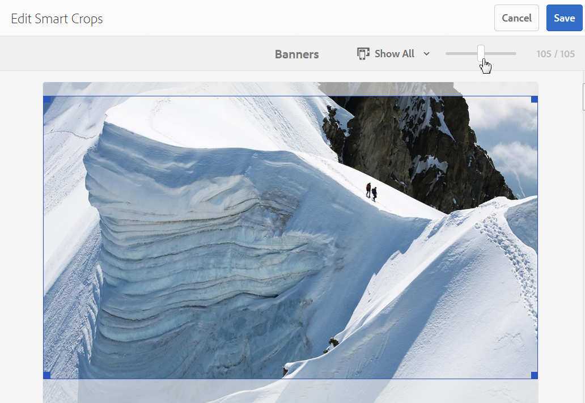

# Dynamic media图像配置文件 {#image-profiles}

上传图像时，您可以通过将图像配置文件应用到文件夹，在上传时自动裁剪图像。

>[!NOTE]
>
>智能裁剪仅在Dynamic Media - Scene7模式下可用。

## Crop options {#crop-options}

您有两个图像裁剪选项可供选择，还有一个用于自动创建颜色和图像色板的选项。

<table>
 <tbody>
  <tr>
   <td><strong>Option</strong></td>
   <td><strong>何时使用</strong></td>
   <td><strong>描述</strong></td>
  </tr>
  <tr>
   <td>像素裁剪</td>
   <td>仅基于尺寸批量裁切图像。</td>
   <td>
要使用此选项，请从“裁 <strong>剪选项</strong> ”下拉列表中选择“像素裁剪”。
 
要从图像的侧边进行裁剪，请输入要从图像的任一侧边或各个侧边裁剪的像素数。裁剪的图像多少取决于图像文件中的 ppi（每英寸像素数）设置。
 
图像配置文件像素裁切按以下方式呈现：  

    <ul>
     <li>值为“顶部”、“底部”、“左”和“右”。</li>
     <li>左上角被视为0,0，并从此处计算像素裁切。</li>
     <li>裁切起点：左边是X，上边是Y</li>
     <li>水平计算：原始图像的水平像素尺寸减去“左”，然后减去“右”。</li>
     <li>垂直计算：垂直像素高度减去“顶部”，然后减去“底部”。</li>
    </ul> 
例如，假设您有一个4000 x 3000像素的图像。 您使用以下值：Top=250;底部=500;左=300;右=700。
 
从左上角(300,250)使用填充空间（4000-300-700、3000-250-500或3000,2250）进行裁剪。
 </td>
  </tr>
  <tr>
   <td>智能裁剪</td>
   <td>根据图像的可视焦点批量裁切图像。</td>
   <td>
Smart Crop利用Adobe Sensei中人工智能的强大功能快速实现图像批量裁剪自动化。 Smart Crop会自动检测并裁切到任何图像中的焦点，以捕获预期的目标点，而不管屏幕大小。
 
要使用智能裁切，请从“裁剪选 <strong>项</strong> ”下拉列表中选择“智能裁切”，然后在“响应式图像裁剪”的右侧启用（打开）该功能。
 
“大”、“中”和“小”的默认断点大小通常涵盖大多数图像在移动和平板电脑设备、桌面和横幅上使用的所有大小。 如果需要，您可以编辑“大”、“中”和“小”的默认名称。
 
要添加更多断点，请单击“添 <strong>加裁剪”</strong>;要删除裁剪，请单击垃圾桶图标。
 </td>
  </tr>
  <tr>
   <td>颜色和图像样本</td>
   <td>批量为每幅图像生成一个图像样本。</td>
   <td>
<strong>注意</strong>:Dynamic Media Classic中不支持智能色板。
 
从显示颜色或纹理的产品图像自动定位和生成高质量色板。
 
要使用颜色和图像色板，请从“裁剪选项”下拉列表中选择“智能裁剪 <strong></strong> ”，然后在“颜色和图像色板”的右侧，启用（打开）该功能。 在“宽度”和“高度”文本框中输入像素值。
 
虽然所有图像裁切都可从演绎版边栏中使用，但只能通过复制URL功能使用色板。 请注意，必须使用您自己的查看组件在站点上渲染色板。 (这种情况的例外是传送横幅。 Dynamic media为传送横幅中使用的色板提供查看组件。)
 
<strong>使用图像色板</strong>
 
图像色板的URL很简单。 即：
 
<code>/is/image/company/&lt;asset_name&gt;:Swatch</code>
 
其中， <code>:Swatch</code> 资产请求会附加到此处。
 
<strong>使用色板</strong>
 
要使用色板，请对以 <code>req=userdata</code> 下内容提出请求：
 
<code>/is/image/&lt;company_name&gt;/&lt;swatch_asset_name&gt;:Swatch?req=userdata</code>
 
例如，以下是Dynamic Media Classic(Scene7)中的样本资产：
 
<code>https://my.company.com:8080/is/image/DemoCo/Sleek:Swatch</code>
 
下面是样本资产的相应 <code>req=userdata</code> URL:
 
<code>https://my.company.com:8080/is/image/DemoCo/Sleek:Swatch?req=userdata</code>
 
答 <code>req=userdata</code> 复如下：
 
<code class="code">SmartCropDef=Swatch
       SmartCropHeight=200.0
       SmartCropRect=0.421671,0.389815,0.0848564,0.0592593,200,200
       SmartCropType=Swatch
       SmartCropWidth=200.0
       SmartSwatchColor=0xA56DB2</code>
 
您还可以请求XML <code>req=userdata</code> 或JSON格式的响应，如以下各个URL示例所示：
 
<code>https://my.company.com:8080/is/image/DemoCo/Sleek:Swatch?req=userdata,xml</code>

<code>SmartSwatchColor</code>

</td></tr></tbody></table>

## USM 锐化 {#unsharp-mask}

You use **[!UICONTROL Unsharp mask]** to fine-tune a sharpening filter effect on the final downsampled image. You can control intensity of effect, radius of the effect (measured in pixels), and a threshold of contrast that will be ignored. This effect uses the same options as Adobe Photoshop’s “Unsharp Mask” filter.

>[!NOTE]
>
>USM锐化仅应用于PTIFF（金字塔tiff）中缩减采样率超过50%的缩小再现。 这意味着ptiff中最大的演绎版不受USM锐化的影响，而缩略图等较小的演绎版则会被更改（并将显示USM锐化）。

In **[!UICONTROL Unsharp Mask]**, you have the following filtering options:

<table>
 <tbody>
  <tr>
   <td><strong>Option</strong></td>
   <td><strong>描述</strong></td>
  </tr>
  <tr>
   <td>数量</td>
   <td>控制应用于边缘像素的对比度数量。 默认值为1.75。对于高分辨率图像，最高可将其增加到5。 可以考虑使用数量来衡量滤镜强度。范围是0-5。</td>
  </tr>
  <tr>
   <td>半径</td>
   <td>确定边缘像素周围影响锐化的像素数量。对于高分辨率图像，输入 1 到 2。低值仅锐化边缘像素；高值锐化较宽范围的像素。正确的值取决于图像大小。默认值为0.2。范围是0-250。</td>
  </tr>
  <tr>
   <td>阈值</td>
   <td>
确定应用USM锐化滤镜时要忽略的对比度范围。换句话说，此选项确定锐化的像素与周围区域必须有多大的不同，才能被视为边缘像素并进行锐化。 要避免引入杂色，请尝试0到255之间的值。
 </td>
  </tr>
 </tbody>
</table>

锐化图像(/help/assets/assets/s7_sharpening_images.pdf) [中介绍了锐]化功能。

## 创建Dynamic media图像配置文件 {#creating-image-profiles}

要为其他资产类型定义高级处理参数，请参阅配 [置资产处理](config-dms7.md#configuring-asset-processing)。

请参 [阅处理元数据、图像和视频的配置文件](processing-profiles.md)。

See also [Best Practices for Organizing your Digital Assets for using Processing Profiles](/help/assets/organize-assets.md).

**创建Dynamic media图像配置文件**

1. 点按AEM徽标，然后导航到工 **[!UICONTROL 具>资产>图像配置文件]**。
1. 点按 **[!UICONTROL 创建]** ，以添加新的图像配置文件。
1. 输入USM锐化、裁切或色板的配置文件名称和值，或者两者的值。

   您可能会发现使用特定于其预期用途的配置文件名称很有帮助。 例如，如果要创建仅生成色板的配置文件，即禁用（关闭）智能裁切，启用（打开）颜色和图像色板，则可以使用配置文件名称“智能色板”。

   另请参 [阅智能裁切和智能色板选项](#crop-options)[和USM锐化](#unsharp-mask)。

   

1. 点按&#x200B;**[!UICONTROL 保存]**。此时新创建的配置文件会显示在可用配置文件列表中。

## 编辑或删除Dynamic media图像配置文件 {#editing-or-deleting-image-profiles}

1. 点按AEM徽标，然后导航到工 **[!UICONTROL 具>资产>图像配置文件]**。
1. 选择要编辑或删除的图像配置文件。要编辑图像配置文件，请选择&#x200B;**[!UICONTROL 编辑图像处理配置文件]**。To remove it, select **[!UICONTROL Delete Image Processing Profile]**.

   

1. 如果是进行编辑操作，请保存更改。如果是进行删除操作，请确认您要删除配置文件。

## 将Dynamic media图像配置文件应用到文件夹 {#applying-an-image-profile-to-folders}

当您将图像配置文件分配给文件夹之后，该文件夹中的所有子文件夹都会自动继承父文件夹的配置文件。这就意味着您只能为每个文件夹分配一个图像配置文件。因此，您在上传、存储、使用资产以及将资产存档的过程中，请妥善安排文件夹结构。

如果您为文件夹分配了一个不同的图像配置文件，新配置文件就会取代之前的配置文件。此前存在的文件夹资产将保持不变。新配置文件将应用于稍后添加到该文件夹的资产。

在用户界面中，分配了配置文件的文件夹会通过卡中显示的配置文件名称来指示。

<!-- When you add smart crop to an existing image profile, you need to re-trigger the [DAM Update Asset workflow](assets-workflow.md) if you want to generate crops for existing assets in your asset repository. -->

您可以将图像配置文件应用到特定文件夹或全局应用到所有资产。

您可以重新处理文件夹中的资产，该文件夹中已有您稍后更改的现有图像配置文件。 请参阅[编辑文件夹的处理配置文件后重新处理该文件夹中的资产](processing-profiles.md#reprocessing-assets)。

### 将Dynamic media图像配置文件应用到特定文件夹 {#applying-image-profiles-to-specific-folders}

You can apply an image profile to a folder from within the **[!UICONTROL Tools]** menu or if you are in the folder, from **[!UICONTROL Properties]**. 本节将会介绍这两种将图像配置文件应用到文件夹的方法。

如果文件夹已经分配了配置文件，则文件夹名称正下方会显示配置文件的名称。

您可以重新处理已有现有视频配置文件的文件夹中的资产，您稍后会更改该配置文件。 请参阅[编辑文件夹的处理配置文件后重新处理该文件夹中的资产](processing-profiles.md#reprocessing-assets)。

#### Applying Dynamic Media image profiles to folders from Profiles user interface {#applying-image-profiles-to-folders-from-profiles-user-interface}

1. 点按AEM徽标，然后导航到工 **[!UICONTROL 具>资产>图像配置文件]**。
1. 选择您要应用到一个或多个文件夹的图像配置文件。

   

1. Tap **[!UICONTROL Apply Processing Profile to Folder(s)]** and select the folder or multiple folders you want use to receive the newly uploaded assets and tap/click **[!UICONTROL Apply]**. 如果文件夹已经分配了配置文件，则文件夹名称正下方会显示配置文件的名称。

#### 从“属性”将Dynamic media图像配置文件应用到文件夹 {#applying-image-profiles-to-folders-from-properties}

1. 点按AEM徽标，然后导航到 **[!UICONTROL 资产]** ，然后导航到要将图像配置文件应用到的文件夹。
1. 在文件夹中，点按复选标记以将其选中，然后点按属 **[!UICONTROL 性]**。
1. 点按图像配 **[!UICONTROL 置文件选]** 项卡。 从配置 **[!UICONTROL 文件名称]** 下拉列表中，选择配置文件，然后点按保 **[!UICONTROL 存并关闭]**。 如果文件夹已经分配了配置文件，则文件夹名称正下方会显示配置文件的名称。

   

### 全局应用Dynamic media图像配置文件 {#applying-an-image-profile-globally}

除了将配置文件应用到文件夹之外，您还可以全局应用一个配置文件，以便上传到AEM资产的任何内容都会应用选定的配置文件。

您可以重新处理已有现有视频配置文件的文件夹中的资产，您稍后会更改该配置文件。 请参阅[编辑文件夹的处理配置文件后重新处理该文件夹中的资产](processing-profiles.md#reprocessing-assets)。

**要全局应用Dynamic media图像配置文件**:

1. 执行下列操作之一：

   * 导航到并 `https://&lt;AEM server&gt;/mnt/overlay/dam/gui/content/assets/foldersharewizard.html/content/dam` 应用相应的配置文件，然后点按 **[!UICONTROL 保存]**。

      

   * 导航到CRXDE Lite到以下节点： `/content/dam/jcr:content`.

      添加属性， `imageProfile:/conf/global/settings/dam/adminui-extension/imageprofile/<name of image profile>` 然后点按 **[!UICONTROL 全部保存]**。

      

## 编辑单个图像的智能裁剪或智能色板 {#editing-the-smart-crop-or-smart-swatch-of-a-single-image}

>[!NOTE]
>
>智能裁剪仅在Dynamic Media - Scene7模式下可用。

您可以手动重新对齐图像的智能裁剪窗口或调整其大小以进一步调整其焦点。

编辑智能裁剪并保存后，更改会传播到您使用特定图像的裁剪时的任何位置。

如果需要，您可以重新运行智能裁剪以再次生成其他裁剪。

另请参 [阅编辑多个图像的智能裁剪或智能色板](#editing-the-smart-crop-or-smart-swatch-of-multiple-images)。

**要编辑单个图像的智能裁剪或智能色板，请执行以下操作**:

1. 点按AEM徽标并导航到 **[!UICONTROL 资产]**，然后导航到应用了智能裁剪或智能色板图像配置文件的文件夹。

1. 点按文件夹以打开其内容。
1. 点按要调整其智能裁剪或智能色板的图像。
1. 在工具栏中，点按 **[!UICONTROL 智能裁剪]**。

1. 执行以下操作之一：

   * 在页面的右上角附近，向左或向右拖动滑块可分别增加或减少图像显示。
   * 在图像上，拖动角手柄以调整裁剪或样本的可查看区域的大小。
   * 在图像上，将框／色板拖到新位置。 只能编辑图像色板；色板是静态的。
   * 在图像上方，点按还 **[!UICONTROL 原]** ，以撤消所有编辑并恢复原始裁切或色板。

1. 在页面的右上角附近，点按保 **[!UICONTROL 存]**，然后点按 **[!UICONTROL 关闭]** ，以返回到资产文件夹。

## 编辑多个图像的智能裁剪或智能色板 {#editing-the-smart-crop-or-smart-swatch-of-multiple-images}

在将包含智能裁剪的图像配置文件应用到文件夹后，该文件夹中的所有图像都将对其应用裁剪。 如果需要，您可以手 *动重新对齐* ，或调整多幅图像中智能裁剪窗口的大小以进一步调整其焦点。

编辑智能裁剪并保存后，更改会传播到您使用特定图像的裁剪时的任何位置。

如果需要，您可以重新运行智能裁剪以再次生成其他裁剪。

**要编辑多个图像的智能裁剪或智能色板，请执行以下操作**:

1. 点按AEM徽标并导航到 **[!UICONTROL 资产]**，然后导航到应用了智能裁剪或智能色板图像配置文件的文件夹。
1. 在文件夹中，点按更 **[!UICONTROL 多操作]** (...)图标，然后点按智 **[!UICONTROL 能裁剪]**。

1. 在“编 **[!UICONTROL 辑智能裁切]** ”页面上，执行下列任一操作：

   * 调整页面上图像的查看大小。

      在断点名称下拉列表的右侧，向左或向右拖动滑块可更改可查看图像显示的大小。

      

   * 根据断点名称筛选可查看图像列表。 在以下示例中，图像会在断点名称“Medium”上筛选。

      在页面的右上角附近，从下拉列表中选择一个断点名称以过滤您看到的图像。 （请参阅上图。）

      

   * 调整智能裁剪框的大小。 执行下列任一操作：

      * 如果图像仅包含智能裁剪或智能色板，请在图像上拖动裁剪框的角手柄以调整裁剪的可查看区域的大小。
      * 如果图像既有智能裁剪又有智能色板，请在图像上拖动裁剪框的角手柄以调整裁剪的可查看区域的大小。 或者，点按或单击图像下方的智能色板（色板为静态），然后拖动裁剪框的角手柄以调整色板可查看区域的大小。
      

   * 移动智能裁剪框。 执行下列任一操作：

      * 如果图像仅具有智能裁剪或智能色板，则在图像上，将裁剪框拖动到新位置。
      * 如果图像既有智能裁剪又有智能色板，则在图像上，将智能裁剪框拖动到新位置。 或者，点按或单击图像下方的智能色板（色板为静态），然后将智能色板裁剪框拖到新位置。
      

   * 撤消所有编辑并恢复原始智能裁剪或智能色板（仅适用于当前编辑会话）。

      点按 **[!UICONTROL 图像上方]** 的还原。

      

1. 在页面的右上角附近，点按&#x200B;**[!UICONTROL 保存]**。然后点 **[!UICONTROL 按关闭]** ，以返回到资产文件夹。

## Removing an image profile from folders {#removing-an-image-profile-from-folders}

当您将图像配置文件从文件夹删除之后，该文件夹中的所有子文件夹都会自动删除从父文件夹继承的配置文件。但是，此前对文件夹中的文件所做的处理均予以保留。

You can remove an image profile from a folder from within the **[!UICONTROL Tools]** menu or if you are in the folder, from **[!UICONTROL Properties]**. 本节将会介绍这两种将图像配置文件从文件夹删除的方法。

### 通过配置文件用户界面将Dynamic media图像配置文件从文件夹删除 {#removing-image-profiles-from-folders-via-profiles-user-interface}

1. 点按AEM徽标，然后导航到工 **[!UICONTROL 具>资产>图像配置文件]**。
1. 选择您要从一个或多个文件夹删除的图像配置文件。
1. Tap **[!UICONTROL Remove Processing Profile from Folder(s)]** and select the folder or multiple folders you want use to remove the profile from and tap **[!UICONTROL Remove]**.

   您可以确认图像配置文件不再应用于文件夹，因为该名称不再显示在文件夹名称的下方。

### 通过属性将Dynamic media图像配置文件从文件夹删除 {#removing-image-profiles-from-folders-via-properties}

1. 点按AEM徽标并导航 **[!UICONTROL 资产]** ，然后导航到您要从中删除图像配置文件的文件夹。
1. 在文件夹中，点按复选标记以选择它，然后点按属 **[!UICONTROL 性]**。
1. 选择“图像配 **[!UICONTROL 置文件]** ”选项卡。
1. 从配置 **[!UICONTROL 文件名称]** 下拉菜单中，选择无 ****，然后点按保 **[!UICONTROL 存并关闭]**。

   如果文件夹已经分配了配置文件，则文件夹名称正下方会显示配置文件的名称。
