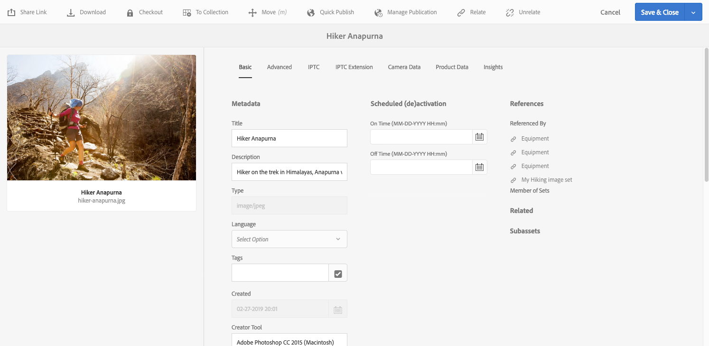

# 图像集 {#image-sets}

图像集为用户提供了集成的查看体验，用户可以通过选择缩略图图像查看项目的不同视图。 图像集允许您展示项目的替代视图，查看器提供了缩放工具来仔细检查图像。

图像集由带有单词的横幅指定 `IMAGESET`. 此外，如果图像集已发布，则横幅上会显示由 **[!UICONTROL World]** 图标指示的发布日期以及由铅笔图标指示的上次修改日期 **** 。

在“图像集”中，您还可以通过创建图像集并添加缩略图来创建色板。

当您希望以不同的颜色、图案或成品显示项目时，此应用程序非常有用。 要创建包含色板的图像集，您需要为要呈现给用户的每种颜色、图案或完成创建一个图像。 您还需要为每个颜色、图案或光洁度使用一个颜色、图案或光洁度色板。

例如，假设您要用不同的颜色清单显示大写字母的图像；这些清单为红色、绿色和蓝色。 这种情况下，你需要同一顶帽子打三针。 你需要一个红色的，一个绿色的，一个蓝色的。 您还需要红色、绿色和蓝色色板。 颜色样本用作用户在样本集查看器中选择的缩略图，以查看红色计费、绿色计费或蓝色计费次数上限。

>[!NOTE]
>
>有关Assets用户界面的信息，请参阅 [管理资源](/help/assets/manage-assets.md).

在创建图像集时，Adobe建议以下最佳实践并强制实施以下限制：

| 限制类型 | 最佳实践 | 施加的限制 |
| --- | --- | --- |
| 每集的重复资产数 | 无重复项 | 20‡ |
| 每组的最大图像数 | 每组5至10个图像 | 1000 |

‡最佳实践是在一个集中没有重复的资产。 单个资产的限制为20个重复项。 如果为该资产添加其他重复项（在该集中），请求将会产生错误或忽略重复项。

另请参阅 [Dynamic Media限制](/help/assets/limitations.md).

## 快速入门：图像集 {#quick-start-image-sets}

**要让您快速启动并运行，请执行以下操作：**

1. [为多个视图上传您的主源图像](#uploading-assets-in-image-sets).

   首先，上传图像集的图像。 选择图像时，请记住，您的客户可以在图像集查看器中放大图像。 确保图像的最大尺寸至少为2000像素，以获得最佳缩放详细信息。 Dynamic Media可以渲染每个高达2500万像素(megapixel)的图像。 例如，可以使用5000 x 5000 MP映像或任何其他大小组合，最大可达25 MP。

   请参阅 [Dynamic Media — 支持的栅格图像格式](/help/assets/assets-formats.md#supported-raster-image-formats-dynamic-media) 有关图像集支持的格式的列表。

<!--    Adobe Experience Manager Assets supports many image file formats, but lossless TIFF, PNG, and EPS images are recommended. -->

1. [创建图像集](#creating-image-sets).

   在图像集中，用户在图像集查看器中选择缩略图。

   要在Assets中创建图像集，请转到 **[!UICONTROL 创建]** > **[!UICONTROL 图像集]**. 然后，添加图像并选择 **[!UICONTROL 保存]**.

   您还可以通过自动创建图像集 [批次集预设](/help/assets/config-dms7.md).
   >[!IMPORTANT]
   >
   >批量集由IPS(Image Production System)作为资产引入的一部分创建，并且仅在Dynamic Media - Scene7模式下可用。

   请参阅 [准备图像集资源以上传和上传文件](#uploading-assets-in-image-sets).

   请参阅 [使用选择器](/help/assets/working-with-selectors.md).

1. 添加 [图像集查看器预设](/help/assets/managing-viewer-presets.md)（根据需要）。

   管理员可以创建或修改图像集查看器预设。 要查看带有查看器预设的图像集，请选择图像集，然后在左边栏下拉菜单中，选择 **[!UICONTROL 查看器]**.

   导航到 **[!UICONTROL 工具]** > **[!UICONTROL 资产]** > **[!UICONTROL 查看器预设]** 创建或编辑查看器预设。

1. （可选） [查看图像集](/help/assets/image-sets.md#viewing-image-sets) 使用批次集预设创建的。
1. [预览图像集](/help/assets/previewing-assets.md).

   选择图像集并预览。 选择缩略图图标，以便您可以在选定的查看器中检查图像集。 您可以从中选择不同的查看器 **[!UICONTROL 查看器]** 菜单，可从左边栏下拉菜单中获取。

1. [发布图像集](/help/assets/publishing-dynamicmedia-assets.md).

   发布图像集将激活URL和嵌入代码。 此外，您必须 [发布任何自定义查看器预设](/help/assets/managing-viewer-presets.md) 您已创建的项目。 现成的查看器预设已发布。

1. [将URL链接到您的Web应用程序](/help/assets/linking-urls-to-yourwebapplication.md) 或 [嵌入视频查看器或图像查看器](/help/assets/embed-code.md).

   Experience Manager Assets为图像集创建URL调用，并在您发布图像集后激活它们。 您可以在预览资产时复制这些URL。 或者，您也可以将它们嵌入到您的网站上。

   选择图像集，然后在左边栏下拉菜单中选择&#x200B;**[!UICONTROL 查看器]**。

   请参阅 [将图像集链接到网页](/help/assets/linking-urls-to-yourwebapplication.md) 和 [嵌入视频查看器或图像查看器](/help/assets/embed-code.md).

要编辑图像集，请参阅 [编辑图像集](#editing-image-sets). 此外，您还可以查看和编辑 [图像集属性](/help/assets/manage-assets.md#editing-properties).

如果您在创建集时遇到问题，请参阅以下主题中的图像和集： [Dynamic Media疑难解答 — Scene7模式](/help/assets/troubleshoot-dms7.md#images-and-sets).

## 上传图像集中的资产 {#uploading-assets-in-image-sets}

首先，上传图像集的图像。 选择图像时，请记住，您的客户可以在图像集查看器中放大图像。 确保图像的最大尺寸至少为2000像素。 图像集支持多种图像文件格式，但建议使用无损的TIFF、PNG和EPS图像。

您可以像上传一样上传图像集的图像 [在Assets中上传任何其他资源](/help/assets/manage-assets.md#uploading-assets).

请参阅 [Dynamic Media — 支持的栅格图像格式](/help/assets/assets-formats.md#supported-raster-image-formats-dynamic-media) 有关图像集支持的格式的列表。

### 准备图像集资源以供上传 {#preparing-image-set-assets-for-upload}

在创建图像集之前，请确保图像的大小和格式正确。

要创建多视图图像集，您需要从不同视点显示项目或显示同一项目的不同方面的图像。 目标是突出显示项目的重要功能，以便查看者能够全面了解项目的外观或用途。

由于用户可以缩放图像集中的图像，因此请确保图像在最大尺寸中至少为2000像素。 <!-- Assets support many image file formats, but lossless TIFF, PNG, and EPS images are recommended. -->

>[!NOTE]
>
>此外，如果使用缩略图指示产品色板，则必须执行以下操作：
>
>您需要同一图像的晕影或不同快照，以不同的颜色、图案或光洁度显示它。 您还需要与不同的颜色、图案或完成相对应的缩略图文件。 例如，要呈现缩览图，其中图像集以黑色、棕色和绿色显示同一夹克，您需要：
>
>* 同一件夹克的黑色、棕色和绿色照片。
>* 黑色、棕色和绿色的缩略图。

## 创建图像集 {#creating-image-sets}

您可以通过用户界面或API创建图像集。 本节介绍如何在UI中创建图像集。

>[!NOTE]
>
>您还可以通过自动创建图像集 [批次集预设](/help/assets/config-dms7.md#creating-batch-set-presets-to-auto-generate-image-sets-and-spin-sets).
>**重要提示：** 批量集由IPS(Image Production System)作为资产引入的一部分创建，并且仅在Dynamic Media - Scene7模式下可用。

将资源添加到集时，会自动按字母数字顺序添加资源。 添加资源后，您可以手动对资源重新排序或排序。

>[!NOTE]
>
>文件名中带有“，”（逗号）的资源不支持图像集。

在创建图像集时，Adobe建议以下最佳实践并强制实施以下限制：

| 限制类型 | 最佳实践 | 施加的限制 |
| --- | --- | --- |
| 每集的重复资产数 | 无重复项 | 20‡ |
| 每组的最大图像数 | 每组5至10个图像 | 1000 |

‡最佳实践是在一个集中没有重复的资产。 单个资产的限制为20个重复项。 如果为该资产添加其他重复项（在该集中），请求将会产生错误或忽略重复项。

另请参阅 [Dynamic Media限制](/help/assets/limitations.md).

**创建图像集：**

1. 在Experience Manager中，选择Experience Manager徽标以访问全局导航控制台，然后转到 **[!UICONTROL 导航]** > **[!UICONTROL 资产]**. 导航到要创建图像集的位置，然后转到 **[!UICONTROL 创建]** > **[!UICONTROL 图像集]** 以打开“图像集编辑器”页。

   您还可以从包含资产的文件夹中创建集。

   

1. 在“图像集编辑器”页面的 **[!UICONTROL 标题]** 字段中，输入图像集的名称。 该名称将显示在图像集的横幅中。 （可选）输入说明。

   

1. 执行以下任一操作：

   * 在“图像集编辑器”页面的左上角附近，选择 **[!UICONTROL 添加资源]**.

   * 在“图像集编辑器”页面中间附近，选择 **[!UICONTROL 点按以打开资产选择器]**.

   选择要包含在图像集中的资源。 选定资产上有一个复选标记图标。完成后，在页面的右上角附近，选择 **[!UICONTROL 选择]**.

   借助资产选择器，您可以通过键入关键字并点按或单击&#x200B;**[!UICONTROL 返回]**&#x200B;来搜索资产。您还可以应用过滤器来优化搜索结果。您可以按路径、收藏集、文件类型和标记进行过滤。选择过滤器，然后选择 **[!UICONTROL 筛选]** 图标。 点按“视图”图标并选择&#x200B;**[!UICONTROL 列视图]**、**[!UICONTROL 卡片视图]**&#x200B;或&#x200B;**[!UICONTROL 列表视图]**&#x200B;可更改视图。

   请参阅 [使用选择器](/help/assets/working-with-selectors.md).

   

1. 将资源添加到集时，会自动按字母数字顺序添加资源。 添加资源后，您可以手动对资源重新排序或排序。

   如有必要，请将资产的“重新排序”图标拖动到资产文件名的右侧，以将图像重新排序到集列表的上方或下方。

   

   如果要更改缩略图或色板，请选择 **+** **缩略图** 图标，然后导航到所需的缩略图或色板。 选择完所有图像后，选择 **[!UICONTROL 保存]**.

1. （可选）执行以下任一操作：

   * 要删除图像，请选择该图像并选择 **[!UICONTROL 删除资源]**.

   * 要应用预设，请选择页面右上角附近的 **[!UICONTROL 预设]**，然后选择要一次性应用于所有资产的预设。

   >[!NOTE]
   >
   >创建图像集时，您可以更改图像集缩略图，或允许Experience Manager根据图像集中的资源自动选择缩略图。 要选择缩略图，请选择 **[!UICONTROL 更改缩略图]** 在“图像集编辑器”页面上的“标题”字段上方，选择任意图像（您也可以导航到其他文件夹以查找图像）。 如果您选择了缩略图，然后决定希望Experience Manager从图像集生成缩略图，请选择 **[!UICONTROL 切换到]** > **[!UICONTROL 自动缩略图]**.

1. 选择&#x200B;**[!UICONTROL 保存]**。新创建的图像集将显示在您创建该图像集的文件夹中。

## 查看图像集 {#viewing-image-sets}

您可以在用户界面中创建图像集，也可以使用 [批次集预设](/help/assets/config-dms7.md#creating-batch-set-presets-to-auto-generate-image-sets-and-spin-sets).

>[!IMPORTANT]
>
>批量集由IPS创建 [图像制作系统] 作为资产引入的一部分，并且仅在Dynamic Media - Scene7模式下可用。)

但是，使用批次集预设创建的集，请 *非* 显示在用户界面中。 您可以通过三种不同的方式查看这些集合。 （即使您在用户界面中创建了图像集，这些方法也可用）。

* 打开单个资产的属性。 属性指明所选资产被引用或作为成员的设置。 如果要查看整个集，请选择集的名称。

  

* 来自任何集的成员图像。选择 **[!UICONTROL 集]** 菜单以显示资产所属的集。

  

* 在搜索中，您可以选择 **[!UICONTROL 筛选]**，然后展开 **[!UICONTROL Dynamic Media]** 并选择 **[!UICONTROL 集]**.

  搜索会返回在UI中手动创建或通过批次集预设自动创建的匹配集。 对于自动集，搜索查询使用“开头为”搜索条件执行，这与基于使用“包含”搜索条件的Experience Manager搜索不同。 将筛选条件设置为 **[!UICONTROL 集]** 这是搜索自动化集的唯一方法。

  

>[!NOTE]
>
>您可以通过用户界面查看集，如中所述 [编辑图像集](#editing-image-sets).

## 编辑图像集 {#editing-image-sets}

您可以对图像集执行各种编辑任务，如下所示：

* 将图像添加到图像集。
* 对图像集中的图像重新排序。
* 删除图像集中的资源。
* 应用查看器预设。
* 删除图像集。

**要编辑图像集：**

1. 执行以下任一操作：

   * 将鼠标悬停在图像集资源上，然后选择 **[!UICONTROL 编辑]** （铅笔图标）。
   * 将鼠标悬停在图像集资源上，选择 **[!UICONTROL 选择]** （复选标记图标），然后选择 **[!UICONTROL 编辑]** 工具栏上。
   * 选择图像集资源，然后选择 **[!UICONTROL 编辑]** （铅笔图标）。

1. 要编辑图像集中的图像，请执行下列任一操作：

   * 要重新排序资产，请将图像拖动到新位置（选择重新排序图标以移动项目）。
   * 要按升序或降序对项排序，请选择列标题。
   * 要添加资源或更新现有资源，请选择 **[!UICONTROL 添加资源]**. 导航到资源，选择它，然后选择 **[!UICONTROL 选择]** 在页面的右上角附近。
     >[!NOTE]
     >
     >如果通过将Experience Manager用于缩略图的图像替换为其他图像来删除该图像，则仍会显示原始资源。
   * 要删除某个资源，请选择该资源并选择 **[!UICONTROL 删除资源]**.
   * 要应用预设，请选择页面右上角附近的 **[!UICONTROL 预设]**，然后选择查看器预设。
   * 要添加或更改缩略图，请选择资源右侧的缩略图图标。 导航到新的缩略图或样本资源，选择它，然后选择 **[!UICONTROL 选择]**.
   * 要删除整个图像集，请导航到该图像集，选择它，然后选择 **[!UICONTROL 删除]**.

   >[!NOTE]
   >
   >您可以通过导航到图像集来编辑图像，请选择 **[!UICONTROL 设置成员]** 在左边栏中，然后选择单个资产上的铅笔图标以打开编辑窗口。

1. 选择 **[!UICONTROL 保存]** 完成编辑时。

## 预览图像集 {#previewing-image-sets}

请参阅 [预览资源](/help/assets/previewing-assets.md).

## 发布图像集 {#publishing-image-sets}

请参阅 [发布资产](/help/assets/publishing-dynamicmedia-assets.md).
