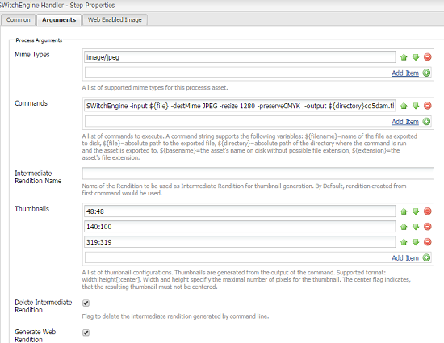

# 图像转码库 {#imaging-transcoding-library}

Adobe的图像转码库是一种专用的图像处理解决方案，可以执行核心图像处理功能，包括：

* 编码
* 转码（转换支持的格式）
* 图像重新取样，使用PS和英特尔IPP算法
* 位深度和色彩配置文件保留
* JPEG质量压缩
* 调整图像大小

图像转码库提供CMYK支持和完整的Alpha支持，但CMYKAlpha除外。

除了支持广泛的文件格式和配置文件外，在性能、可扩展性和质量方面，图像转码库与其他第三方解决方案相比具有显着的优势。 以下是使用图像转码库的一些主要优势：

* **随着文件大小或分辨率增加而缩放**：缩放主要通过图像转码库在解码文件时重新调整大小的专利功能来实现。 此功能可确保运行时内存使用始终是最佳的，而不是增加文件大小或分辨率MB的二次函数。 图像转码库可以处理更大、分辨率更高（包含更高M像素）的文件。 第三方工具（如ImageMagick）在处理此类文件时无法处理大型文件并崩溃。
* **Photoshop质量压缩和调整大小算法**：在向下采样质量（平滑、锐化以及自动双三次）和压缩质量方面与行业标准一致。 图像转码库进一步评估输入图像的质量因子，并智能地使用输出图像的最佳表格和质量设置。 此功能可在不影响视觉质量的情况下生成最佳大小的文件。
* **高吞吐量：**&#x200B;响应时间更短，吞吐量始终高于ImageMagick。 因此，图像转码库应当减少用户的等待时间和托管成本。
* **在并发负载下扩展效果更好：**&#x200B;在并发负载条件下，成像转码库的执行效果最佳。 它提供高吞吐量、最佳CPU性能、内存使用率和低响应时间，有助于降低托管成本。

## 支持的平台 {#supported-platforms}

图像转码库仅适用于RHEL 8、RHEL 7和CentOS 7发行版。

>[!NOTE]
>
>不支持Mac OS和其他*nix分发（例如Debian和Ubuntu）。

## 用途 {#usage}

图像转码库的命令行参数可以包括以下内容：

```shell
 -destMime PNG/JPEG: Mime type of output rendition
 -BitDepth 8/16: Preserves Bit Depth. Bitdepth '4' is automatically converted to '8'
 -preserveBitDepth: Downscales Bit Depth (No upscaling)
 -preserveCMYK: Preserves CMYK color space
 -jpegQuality: Provides jpeg quality parameter (0-12 , corresponding to Photoshop qualities)
 -ResamplingMethod BiCubic/Lanczos/PSBicubic: Provides resampling methods. PSBicubic is a Photoshop quality resampling method.
 -resize
```

您可以为`-resize`参数配置以下选项：

* `X`：工作方式类似于[!DNL Experience Manager]。 例如，-resize 319。
* `WxH`：未维护宽高比，例如`-resize 319x319`。
* `Wx`：固定宽度并计算保持宽高比的高度。 例如：`-resize 319x`。
* `xH`：固定高度并计算保持宽高比的宽度。 例如：`-resize x319`。

```shell
 -AllowUpsampling (Resizes smaller images)
 -input <fileName>
 -output <fileName>
```

## 配置映像转码库 {#configuring-imaging-transcoding-library}

要配置ITL处理，请创建一个配置文件并更新工作流以执行该文件。

### 为提取的捆绑包创建配置文件 {#create-conf-file}

要配置库，请使用以下步骤创建一个CONF文件以指示库。 您需要管理员或root权限。

1. 从Software Distribution[&#128279;](https://experience.adobe.com/#/downloads/content/software-distribution/en/aem.html?package=/content/software-distribution/en/details.html/content/dam/aem/public/adobe/packages/aem630/product/assets/aem-assets-imaging-transcoding-library-pkg)下载映像转码库包并使用包管理器安装它。 此包与[!DNL Experience Manager] 6.5兼容。

1. 要知道`com.day.cq.dam.cq-dam-switchengine`的捆绑包ID，请登录到Web控制台，然后单击&#x200B;**[!UICONTROL OSGi]** > **[!UICONTROL 捆绑包]**。 或者，要打开捆绑包控制台，请访问`https://[aem_server:[port]/system/console/bundles/` URL。 找到`com.day.cq.dam.cq-dam-switchengine`包及其标识。

1. 通过使用命令`ls -la /aem65/author/crx-quickstart/launchpad/felix/bundle<id>/data/binaries/`检查文件夹，确保提取了所有必需的库，其中文件夹名称是使用捆绑ID构建的。 例如，如果捆绑ID为`588`，则命令为`ls -la /aem65/author/crx-quickstart/launchpad/felix/bundle588/data/binaries/`。

1. 创建`SWitchEngineLibs.conf`文件以链接到库。

   ```shell
   cd `/etc/ld.so.conf.d`
   touch SWitchEngineLibs.conf
   vi SWitchEngineLibs.conf
   ```

1. 使用`cat SWitchEngineLibs.conf`命令将`/aem65/author/crx-quickstart/launchpad/felix/bundle<id>/data/binaries/`路径添加到conf文件。

1. 执行`ldconfig`命令以创建必要的链接和缓存。

1. 在用于启动[!DNL Experience Manager]的帐户中，编辑`.bash_profile`文件。 通过添加以下内容添加`LD_LIBRARY_PATH`。

   ```shell
   LD_LIBRARY_PATH=.
   export LD_LIBRARY_PATH
   ```

1. 要确保路径的值设置为`.`，请使用`echo $LD_LIBRARY_PATH`命令。 输出应为`.`。 如果该值未设置为`.`，请重新启动会话。

### 配置[!UICONTROL DAM更新资产]工作流 {#configure-dam-asset-update-workflow}

更新[!UICONTROL DAM更新资产]工作流以使用该库处理图像。

1. 在[!DNL Experience Manager]用户界面中，选择&#x200B;**[!UICONTROL 工具]** > **[!UICONTROL 工作流]** > **[!UICONTROL 模型]**。

1. 从&#x200B;**[!UICONTROL 工作流模型]**&#x200B;页面，在编辑模式下打开&#x200B;**[!UICONTROL DAM更新资产]**&#x200B;工作流模型。

1. 打开&#x200B;**[!UICONTROL 进程缩略图]**&#x200B;工作流进程步骤。 在&#x200B;**[!UICONTROL 缩略图]**&#x200B;选项卡中，在&#x200B;**[!UICONTROL 跳过MIME类型]**&#x200B;列表中添加要跳过其默认缩略图生成过程的MIME类型。
例如，如果要使用图像转码库为TIFF图像创建缩略图，请在&#x200B;**[!UICONTROL 跳过MIME类型]**&#x200B;字段中指定`image/tiff`。

1. 在&#x200B;**[!UICONTROL 启用Web的图像]**&#x200B;选项卡中，在&#x200B;**[!UICONTROL 跳过列表]**&#x200B;中添加要跳过默认Web呈现生成过程的MIME类型。 例如，如果您在上一步中跳过了MIME类型`image/tiff`，请将`image/tiff`添加到跳过列表。

1. 打开&#x200B;**[!UICONTROL EPS缩略图（由ImageMagick提供支持）]**&#x200B;步骤，导航到&#x200B;**[!UICONTROL 参数]**&#x200B;选项卡。 在&#x200B;**[!UICONTROL Mime类型]**&#x200B;列表中，添加您希望映像转码库处理的MIME类型。 例如，如果您在上一步中跳过了MIME类型`image/tiff`，请将`image/jpeg`添加到&#x200B;**[!UICONTROL Mime类型]**&#x200B;列表。

1. 删除缺省命令（如果存在）。

1. 切换侧面板并从步骤列表中添加&#x200B;**[!UICONTROL SWitchEngine处理程序]**。

1. 根据您的自定义要求向[!UICONTROL SwitchEngine处理程序]添加命令。 调整您指定的命令参数以满足您的要求。 例如，如果要保留JPEG图像的颜色配置文件，请将以下命令添加到&#x200B;**[!UICONTROL 命令]**&#x200B;列表中：

   * `SWitchEngine -input ${file} -destMime PNG -resize 48 -output ${directory}cq5dam.thumbnail.48.48.png`
   * `SWitchEngine -input ${file} -destMime PNG -resize 140x100 -output ${directory}cq5dam.thumbnail.140.100.png`
   * `SWitchEngine -input ${file} -destMime PNG -resize 319 -output ${directory}cq5dam.thumbnail.319.319.png`
   * `SWitchEngine -input ${file} -destMime JPEG -resize 1280 -preserveCMYK -output ${directory}cq5dam.web.1280.1280.jpeg`

   

1. （可选）使用单个命令从中间演绎版生成缩略图。 中间格式副本用作生成静态格式副本和Web格式副本的源。 此方法比以前的方法速度快。 但是，使用此方法无法将自定义参数应用到缩略图。

   

1. 要生成Web演绎版，请在&#x200B;**[!UICONTROL 启用Web的图像]**&#x200B;选项卡中配置参数。

1. 同步更新的[!UICONTROL DAM更新资产]工作流模型。 保存工作流。

要验证配置，请上传TIFF映像并监视error.log文件。 您会注意到有`INFO`条消息提及`SwitchEngineHandlingProcess execute: executing command line`。 日志中提到了生成的演绎版。 工作流完成后，您可以在[!DNL Experience Manager]中查看新演绎版。

>[!MORELIKETHIS]
>
>* [支持的MIME类型文章](assets-formats.md#supported-image-transcoding-library)
