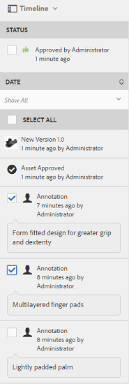

# 管理您的数字资源 {#manage-digital-assets}

| 版本 | 文章链接 |
| -------- | ---------------------------- |
| AEM as a Cloud Service | [单击此处](https://experienceleague.adobe.com/docs/experience-manager-cloud-service/content/assets/manage/manage-digital-assets.html?lang=zh-Hans) |
| AEM 6.5 | 本文 |

在[!DNL Adobe Experience Manager Assets]中，您可以执行除存储和管理资源之外的其他操作。 [!DNL Experience Manager]提供企业级资产管理功能。 您可以编辑和共享资源、运行高级搜索以及创建数十种受支持的文件格式的多个演绎版。 您还可以管理版本和数字权限、自动处理资源、管理和控制元数据、使用注释进行协作等等。

本文介绍了基本资源管理任务，例如创建或上传；元数据更新；复制、移动和删除；发布、取消发布和搜索资产。 要了解用户界面，请参阅[开始使用资产用户界面](/help/sites-authoring/basic-handling.md)。 要管理内容片段，请参阅[管理内容片段](/help/assets/content-fragments/content-fragments-managing.md)资源。

## 创建文件夹 {#creating-folders}

组织资产集合（例如，所有`Nature`图像）时，您可以创建文件夹以将它们保持在一起。 您可以使用文件夹对资源进行分类和组织。 [!DNL Experience Manager Assets]不要求您组织文件夹中的资源才能更好地工作。

>[!NOTE]
>
>* 共享到Experience Cloud时不支持共享类型为`sling:OrderedFolder`的[!DNL Assets]文件夹。 如果要共享文件夹，请勿在创建文件夹时选择[!UICONTROL 已排序]。
>* [!DNL Experience Manager]不允许使用`subassets`单词作为文件夹的名称。 它是为包含复合资产的子资产的节点保留的关键字。

1. 导航到数字资产文件夹中要创建文件夹的位置。 在菜单中，单击&#x200B;**[!UICONTROL 创建]**。 选择&#x200B;**[!UICONTROL 新文件夹]**。
1. 在&#x200B;**[!UICONTROL 标题]**&#x200B;字段中，提供文件夹名称。 默认情况下，DAM使用您提供的标题作为文件夹名称。 创建文件夹后，您可以覆盖默认文件夹名称并指定其他文件夹名称。
1. 单击&#x200B;**[!UICONTROL 创建]**。您的文件夹会显示在数字资产文件夹中。

不支持以下（以空格分隔的）字符：

* 资源文件名不能包含以下任一字符： `* / : [ \\ ] | # % { } ? &`
* 资产文件夹名称不能包含以下任一字符： `* / : [ \\ ] | # % { } ? \" . ^ ; + & \t`

请勿在资产文件名的扩展中包含特殊字符。

## 上传资源 {#uploading-assets}

<!-- TBD the following:
Move this section into a new article. CQDOC-14874 ticket is created for this.
In this complete article, replace emphasis with UICONTROL where appropriate.
-->

您可以从本地文件夹或网络驱动器将各种类型的资源(包括图像、PDF文件、RAW文件等)上传到[!DNL Experience Manager Assets]。

>[!NOTE]
>
>在Dynamic Media - Scene7模式下，默认的资源上传文件大小为2 GB或更小。 要配置大于2 GB、最大为15 GB的资源上传，请参阅[（可选）配置Dynamic Media - Scene7模式以上传大于2 GB的资源](/help/assets/config-dms7.md#optional-config-dms7-assets-larger-than-2gb)。

>[!IMPORTANT]
>
>您上传到Experience Manager的Assets的文件名超过100个字符，在Dynamic Media中使用它们时会有缩写。
>
>文件名中的前100个字符按原样使用；其余任何字符都替换为字母数字字符串。 此重命名方法可确保在Dynamic Media中使用资产时具有唯一的名称。 它还旨在适应Dynamic Media中允许的最大资源文件名长度。

您可以选择将资产上传到文件夹，无论是否分配了处理配置文件。

对于已分配处理配置文件的文件夹，配置文件名称会显示在卡片视图的缩略图上。 在列表视图中，配置文件名称显示在&#x200B;**处理配置文件**&#x200B;列中。 请参阅[处理配置文件](/help/assets/processing-profiles.md)。

在上传资源之前，请确保它采用[!DNL Experience Manager Assets]支持的[格式](/help/assets/assets-formats.md)。

1. 在[!DNL Assets]用户界面中，导航到要添加数字资产的位置。
1. 要上传资源，请执行以下操作之一：

   * 在工具栏上，单击&#x200B;**[!UICONTROL 创建]**。 然后，在菜单上单击&#x200B;**[!UICONTROL 文件]**。 如果需要，可以在呈现的对话框中重命名文件。
   * 在支持HTML5的浏览器中，将资源直接拖动到[!DNL Assets]用户界面上。 不显示重命名文件的对话框。

   

   要选择多个文件，请选择`Ctrl`或`Command`键，然后在文件选取器对话框中选择资源。 使用iPad时，一次只能选择一个文件。

   您可以暂停上传大型资产（大于500 MB），并稍后从同一页面恢复上传操作。 单击上传开始时显示的进度条旁边的&#x200B;**[!UICONTROL 暂停]**。

   

可以配置大于某个资源被视为大型资源的大小。 例如，您可以将系统配置为将大于1000 MB（而不是500 MB）的资源视为大型资源。 在这种情况下，当上传大于1000 MB的资产时，**[!UICONTROL 暂停]**&#x200B;会出现在进度条上。

如果上载的文件大于1000 MB，而文件小于1000 MB，则不显示[!UICONTROL 暂停]选项。 但是，如果取消小于1000 MB的文件上传，则会显示&#x200B;**[!UICONTROL 暂停]**&#x200B;选项。

要修改大小限制，请在`/apps/dam/gui/content/assets/jcr:content/actions/secondary/create/items/fileupload`处的CRX存储库中配置`fileupload`节点的`chunkUploadMinFileSize`属性。

单击&#x200B;**[!UICONTROL 暂停]**&#x200B;时，它将切换到&#x200B;**[!UICONTROL 播放]**&#x200B;选项。 要继续上传，请单击&#x200B;**[!UICONTROL 播放]**。

要取消正在进行的上载，请单击进度条旁边的关闭(`X`)。 取消上传操作时，[!DNL Assets]将删除部分上传的资产部分。

在低带宽方案和网络故障情况下，恢复上传的能力尤其有用，因为要上传大型资产需要很长时间。 您可以暂停上传操作，并在以后情况改善时继续。 恢复后，将从暂停的位置开始上载。

在上传操作期间，[!DNL Experience Manager]会将要上传的部分资源保存为CRX存储库中的数据块。 上载完成后，[!DNL Experience Manager]将这些区块合并到存储库中的单个数据块中。

要为未完成的区块上载作业配置清理任务，请转到`https://[aem_server]:[port]/system/console/configMgr/org.apache.sling.servlets.post.impl.helper.ChunkCleanUpTask`。

>[!CAUTION]
>
>当默认值为500 MB且区块大小为50 MB时，将触发区块上载。 如果您编辑[Apache Jackrabbit Oak TokenConfiguration](https://experienceleague.adobe.com/docs/experience-cloud-kcs/kbarticles/KA-16464.html?lang=zh-Hans)并将`timeout configuration`设置为小于资源上传所花费的时间，则在资源上传过程中会遇到会话超时情况。 因此，请更改`chunkUploadMinFileSize`和`chunksize`，以便每个区块请求都刷新会话。
>
>给定凭据过期超时、延迟、带宽和预期并发上传数，可让您确保选择以下内容的最大值：
>
>* 为了确保在上载过程中对可能导致凭据过期的文件启用区块上载。
>
>* 确保每个区块在凭据过期之前完成。

如果上传的资产与上传资产位置已提供的资产同名，则会显示警告对话框。

您可以选择替换现有资源，创建另一个版本，或通过重命名上传的新资源来保留这两个版本。 如果替换现有资源，则将删除资源的元数据以及您对现有资源所做的任何先前修改（例如，注释或裁切）。 如果选择保留两个资产，则新资产将重命名为附加数字`1`到其名称。


>[!NOTE]
>
>当您在[!UICONTROL 名称冲突]对话框中选择&#x200B;**[!UICONTROL 替换]**&#x200B;时，将为新资源重新生成资源ID。 此ID与上一个资源的ID不同。
>
>如果启用了Assets Insights以通过[!DNL Adobe Analytics]跟踪展示次数或单击次数，则重新生成的资源ID将使在[!DNL Analytics]上为资源捕获的数据无效。

如果上传的资源存在于[!DNL Assets]中，则&#x200B;**[!UICONTROL 检测到重复项]**&#x200B;对话框会警告您正在尝试上传重复的资源。 仅当现有资产的二进制文件的`SHA 1`校验和值与您上传的资产的校验和值匹配时，才会显示该对话框。 在这种情况下，资产的名称并不重要。

>[!NOTE]
>
>仅当启用了重复检测功能时，才会显示[!UICONTROL 检测到重复项]对话框。 要启用重复检测功能，请参阅[启用重复检测](/help/assets/duplicate-detection.md)。


若要在[!DNL Assets]中保留重复的资产，请单击&#x200B;**[!UICONTROL 保留]**。 要删除您上传的重复资源，请单击&#x200B;**[!UICONTROL 删除]**。

[!DNL Experience Manager Assets]阻止您上传其文件名中包含禁止使用的字符的资产。 如果您尝试上载文件名中包含不允许的字符或更多字符的资产，[!DNL Assets]将显示一条警告消息并停止上载，直到您删除这些字符或使用允许名称上载为止。

为了适合您所在组织的特定文件命名约定，可以使用[!UICONTROL 上传Assets]对话框为上传的文件指定长名称。

但是，不支持以下（以空格分隔的）字符列表：

* 资源文件名不得包含`* / : [ \\ ] | # % { } ? &`
* 资产文件夹名称不得包含`* / : [ \\ ] | # % { } ? \" . ^ ; + & \t`

请勿在资产文件名的扩展中包含特殊字符。


此外，[!DNL Assets]用户界面会显示您上传的最新资源或您首先创建的文件夹。

如果在上载文件之前取消上载操作，[!DNL Assets]将停止上载当前文件并刷新内容。 但是，不会删除已上载的文件。

[!DNL Assets]中的上传进度对话框显示已成功上传的文件数和无法上传的文件数。

### 串行上传 {#serialuploads}

批量上传大量资产会占用大量I/O资源，这可能会对[!DNL Assets]部署的性能产生不利影响。 特别是，如果Internet连接速度较慢，则由于磁盘I/O激增，上载时间会急剧增加。此外，您的Web浏览器可能会对[!DNL Assets]可以处理并发资源上传的POST请求数引入其他限制。 因此，上载操作失败或过早终止。 换言之，[!DNL Experience Manager Assets]在摄取一栈文件时可能会丢失某些文件，或者完全无法摄取任何文件。

为了克服这种情况，[!DNL Assets]在批量上传操作期间一次摄取一个资产（串行上传），而不是同时摄取所有资产。

默认情况下启用资产串行上传。 要禁用该功能并允许并发上传，请在Crx-de中叠加`fileupload`节点并将`parallelUploads`属性的值设置为`true`。

### 使用FTP上传资源 {#uploading-assets-using-ftp}

Dynamic Media支持通过FTP服务器批量上传资源。 如果您打算上载大型资产（大于1 GB）或上载整个文件夹和子文件夹，则应使用FTP。 您甚至可以将FTP上传设置为按定期计划进行。

>[!NOTE]
>
>在Dynamic Media - Scene7模式下，默认的资源上传文件大小为2 GB或更小。 要配置大于2 GB、最大为15 GB的资源上传，请参阅[（可选）配置Dynamic Media - Scene7模式以上传大于2 GB的资源](/help/assets/config-dms7.md#optional-config-dms7-assets-larger-than-2gb)。

>[!NOTE]
>
>要在Dynamic Media - Scene7模式下通过FTP上传资源，请在[!DNL Experience Manager]创作实例上安装功能包18912。 联系[Adobe客户支持](https://experienceleague.adobe.com/zh-hans?support-solution=General#support)以访问FP-18912并完成FTP帐户的设置。 有关详细信息，请参阅[安装功能包18912以进行批量资源迁移](/help/assets/bulk-ingest-migrate.md)。
>
>如果您使用FTP上传资产，则会忽略[!DNL Experience Manager]中指定的上传设置。 而是使用Dynamic Media Classic中定义的文件处理规则。

**使用FTP上传资源**

1. 使用您选择的FTP客户端，使用从预配电子邮件收到的FTP用户名和密码登录到FTP服务器。 在FTP客户端中，将文件或文件夹上传到FTP服务器。

1. 打开[Dynamic Media Classic桌面应用程序](https://experienceleague.adobe.com/docs/dynamic-media-classic/using/intro/dynamic-media-classic-desktop-app.html?lang=zh-Hans#system-requirements-dmc-app)，然后登录到您的帐户。

   在配置时，Adobe已提供您的凭据和登录。 如果您没有此信息，请联系Adobe客户支持。

1. 在全局导航栏上，单击&#x200B;**[!UICONTROL 上传]**。
1. 在上传页面的左上角附近，单击&#x200B;**[!UICONTROL 通过FTP]**&#x200B;选项卡。
1. 在页面的左侧，选择要从中上传文件的FTP文件夹；在页面的右侧，选择目标文件夹。
1. 在页面的右下角附近，单击&#x200B;**[!UICONTROL 作业选项]**，然后根据所选文件夹中的资源设置所需的选项。

   查看[上载作业选项](#upload-job-options)。

   >[!NOTE]
   >
   >当您通过FTP上传资源时，您在Dynamic Media Classic (S7)中设置的上传作业选项优先于[!DNL Experience Manager]中设置的资源处理参数。

1. 在“上载作业选项”对话框的右下角，单击&#x200B;**[!UICONTROL 保存]**。
1. 在上传页面的右下角，单击&#x200B;**[!UICONTROL 提交上传]**。

   要查看上载进度，请在全局导航栏上单击&#x200B;**[!UICONTROL 作业]**。 “作业”页显示上载的进度。 您可以随时在[!DNL Experience Manager]中继续工作并返回Dynamic Media Classic中的“作业”页面以查看正在进行的作业。
若要取消正在进行的上载作业，请单击“持续时间”时间旁边的&#x200B;**[!UICONTROL 取消]**。

#### 上载作业选项 {#upload-job-options}

| 上传选项 | 子选项 | 描述 |
|---|---|---|
| 作业名称 | | 在文本字段中预填充的默认名称包括用户输入的名称部分以及日期和时间戳。 您可以使用默认名称或为此上载作业输入您自己创建的名称。 <br>作业和其他上载和发布作业均记录在“作业”页面上，您可以在该页面上检查作业的状态。 |
| 上传后的Publish | | 自动发布您上传的资产。 |
| 在任意文件夹内，使用相同的基本资源名称（不区分扩展名）进行覆盖 | | 如果希望上载的文件以相同的名称替换现有文件，请选择此选项。 此选项的名称可能不同，具体取决于&#x200B;**[!UICONTROL 应用程序设置]** > **[!UICONTROL 常规设置]** > **[!UICONTROL 上载到应用程序]** > **[!UICONTROL 覆盖图像]**&#x200B;中的设置。 |
| 上传时解压缩Zip或Tar文件 | | |
| 作业选项 | | 单击&#x200B;**[!UICONTROL 作业选项]**，以便打开[!UICONTROL 上载作业选项]对话框并选择影响整个上载作业的选项。 对于所有文件类型，这些选项都相同。<br>您可以从“应用程序常规设置”页面开始选择用于上载文件的默认选项。 若要打开此页面，请选择&#x200B;**[!UICONTROL 设置]** > **[!UICONTROL 应用程序设置]**。 选择&#x200B;**[!UICONTROL 默认上载选项]**&#x200B;选项以打开[!UICONTROL 上载作业选项]对话框。 |
| | 时间 | 选择“一次性”或“循环”。 要设置循环作业，请选择重复选项（每日、每周、每月或自定义）以指定希望FTP上载作业重复的时间。 然后，根据需要指定计划选项。 |
| | 包括子文件夹 | 上传要上传的文件夹中的所有子文件夹。 您上传的文件夹及其子文件夹的名称自动输入到[!DNL Experience Manager Assets]中。 |
| | 裁剪选项 | 若要从图像的侧面手动裁切，请选择“裁切”菜单，然后选择“手动”。 然后输入要从图像的任意一侧或每侧裁切的像素数。 裁切图像的数量取决于图像文件中的ppi（每英寸像素数）设置。 例如，如果图像显示150 ppi，并且您在“顶部”、“右侧”、“底部”和“左侧”文本框中输入75，则每侧将裁剪半英寸。<br>要从图像自动裁切空白像素，请打开“裁切”菜单，选择“手动”，然后在“顶部”、“右侧”、“底部”和“左侧”字段中输入像素度量以从侧面裁切。 您还可以选择“裁切”菜单上的“裁剪”，然后选择以下选项：<br> **修剪基于** <ul><li>**颜色** — 选择“颜色”选项。 然后选择“边角”菜单，然后选择图像的边角，其颜色最能代表要裁切的空白颜色。</li><li>**透明度** — 选择“透明度”选项。<br> **容差** — 拖动滑块以指定从0到1的容差。对于基于颜色的裁剪，请指定0以裁剪像素，前提是它们与您在图像角落选择的颜色完全匹配。 数字越接近1，则颜色差异越大。<br>对于基于透明度的裁剪，请指定0以仅裁切透明像素。 数字靠近1可以提高透明度。</li></ul><br>这些裁切选项不具有破坏性。 |
| | 颜色配置文件选项 | 在创建用于交付的优化文件时选择颜色转换：<ul><li>默认色彩保存：当图像包含色彩空间信息时，保留源图像颜色；不进行色彩转换。 目前几乎所有图像都已嵌入相应的颜色配置文件。 但是，如果CMYK源图像不包含嵌入的颜色配置文件，则颜色将转换为sRGB（标准红绿蓝）颜色空间。 sRGB是在网页上显示图像的推荐颜色空间。</li><li>保留原始颜色空间：保留原始颜色而不进行任何颜色转换。 对于没有嵌入颜色配置文件的图像，任何颜色转换都使用Publish设置中配置的默认颜色配置文件来完成。 颜色配置文件可能与使用此选项创建的文件中的颜色不一致。 因此，建议您使用“默认颜色保留”选项。</li><li>自定义从>至<br>打开菜单，以便您选择“转换自”和“转换至”颜色空间。 此高级选项会覆盖嵌入到源文件中的任何颜色信息。 当您提交的所有图像包含不正确或缺少颜色配置文件数据时，请选择此选项。</li></ul> |
| | 图像编辑选项 | 您可以保留图像中的剪贴蒙版，并选择颜色配置文件。<br>查看[在上传](#setting-image-editing-options-at-upload)时设置图像编辑的选项。 |
| | Postscript选项 | 可以栅格化PostScript®文件、裁切文件、保持透明背景、选择分辨率以及选择颜色空间。<br>请参阅[设置PostScript和Illustrator上传选项](#setting-postscript-and-illustrator-upload-options)。 |
| | Photoshop选项 | 您可以从Adobe®Photoshop®文件创建模板、维护图层、指定图层的命名方式、提取文本以及指定将图像锚定到模板中的方式。[!DNL Experience Manager]不支持<br>模板。<br>请参阅[设置Photoshop上传选项](#setting-photoshop-upload-options)。 |
| | PDF选项 | 您可以栅格化文件、提取搜索词和链接、自动生成eCatalog、设置分辨率以及选择颜色空间。[!DNL Experience Manager]不支持<br>eCatalog。 <br>请参阅[设置PDF上传选项](#setting-pdf-upload-options)。<br>**注意**：对于新上传，PDF要考虑进行提取的最大页数为5000。 2022年12月31日，此限制将更改为100页(适用于所有PDF)。 另请参阅[Dynamic Media限制](/help/assets/limitations.md)。 |
| | Illustrator选项 | 可以栅格化Adobe Illustrator®文件、保持透明背景、选择分辨率以及选择颜色空间。<br>请参阅[设置PostScript和Illustrator上传选项](#setting-postscript-and-illustrator-upload-options)。 |
| | EVideo选项 | 您可以通过选择视频预设来转码视频文件。<br>请参阅[设置eVideo上传选项](#setting-evideo-upload-options)。 |
| | 批次集预设 | 要从上传的文件创建图像集或旋转集，请单击要使用的预设的“活动”列。 您可以选择多个预设。 您可以在Dynamic Media Classic的“应用程序设置/批量集预设”页中创建预设。<br>请参阅[配置批次集预设以自动生成图像集和旋转集](config-dms7.md#creating-batch-set-presets-to-auto-generate-image-sets-and-spin-sets)，了解有关创建批次集预设的更多信息。<br>查看[在上传](#setting-batch-set-presets-at-upload)时设置批次集预设。 |

#### 设置上传时图像编辑的选项 {#setting-image-editing-options-at-upload}

上载图像文件(包括AI、EPS和PSD文件)时，您可以在[!UICONTROL 上载作业选项]对话框中执行以下编辑操作：

* 从图像边缘裁切空格（请参阅上表中的描述）。
* 从图像的侧面手动裁切（请参阅上表中的描述）。
* 选择颜色配置文件（请参阅上表中的选项说明）。
* 从剪切路径创建蒙版。
* 使用钝化蒙版选项锐化图像
* 挖空背景

<!--
| Option | Sub-option | Description |
|---|---|---|
| Create Mask From Clipping Path | | Create a mask for the image based on its clipping path information. This option applies to images created with image-editing applications in which a clipping path was created. |
| Unsharp Masking | | Lets you fine-tune a sharpening filter effect on the final downsampled image, controlling the intensity of the effect, the radius of the effect (as measured in pixels), and a threshold of contrast that is ignored.<br> This effect uses the same options as Photoshop's Unsharp Mask filter. Contrary to what the name suggests, Unsharp Mask is a sharpening filter. Under Unsharp Masking, set the options you want. Setting options are described in the following: |
| | Amount | Controls the amount of contrast that is applied to edge pixels.<br> Think of it as the intensity of the effect. The main difference between the amount values of Unsharp Mask in Dynamic Media and the amount values in Adobe Photoshop, is that Photoshop has an amount range of 1% to 500%. Whereas, in Dynamic Media, the value range is 0.0 to 5.0. A value of 5.0 is the rough equivalent of 500% in Photoshop; a value of 0.9 is the equivalent of 90%, and so on. |
| | Radius | Controls the radius of the effect. The value range is 0-250.<br> The effect is run on all pixels in an image and radiates out from all pixels in all directions. The radius is measured in pixels. For example, to get a similar sharpening effect for a 2000 x 2000 pixel image and 500 x 500 pixel image, you would set a radius of two pixels on the 2000 x 2000 pixel image and a radius value of one pixel on the 500 x 500 pixel image. A larger value is used for an image that has more pixels. |
| | Threshold | Threshold is a range of contrast that is ignored when the Unsharp Mask filter is applied. It is important so that no "noise" is introduced to an image when this filter is used. The value range is 0-255, which is the number of brightness steps in a grayscale image. 0=black, 128=50% gray and 255=white.<br> For example, a threshold value of 12 ignores slight variations is skin tone brightness to avoid adding noise, but still add edge contrast to areas such as where eyelashes meet skin.<br> For example, if you have a photo of someone's face, the Unsharp Mask affects the parts of the image, such as where eyelashes and skin meet to create an obvious area of contrast, and the smooth skin itself. Even the smoothest skin exhibits subtle changes in brightness values. If you do not use a threshold value, the filter accentuates these subtle changes in skin pixels. In turn, a noisy and undesirable effect is created while contrast on the eyelashes is increased, enhancing sharpness.<br> To avoid this issue, a threshold value is introduced that tells the filter to ignore pixels that do not change contrast dramatically, like smooth skin.<br> In the zipper graphic shown earlier, notice the texture next to the zippers. Image noise is exhibited because the threshold values were too low to suppress the noise. |
| | Monochrome | Select to unsharp-mask image brightness (intensity).<br> Deselect to unsharp-mask each color component separately. |
| Knockout Background | | Automatically removes the background of an image when you upload it. This technique is useful to draw attention to a particular object and make it stand out from a busy background. Select to enable or "turn on" the Knockout Background feature and the following sub-options: |
| | Corner | Required.<br> The corner of the image that is used to define the background color to knockout.<br> You can choose from **Upper Left**, **Bottom Left**, **Upper Right**, or **Bottom Right**. |
| | Fill Method | Required.<br> Controls pixel transparency from the Corner location that you set.<br> You can choose from the following fill methods: <ul><li>**Flood Fill** - turns all pixels transparent that match the Corner that you have specified and are connected to it.</li><li>**Match Pixel** - turns all matching pixels transparent, regardless of their location on the image.</li></ul> |
| | Tolerance | Optional.<br> Controls the allowable amount of variation in pixel color matching based on the Corner location that you set.<br> Use a value of 0.0 to match pixel colors exactly or, use a value of 1.0 to allow for the greatest variation. |
-->

#### 设置PostScript和Illustrator上传选项 {#setting-postscript-and-illustrator-upload-options}

上传PostScript (EPS)或Illustrator (AI)图像文件时，可以采用各种方式格式化它们。 您可以栅格化文件、保持透明背景、选择分辨率以及选择颜色空间。 在[!UICONTROL PostScript选项]和[!UICONTROL Illustrator选项]下的[!UICONTROL 上载作业选项]对话框中，提供了用于格式化PostScript和Illustrator文件的选项。

| 选项 | 子选项 | 描述 |
|---|---|---|
| 正在处理 | | 选择&#x200B;**[!UICONTROL 栅格化]**&#x200B;以将文件中的矢量图形转换为位图格式。 |
| 在渲染的图像中保持透明背景 | | 保持文件的背景透明度。 |
| 解决方法 | | 确定分辨率设置。 此设置确定文件中每英寸显示的像素数。 |
| 色彩空间 | | 选择“色彩空间”菜单，然后从以下色彩空间选项中进行选择： |
| | 自动检测 | 保留文件的颜色空间。 |
| | 强制作为RGB | 转换为RGB色彩空间。 |
| | 强制为CMYK | 转换为CMYK颜色空间。 |
| | 强制为灰度 | 转换为灰度颜色空间。 |

#### 设置Photoshop上传选项 {#setting-photoshop-upload-options}

Photoshop文档(PSD)文件最常用于创建图像模板。 上传PSD文件时，您可以从文件自动创建图像模板（在上传屏幕上选择[!UICONTROL 创建模板]选项）。

如果使用包含图层的PSD文件创建模板，则Dynamic Media会从包含图层的模板文件创建多个图像；它为每个图层创建一个图像。

使用如上所述的[!UICONTROL 裁切选项]和[!UICONTROL 颜色配置文件选项]以及Photoshop上传选项。

>[!NOTE]
>
>[!DNL Experience Manager]不支持模板。

| 选项 | 子选项 | 描述 |
|---|---|---|
| 保留图层 | | 将PSD中的图层（如果有）拆分为单独的资源。 资源层仍与PSD相关联。 通过在“详细信息”视图中打开PSD文件并选择图层面板可查看它们。 |
| 创建模板 | | 从PSD文件中的图层创建模板。 |
| 提取文本 | | 提取文本，以便用户能够在查看器中搜索文本。 |
| 将图层扩展至背景大小 | | 将已翻录图像图层的大小扩展到背景图层的大小。 |
| 图层命名 | | PSD文件中的图层将作为单独的图像上传。 |
| | 图层名称 | 将图像命名为PSD文件中的图层名称。 例如，原始PSD文件中名为“Price Tag”的图层会变成名为“Price Tag”的图像。 但是，如果PSD文件中的图层名称是默认的Photoshop图层名称（“背景”、“图层1”、“图层2”等），则图像将根据PSD文件中的图层编号进行命名。 它们不会以默认图层名称命名。 |
| | Photoshop和图层编号 | 将图像命名为PSD文件中的图层编号，而忽略原始图层名称。 使用Photoshop文件名和附加的图层编号来命名图像。 例如，名为Spring Ad.psd的文件第二层的名称为Spring Ad_2，即使它在Photoshop中具有非默认名称。 |
| | Photoshop和图层名称 | 在PSD文件后面加上图层名称或图层编号来命名图像。 如果PSD文件中的图层名称是默认的Photoshop图层名称，则使用图层编号。 例如，在名为SpringAd的PSD文件中，名为Price Tag的图层将名为Spring Ad_Price Tag。 缺省名称为Layer 2的层称为Spring Ad_2。 |
| 锚点 | | 指定如何在模板中定位图像，模板是根据PSD文件生成的分层组合生成的。 默认情况下，锚点是中心。 中心锚点允许替换图像以最佳方式填充相同的空间，而不管替换图像的长宽比如何。 当引用模板并使用参数替换时，替换此图像的不同方面的图像有效地占用了相同的空间。 如果您的应用程序要求替换图像填充模板中分配的空间，请更改为其他设置。 |

#### 设置PDF上传选项 {#setting-pdf-upload-options}

上传PDF文件时，可以采用各种方式对其进行格式化。 您可以裁切页面、提取搜索词、输入像素/英寸分辨率，以及选择颜色空间。 PDF文件通常包含修剪边距、裁切标记、注册标记和其他打印机标记。 上传PDF文件时，您可以从页面侧面裁切这些标记。

对于新上传，PDF要考虑进行提取的最大页数为5000。 2022年12月31日，此限制将更改为100页(适用于所有PDF)。 另请参阅[Dynamic Media限制](/help/assets/limitations.md)。

>[!NOTE]
>
>[!DNL Experience Manager]中不支持eCatalog。

从以下选项中进行选择：

| 选项 | 子选项 | 描述 |
|---|---|---|
| 正在处理 | 栅格化 | （默认）翻录PDF文件中的页面，并将矢量图形转换为位图图像。 如果要创建eCatalog，请选择此选项。 |
| 提取 | 搜索词 | 从PDF文件中提取单词，以便在eCatalog查看器中按关键字搜索该文件。 |
| | 链接 | 从PDF文件中提取链接，并将其转换为在eCatalog查看器中使用的图像映射。 |
| 从多页PDF自动生成eCatalog | | 自动从PDF文件创建eCatalog。 eCatalog以您上传的PDF文件命名。 (仅当在上传PDF文件时栅格化该文件时，此选项才可用。) |
| 解决方法 | | 确定分辨率设置。 此设置确定PDF文件中每英寸显示的像素数。 默认值为150。 |
| 色彩空间 | | 选择“色彩空间”菜单，并为PDF文件选择一个色彩空间。 大多数PDF文件都有RGB和CMYK彩色图像。 RGB色彩空间更适合在线观看。 |
| | 自动检测 | 保留PDF文件的色彩空间。 |
| | 强制渲染为 RGB | 转换为RGB色彩空间。 |
| | 强制渲染为 CMYK | 转换为CMYK颜色空间。 |
| | 强制渲染为灰度 | 转换为灰度颜色空间。 |

#### 设置eVideo上传选项 {#setting-evideo-upload-options}

要通过从各种视频预设中进行选择来转码视频文件，请执行以下操作：

| 选项 | 子选项 | 描述 |
|---|---|---|
| 自适应视频 | | 可与任何纵横比配合使用的单个编码预设，用于创建要交付到移动设备、平板电脑和台式机的视频。 使用此预设编码的上传源视频将设置为固定高度。 但是，宽度会自动缩放以保留视频的长宽比。 <br>最佳实践是使用自适应视频编码。 |
| 单个编码预设 | 编码预设排序 | 如果要按名称或分辨率大小对“桌面”、“移动设备”和“平板电脑”下列出的编码预设进行排序，请选择&#x200B;**[!UICONTROL 名称]**&#x200B;或&#x200B;**[!UICONTROL 大小]**。 |
| | 桌面 | 创建一个MP4文件，为台式计算机提供流视频或渐进式视频体验。 选择具有所需分辨率大小和目标数据速率的一个或多个纵横比。 |
| | 移动设备 | 创建一个MP4文件，以在iPhone或Android™移动设备上交付。 选择具有所需分辨率大小和目标数据速率的一个或多个纵横比。 |
| | 平板电脑 | 创建一个MP4文件，以在iPad或Android™平板电脑设备上交付。 选择具有所需分辨率大小和目标数据速率的一个或多个纵横比。 |

#### 在上传时设置批次集预设 {#setting-batch-set-presets-at-upload}

如果要自动从上传的图像创建图像集或旋转集，请单击要使用的预设的“活动”列。 您可以选择多个预设。

请参阅[将批次集预设配置为自动生成图像集和旋转集](/help/assets/config-dms7.md#creating-batch-set-presets-to-auto-generate-image-sets-and-spin-sets)，了解有关创建批次集预设的更多信息。

### 流式上传 {#streamed-uploads}

如果将许多资源上传到Adobe Experience Manager，则对服务器的I/O请求会急剧增加，这会降低上传效率，甚至会导致某些上传任务超时。 [!DNL Experience Manager Assets]支持流式上传资源。 流式上传可减少上传操作期间的磁盘I/O，方法是在将资产复制到存储库之前，避免将其存储在服务器上的临时文件夹中。 相反，会将数据直接传输到存储库。 这样，上传大型资产的时间以及发生超时的可能性就会减少。 在[!DNL Assets]中默认启用流式上载。

>[!NOTE]
>
>对于运行在JEE服务器上、servlet-api版本低于3.1的Adobe Experience Manager，将禁用流上传。

### 提取包含资产的ZIP存档 {#extractzip}

您可以像上传任何其他受支持的资源一样上传ZIP存档。 相同的文件名规则适用于ZIP文件。 [!DNL Experience Manager]允许您将ZIP存档解压缩到DAM位置。 如果存档文件不包含ZIP作为扩展名，请使用内容启用文件类型检测。

一次选择一个ZIP存档，单击&#x200B;**[!UICONTROL 提取存档]**，然后选择目标文件夹。 选择要处理冲突的选项（如果有）。 如果ZIP文件中的资源存在于目标文件夹中，您可以选择以下选项之一：跳过提取、替换现有文件、通过重命名保留两个资源或创建版本。

提取完成后，[!DNL Experience Manager]会在通知区域中通知您。 在[!DNL Experience Manager]提取ZIP文件时，您可以在不中断提取的情况下返回您的工作。


该功能的一些限制包括：

* 如果目标位置存在同名文件夹，则会将ZIP文件中的资产提取到现有文件夹中。
* 如果取消提取，则不会删除已提取的资产。
* 您不能同时选择两个ZIP文件并对其进行解压缩。 您一次只能提取一个ZIP存档。
* 上传ZIP存档时，如果上传对话框显示500服务器错误，请在安装[最新的Service Pack](/help/release-notes/release-notes.md)后重试。

## 预览资源 {#previewing-assets}

要预览资源，请执行以下步骤。

1. 从[!DNL Assets]用户界面中，导航到要预览的资源的位置。
1. 单击所需的资产，以便将其打开。

1. 在预览模式下，缩放选项可用于[支持的图像类型](/help/assets/assets-formats.md#supported-raster-image-formats)（通过交互式编辑）。

   要放大资产，请单击`+`（或单击资产上的放大镜）。 要缩小，请单击`-`。 放大时，可以通过平移仔细查看图像的任意区域。 重置缩放箭头将您带回原始视图。 若要将视图重置为原始大小，请单击&#x200B;**[!UICONTROL 重置]** 。

**仅使用键盘键预览资源**

要使用键盘预览资源，请执行以下步骤：

1. 从[!DNL Assets]用户界面中，使用`Tab`和箭头键导航到所需的资产。

1. 按所需资产上的`Enter`键，以便打开该资产。 您可以在预览模式下放大资产。

1. 要放大资产：
   1. 使用`Tab`键将焦点移动到放大选项。
   1. 使用`Enter`键放大图像。

   要缩小，请使用`Tab`键将焦点置于缩小选项上，然后按`Enter`。

1. 使用`Shift` + `Tab`键将焦点移回图像上。

1. 使用箭头键在缩放的图像周围移动。

>[!MORELIKETHIS]
>
>* [预览Dynamic Media Assets](/help/assets/previewing-assets.md)。
>* [查看子资产](managing-linked-subassets.md#viewing-subassets)。

## 编辑属性和元数据 {#editing-properties}

1. 导航到要编辑其元数据的资源的位置。

1. 选择资源，然后从工具栏中选择&#x200B;**[!UICONTROL 属性]**，以便您可以查看资源的属性。 或者，选择资产卡上的&#x200B;**[!UICONTROL 属性]**&#x200B;快速操作。

   

1. 在[!UICONTROL 属性]页面中，编辑各种选项卡下的元数据属性。 例如，在&#x200B;**[!UICONTROL 基本]**&#x200B;选项卡下，编辑标题和描述。

   >[!NOTE]
   >
   >[!UICONTROL 属性]页面的布局和可用的元数据属性取决于基础元数据架构。 要了解如何修改[!UICONTROL 属性]页面的布局，请参阅[元数据架构](/help/assets/metadata-schemas.md)。

1. 要计划资产激活的特定日期/时间，请使用&#x200B;**[!UICONTROL 开始时间]**&#x200B;字段旁边的日期选取器。

   

   *图：使用日期选择器计划资产激活。*

1. 如果要更新元数据属性中的复制代理触发器，请选中&#x200B;**[!UICONTROL 已达到打开/关闭时间]**&#x200B;选项。
   

1. 要在特定持续时间后停用资产，请从&#x200B;**[!UICONTROL 关闭时间]**&#x200B;字段旁边的日期选取器中选择停用日期/时间。 停用日期应晚于资源的激活日期。 在[!UICONTROL 结束时间]后，无法通过[!DNL Assets] Web界面或HTTP API使用资产及其演绎版。

1. 在&#x200B;**[!UICONTROL 标记]**&#x200B;字段中，选择一个或多个标记。 要添加自定义标记，请在框中键入标记的名称，然后选择`Enter`。 新标记保存在[!DNL Experience Manager]中。 [!DNL YouTube]需要标记才能发布。 请参阅[将视频发布到YouTube](video.md#publishing-videos-to-youtube)。

   >[!NOTE]
   >
   >要创建标记，您需要在CRX存储库的`/content/cq:tags/default`处具有写入权限。

1. 要为资产提供评级，请单击&#x200B;**[!UICONTROL 高级]**&#x200B;选项卡，然后单击相应位置的星形以分配所需的评级。

   资产属性中的

   您为资产分配的评级得分显示在&#x200B;**[!UICONTROL 您的评级]**&#x200B;下。 从对资产进行评级的用户处收到的资产平均评级分数显示在&#x200B;**[!UICONTROL 评级]**&#x200B;之下。 此外，在&#x200B;**[!UICONTROL 评级细分]**&#x200B;下显示对平均评级得分有贡献的评级得分的细分。 您可以根据平均评分搜索资源。

1. 要查看资产的使用情况统计数据，请单击&#x200B;**[!UICONTROL 分析]**&#x200B;选项卡。

   使用情况统计信息包括：

   * 查看或下载资源的次数
   * 用于使用资产的渠道/设备
   * 最近使用过资产的创意解决方案

   有关更多详细信息，请参阅[Assets分析](/help/assets/asset-insights.md)。

1. 单击“**[!UICONTROL 保存并关闭]**”。
1. 导航到[!DNL Assets]用户界面。 编辑的元数据属性（包括标题、描述、评级等）将显示在卡片视图的资产卡片上，以及列表视图的相关列下。

## 复制资产 {#copying-assets}

复制资产或文件夹时，将会复制整个资产或文件夹及其内容结构。 在目标位置复制复制的资产或文件夹。 源位置的资产不会更改。

资产的特定副本特有的几个属性不会结转。 一些示例包括：

* 资产ID、创建日期和时间以及版本和版本历史记录。 这些属性中的某些由属性`jcr:uuid`、`jcr:created`和`cq:name`指示。

* 每个资源及其每个演绎版的创建时间和引用路径都是唯一的。

其他属性和元数据信息将保留。 复制资产时，不会创建部分副本。

1. 在[!DNL Assets]界面中，选择一个或多个资源并单击工具栏中的&#x200B;**[!UICONTROL 复制]**。 或者，从资源卡中选择Assets界面工具栏中的&#x200B;**[!UICONTROL 复制]** 快速操作。

   >[!NOTE]
   >
   >如果您使用[!UICONTROL 复制]快速操作，则一次只能复制一个资产。

1. 导航到要复制资产的位置。

   >[!NOTE]
   >
   >如果您在同一位置复制资产，[!DNL Experience Manager]将自动生成该名称的变体。 例如，如果您复制标题为`Square`的资产，[!DNL Experience Manager]会自动为其副本生成标题为`Square1`。

1. 单击工具栏中的&#x200B;**[!UICONTROL 粘贴]** 资源选项。 Assets随后将复制到此位置。

   >[!NOTE]
   >
   >在粘贴操作完成之前，**[!UICONTROL 粘贴]**&#x200B;选项在工具栏中可用。

## 移动和重命名资源 {#moving-or-renaming-assets}

将资源（或文件夹）移动到其他位置时，不会复制资源（或文件夹），这与复制资源时不同。 将资源（或文件夹）放置到目标位置，并从源位置将其删除。 在将资源移动到新位置时，您还可以重命名资源。
如果您要将已发布的资产移至其他位置，则可以选择重新发布该资产。 默认情况下，对已发布的资产执行移动操作会自动取消发布该资产。 如果作者在移动资产时选择[!UICONTROL Republish]选项，则会重新发布已移动的资产。


要移动资源或文件夹，请执行以下操作：

1. 导航到要移动的资源的位置。

1. 选择资源，然后单击工具栏中的&#x200B;**[!UICONTROL 移动]**&#x200B;选项。
   

1. 在[!UICONTROL 移动Assets]向导中，执行以下操作之一：

   * 在移动资源后指定资源的名称。 然后单击&#x200B;**[!UICONTROL 下一步]**&#x200B;继续。

   * 单击&#x200B;**[!UICONTROL 取消]**&#x200B;停止该进程。

   >[!NOTE]
   >
   >* 如果新位置没有使用该名称的资源，则可以为该资源指定相同的名称。 但是，如果将资产移动到具有相同名称的资产存在的位置，则应该使用其他名称。 如果使用相同的名称，系统会自动生成该名称的变体。 例如，如果资产的名称为Square，则系统会为其副本生成名称Square1。
   >* 重命名时，文件名中不允许使用空格。

1. 在&#x200B;**[!UICONTROL 选择目标]**&#x200B;对话框中，执行以下操作之一：

   * 导航到资产的新位置，然后单击&#x200B;**[!UICONTROL 下一步]**&#x200B;以继续。

   * 单击“**[!UICONTROL 上一步]**”以返回&#x200B;**[!UICONTROL 重命名]**&#x200B;屏幕。

1. 如果要移动的资产具有任何引用页面、资产或收藏集，则&#x200B;**[!UICONTROL 调整引用]**&#x200B;选项卡将出现在&#x200B;**[!UICONTROL 选择目标]**&#x200B;选项卡旁边。

   在&#x200B;**[!UICONTROL 调整引用]**&#x200B;屏幕中执行以下操作之一：

   * 根据新的详细信息指定要调整的引用，然后单击&#x200B;**[!UICONTROL 移动]**&#x200B;以继续。

   * 在&#x200B;**[!UICONTROL 调整]**&#x200B;列中，选择/取消选择对资源的引用。
   * 单击&#x200B;**[!UICONTROL 返回]**&#x200B;以返回&#x200B;**[!UICONTROL 选择目标]**&#x200B;屏幕。

   * 单击&#x200B;**[!UICONTROL 取消]**&#x200B;可停止移动操作。

   如果不更新引用，它们将继续指向资产的上一个路径。 如果调整引用，它们将会更新为新的资产路径。

### 使用拖动操作移动资源 {#move-using-drag}

您可以将资产（或文件夹）移动到同级文件夹，方法是将其拖动到目标位置，而不是使用用户界面中的[!UICONTROL 移动]选项。 但是，只能在列表视图中执行此操作。

通过拖动来移动资产不会打开[!UICONTROL 移动资产]向导，因此，您不能在移动时重命名资产。 此外，已发布的资产会在通过拖动移动它们时重新发布，而无需寻求用户批准重新发布。


## 管理节目 {#managing-renditions}

1. 您可以添加或删除资源的演绎版，但原始演绎版除外。 导航到要添加或删除演绎版的资源的位置。

1. 单击资产，以打开其页面。
1. 在Experience Manager界面中，从列表中选择&#x200B;**[!UICONTROL 呈现版本]**。
1. 在&#x200B;**[!UICONTROL 演绎版]**&#x200B;面板中，查看为资源生成的演绎版列表。

   Assets详细信息页面上的

   >[!NOTE]
   >
   >默认情况下，[!DNL Assets]不会在预览模式下显示资源的原始演绎版。 如果您是管理员，则可以使用叠加将[!DNL Assets]配置为在预览模式下显示原始演绎版。

1. 选择一个演绎版以查看或删除该演绎版。

   **删除演绎版**

   从&#x200B;**[!UICONTROL 格式副本]**&#x200B;面板中选择格式副本，然后单击&#x200B;**[!UICONTROL 删除格式副本]**选项。 资产处理完成后无法批量删除演绎版。 对于单个资源，您可以从用户界面手动删除演绎版。 对于多个资源，您可以自定义Experience Manager以删除特定演绎版，或删除资源并重新上传已删除的资源。

   **上传新演绎版**

   导航到资源的资源详细信息页面，然后单击&#x200B;**[!UICONTROL 添加演绎版]** 选项以上传资源的新演绎版。

   >[!NOTE]
   >
   >如果从&#x200B;**[!UICONTROL “演绎版”]**&#x200B;面板选择演绎版，则工具栏更改上下文并仅显示与该演绎版相关的那些操作。不显示[!UICONTROL 上传演绎版]等选项。 要在工具栏中查看这些选项，请导航到资产的详细信息页面。

   您可以为希望在图像或视频资源的详细信息页面中显示的演绎版配置尺寸。 根据您指定的维度，[!DNL Assets]显示具有精确或最接近维度的演绎版。

   要在资源详细信息级别配置图像的演绎版尺寸，请叠加 `renditionpicker` 节点 (`libs/dam/gui/content/assets/assetpage/jcr:content/body/content/content/items/assetdetail/items/col1/items/assetview/renditionpicker`) 并配置宽度属性的值。配置属性&#x200B;**[!UICONTROL 大小（长）（以KB]**&#x200B;为单位）以代替宽度，以便可以根据图像大小在资源详细信息页面上自定义演绎版。 对于基于大小的自定义，如果匹配的演绎版的大小大于原始演绎版，则属性 `preferOriginal` 将首选项分配给原始演绎版。

   同样，您可以通过叠加`libs/dam/gui/content/assets/annotate/jcr:content/body/content/content/items/content/renditionpicker`来自定义注释页面图像。

   在CRXDE中

   要为视频资源配置演绎版维度，请导航到CRX存储库中位置`/libs/dam/gui/content/assets/assetpage/jcr:content/body/content/content/items/assetdetail/items/col1/items/assetview/videopicker`的`videopicker`节点，覆盖该节点，然后编辑相应的属性。

   >[!NOTE]
   >
   >仅当浏览器的视频格式与HTML5兼容时，才支持视频批注。 此外，根据浏览器的不同，支持不同的视频格式。 但是，视频注释尚不支持MXF视频格式。

有关生成和查看子资产的详细信息，请参阅[管理子资产](managing-linked-subassets.md#generate-subassets)。

## 删除资源 {#deleting-assets}

要删除资源，用户需要对`dam/asset`具有删除权限。 如果只有修改权限，则只能编辑资源元数据并向资源添加注释。 但是，无法删除资源或其元数据。

要从其他页面解析或移除传入引用，请在删除资产之前更新相关引用。 要禁止用户删除引用的资产并留下断开的链接，请使用叠加禁用强制删除选项。

要删除资源或包含资源的文件夹，请执行以下操作：

1. 导航到要删除的资产或文件夹的位置。

1. 选择资源或文件夹，然后单击工具栏中的&#x200B;**[!UICONTROL 删除]** 。

   确认删除后：

   * 如果资产没有引用，则会删除资产。

   * 如果该资产具有引用，则会出现一条错误消息，通知您&#x200B;**一个或多个资产被引用**。 您可以选择&#x200B;**[!UICONTROL 强制删除]**&#x200B;或&#x200B;**[!UICONTROL 取消]**。

   >[!NOTE]
   >
   >* 要从其他页面解析或移除传入引用，请在删除资产之前更新相关引用。 此外，使用叠加禁用强制删除选项，以禁止用户删除引用的资产并留下断开的链接。
   >* 可能会删除包含已签出资源文件的&#x200B;*文件夹*。 在删除文件夹之前，请确保用户未签出任何数字资产。

>[!NOTE]
>
>如果从用户界面中使用上述方法删除文件夹，则关联的用户组也会被删除。
>
>但是，可以在创作实例(`https://[server]:[port]/system/console/jmx/com.day.cq.dam.core.impl.team%3Atype%3DClean+redundant+groups+for+Assets`)中使用JMX中的`clean`方法从存储库中清理冗余、未使用和自动生成的现有用户组。

## 下载资源 {#downloading-assets}

请参阅[从Experience Manager](/help/assets/download-assets-from-aem.md)下载资源。

## Publish或取消发布资源 {#publish-assets}

在[!DNL Experience Manager]作者上上传、处理或编辑资产后，将资产发布到发布服务器。 发布功能可公开使用资产。 取消发布操作会从发布服务器中删除资产，但不会从创作服务器中删除资产。

有关[!DNL Dynamic Media]的特定信息，请参阅[发布 [!DNL Dynamic Media] 资产](/help/assets/publishing-dynamicmedia-assets.md)。

1. 导航到要发布或者要从发布环境中移除（取消发布）的资源或资源文件夹的位置。

1. 选择要取消发布的资源或文件夹，然后单击工具栏中的&#x200B;**[!UICONTROL 管理发布]** 选项。 或者，要快速发布，请从工具栏中选择&#x200B;**[!UICONTROL 快速Publish]**&#x200B;选项。 如果要发布的文件夹包含空文件夹，则不会发布该空文件夹。

1. 根据需要选择&#x200B;**[!UICONTROL Publish]**&#x200B;或&#x200B;**[!UICONTROL 取消发布]**&#x200B;选项。

   
   *图：Publish和取消发布选项以及计划选项。*

1. 选择&#x200B;**[!UICONTROL 立即]**&#x200B;对资产执行操作，或选择&#x200B;**[!UICONTROL 稍后]**&#x200B;安排操作。 如果选择&#x200B;**[!UICONTROL 稍后]**&#x200B;选项，请选择日期和时间。 单击&#x200B;**[!UICONTROL 下一步]**。

1. 发布时，如果资产引用了其他资产，则向导中会列出其引用。 仅显示自上次发布以来未发布或修改的引用。 选择要发布的引用。

1. 取消发布时，如果资产引用了其他资产，请选择要取消发布的引用。 单击&#x200B;**[!UICONTROL 取消发布]**。在确认对话框中，单击&#x200B;**[!UICONTROL 取消]**&#x200B;以停止操作，或单击&#x200B;**[!UICONTROL 取消发布]**&#x200B;以确认在指定日期取消发布资源。

了解以下与发布或取消发布资产或文件夹相关的限制和提示：

* [!UICONTROL 管理发布]的选项仅对具有复制权限的用户帐户可用。
* 取消发布复杂资产时，请仅取消发布资产。 避免取消发布引用，因为它们可能会被其他已发布的资产引用。
* 未发布空文件夹。
* 如果发布正在处理的资源，则仅发布原始内容。 缺少节目。 等待处理完成，然后在处理完成后发布或重新发布资产。

## 已关闭的用户组 {#closed-user-group}

封闭用户组(CUG)用于限制对从[!DNL Experience Manager]发布的特定资源文件夹的访问。 如果为文件夹创建CUG，则对该文件夹（包括文件夹资源和子文件夹）的访问权限将仅限于分配的成员或组。 要访问该文件夹，用户必须使用其安全凭据登录。

CUG是限制对资源的访问权限的额外方法。 您还可以配置文件夹的登录页面。

1. 从[!DNL Assets]界面中选择一个文件夹，然后单击工具栏中的[!UICONTROL 属性]选项，以便您可以显示属性页。
1. 从&#x200B;**[!UICONTROL 权限]**&#x200B;选项卡，在&#x200B;**[!UICONTROL 已关闭的用户组]**&#x200B;下添加成员或组。

   

1. 要在用户访问该文件夹时显示登录屏幕，请选择&#x200B;**[!UICONTROL 启用]**&#x200B;选项。 然后，在[!DNL Experience Manager]中选择登录页面的路径，并保存更改。

   

   >[!NOTE]
   >
   >如果未指定登录页面的路径，[!DNL Experience Manager]会在发布实例中显示默认登录页面。

1. 将该文件夹Publish，然后尝试从发布实例访问它。 将显示登录屏幕。
1. 如果您是CUG成员，请输入安全凭据。 [!DNL Experience Manager]验证您之后将显示文件夹。

## 搜索资源 {#assetsearch}

搜索资产是使用数字资产管理系统的核心。 此功能对创意人员很重要，对企业用户和营销人员稳健管理资产很重要，对DAM管理员管理也非常重要。

有关简单、高级和自定义搜索以发现和使用最合适的资源，请参阅[在Experience Manager中搜索资源](search-assets.md)。

## 快速操作 {#quick-actions}

快速操作图标一次可用于单个资源。 根据您的设备，执行以下操作以显示快速操作图标：

* 触控设备：触控并按住。 例如，在iPad上，您可以选择并按住资产，以便显示快速操作。
* 非触控设备：悬停指针。 例如，在桌面设备上，如果将指针悬停在资产缩略图上，则会显示快速操作栏。

### 导航并选择资源 {#navigating-and-selecting-assets}

您可以使用&#x200B;**[!UICONTROL 选择]**&#x200B;选项通过任何可用视图（卡片、列和列表）查看、导航和选择资源。

在列表视图和列视图中，当您将指针悬停在资产缩略图上时，会显示&#x200B;**[!UICONTROL 选择]**&#x200B;选项。

在卡片视图中，**[!UICONTROL 选择]**&#x200B;选项显示为快速操作。

在浏览器的[!DNL Assets]用户界面中浏览文件夹或收藏集时，您可以使用右上角的[!UICONTROL 全选]选项来选择显示或加载的所有资产。 最初，卡片视图中只加载100个资源，列表视图中只加载200个资源。 滚动搜索结果页面时，视图中会加载更多资源。 [!UICONTROL 全选]选项仅选择已加载的资源。

有关详细信息，请参阅[查看和选择资源](/help/sites-authoring/basic-handling.md#viewing-and-selecting-resources)。

## 编辑图像 {#editing-images}

[!DNL Assets]界面中的编辑工具允许您对图像资源执行少量编辑作业。 您可以裁切、旋转、翻转图像以及执行其他编辑作业。 您还可以将图像映射添加到资源。

>[!NOTE]
>
>对于某些组件，全屏模式提供了其他可用选项。

1. 执行以下操作之一，在编辑模式下打开资产：

   * 选择资源，然后单击工具栏中的&#x200B;**[!UICONTROL 编辑]**。
   * 单击卡片视图中资产上显示的&#x200B;**[!UICONTROL 编辑]**&#x200B;选项。
   * 在工具栏中单击&#x200B;**[!UICONTROL 编辑]**。

1. 若要裁切图像，请单击&#x200B;**[!UICONTROL 裁切]** 。

1. 从列表中选择所需的选项。裁切区域会根据您选择的选项显示在图像上。 利用&#x200B;**手绘**&#x200B;选项，您可以不受纵横比限制裁剪图像。

1. 选择要裁剪的区域，并在图像上调整其大小或重新定位。

1. 使用&#x200B;**[!UICONTROL 撤消]** 和&#x200B;**[!UICONTROL 重做]** 选项分别还原到未裁剪的图像或保留裁剪的图像。
1. 单击相应的&#x200B;**[!UICONTROL 旋转]**&#x200B;选项以顺时针或逆时针旋转图像。

   

1. 如果要水平翻转图像或垂直翻转，请单击相应的&#x200B;**[!UICONTROL 翻转]**&#x200B;选项。

1. 若要完成图像编辑，请单击&#x200B;**[!UICONTROL 完成]**。 单击&#x200B;**完成**&#x200B;也会开始重新生成节目。

>[!NOTE]
>
>BMP、GIF、PNG和JPEG文件格式支持图像编辑。

您还可以使用图像编辑器添加图像映射。 有关详细信息，请参阅[添加图像映射](/help/assets/image-maps.md)。

>[!NOTE]
>
>要编辑TXT文件，请从Configuration Manager设置&#x200B;**Day CQ Link Externalizer**。

## 时间线 {#timeline}

时间轴允许您查看选定项目的各种事件，例如资产的活动工作流、注释/注释、活动日志和版本。


*图：对资产的时间线条目排序。*

>[!NOTE]
>
>在[收藏集控制台](/help/assets/manage-collections.md#navigating-the-collections-console)中，**[!UICONTROL 显示全部]**&#x200B;列表提供了仅查看评论和工作流的选项。 此外，时间轴仅显示控制台中列出的顶级收藏集。 如果您在任何收藏集中导航，则不会显示此选项。

>[!NOTE]
>
>时间轴包含多个特定于内容片段[&#128279;](/help/assets/content-fragments/content-fragments-managing.md#timeline-for-content-fragments)的选项。

## 为资源作批注 {#annotating}

注释是添加到图像或视频的注释或说明性注释。 注释为营销人员提供了协作和提供有关资产的反馈。

仅当浏览器具有与HTML5兼容的视频格式时，才支持视频批注。 [!DNL Assets]支持的视频格式取决于浏览器。 但是，视频注释尚不支持MXF视频格式。

>[!NOTE]
>
>对于内容片段，在片段编辑器[&#128279;](/help/assets/content-fragments/content-fragments-variations.md#annotating-a-content-fragment)中创建注释。

1. 导航到要将注释添加到的资源的位置。
1. 从以下选项之一单击&#x200B;**[!UICONTROL 注释]**&#x200B;选项：

   * [快速操作](/help/assets/manage-assets.md#quick-actions)
   * 选择资产或导航到资产页面后，从工具栏中选择资产。

1. 在时间轴底部的&#x200B;**[!UICONTROL 注释]**&#x200B;框中添加注释。或者，在图像上标出一个区域，然后在&#x200B;**[!UICONTROL 添加批注]**&#x200B;对话框中添加批注。

1. 要通知用户有关批注的信息，请指定用户的电子邮件地址并添加批注。 例如，要通知Aaron MacDonald有关注释，请输入@aa。 所有匹配用户的提示都会显示在列表中。 从列表中选择Aaron的电子邮件地址，以便可以使用评论为人员添加标签。 同样，您可以在注释内的任何位置或在注释之前或之后标记更多用户。

   

   >[!NOTE]
   >
   >对于非管理员用户，仅当用户在CRXDE中的`/home`路径具有读取权限时，才会显示建议。

1. 添加注释后，单击&#x200B;**[!UICONTROL 添加]**&#x200B;以保存注释。 注释的通知将发送到Aaron。

   >[!NOTE]
   >
   >在保存批注之前，可以添加多个批注。

1. 单击&#x200B;**[!UICONTROL 关闭]**&#x200B;退出注释模式。
1. 要查看通知，请使用Aaron MacDonald的凭据登录到[!DNL Assets]，然后单击&#x200B;**[!UICONTROL 通知]**&#x200B;选项以查看通知。

   >[!NOTE]
   >
   >注释也可以添加到视频资产中。 在对视频添加注释时，播放器会暂停以允许您在帧上添加注释。 有关详细信息，请参阅[管理视频资产](/help/assets/managing-video-assets.md)。 视频注释尚不支持MXF视频格式。

1. 若要选择不同的颜色以便区分用户，请单击“配置文件”选项，然后单击“**[!UICONTROL 我的首选项]**”。

   

   在&#x200B;**[!UICONTROL 批注颜色]**&#x200B;框中指定所需颜色，然后单击&#x200B;**[!UICONTROL 接受]**。

   

>[!NOTE]
>
>您还可以向收藏集添加注释。 但是，如果收藏集包含子收藏集，则只能将批注/注释添加到父收藏集。 “注释”选项不适用于子收藏集。

### 查看保存的注释 {#viewing-saved-annotations}

一次只能查看一个注释。

>[!NOTE]
>
>如果选择多个注释，则用户界面上将显示最新注释。
>
>仅支持将带注释的资源打印为PDF的多选。

**查看为资源保存的批注：**

1. 转到资源的位置并打开资源页面。

1. 在Experience Manager界面中，选择&#x200B;**[!UICONTROL 时间线]**。
1. 从时间线的&#x200B;**[!UICONTROL 显示全部]**&#x200B;列表中，选择&#x200B;**[!UICONTROL 注释]**&#x200B;以根据注释过滤结果。

   如果要查看图像上的相应批注，请单击&#x200B;**[!UICONTROL 时间轴]**&#x200B;面板中的批注。

   

   单击&#x200B;**[!UICONTROL 删除]**&#x200B;可删除特定评论。

### 打印批注 {#printing-annotations}

如果资源具有注释或遵循审阅工作流，则可以将资源与注释一起打印，并以PDF文件的形式审阅状态，以供离线审阅。

您还可以选择仅打印注释或审阅状态。

>[!NOTE]
>
>在将带有注释的资源打印为PDF时，您可以选择多个注释。

要打印批注和审阅状态，请单击&#x200B;**[!UICONTROL 打印]**，然后按照向导中的说明操作。 仅当资产至少分配了一个注释或审阅状态时，**[!UICONTROL 打印]**&#x200B;选项才会显示在工具栏中。

1. 从[!DNL Assets]界面中，打开资源的预览页面。
1. 执行下列操作之一：

   * 要打印所有注释和审阅状态，请跳过步骤3并直接转到步骤4。
   * 要打印特定注释和审阅状态，请打开[时间线](/help/assets/manage-assets.md#timeline)，然后转到步骤3。

1. 要打印特定注释，请从时间轴中选择注释。

   

   要仅打印审阅状态，请从时间线中选择它。

1. 单击工具栏中的&#x200B;**[!UICONTROL 打印]**。

1. 从“打印”对话框中，选择要在PDF上显示注释/审阅状态的位置。 例如，如果希望批注/状态在包含已打印图像的页面的右上角打印，则使用&#x200B;**左上**&#x200B;设置。 默认情况下，该复选框处于选中状态。

   您可以根据希望在打印的 PDF 中显示批注/状态的位置选择其他设置。如果希望批注/状态显示在与打印资产不同的页面中，请选择&#x200B;**[!UICONTROL 下一页]**。

1. 单击&#x200B;**[!UICONTROL 打印]**。 根据您在步骤 2 中选择的选项，生成的 PDF 会在指定位置显示批注/状态。例如，如果您选择使用&#x200B;**左上角**&#x200B;设置打印批注和审阅状态，则生成的输出将类似于此处描述的 PDF 文件。

   

1. 使用右上方的选项下载PDF的PDF上打印打印选项。

   >[!NOTE]
   >
   >如果资源具有子资源，您可以打印所有子资源及其特定的页面注释。

   要编辑渲染PDF文件的外观，例如字体颜色、大小和样式，请从配置管理器中打开&#x200B;**[!UICONTROL 注释PDF配置]**，并修改所需的选项。 例如，要更改已批准状态的显示颜色，请修改相应字段中的颜色代码。 有关更改注释字体颜色的信息，请参阅[注释](/help/assets/manage-assets.md#annotating)。

   

   返回到渲染的PDF文件并刷新它。 刷新的PDF反映您所做的更改。

如果资产包含外语（尤其是非拉丁语言）批注，则必须首先在[!DNL Experience Manager]服务器上配置CQ-DAM-Handler-Gibson Font Manager服务才能打印这些批注。 配置CQ-DAM-Handler-Gibson Font Manager服务时，提供所需语言的字体所在的路径。

1. 从URL `https://[aem_server]:[port]/system/console/configMgr/com.day.cq.dam.handler.gibson.fontmanager.impl.FontManagerServiceImpl`打开CQ-DAM-Handler-Gibson Font Manager服务配置页面。
1. 要配置CQ-DAM-Handler-Gibson字体管理器服务，请执行以下操作之一：

   * 在System Fonts目录选项中，指定系统上字体目录的完整路径。 例如，如果您是Mac用户，则可以在System Fonts目录选项中将路径指定为&#x200B;*/Library/Fonts*。 [!DNL Experience Manager]从此目录中提取字体。
   * 在`crx-quickstart`文件夹内创建一个名为`fonts`的目录。 CQ-DAM-Handler-Gibson Font Manager服务会自动获取位置`crx-quickstart/fonts`的字体。 可以在AdobeServer Fonts目录选项中覆盖此默认路径。

   * 在系统中创建字体文件夹，并将所需的字体存储在文件夹中。 然后，在Customer Fonts目录选项中指定该文件夹的完整路径。

1. 从URL `https://[aem_server]:[4502]/system/console/configMgr/com.day.cq.dam.core.impl.annotation.pdf.AnnotationPdfConfig`访问注释PDF配置。
1. 使用正确的字体系列集配置注释PDF，如下所示：

   * 在font-family选项中包含字符串`<font_family_name_of_custom_font, sans-serif>`。 例如，如果要以CJK（中文、日语和韩语）打印注释，请在font-family选项中包含字符串`Arial Unicode MS, Noto Sans, Noto Sans CJK JP, sans-serif`。 如果要以印地语打印注释，请下载相应的字体并将字体系列配置为Arial®Unicode MS®、Noto Sans、Noto Sans CJK JP、Noto Sans Devanagari、sans-serif。

1. 重新启动[!DNL Experience Manager]部署。

以下是如何配置[!DNL Experience Manager]以使用中日韩语（中文、日语和韩语）打印注释的示例：

1. 从以下链接下载Google Noto CJK字体，并将其存储在Font Manager Service中配置的字体目录中。

   * 全部采用一种超级CJK字体： [https://fonts.google.com/noto/use](https://fonts.google.com/noto/use)
   * Noto Sans （适用于欧洲语言）： [https://fonts.google.com/noto](https://fonts.google.com/noto)
   * 您选择的语言没有字体： [https://fonts.google.com/noto](https://fonts.google.com/noto)

1. 通过将font-family参数设置为`Arial Unicode MS, Noto Sans, Noto Sans CJK JP, sans-serif`来配置注释PDF文件。 此配置默认可用，适用于所有欧洲语言和中日韩语言。
1. 如果您选择的语言与步骤2中提到的语言不同，请将相应的（逗号分隔）条目附加到默认字体系列。

## 创建、管理、预览和恢复资源版本 {#asset-versioning}

版本控制可在特定的时间点创建数字资源的快照。 版本控制有助于以后将资源还原到以前的状态。 例如，如果要撤消对资源所做的更改，请恢复该资源的未编辑版本。 在[!DNL Experience Manager]中，您可以创建版本、查看当前修订版本、查看两个图像版本之间的并排差异，以及将资产还原到其以前的版本。

在以下情况下，您可以在[!DNL Experience Manager]中创建版本：

* 使用同一位置中存在的相同文件名上传资源。 它可以是新资产，也可以是同一资产的修改版本。
* 编辑[!DNL Experience Manager]中的图像并保存更改。
* 编辑资源的元数据。
* 使用[!DNL Experience Manager]桌面应用签出现有资产，编辑它，然后[上载更改](https://experienceleague.adobe.com/docs/experience-manager-desktop-app/using/using.html?lang=zh-Hans#edit-assets-upload-updated-assets)。

您还可以通过工作流启用自动版本控制。 在为资源创建版本时，元数据和演绎版与版本一起保存。 呈现版本是相同图像的替代版本，例如上传JPEG文件的PNG呈现版本。

1. 导航到要创建版本的资产的位置，然后单击该位置以打开其预览。 从页面的左上角，打开菜单，然后选择&#x200B;**[!UICONTROL 时间轴]**。

   

   *图：从页面的左上角区域打开菜单，然后选择[!UICONTROL 时间轴]选项。*

1. 要创建资源的版本，请执行以下操作：

   * 单击底部的&#x200B;**[!UICONTROL 操作]**。
   * 单击&#x200B;**[!UICONTROL 另存为版本]**，以便您可以创建资源的版本。 （可选）添加标签和注释。
   * 单击&#x200B;**[!UICONTROL 创建]**&#x200B;以创建版本。

     

     *图：从[!UICONTROL 时间轴]左侧边栏创建资产的版本。*

1. 要查看资源的版本，请执行以下操作：

   * 单击&#x200B;**[!UICONTROL 在[!UICONTROL 时间线]中显示所有]**。
   * 单击&#x200B;**[!UICONTROL 版本]**。 为资产创建的所有版本都列在左侧边栏中。

   * 选择资源的特定版本，然后单击&#x200B;**[!UICONTROL 预览版本]**。

1. 要还原到资产的早期版本，请执行以下操作。 还原后，此版本将显示在[!DNL Assets]界面中并可供使用。

   * 单击资源的某个版本。 （可选）添加标签和注释。
   * 单击&#x200B;**[!UICONTROL 还原到此版本]**。

     

     *图：选择一个版本并还原到该版本。 它会变成DAM用户随后可用的当前版本。*

1. 要比较图像的两个版本，请执行以下步骤：
   * 单击要与当前版本进行比较的版本。
   * 将滑块拖动到左侧可将此版本叠加到当前版本上并进行比较。

   

   *图：使用滑块轻松地将所选的资源版本与当前版本进行比较。*

### 在资产上启动工作流 {#starting-a-workflow-on-an-asset}

要应用工作流来处理资产，请参阅[启动资产的工作流](/help/assets/assets-workflow.md#apply-a-workflow-to-an-asset)。

## 收藏集 {#collections}

收藏集是一组经过排序的资源。 使用收藏集可在用户之间共享相关资产，或将类似资产群集在一起，以便轻松发现。

* 收藏集可以包含来自不同位置的资源，因为它们仅包含对这些资源的引用。 每个收藏集均保持资源的引用完整性。
* 您可以与具有不同权限级别（包括编辑、查看等）的多个用户共享收藏集。

要了解收藏集管理的详细信息，请参阅[管理数字资产收藏集](/help/assets/manage-collections.md)。

## 在桌面应用程序或AdobeAsset Link中查看资源时隐藏过期的资源 {#hide-expired-assets-via-acp-api}

[!DNL Experience Manager]桌面应用允许从Windows或Mac桌面访问DAM存储库。 AdobeAsset Link允许从支持的[!DNL Creative Cloud]桌面应用程序中访问资源。

从[!DNL Experience Manager]用户界面中浏览资源时，不显示过期的资源。 要在从桌面应用程序和Asset Link浏览资产时，阻止查看、搜索和获取过期的资产，管理员可以执行以下配置。 该配置适用于所有用户，而不管管理员权限如何。

执行以下CURL命令。 确保访问资产的用户的读取权限为`/conf/global/settings/dam/acpapi/`。 属于`dam-user`组的用户默认拥有权限。

```curl
curl -v -u admin:admin --location --request POST 'http://localhost:4502/conf/global/settings/dam/acpapi/configuration/_jcr_content' \
--header 'Content-Type: application/x-www-form-urlencoded' \
--data-urlencode 'jcr:title=acpapiconfig' \
--data-urlencode 'hideExpiredAssets=true' \
--data-urlencode 'hideExpiredAssets@TypeHint=Boolean' \
--data-urlencode 'jcr:primaryType=nt:unstructured' \
--data-urlencode '../../jcr:primaryType=sling:Folder'
```

要了解更多信息，请参阅如何使用桌面应用程序[浏览DAM资源](https://experienceleague.adobe.com/docs/experience-manager-desktop-app/using/using.html?lang=zh-Hans#browse-search-preview-assets)和[如何使用AdobeAsset Link](https://helpx.adobe.com/cn/enterprise/using/manage-assets-using-adobe-asset-link.html)。
