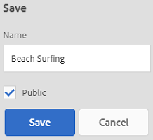

# 管理收藏集 {#managing-collections}

收藏集是其中的一组资产 [!DNL Adobe Experience Manager Assets]。 使用收藏集可在用户之间共享资产。该集合可以是静态集合或基于搜索结果的动态集合。

与文件夹不同，收藏集可以包含来自不同位置的资产。 您可以与分配了不同权限级别（包括查看、编辑等）的不同用户共享集合。

您可以与一个用户共享多个收藏集。每个收藏集都包含对资产的引用。收藏集中会保持资产的引用完整性。

收藏集根据资产的整理方式分为以下类型：

* 包含资产、文件夹和其他收藏集的静态引用列表的收藏集。

* 智能收藏集，它根据搜索条件动态地包含资产。

## 访问收藏集控制台 {#navigating-the-collections-console}

要打开收 **[!UICONTROL 藏集]**，请在界 [!DNL Experience Manager] 面中，转到“资 **[!UICONTROL 产]** ”>“ **[!UICONTROL 收藏集]**”。

## 创建集合 {#creating-a-collection}

You can create a collection either with [static references](#creating-a-collection-with-static-references) or based on a [search criteria-based filter](#creating-a-smart-collection). 您还可以从Lightbox创建收藏集。

### Create a collection with static references {#creating-a-collection-with-static-references}

您可以创建包含静态引用的收藏集，例如包含对资产、文件夹、收藏集、旋转集和图像集的引用的收藏集。

1. 导航到&#x200B;**[!UICONTROL 收藏集]**&#x200B;控制台。
1. 在工具栏中，单击 **[!UICONTROL 创建]**。
1. In the **[!UICONTROL Create Collection]** page, enter a title and an optional description for the collection.
1. 向收藏集添加成员并分配相应的权限。或者，选择&#x200B;**[!UICONTROL 公共收藏集]**，以允许所有用户访问该收藏集。

   >[!NOTE]
   >
   >要使成员能够与其他用户共享集合，请在路径 `dam-users` 中提供组读取权限 `home/users`。 为位置的用户授 `/content/dam/collections` 予权限，允许用户在弹出列表中视图集合。 或者，将用户作为组的一 `dam-users` 部分。

1. （可选）为集合添加缩略图图像。
1. Click **[!UICONTROL Create]**, and then click **[!UICONTROL OK]** to close the dialog. 具有指定标题和属性的集合将在“收藏集”控制台中打开。

   >[!NOTE]
   >
   >[!DNL Experience Manager Assets] 允许您为收藏集创建审核任务，这与为资产文件夹创建审核任务的方式类似。

   要向收藏集添加资产，请导航到 [!DNL Assets] 用户界面。 有关详细信息，请 [参阅将资产添加到收藏集](#adding-assets-to-a-collection)。

### 使用拖放区创建集合 {#create-collections-using-dropzone}

您可以将资产从用户界 [!DNL Assets] 面拖到集合中。 您还可以创建收藏集的副本并将资产拖动到该集合。

1. 从用 [!DNL Assets] 户界面中，选择要添加到收藏集的资产。
1. 将资产拖至“放 **[!UICONTROL 入收藏集”区]** 。 或者，也可 **[!UICONTROL 以单击工]** 具栏中的到集合。

   

1. In the **[!UICONTROL Add To Collection]** page, click **[!UICONTROL Create Collection]** from the toolbar.

   If you want to add the assets to an existing collection, select it from the page, and click **[!UICONTROL Add]**. 默认情况下，将选择最近更新的集合。

1. 在&#x200B;**[!UICONTROL 创建新收藏集]**&#x200B;对话框中，指定收藏集的名称。如果希望所有用户都可以访问该收藏集，请选择&#x200B;**[!UICONTROL 公共收藏集]**。
1. 单击 **[!UICONTROL 继续]** ，以创建集合。

### Create a smart collection {#creating-a-smart-collection}

智能收藏集使用搜索条件动态填充资产。 您只能使用文件（而不是文件夹、文件和文件夹）创建智能收藏集。

要创建智能收藏集，请执行以下步骤：

1. 导航到用 [!DNL Assets] 户界面并单击“搜索”。

1. 在“Omnisearch”（全搜索）框中键入search关键字，然后按 `Enter`。 打开过滤器面板并应用搜索筛选器。

1. 从“文件 **[!UICONTROL 和文件夹]** ”列表中，选 **[!UICONTROL 择“文件]**”。

   

1. 单击 **[!UICONTROL 保存智能收藏集]**。

1. 指定集合的名称。 Select **[!UICONTROL Public]** to add the DAM Users group with the Viewer role to the smart collection.

   

   >[!NOTE]
   >
   >如果您选 **[!UICONTROL 择]**“公共”，则创建智能收藏集后，具有所有者角色的每个人都可以使用它。 If you deselect the **[!UICONTROL Public]** option, the DAM user group is no longer associated with the smart collection.

1. Click **[!UICONTROL Save]** to create the smart collection, and then close the message box to complete the process.

   The new smart collection is also added to the **[!UICONTROL Saved Searches]** list.

   

   The label of the **[!UICONTROL Create Smart Selection]** option changes to **[!UICONTROL Edit Smart Selection]**. 要编辑智能收藏集的设置，请从“文件和文 **[!UICONTROL 件夹]** ”列 **[!UICONTROL 表中选择“文件]** ”。 单击编辑 **[!UICONTROL 智能选择]** 。

## Add assets to a collection {#adding-assets-to-a-collection}

您可以将资产添加到包含一系列引用的资产或文件夹的收藏集中。智能收藏集可使用搜索查询来填充资产。因此，对资产和文件夹的静态引用不适用于此类收藏集。

1. 在资产 [!DNL A]用户界面中，选择资产，然后单 **[!UICONTROL 击工具]** 栏中  。
或者，也可以将资产拖到界 **[!UICONTROL 面上的“放入集]** ”区域。 当区域的标签变为拖放到添加时， **[!UICONTROL 添加资产]**。

1. 在添 **[!UICONTROL 加到收藏集]** ，选择要将资产添加到的收藏集。

1. 单击 **[!UICONTROL 添加]**，然后关闭确认消息。 资产会添加到收藏集。

## 编辑智能收藏集 {#editing-a-smart-collection}

Smart collections are built by saving a search so you can alter their content by modifying the search parameters of the [saved search](#saved-searches).

1. 在用户 [!DNL Assets] 界面中，单击工具栏中  。
1. 将光标置于“Omnisearch”（全搜索）框中，按Return键。
1. 在界面 [!DNL Experience Manager] 中，打开“过滤器”面板。
1. 从&#x200B;**[!UICONTROL 保存的搜索]**&#x200B;列表中，选择要修改的智能收藏集。“搜索”面板显示为保存的搜索配置的过滤器。

   

1. 从“文件 **[!UICONTROL 和文件夹]** ”列表中，选 **[!UICONTROL 择“文件]**”。
1. 根据需要修改一个或多个过滤器。 单击 **[!UICONTROL 编辑智能收藏集]**。

   您还可以编辑智能收藏集的名称。

   

1. 单击&#x200B;**[!UICONTROL 保存]**。此时会出现&#x200B;**[!UICONTROL 编辑智能收藏集]**&#x200B;对话框。
1. 单击 **[!UICONTROL 覆盖]** ，将原始智能收藏集替换为已编辑的收藏集。 或者，选择 **[!UICONTROL 另存为]** ，以单独保存已编辑的集合。
1. In the confirmation dialog, Click **[!UICONTROL Save]** to complete the process.

## 视图和编辑集合元数据 {#view-edit-collection-metadata}

收藏集元数据由与收藏集相关的数据组成，其中包括添加的任何标记。

1. 从收藏集 [!UICONTROL 控制台] ，选择一个收藏集，然后单 **[!UICONTROL 击工]** 具栏中的属性。
1. 在&#x200B;**[!UICONTROL 收藏集元数据]**&#x200B;页面中，从&#x200B;**[!UICONTROL 基本]**&#x200B;和&#x200B;**[!UICONTROL 高级]**&#x200B;选项卡中查看收藏集元数据。
1. 根据需要修改元数据。 要保存更改，请单 **[!UICONTROL 击工具栏中]** 的保存并关闭。

## 批量编辑多个集合的元数据 {#editing-collection-metadata-in-bulk}

您可以同时编辑多个集合的元数据。 此功能可帮助您快速复制多个集合中的常见元数据。

1. 在“收藏集”控制台中，选择两个或更多收藏集。
1. 在工具栏中，单击 **[!UICONTROL 属性]**。
1. 在&#x200B;**[!UICONTROL 收藏集元数据]**&#x200B;页面中，根据需要编辑&#x200B;**[!UICONTROL 基本]**&#x200B;和&#x200B;**[!UICONTROL 高级]**&#x200B;选项卡下的元数据。
1. 要视图特定集合的元数据属性，请在集合列表中取消选择其余的集合。 元数据编辑器字段会填充特定集合的元数据。

   >[!NOTE]
   >
   >* 在“属 [!UICONTROL 性] ”页面中，您可以通过取消选择集合从集合列表中删除集合。 收藏集列表默认选中所有收藏集。 [!DNL Experience Manager] 不会更新您删除的集合的元数据。
   >* At the top of the list, select the check box near **[!UICONTROL Title]** to toggle between selecting the collections and clearing the list.

1. 单击 **[!UICONTROL 工具栏中的]** “保存并关闭”，然后关闭确认对话框。
1. To append the new metadata with the existing metadata, select **[!UICONTROL Append mode]**. 如果不选中此选项，则新元数据将替换字段中的现有元数据。单击 **[!UICONTROL 提交]**。

   >[!NOTE]
   >
   >您为所选集合添加的元数据将覆盖这些集合的以前元数据。 使用“ [!UICONTROL 追加] ”模式在可包含多个值的字段中向现有元数据添加新值。 单值字段始终被覆盖。 您在“标记”字段中添 [!UICONTROL 加的] 任何标记都会附加到元数据中的现有标记列表。

要自定义元数据 [!UICONTROL 属性] 页面，包括添加、修改和删除元数据属性，请使用模式编辑器。

>[!TIP]
>
>批量编辑方法适用于集合中的可用资产。 对于跨文件夹可用或符合通用标准的资产，可在搜索后 [批量更新元数据](/help/assets/search-assets.md#metadataupdates)。

## 搜索集合 {#searching-collections}

您可以从“收藏集”控制台中搜索收藏集。When you search with keywords in the Omnisearch box, [!DNL Assets] searches for collection names, metadata, and the tags added to the collections.

如果您从顶级搜索集合，则搜索结果中只返回单个集合。 [!DNL Assets] 或收藏集中的文件夹被排除。 在所有其他情况下（例如，在单个收藏集或文件夹层次结构中），都会返回所有相关资产、文件夹和收藏集。

## 在集合中搜索 {#searching-within-collections}

在收藏集控制台中，单击某个收藏集以将其打开。

Within a collection, [!DNL Experience Manager] search is restricted to assets (and their tags and metadata) within the collection that you are viewing. 当您在某个文件夹内进行搜索时，将返回当前文件夹中所有匹配的资产和子文件夹。 当您在收藏集中进行搜索时，只会返回与收藏集直接成员匹配的资产、文件夹和其他收藏集。

## 编辑集合设置 {#editing-collection-settings}

您可以编辑集合设置（如标题和说明），或向集合添加成员。

1. 选择一个集合，然后单 **[!UICONTROL 击工]** 具栏中的设置。 或者，也可以使 **[!UICONTROL 用集合]** 缩略图中的设置快速操作。
1. Modify the collection settings in the **[!UICONTROL Collection Settings]** page. For example, modify the collection title, descriptions, members, and permissions as discussed in [Adding Collections](#creating-a-collection).

1. 要保存更改，请单击“ **[!UICONTROL 保存]**”。

## 删除集合 {#deleting-a-collection}

1. 从收藏集控制台中，选择一个或多个收藏集，然后单击工具栏中的删除。

1. In the dialog, click **[!UICONTROL Delete]** to confirm the delete action.

   >[!NOTE]
   >
   >You can also delete smart collections by [deleting saved searches](#saved-searches).

## 下载集合 {#downloading-a-collection}

当您下载收藏集时，会下载该收藏集中的整个资产层次结构，包括文件夹和子收藏集。

1. 从“集合”控制台中，选择要下载的一个或多个集合。
1. 在工具栏中，单击“ **[!UICONTROL 下载]**”。
1. 在“下载 **[!UICONTROL ”对话]** 框中，单击“ **[!UICONTROL 下载]**”。 如果要下载集合中资产的演绎版，请选择“演 **[!UICONTROL 绎版]**”。 选择“ **[!UICONTROL 电子邮]** 件”选项，向集合所有者发送电子邮件通知。

   当您选择要下载的集合时，将下载集合下的完整文件夹层次结构。 要将您下载的每个收藏集（包括嵌套在父收藏集下的子收藏集中的资产）包含在单个文件夹中，请选 **[!UICONTROL 择为每个资产创建单独的文件夹]**。

## 创建嵌套集合 {#creating-nested-collections}

您可以将一个收藏集添加到另一个收藏集中，从而创建嵌套式收藏集。

1. 从收藏集控制台中，选择所需的收藏集或收藏集组，然后单击工 **[!UICONTROL 具栏中]** 的到收藏集。

1. 从添 **[!UICONTROL 加到收藏集]** ，选择要在其中添加收藏集的收藏集。

   >[!NOTE]
   >
   >默认情况下，最近更新的集合会在添加到 **[!UICONTROL 集合页面中选]** 择。

1. 单击&#x200B;**[!UICONTROL 添加]**。系统会显示一条消息，确认该集合已添加到“选择目标”页 **[!UICONTROL 面的目标]** 集合。 关闭消息以完成该过程。

>[!NOTE]
>
>无法嵌套智能收藏集。也就是说，智能收藏集不能包含其他任何收藏集。

## 保存的搜索 {#saved-searches}

In the [!DNL Assets] user interface, you can search or filter assets based on certain rules, search criteria, or custom search facets. 如果将这些搜索另存为&#x200B;**[!UICONTROL 保存的搜索]**，则以后可以从“过滤器”面板的&#x200B;**[!UICONTROL 保存的搜索]**&#x200B;列表中访问它们。创建保存的搜索也会创建智能收藏集。

创建智能收藏集时将创建保存的搜索。智能收藏集会自动添加到&#x200B;**[!UICONTROL 保存的搜索]**&#x200B;列表。The [!UICONTROL Saved Searches] query for the collection is saved in the `dam:query` property in CRXDE at the relative location `/content/dam/collections/`. 您可以保存的搜索以及列表中显示的保存的搜索没有限制。

>[!NOTE]
>
>您可以按共享静态收藏集的相同方式共享智能收藏集。

编辑保存的搜索与编辑智能收藏集相同。 For details, see [edit a smart collection](#editing-a-smart-collection).

要删除保存的搜索，请执行以下步骤：

1. 在用户 [!DNL Assets] 界面中，单击“搜索 。
1. 在“Omnisearch”（全搜索）字段中，按Return键。
1. 在界面 [!DNL Experience Manager] 中，打开“过滤器”面板。
1. From the **[!UICONTROL Saved Searches]** list, click **[!UICONTROL Delete]** next to the smart collection that you want to delete.

   

1. In the dialog, click **[!UICONTROL Delete]** to delete the saved search.

## 对集合执行工作流 {#running-a-workflow-on-a-collection}

您可以为集合中的资产运行工作流。 如果集合包含嵌套集合，则该工作流也会运行在嵌套集合中的资产上。 但是，如果集合和嵌套集合包含重复资产，则此工作流仅对此类资产运行一次。

1. 打开 **[!UICONTROL 资产]** > **[!UICONTROL 收藏集]**。 要对特定集合执行工作流，请选择该工作流。
1. Open **[!UICONTROL Timeline]** rail. 单击  ，然后单 **[!UICONTROL 击开始工作流]**。
1. 在&#x200B;**[!UICONTROL 启动工作流]**&#x200B;部分，从列表中选择工作流模型。例如，选择 **[!UICONTROL DAM 更新资产]**&#x200B;模型。
1. 输入工作流的标题，然后单击 **[!UICONTROL 开始]**。
1. In the dialog, click **[!UICONTROL Proceed]**. 此工作流将处理选定集合中的所有资产。

>[!MORELIKETHIS]
>
>* [配置Experience Manager资产电子邮件通知](/help/sites-administering/notification.md#assetsconfig)
>* [为集合创建审阅任务](bulk-approval.md)

