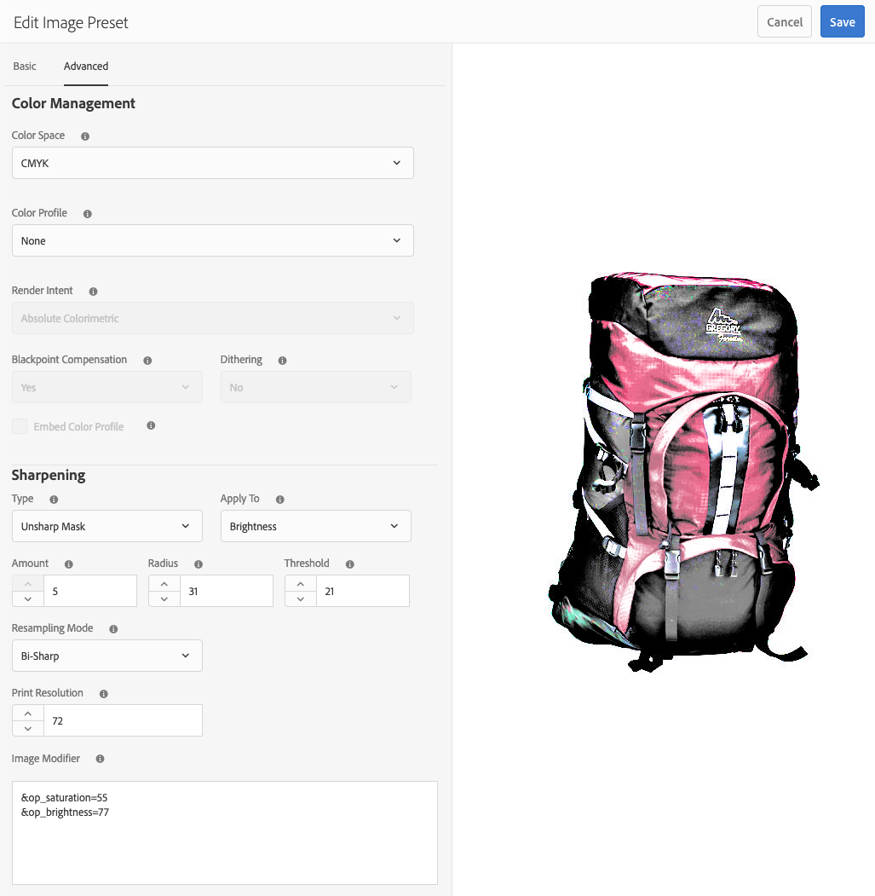

# 管理Dynamic Media图像预设{#managing-image-presets}

图像预设使AEM Assets能够动态地传送不同大小、不同格式或具有其他动态生成的图像属性的图像。 每个图像预设都代表一组预定义的大小调整和格式设置命令，以用于显示图像。在创建图像预设时，您需要选择图像传送的大小。此外，还需要选择格式设置命令，以确保传送供查看的图像时，显示优化的图像外观。

管理员可以创建用于导出资产的预设。在导出图像时，用户可以选择预设，此操作也将调整图像的格式，使其符合管理员指定的规范。

您还可以创建响应式图像预设。如果对资产应用响应式图像预设，则资产会根据查看资产时所使用的设备或屏幕大小而相应发生更改。除了RGB或灰色外，还可以将图像预设配置为在色彩空间中使用CMYK。

本节将介绍如何创建、修改和通常管理图像预设。 无论您何时预览图像，都可以对图像应用图像预设。请参阅[应用图像预设](/help/assets/image-presets.md)。

>[!NOTE]
>
>智能成像可与您现有的图像预设配合使用，并在交付的最后一毫秒内使用智能功能，根据浏览器或网络连接速度进一步减小图像文件大小。 有关更多信息，请参阅[智能成像](/help/assets/imaging-faq.md)。

## 了解Dynamic Media图像预设{#understanding-image-presets}

与宏一样，图像预设是一组预定义的大小调整和格式设置命令，这些命令使用同一个名称进行保存。为了解图像预设的工作方式，假定您的网站要求每个产品图像在桌面设备和移动设备上传送时均以不同的大小和格式显示。

>[!NOTE]
>
>在Dynamic Media - Scene7模式下，图像预设仅受图像资产支持。

您可以创建两种图像预设：一种是适用于桌面版本的 500 x 500 像素；一种是适用于移动版本的 150 x 150 像素。您可以创建两个图像预设，一个称为`Enlarge`，用于以500x500像素显示图像，另一个称为`Thumbnail`，用于以150x150像素显示图像。 要传送大小为`Enlarge`和`Thumbnail`的图像，AEM会查找“放大图像预设”和“缩略图图像预设”的定义。 然后，AEM 会根据每种“图像预设”的尺寸和格式规范，动态地生成相应的图像。

如果图像在动态传送时大小大幅缩减，图像可能会丢失锐化和细节。由于这一原因，每个图像预设中都包含格式控制，以在传送图像时将其优化为特定大小。这些控制可确保图像在传送到网站或应用程序时具有锐化、清晰的效果。

管理员可以创建图像预设。要创建图像预设，您可以从头开始创建，也可以通过现有图像预设创建，然后使用新名称对其保存。

## 管理Dynamic Media图像预设{#managing-image-presets-1}

您可以在AEM中管理图像预设，方法是点按或单击AEM徽标以访问全局导航控制台，然后点按或单击工具图标，然后导航到&#x200B;**[!UICONTROL Assets >图像预设]**。


>[!NOTE]
>
>在预览或传送资产时，您创建的任何图像预设也可用作动态演绎版。
>
>在&#x200B;*Dynamic Media - Scene7模式*&#x200B;中，当图像预设自动发布时，您需要&#x200B;*not*&#x200B;发布图像预设。
>
>在&#x200B;*Dynamic Media — 混合模式*&#x200B;中，您需要手动发布图像预设。
>
>请参阅[发布图像预设。](#publishing-image-presets)

>[!NOTE]
>
>当您在资产的详细信息视图中选择&#x200B;**[!UICONTROL 演绎版]**&#x200B;时，系统会显示各种演绎版。 您可以增加或减少显示的图像预设数。 请参阅[增加显示](#increasing-or-decreasing-the-number-of-image-presets-that-display)的图像预设数。

### 智能裁剪、Adobe Illustrator(AI)、Postscript(EPS)和PDF文件格式{#adobe-illustrator-ai-postscript-eps-and-pdf-file-formats}

>[!NOTE]
>
>本主题仅适用于Dynamic Media — 混合模式。

如果您打算支持摄取AI、EPS和PDF文件以便生成这些文件格式的动态演绎版，则可能需要在创建图像预设之前查看以下信息。

Adobe Illustrator的文件格式是PDF的变体。 在AEM Assets，主要区别如下：

* Adobe Illustrator文档由包含多层的单个页面组成。 每个层都作为PNG子资产提取，位于主Illustrator资产下。
* PDF文档由一个或多个页面组成。 每个页面都作为单页PDF子资产提取，位于主多页PDF文档下。

子资产由`Create Sub Asset process`组件在整个`DAM Update Asset`工作流中创建。 要在工作流中查看此流程组件，请点按&#x200B;**[!UICONTROL 工具]** > **[!UICONTROL 工作流]** > **[!UICONTROL 模型]** > **[!UICONTROL DAM更新资产]** > **[!UICONTROL 编辑]**。

另请参阅[查看多页文件的页面](/help/assets/managing-linked-subassets.md#view-pages-of-a-multi-page-file)。

在打开资产时，您可以查看子资产或页面，点按内容菜单，然后选择&#x200B;**[!UICONTROL 子资产]**&#x200B;或&#x200B;**[!UICONTROL 页面]**。 子资产是真实资产。 即，PDF页面由`Create Sub Asset`工作流组件提取。 然后，它们将作为`page1.pdf`、`page2.pdf`等存储在主资产下方。 存储完这些值后，`DAM Update Asset`工作流会处理它们。

要使用Dynamic Media预览AI、EPS或PDF文件并生成动态呈现，需要执行以下处理步骤：

1. 在`DAM Update Asset`工作流中，`Rasterize PDF/AI Image Preview Rendition`流程组件使用配置的分辨率将原始资产的第一页栅格化为`cqdam.preview.png`演绎版。

1. 然后，工作流中的`Dynamic Media Process Image Assets`流程组件会将`cqdam.preview.png`演绎版优化为PTIFF。

>[!NOTE]
>
>在[!UICONTROL DAM更新资产]工作流中， **[!UICONTROL EPS缩略图]**&#x200B;步骤为EPS文件生成缩略图。

#### PDF/AI/EPS资产元数据属性{#pdf-ai-eps-asset-metadata-properties}

| **元数据属性** | **描述** |
|---|---|
| dam:Physicalwidthininch | 文档宽度（英寸）。 |
| dam：物理高度英寸 | 文档高度（英寸）。 |

可通过`DAM Update Asset`工作流访问`Rasterize PDF/AI Image Preview Rendition`流程组件选项。

点按左上角的Adobe Experience Manager，导航到&#x200B;**[!UICONTROL 工具]** > **[!UICONTROL 工作流]** > **[!UICONTROL 模型]**。 在“工作流模型”页面中，选择&#x200B;**[!UICONTROL DAM更新资产]**，然后在工具栏中点按&#x200B;**[!UICONTROL 编辑]**。 在[!UICONTROL DAM更新资产]工作流页面上，双击`Rasterize PDF/AI Image Preview Rendition`流程组件以打开其步骤属性对话框。

#### 栅格化PDF/AI图像预览呈现版本选项{#rasterize-pdf-ai-image-preview-rendition-options}


用于栅格化PDF或AI工作流的参数

<table>
 <tbody>
  <tr>
   <td><strong>进程参数</strong></td>
   <td><strong>默认设置</strong></td>
   <td><strong>描述</strong></td>
  </tr>
  <tr>
   <td>Mime 类型</td>
   <td><p>application/pdf</p> <p>application/postscript</p> <p>application/illustrator<br /> </p> </td>
   <td>被视为PDF或Illustrator文档的文档mime类型列表。<br /> </td>
  </tr>
  <tr>
   <td>最大宽度</td>
   <td>2048年</td>
   <td>生成的预览呈现的最大宽度（以像素为单位）。<br /> </td>
  </tr>
  <tr>
   <td>最大高度</td>
   <td>2048年</td>
   <td>生成的预览呈现的最大高度（以像素为单位）。<br /> </td>
  </tr>
  <tr>
   <td>分辨率</td>
   <td>72</td>
   <td>分辨率以ppi为单位栅格化第一页（每英寸像素）。</td>
  </tr>
 </tbody>
</table>

使用默认的进程参数，PDF/AI文档的第一页以72 ppi进行光栅化，生成的预览图像的大小为2048 x 2048像素。 对于典型部署，您可能希望将分辨率提高到至少150 ppi或更高。 例如，300 ppi的美国字母大小文档要求最大宽度和高度分别为2550 x 3300像素。

“最大宽度”和“最大高度”限制要栅格化的分辨率。 例如，如果最大值保持不变，并且分辨率设置为300 ppi，则美国信件文档将以186 ppi光栅化。 即，文档为1581 x 2046像素。

`Rasterize PDF/AI Image Preview Rendition`进程组件定义了最大值，以确保它不会在内存中创建过大的映像。 此类大映像可能会使提供给JVM（Java虚拟机）的内存溢出。 必须小心为JVM提供足够的内存来管理已配置的并行工作流数量，每个工作流都有可能以已配置的最大大小创建映像。

### InDesign(INDD)文件格式{#indesign-indd-file-format}

如果您打算支持摄取INDD文件以便生成此文件格式的动态演绎版，则可能需要在创建图像预设之前查看以下信息。

对于InDesign文件，仅当Adobe InDesign服务器与AEM集成时，才会提取子资产。 引用的资产会根据其元数据进行关联。 InDesign Server不是链接所必需的。 但是，在为要在AEM文件和引用的资产之间创建的链接处理InDesign文件之前，InDesign中必须存在引用的资产。

请参阅[将AEM Assets与InDesign Server集成](/help/assets/indesign.md)。

`DAM Update Asset`工作流中的媒体提取流程组件运行多个预配置的扩展脚本来处理InDesign文件。


[!UICONTROL DAM更新资产]工作流中媒体提取流程组件参数中的ExtendScript路径。

以下脚本供Dynamic Media集成使用：

<table>
 <tbody>
  <tr>
   <td><strong>扩展脚本名称</strong></td>
   <td><strong>默认</strong></td>
   <td><strong>描述</strong></td>
  </tr>
  <tr>
   <td>ThumbnailExport.jsx</td>
   <td>是</td>
   <td>生成300 ppi <code>thumbnail.jpg</code>演绎版，该演绎版经过优化，并由<code>Dynamic Media Process Image Assets</code>进程组件转换为PTIFF演绎版。<br /> </td>
  </tr>
  <tr>
   <td>JPEGPagesExport.jsx</td>
   <td>是</td>
   <td>为每个页面生成300 ppi JPEG子资产。 JPEG子资产是存储在InDesign资产下的实际资产。 它还通过<code>DAM Update Asset</code>工作流进行了优化并转换为PTIFF。<br /> </td>
  </tr>
  <tr>
   <td>PDFPagesExport.jsx</td>
   <td>否</td>
   <td>为每个页面生成PDF子资产。 将按照前面所述处理PDF子资产。 由于PDF仅包含单页，因此不会生成子资产。<br /> </td>
  </tr>
 </tbody>
</table>

## 配置图像缩略图大小{#configuring-image-thumbnail-size}

您可以通过在&#x200B;**[!UICONTROL DAM更新资产]**&#x200B;工作流中配置这些设置来配置缩略图的大小。 在工作流中，您可以通过两个步骤来配置图像资产的缩略图大小。 尽管其中一个(**[!UICONTROL Dynamic Media流程图像资产]**)用于动态图像资产，而另一个（**[!UICONTROL 流程缩略图]**）用于静态缩略图生成，或者当所有其他流程无法生成缩略图时，*两个*&#x200B;应具有相同的设置。

在 **[!UICONTROL Dynamic Media 流程图像资产]**&#x200B;步骤中，缩略图由图像服务器生成，此配置与应用于&#x200B;**[!UICONTROL 流程缩略图]**&#x200B;步骤的配置无关。通过&#x200B;**[!UICONTROL 流程缩略图]**&#x200B;步骤生成缩略图是创建缩览图最耗时、内存占用最多的方法。

缩略图大小按以下格式定义：**[!UICONTROL width:height:center]**，例如&#x200B;*80:80:false*。 宽度和高度决定缩略图的大小（以像素为单位）；中心值为false或true，如果设置为true，则表示缩略图的大小与配置中给定的大小完全相同。 如果调整大小的图像较小，则该图像将居中在缩略图中。

>[!NOTE]
>
>* EPS 文件的缩略图大小可在 **[!UICONTROL EPS 缩略图]**&#x200B;步骤中“缩略图”的&#x200B;**[!UICONTROL 参数]**&#x200B;选项卡下进行配置。
   >
   >
* 可在&#x200B;**[!UICONTROL 参数]**&#x200B;选项卡下的&#x200B;**[!UICONTROL 流程]**&#x200B;选项卡中，通过 **[!UICONTROL FFmpeg 缩略图]**&#x200B;步骤配置视频的缩略图大小。

>


**要配置图像缩略图大小**:

1. 点按&#x200B;**[!UICONTROL 工具]** > **[!UICONTROL 工作流]** > **[!UICONTROL 模型]** > **[!UICONTROL DAM更新资产]** > **[!UICONTROL 编辑]**。
1. 点按&#x200B;**[!UICONTROL Dynamic Media处理图像资产]**&#x200B;步骤，然后点按或单击&#x200B;**[!UICONTROL 缩略图]**&#x200B;选项卡。 根据需要更改缩略图大小，然后点按&#x200B;**[!UICONTROL 确定]**。

   

1. 点按&#x200B;**[!UICONTROL 流程缩略图]**&#x200B;步骤，然后点按&#x200B;**[!UICONTROL 缩略图]**&#x200B;选项卡。根据需要更改缩略图大小，然后点按&#x200B;**[!UICONTROL 确定]**。

   >[!NOTE]
   >
   >**[!UICONTROL 流程缩略图]**&#x200B;步骤的缩略图参数中的值必须与 **[!UICONTROL Dynamic Media 流程图像资产]**&#x200B;步骤中的缩略图参数相匹配。

1. 点按&#x200B;**[!UICONTROL 保存]**&#x200B;以保存对工作流所做的更改。

### 增加或减少显示{#increasing-or-decreasing-the-number-of-image-presets-that-display}的Dynamic Media图像预设数

在预览资产时，您创建的图像预设可以作为动态演绎版使用。 从&#x200B;**[!UICONTROL 详细信息视图>演绎版]**&#x200B;查看资产时，AEM会显示各种动态演绎版。 您可以增加或减少显示的演绎版限制。

**要增加或减少显示的Dynamic Media图像预设数**:

1. 导航到CRXDE Lite([https://localhost:4502/crx/de](https://localhost:4502/crx/de))。
1. 导航到位于`/libs/dam/gui/coral/content/commons/sidepanels/imagepresetsdetail/imgagepresetslist`的图像预设列表节点

   

1. 在 **[!UICONTROL limit]** 属性中，将默认设 **[!UICONTROL 置为15的Value]**（值）更改为所需的数字。
1. 导航到位于`/libs/dam/gui/coral/content/commons/sidepanels/imagepresetsdetail/imgagepresetslist/datasource`的图像预设数据源

   

1. 在limit属性中，将数字更改为所需的数字，例如`{empty requestPathInfo.selectors[1] ? "20" : requestPathInfo.selectors[1]}`
1. 点按&#x200B;**[!UICONTROL 保存全部]**。

## 创建Dynamic Media图像预设{#creating-image-presets}

通过创建Dynamic Media图像预设，您可以在预览或发布图像时将这些设置应用到任何图像。

>[!NOTE]
>
>如果使用 Internet Explorer 9，创建的预设在保存后不会立即显示在预设列表中。要解决此问题，请禁用 IE9 的缓存。

如果您打算支持摄取AI、PDF和EPS文件以便生成这些文件格式的动态呈现版本，则可能需要在创建图像预设之前查看以下信息。
请参阅[Adobe Illustrator(AI)、Postscript(EPS)和PDF文件格式](#adobe-illustrator-ai-postscript-eps-and-pdf-file-formats)。

如果您打算支持摄取INDD文件以便生成此文件格式的动态演绎版，则可能需要在创建图像预设之前查看以下信息。
请参阅[InDesign(INDD)文件格式](#indesign-indd-file-format)。

>[!NOTE]
>
>要创建Dynamic Media图像预设，您必须以AEM管理员或Admin Console管理员的身份拥有管理员权限。

**要创建Dynamic Media图像预设，请执行以下操作**:

1. 在AEM中，点按AEM徽标以访问全局导航控制台，然后点按&#x200B;**[!UICONTROL 工具>资产>图像预设]**。
1. 单击&#x200B;**[!UICONTROL 创建]**。此时将打开&#x200B;**[!UICONTROL 编辑图像预设]**&#x200B;窗口。

   

   >[!NOTE]
   >
   >要使此图像预设具有响应性，请擦除&#x200B;**[!UICONTROL 宽度]**&#x200B;和&#x200B;**[!UICONTROL 高度]**&#x200B;字段中的值，并将其留空。

1. 根据需要，在&#x200B;**[!UICONTROL 基本]**&#x200B;和&#x200B;**[!UICONTROL 高级]**&#x200B;选项卡中输入值，包括名称。图像预设选项中概 [述了这些选项](#image-preset-options)。 预设显示在左窗格中，并可以与其他资产一起动态使用。

   

1. 单击&#x200B;**[!UICONTROL 保存]**。

## 创建响应式图像预设{#creating-a-responsive-image-preset}

要创建响应式图像预设，请执行[创建图像预设](#creating-image-presets)中的步骤。在&#x200B;**[!UICONTROL 编辑图像预设]**&#x200B;窗口中输入高度和宽度时，请清除这两个字段的值，并将其保留为空。

将这两个字段保留为空就是告诉 AEM 此图像预设为响应式。您可以视需要调整其他值。


>[!NOTE]
>
>要在将图像预设应用到资产时显示 **[!UICONTROL URL]** 和 **[!UICONTROL RESS]** 按钮，必须先发布资产。
>
>
>
>在Dynamic Media - Scene7模式下，图像预设和图像资产会自动发布。
>
>在Dynamic Media — 混合模式下，您必须手动发布图像预设和图像资产。

### 图像预设选项{#image-preset-options}

在创建或编辑图像预设时，您可以使用本节介绍的几种选项。此外，Adobe还建议从以下“最佳实践”选项开始：

* **[!UICONTROL 格式]** (**** 基本选项卡) — 选择 **** JPEG或其他符合您要求的格式。所有Web浏览器都支持JPEG图像格式；它可以在小文件大小和图像质量之间实现良好的平衡。但是，JPEG格式图像使用有损压缩方案，如果压缩设置过低，则会引入不需要的图像伪影。因此，Adobe 建议将压缩质量设置为 75。此设置在图像质量和小文件大小之间提供了良好的平衡。

* **[!UICONTROL 启用简单锐化]** - 请勿选择&#x200B;**[!UICONTROL 启用简单锐化]**（此锐化滤镜提供的控制度低于“钝化蒙版”设置）。

* **[!UICONTROL 锐化：重新取样模式]**  — 选择 **[!UICONTROL 两次立方]**。

#### “基本”选项卡选项{#basic-tab-options}

<table>
 <tbody>
  <tr>
   <td><strong>字段</strong></td>
   <td><strong>描述</strong></td>
  </tr>
  <tr>
   <td><strong>名称</strong></td>
   <td>输入一个描述性名称，不加任何空格。在名称中包含图像大小规格可帮助用户识别此图像预设。</td>
  </tr>
  <tr>
   <td><strong>宽度和高度</strong></td>
   <td>输入传送图像时所用的像素大小。宽度和高度必须大于 0 像素。如果任一值为 0，则无法创建预设。如果两个值均为空，则表示已经创建了响应式图像预设。</td>
  </tr>
  <tr>
   <td><strong>格式</strong></td>
   <td><p>从菜单中选择一个格式。</p> <p>选择 <strong>JPEG</strong> 可提供以下更多选项。</p>
    <ul>
     <li><strong>质量</strong>  — 控制JPEG压缩级别。此设置会影响文件大小和图像质量。JPEG质量比例为1-100。拖动滑块时，比例可见。</li>
     <li><strong>启用JPG色度缩减采样</strong>  — 由于眼睛对高频颜色信息的敏感度低于高频亮度，因此JPEG图像会将图像信息划分为亮度和颜色分量。压缩JPEG图像时，亮度分量会保留全分辨率，而颜色分量会通过平均一组像素来缩减采样。缩减采样会将数据量减少一半或三分之一，几乎不会影响感知质量。缩减采样不适用于灰度图像。此技术可减少对对比度高的图像（例如，叠加有文本的图像）有用的压缩量。</li>
    </ul>
    <div>
      选择 <strong>GIF</strong> 或<strong>带有 Alpha 的 GIF</strong> 可提供以下更多 <strong>GIF 颜色量化</strong>选项：
    </div>
    <ul>
     <li><strong>类 </strong>型 — 选 <strong>择自适应</strong> （默认）、 <strong>Web</strong>或 <strong>Macintosh</strong>。如果选择 <strong>带Alpha的GIF</strong>，则“Macintosh”选项不可用。</li>
     <li><strong>Dither</strong>  — 选择“ <strong></strong> 差异 <strong>”或“关”</strong>。</li>
     <li><strong>颜色数目</strong> - 输入介于 2 到 256 之间的一个数字。</li>
     <li><strong>颜色列表</strong> - 输入一个以逗号分隔的列表。例如，对于白色、灰色和黑色，输入 000000,888888,ffffff。</li>
    </ul>
    <div>
      选择 <strong>PDF</strong>、<strong>TIFF</strong> 或<strong>带有 Alpha 的 TIFF</strong> 可提供以下更多选项：
    </div>
    <ul>
     <li><strong>压缩</strong> - 选择一种压缩算法。“PDF”的算法选项有<strong>无</strong>、<strong>Zip</strong> 和 <strong>Jpeg</strong>；对于“TIFF”，压缩算法选项有<strong>无</strong>、<strong>LZW</strong>、<strong>Jpeg</strong> 和 <strong>Zip</strong>；对于“带有 Alpha 的 TIFF”，压缩算法选项有<strong>无</strong>、<strong>LZW</strong> 和 <strong>Zip</strong>。</li>
    </ul> <p>如果选择 <strong>PNG</strong>、<strong>带有 Alpha 的 PNG</strong>，或者选择 <strong>EPS</strong>，则不提供其他选项。</p> </td>
  </tr>
  <tr>
   <td><strong>锐化</strong></td>
   <td>选择<strong>启用简单锐化</strong>选项可在执行所有缩放操作后对图像应用基本锐化滤镜。锐化有助于弥补在以不同大小显示图像时可能产生的模糊。 </td>
  </tr>
 </tbody>
</table>

#### “高级”选项卡选项{#advanced-tab-options}

<table>
 <tbody>
  <tr>
   <td><strong>字段</strong></td>
   <td><strong>描述</strong></td>
  </tr>
  <tr>
   <td><strong>色彩空间</strong></td>
   <td>为色彩空间选择<strong>RGB、CMYK、</strong>或<strong>灰度</strong>。</td>
  </tr>
  <tr>
   <td><strong>颜色配置文件</strong></td>
   <td>如果资产与工作配置文件不同，请选择资产应转换到的输出色彩空间配置文件。</td>
  </tr>
  <tr>
   <td><strong>渲染方法</strong></td>
   <td>您可以覆盖默认的渲染意图。 渲染意图决定了目标颜色配置文件中无法重现的颜色（超出色域）会发生什么情况。 如果“渲染意图”与ICC配置文件不兼容，则将忽略该“渲染意图”。
    <ul>
     <li>选择<strong>感知</strong>，当原始图像中的一种或多种颜色超出目标色彩空间的色域时，将总色域从一个色彩空间压缩为另一个色彩空间。</li>
     <li>当当前颜色空间中的颜色超出目标颜色空间的色域时，如果您希望将其映射到目标颜色空间色域中最接近的颜色，而不影响任何其他颜色，请选择<strong>相对比色</strong>。 </li>
     <li>选择<strong>饱和度</strong>以在转换为目标色彩空间时重现原始图像色彩饱和度。 </li>
     <li>选择<strong>绝对比色</strong>以完全匹配颜色，而不对会改变图像亮度的白点或黑点进行任何调整。</li>
    </ul> </td>
  </tr>
  <tr>
   <td><strong>黑场补偿</strong></td>
   <td>如果输出配置文件支持此功能，请选择此选项。 如果黑点补偿与指定的ICC配置文件不兼容，则忽略该补偿。</td>
  </tr>
  <tr>
   <td><strong>仿色</strong></td>
   <td>选择此选项可能会避免或减少色带伪影。 </td>
  </tr>
  <tr>
   <td><strong>锐化类型</strong></td>
   <td><p>选择<strong>无</strong>、<strong>锐化</strong>或 <strong>USM 锐化</strong>。 </p>
    <ul>
     <li>选择<strong>无</strong>可禁用锐化。</li>
     <li>选择<strong>锐化</strong>可在执行所有缩放操作后对图像应用基本锐化滤镜。锐化有助于弥补在以不同大小显示图像时可能产生的模糊。 </li>
     <li>选择<strong> USM锐化</strong>可对最终缩减采样图像微调锐化滤镜效果。您可以控制效果的强度、效果的半径（以像素为单位）以及将被忽略的对比度阈值。此效果使用与Photoshop的“钝化蒙版”滤镜相同的选项。</li>
    </ul> <p>在 <strong>USM 锐化</strong>中，您可以设置以下选项：</p>
    <ul>
     <li><strong>数量</strong>  — 控制对边缘像素应用的对比度数量。默认的实数值为1.0。对于高分辨率图像，最高可将其增加到5.0。请考虑使用“数量”来测量滤镜强度。</li>
     <li><strong>半径</strong>  — 确定边缘像素周围影响锐化的像素数。对于高分辨率图像，请输入一个介于1到2之间的实数。 低值仅锐化边缘像素；高值可锐化较宽范围的像素。 正确的值取决于图像大小。</li>
     <li><strong>阈值</strong>  — 确定在应用USM锐化滤镜时要忽略的对比度范围。换句话说，此选项确定锐化的像素与周围区域必须有多大的不同，才会被视为边缘像素并进行锐化。为避免引入杂色，请尝试使用2到20之间的整数值。 </li>
     <li><strong>应用于</strong>  — 确定钝化是否应用于每种颜色或亮度。</li>
    </ul>
    <div>
      有关“锐化”的信息，请参阅<a href="https://experienceleague.adobe.com/docs/dynamic-media-classic/assets/sharpening_images.pdf">锐化图像</a>。
    </div> </td>
  </tr>
  <tr>
   <td><strong>重新取样模式</strong></td>
   <td>选择一个<strong>重新取样模式</strong>选项。在缩减像素采样时，这些选项会锐化图像：
    <ul>
     <li><strong>双线性</strong>  — 最快的重新取样方法。会出现一些锯齿伪像。</li>
     <li><strong>两次立方</strong>  — 提高CPU使用率，但会生成较锐利的图像，出现的锯齿伪像较少。</li>
     <li><strong>锐化2</strong>  — 可以生成比两次立方选项更锐利的结果，但CPU成本更高。</li>
     <li><strong>Bi-Sharp</strong>  — 选择Photoshop默认重采样器以减小图像大小，此方法称为双 <strong>立</strong> 方法Adobe Photoshop。</li>
     <li><strong>每种颜色</strong>和<strong>亮度</strong> - 每种方法均可基于颜色或亮度。默认情况下将选择<strong>每种颜色</strong>。</li>
    </ul> </td>
  </tr>
  <tr>
   <td><strong>打印分辨率</strong></td>
   <td>选择此图像的打印分辨率；默认值为 72 像素。</td>
  </tr>
  <tr>
   <td><strong>图像修饰符</strong></td>
   <td><p>除了UI中提供的常用图像设置之外，Dynamic Media还支持许多高级图像修改，您可以在<strong>图像修饰符</strong>字段中指定这些修改。 这些参数在<a href="https://experienceleague.adobe.com/docs/dynamic-media-developer-resources/image-serving-api/image-serving-api/http-protocol-reference/command-reference/c-command-reference.html?lang=en#image-serving-api">Image Server协议命令引用</a>中定义。</p> <p>重要信息：API中列出的以下功能不受支持：</p>
    <ul>
     <li>基本模板和文本渲染命令：<code>text= textAngle= textAttr= textFlowPath= textFlowXPath= textPath=</code>和 <code>textPs=</code></li>
     <li>本地化命令：<code>locale=</code>和 <code>req=xlate</code></li>
     <li><code>req=set</code> 不可用于常规用法。</li>
     <li><code>req=mbrset</code></li>
     <li><code>req=saveToFile</code></li>
     <li><code>req=targets</code></li>
     <li><code>template=</code></li>
     <li>非核心Dynamic Media服务：SVG、图像渲染和Web-to-Print</li>
    </ul> </td>
  </tr>
 </tbody>
</table>

## 使用图像修饰符{#defining-image-preset-options-with-image-modifiers}定义图像预设选项

除了“基本”和“高级”选项卡中提供的选项外，您还可以定义图像修饰符，以便在定义图像预设时有更多选择。图像渲染依赖于[HTTP协议引用](https://experienceleague.adobe.com/docs/dynamic-media-developer-resources/image-serving-api/image-serving-api/http-protocol-reference/command-reference/c-command-reference.html#image-serving-api)中详细定义的图像渲染API。

下面的一些基本示例显示了可以使用图像修饰符实现的操作。

>[!NOTE]
>
>某些图像修饰符[不能在AEM](#advanced-tab-options)中使用。

* [op_invert](https://experienceleague.adobe.com/docs/dynamic-media-developer-resources/image-serving-api/image-serving-api/http-protocol-reference/command-reference/r-op-invert.html#image-serving-api)  — 反转每个颜色分量以获得负图像效果。

   ```xml
   &op_invert=1
   ```

   

* [op_blur](https://experienceleague.adobe.com/docs/dynamic-media-developer-resources/image-serving-api/image-serving-api/http-protocol-reference/command-reference/r-op-blur.html#image-serving-api) - 向图像应用模糊滤镜。

   ```xml
   &op_blur=7
   ```

   

* 组合命令 - op_blur 和 op-invert

   ```xml
   &op_invert=1&op_blur=7
   ```

   

* [op_brightness](https://experienceleague.adobe.com/docs/dynamic-media-developer-resources/image-serving-api/image-serving-api/http-protocol-reference/command-reference/r-op-brightness.html#image-serving-api)  — 降低或增加亮度。

   ```xml
   &op_brightness=58
   ```

   

* [opac](https://experienceleague.adobe.com/docs/dynamic-media-developer-resources/image-serving-api/image-serving-api/http-protocol-reference/command-reference/r-opac.html#image-serving-api) - 调整图像不透明度。可用于降低前景不透明度。

   ```xml
   opac=29
   ```

   

## 编辑图像预设{#modifying-image-presets}

1. 在AEM中，点按AEM徽标以访问全局导航控制台，然后点按&#x200B;**[!UICONTROL 工具]** > **[!UICONTROL 资产]** > **[!UICONTROL 图像预设]**。

   

1. 选择预设，然后单击&#x200B;**[!UICONTROL 编辑]**。将打开&#x200B;**[!UICONTROL 编辑图像预设]**&#x200B;窗口。
1. 进行更改，然后单击&#x200B;**[!UICONTROL 保存]**&#x200B;以保存更改，或单击&#x200B;**[!UICONTROL 取消]**&#x200B;以取消更改。

## 发布Dynamic Media图像预设{#publishing-image-presets}

如果您运行的是Dynamic Media — 混合模式，则必须手动发布图像预设。

(如果您运行的是Dynamic Media - Scene7模式，则图像预设将自动发布；您无需完成这些步骤。)

**要在Dynamic Media — 混合模式中发布图像预设，请执行以下操作**:

1. 在AEM中，点按或单击AEM徽标以访问全局导航控制台，然后点按或单击工具图标，然后导航到&#x200B;**[!UICONTROL Assets]** > **[!UICONTROL 图像预设]**。
1. 从图像预设列表中选择一个或多个图像预设，然后单击或点按&#x200B;**[!UICONTROL 发布]**。
1. 发布图像预设后，状态将从未发布更改为已发布。

   

## 删除Dynamic Media图像预设{#deleting-image-presets}

1. 在Experience Manager中，点按或单击AEM徽标以访问全局导航控制台。
1. 点按&#x200B;**[!UICONTROL 工具]**&#x200B;图标，然后导航到&#x200B;**[!UICONTROL 资产]** > **[!UICONTROL 图像预设]**。
1. 选择预设，然后单击&#x200B;**[!UICONTROL 删除]**。 Dynamic Media会向您确认是否要删除它。 点按&#x200B;**[!UICONTROL 删除]**&#x200B;以删除，或点按&#x200B;**[!UICONTROL 取消]**&#x200B;以中止。
