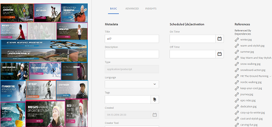

# 管理复合和多页资源 {#managing-compound-assets}

[!DNL Adobe Experience Manager Assets]可以确定上传的文件是否包含对存储库中已存在的资源的引用。 此功能仅适用于支持的文件格式。 如果上传的资产包含对[!DNL Experience Manager]资产的任何引用，则在上传的资产和引用的资产之间会创建一个双向链接。

除了消除冗余之外，引用[!DNL Adobe Creative Cloud]应用程序中的资产还可以增强协作，并提高用户的效率和生产率。

[!DNL Experience Manager Assets]支持双向引用。 在上传文件的资产详细信息页面中，您可以找到引用的资产。 此外，您还可以在引用资源的资源详细信息页面中查看引用文件。

引用根据被引用资产的路径、文档ID和实例ID来解析。

## [!DNL Adobe Illustrator]：添加数字资产作为引用 {#refai}

您可以从[!DNL Adobe Illustrator]文件中引用现有的数字资源。

1. 使用[[!DNL Experience Manager] 桌面应用程序](https://experienceleague.adobe.com/docs/experience-manager-desktop-app/using/using.html)，在本地文件系统上获取数字资产。 导航到要引用的资源的文件系统位置。
1. 将资源从本地文件夹拖到[!DNL Illustrator]文件中。

1. 将[!DNL Illustrator]文件保存到已装入的驱动器，或将[上传](/help/assets/manage-assets.md#uploading-assets)到[!DNL Experience Manager]存储库。

1. 工作流完成后，转到资产的资产详细信息页面。 对现有数字资产的引用列在&#x200B;**[!UICONTROL 引用]**&#x200B;列的&#x200B;**[!UICONTROL 依赖项]**&#x200B;下。

   

1. 出现在&#x200B;**[!UICONTROL 依赖项]**&#x200B;下的引用的资源也可以由当前文件以外的文件引用。 要查看资源的引用文件列表，请单击&#x200B;**[!UICONTROL 依赖项]**&#x200B;下的资源。

   

1. 单击工具栏中的&#x200B;**[!UICONTROL 查看属性]**。 在[!UICONTROL 属性]页面中，引用当前资源的文件列表显示在&#x200B;**[!UICONTROL 基本]**&#x200B;选项卡的&#x200B;**[!UICONTROL 引用]**&#x200B;列下。

   

   *图：资源详细信息中的资源引用。*

## [!DNL Adobe InDesign]：添加数字资产作为引用 {#add-aem-assets-as-references-in-adobe-indesign}

要从[!DNL InDesign]文件中引用数字资源，请将资源拖动到[!DNL InDesign]文件或将[!DNL InDesign]文件导出为ZIP存档。

引用的资产已存在于[!DNL Experience Manager Assets]中。 您可以通过[配置InDesign Server](indesign.md)来提取子资源。 [!DNL InDesign]文件中的嵌入资源将提取为子资源。

>[!NOTE]
>
>如果[!DNL InDesign Server]已代理，则[!DNL InDesign]文件在其XMP元数据中嵌入其预览。 在这种情况下，不会明确要求提取缩略图。 但是，如果未代理[!DNL InDesign Server]，则必须为[!DNL InDesign]文件显式提取缩略图。

上传INDD文件时，通过查询存储库中具有`xmpMM:InstanceID`和`xmpMM:DocumentID`属性的资产来获取引用。

### 通过拖动资产创建引用 {#create-references-by-dragging-aem-assets}

此过程类似于[在Adobe Illustrator](#refai)中添加数字资源作为引用。

### 通过导出ZIP文件创建对资产的引用 {#create-references-to-aem-assets-by-exporting-a-zip-file}

1. 执行[创建工作流模型](/help/sites-developing/workflows-models.md)中的步骤以创建工作流。
1. 使用[!DNL Adobe InDesign]的[程序包功能](https://helpx.adobe.com/indesign/how-to/indesign-package-files-for-handoff.html)导出文档。 [!DNL Adobe InDesign]可以将文档和链接的资源导出为包。 在这种情况下，导出的文件夹包含一个`Links`文件夹，该文件夹包含[!DNL InDesign]文件中的子资源。 `Links`文件夹与INDD文件位于同一文件夹中。
1. 创建ZIP文件并将其上载到[!DNL Experience Manager]存储库。
1. 启动`Unarchiver`工作流。
1. 工作流完成后，链接文件夹中的引用将自动引用为子资产。 要查看引用的资源列表，请导航到[!DNL InDesign]资源的资源详细信息页面并关闭[边栏](/help/sites-authoring/basic-handling.md#rail-selector)。

## [!DNL Adobe Photoshop]：添加数字资产作为引用 {#refps}

1. 使用[!DNL Experience Manager]桌面应用访问[!DNL Experience Manager Assets]。 下载并显示本地文件系统上的资源。 在[!DNL Adobe Photoshop]中使用[!UICONTROL 放置链接的]功能。 请参阅[将资源放入桌面应用程序](https://experienceleague.adobe.com/docs/experience-manager-desktop-app/using/using.html#place-assets-in-native-documents)。

1. 将[!DNL Photoshop]文件保存到已挂载的驱动器或[上传](/help/assets/manage-assets.md#uploading-assets)到[!DNL Experience Manager]存储库。
1. 工作流完成后，对现有[!DNL Experience Manager]资产的引用将列在资产详细信息页面中。

   要查看引用的资源，请关闭资源详细信息页面中的[边栏](/help/sites-authoring/basic-handling.md#rail-selector)。

1. 引用的资产还包含从中引用它们的资产的列表。 要查看引用的资源列表，请导航到资源详细信息页面并关闭[边栏](/help/sites-authoring/basic-handling.md#rail-selector)。

>[!NOTE]
>
>复合资产中的资产也可以根据其文档ID和实例ID进行引用。 此功能仅在[!DNL Adobe Illustrator]和[!DNL Adobe Photoshop]版本中可用。 对于其他人，会根据主复合资产中链接资产的相对路径进行引用，如在[!DNL Experience Manager]的早期版本中所做。

## 创建子资产 {#generate-subassets}

对于支持的多页格式(PDF文件、AI文件、[!DNL Microsoft PowerPoint]和[!DNL Apple Keynote]文件以及[!DNL Adobe InDesign]文件)的资源，[!DNL Experience Manager]可以生成与原始资源的每个单独页面对应的子资源。 这些子资产已链接到&#x200B;*父*&#x200B;资产，有助于进行多页面查看。 对于所有其他目的，子资产将被视为[!DNL Experience Manager]中的正常资产。

默认情况下，子资源生成处于禁用状态。 要启用子资产生成，请执行以下步骤：

1. 以管理员身份登录[!DNL Experience Manager]。 访问&#x200B;**[!UICONTROL 工具]** > **[!UICONTROL 工作流]** > **[!UICONTROL 模型]**。
1. 选择&#x200B;**[!UICONTROL DAM更新资产]**&#x200B;工作流，然后单击&#x200B;**[!UICONTROL 编辑]**。
1. 单击&#x200B;**[!UICONTROL 切换侧面板]**&#x200B;并找到&#x200B;**[!UICONTROL 创建子资产]**&#x200B;步骤。 将步骤添加到工作流。 单击&#x200B;**[!UICONTROL 同步]**。

要生成子资产，请执行下列操作之一：

* 新资源： [!UICONTROL DAM更新Assets]工作流对上传到[!DNL Experience Manager]的任何新资源执行。 为新的多页面资源自动生成子资源。
* 现有多页面资源：执行以下任一步骤后，手动执行[!UICONTROL DAM更新Assets]工作流：

   * 选择资产并单击[!UICONTROL 时间轴]以打开左侧面板。 或者，使用键盘快捷键`alt + 3`。 单击[!UICONTROL 启动工作流]，选择[!UICONTROL DAM更新资产]，单击[!UICONTROL 启动]，然后单击[!UICONTROL 继续]。
   * 选择一个资产，然后单击工具栏中的[!UICONTROL 创建] > [!UICONTROL 工作流]。 从弹出对话框中，选择[!UICONTROL DAM更新资产]工作流，单击[!UICONTROL 开始]，然后单击[!UICONTROL 继续]。

对于Microsoft Word文档，请执行&#x200B;**[!UICONTROL DAM解析Word文档]**&#x200B;工作流。 它从Microsoft Word文档的内容生成一个`cq:Page`组件。 从文档提取的图像是从`cq:Page`组件引用的。 即使禁用子资产生成，也会提取这些图像。

>[!NOTE]
>
>在[!UICONTROL 进程参数]的[!UICONTROL 创建子资产进程 — 步骤属性]中，您可以指定[!DNL Experience Manager]生成的子资产数。 默认值为 5。要生成所有子资产，请将该字段留空。 如果字段为负，则不会生成任何子资产。

## 查看子资产 {#viewing-subassets}

仅当生成了子资产并且可用于所选的多页资产时，才会显示子资产。 要查看生成的子资源，请打开多页资源。 在页面的左上角区域，单击，然后单击列表中的&#x200B;**[!UICONTROL 子资产]**。 从列表中选择&#x200B;**[!UICONTROL 子资产]**&#x200B;时。 或者，使用键盘快捷键`alt + 5`。

## 查看多页文件的页面 {#view-pages-of-a-multi-page-file}

您可以使用[!DNL Experience Manager Assets]的页面查看器功能查看多页文件，如PDF、INDD、PPT、PPTX和AI文件。 打开多页资源，然后单击页面左上角的&#x200B;**[!UICONTROL 查看页面]**。 打开的页面查看器会显示资产的页面，以及用于在每个页面中浏览和缩放的控件。

对于[!DNL InDesign]，您可以使用[!DNL InDesign Server]提取页面。 如果在创建[!DNL InDesign]文件期间保存了页面的预览，则页面提取不需要[!DNL InDesign Server]。

以下选项在工具栏、左边栏和页面查看器控件中可用：

* **[!UICONTROL 桌面操作]**，用于使用[!DNL Experience Manager]桌面应用程序打开或显示特定子资产。 如果您使用的是[!DNL Experience Manager]桌面应用程序，请查看如何[配置桌面操作](https://experienceleague.adobe.com/docs/experience-manager-desktop-app/using/using.html#desktopactions-v2)。

* **[!UICONTROL 属性]**&#x200B;选项打开特定子资源的[!UICONTROL 属性]页面。

* **[!UICONTROL 注释]**&#x200B;选项允许您为特定子资源添加注释。 在打开父资产进行查看时，将会收集并显示您在单独子资产上使用的注释。

* **[!UICONTROL 页面概述]**&#x200B;选项同时显示所有子资源。

* 单击![选项打开左边栏后，左边栏中的&#x200B;**[!UICONTROL 时间轴]**&#x200B;选项将显示文件的活动流。](assets/do-not-localize/aem_leftrail_contentonly.png)

## 最佳实践和限制 {#best-practice-limitation-tips}

* 在任何[!DNL Experience Manager]部署中，子资产生成可能会占用大量资源。 如果您在上传复杂资产时生成子资产，请在DAM更新资产工作流中添加该步骤。 如果要按需生成子资产，请创建单独的工作流以生成子资产。 专用工作流允许您跳过DAM更新资产工作流中的其他步骤并保存计算资源。

>[!MORELIKETHIS]
>
>* [使用Adobe Experience Manager桌面应用程序](https://experienceleague.adobe.com/docs/experience-manager-desktop-app/using/using.html)
>* [在Adobe Experience Manager中配置桌面操作](https://experienceleague.adobe.com/docs/experience-manager-desktop-app/using/using.html#desktopactions-v2)
>* [在Adobe Photoshop中创建链接智能对象](https://helpx.adobe.com/photoshop/using/create-smart-objects.html#create-linked-smart-objects)
>* [将图形置于Adobe InDesign](https://helpx.adobe.com/indesign/using/placing-graphics.html)
