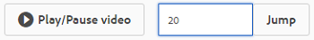

# 管理视频资源 {#manage-video-assets}

| 版本 | 文章链接 |
| -------- | ---------------------------- |
| AEM as a Cloud Service | [单击此处](https://experienceleague.adobe.com/docs/experience-manager-cloud-service/content/assets/manage/manage-video-assets.html?lang=en) |
| AEM 6.5 | 本文 |

视频格式是组织数字资产的重要组成部分。 [!DNL Adobe Experience Manager]提供了成熟的产品和功能，可在创建视频资产后管理其整个生命周期。

了解如何在[!DNL Adobe Experience Manager Assets]中管理和编辑视频资产。 可以使用[!DNL Dynamic Media]集成进行视频编码和转码，例如FFmpeg转码。

## 上传和预览视频资产 {#upload-and-preview-video-assets}

[!DNL Adobe Experience Manager Assets]为扩展名为MP4的视频资源生成预览。 如果资产的格式不是MP4，请安装FFmpeg包以生成预览。 FFmpeg创建OGG和MP4类型的视频演绎版。 您可以在[!DNL Assets]用户界面中预览节目。

1. 在数字资产文件夹或子文件夹中，导航到要添加数字资产的位置。
1. 要上传资源，请在工具栏中单击&#x200B;**[!UICONTROL 创建]**，然后选择&#x200B;**[!UICONTROL 文件]**。 或者，在用户界面上拖动文件。 有关详细信息，请参阅[上传资源](manage-assets.md#uploading-assets)。
1. 要在卡片视图中预览视频，请单击视频资源上的&#x200B;**[!UICONTROL 播放]** 选项。 您只能在卡片视图中暂停或播放视频。 [!UICONTROL 播放]和[!UICONTROL 暂停]选项在列表视图中不可用。

1. 要在资源详细信息页面中预览视频，请单击卡片上的&#x200B;**[!UICONTROL 编辑]**。 视频在浏览器的本机视频播放器中播放。 您可以播放、暂停、控制音量以及将视频缩放到全屏。

   

## 用于上传大于2 GB的资产的配置 {#configuration-to-upload-assets-that-are-larger-than-gb}

默认情况下，[!DNL Assets]不允许您上传任何因文件大小限制而大于2 GB的资产。 但是，您可以通过进入CRXDE Lite并在`/apps`目录下创建节点来覆盖此限制。 节点必须具有相同的节点名称、目录结构和顺序的可比较节点属性。

除了[!DNL Assets]配置外，请更改以下配置以上传大型资产：

* 增加令牌过期时间。 在`https://[aem_server]:[port]/system/console/configMgr`处的Web控制台中查看[!UICONTROL AdobeGranite CSRF Servlet]。 有关详细信息，请参阅[CSRF保护](/help/sites-developing/csrf-protection.md)。
* 增加Dispatcher配置中的`receiveTimeout`。 有关详细信息，请参阅[Experience ManagerDispatcher配置](https://experienceleague.adobe.com/docs/experience-manager-dispatcher/using/configuring/dispatcher-configuration.html#renders-options)。

>[!NOTE]
>
>[!DNL Experience Manager] Classic用户界面没有2 GB的文件大小限制。 此外，不完全支持大型视频的端到端工作流。

要配置更高的文件大小限制，请在`/apps`目录中执行以下步骤。

1. 在[!DNL Experience Manager]中，单击&#x200B;**[!UICONTROL 工具]** > **[!UICONTROL 常规]** > **[!UICONTROL CRXDE Lite]**。
1. 在CRXDE Lite中，导航到`/libs/dam/gui/content/assets/jcr:content/actions/secondary/create/items/fileupload`。 要查看目录窗口，请单击`>>`。
1. 在工具栏中，单击&#x200B;**[!UICONTROL 覆盖节点]**。 或者，从上下文菜单中选择&#x200B;**[!UICONTROL 覆盖节点]**。
1. 在&#x200B;**[!UICONTROL 覆盖节点]**&#x200B;对话框中，单击&#x200B;**[!UICONTROL 确定]**。

   

1. 刷新浏览器。 已选择覆盖节点`/apps/dam/gui/content/assets/jcr:content/actions/secondary/create/items/fileupload`。
1. 在&#x200B;**[!UICONTROL 属性]**&#x200B;选项卡中，输入适当的值（以字节为单位）以将大小限制增加到所需的大小。 例如，要将大小限制增加到30 GB，请输入`32212254720`值。

1. 在工具栏中，单击&#x200B;**[!UICONTROL 全部保存]**。
1. 在[!DNL Experience Manager]中，单击&#x200B;**[!UICONTROL 工具]** > **[!UICONTROL 操作]** > **[!UICONTROL Web控制台]**。
1. 在[!DNL Adobe Experience Manager] [!UICONTROL Web控制台包]页的“名称”表列下，找到并单击&#x200B;**[!UICONTROL AdobeGranite工作流外部进程作业处理程序]**。
1. 在[!UICONTROL AdobeGranite工作流外部进程作业处理程序]页面上，将&#x200B;**[!UICONTROL 默认超时]**&#x200B;和&#x200B;**[!UICONTROL 最大超时]**&#x200B;字段的秒数设置为`18000`（5小时）。 单击&#x200B;**[!UICONTROL 保存]**。
1. 在[!DNL Experience Manager]中，单击&#x200B;**[!UICONTROL 工具]** > **[!UICONTROL 工作流]** > **[!UICONTROL 模型]**。
1. 在“工作流模型”页面上，选择&#x200B;**[!UICONTROL Dynamic Media编码视频]**，然后单击&#x200B;**[!UICONTROL 编辑]**。
1. 在工作流页面上，双击&#x200B;**[!UICONTROL Dynamic Media视频服务进程]**&#x200B;组件。
1. 在[!UICONTROL 步骤属性]对话框的&#x200B;**[!UICONTROL 常用]**&#x200B;选项卡下，展开&#x200B;**高级设置**。
1. 在&#x200B;**[!UICONTROL 超时]**&#x200B;字段中，指定值`18000`，然后单击&#x200B;**[!UICONTROL 确定]**&#x200B;以返回&#x200B;**[!UICONTROL Dynamic Media编码视频]**&#x200B;工作流页面。
1. 在页面顶部附近，在[!UICONTROL Dynamic Media编码视频]页面标题下方，单击&#x200B;**[!UICONTROL 保存]**。

## Publish视频资源 {#publish-video-assets}

发布后，您可以将视频资产作为URL包含在网页中，或直接嵌入这些资产。 有关详细信息，请参阅[发布Dynamic Media资源](/help/assets/publishing-dynamicmedia-assets.md)。

## Publish到YouTube的视频 {#publishing-videos-to-youtube}

您可以将内部部署Experience Manager视频资产直接发布到之前创建的YouTube渠道。

要将视频资源发布到YouTube，您需要使用标记设置Experience Manager Assets。 将这些标记与YouTube渠道关联。 如果视频资产的标记与YouTube渠道的标记匹配，则视频将发布到YouTube。 只要使用关联的标记，Publish到YouTube的操作就会与视频的正常发布同时进行。

YouTube自行编码。 因此，上传到Experience Manager的原始视频文件会发布到YouTube，而不是Dynamic Media的编码创建的任何视频演绎版。 虽然无需使用Dynamic Media处理视频，但预计可在播放时需要查看器预设时这样做。

当您绕过视频处理配置文件并直接发布到YouTube时，这仅仅意味着您在Experience Manager资源中的视频资源没有获取可查看的缩略图。 它还意味着，如果您在`dynamicmedia`或`dynamicmedia_scene7`运行模式下运行，则未编码的视频不适用于任何Dynamic Media资源类型。

将视频资产发布到YouTube服务器需要完成以下任务，以确保使用YouTube进行安全可靠的服务器到服务器身份验证：

1. [配置Google云设置](#configuring-google-cloud-settings)
1. [创建YouTube渠道](#creating-a-youtube-channel)
1. [添加标记以进行发布](#adding-tags-for-publishing)
1. [启用YouTube Publish复制代理](#enabling-the-youtube-publish-replication-agent)
1. [在Experience Manager中设置YouTube](#setting-up-youtube-in-aem)
1. [（可选）自动为您上传的视频设置默认YouTube属性](#optional-automating-the-setting-of-default-youtube-properties-for-your-uploaded-videos)
1. [Publish视频到您的YouTube渠道](#publishing-videos-to-your-youtube-channel)
1. [（可选）验证YouTube上发布的视频](/help/assets/video.md#optional-verifying-the-published-video-on-youtube)
1. [将YouTube URL关联到您的Web应用程序](#linking-youtube-urls-to-your-web-application)

您还可以[取消发布视频以将其从YouTube](#unpublishing-videos-to-remove-them-from-youtube)中删除。

### 配置Google云设置 {#configuring-google-cloud-settings}

要发布到YouTube，您需要Google帐户。 如果您拥有GMAIL帐户，则表明您已经拥有Google帐户；如果您没有Google帐户，则可以轻松创建一个帐户。 您需要帐户，因为您需要凭据才能将视频资产发布到YouTube。 如果您已创建帐户，请跳过此任务并直接继续[创建YouTube渠道](#creating-a-youtube-channel)。

用于Google Cloud的帐户和用于YouTube的Google帐户不需要相同。

Google会定期更改其用户界面。 因此，将视频发布到YouTube的步骤可能与以下文档记录的内容略有不同。 当您尝试检查视频是否已上传到YouTube时，此警告也适用。

>[!NOTE]
>
>在撰写本文时，以下步骤是准确的。 但是，Google会定期更新其网站，恕不另行通知。 因此，这些步骤可能会略有不同。

要配置Google云设置，请执行以下操作：

1. 创建一个Google帐户。

   如果您已经拥有Google帐户，请跳至下一步。

1. 转到[https://cloud.google.com/](https://cloud.google.com/)。
1. 在Google cloud页面的右上角附近，单击控制 **[!UICONTROL 台]**。

   如有必要，请使用您的Google帐户凭据&#x200B;**[!UICONTROL 登录]**&#x200B;以查看&#x200B;**[!UICONTROL 控制台]**&#x200B;选项。

1. 在“功能板”页面的&#x200B;**[!UICONTROL Google Cloud Platform]**&#x200B;右侧，单击“项目”下拉列表以打开“选择项目”对话框。
1. 在选择项目对话框中，选择&#x200B;**[!UICONTROL 新建项目]**。

   

1. 在“新建项目”对话框的“项目名称”字段中，键入新项目的名称。

   您的项目ID基于您的项目名称。 因此，请仔细选择项目名称；在创建项目后无法对其进行更改。 此外，当您稍后在Experience Manager中设置YouTube时，必须再次输入相同的项目ID；请考虑将其写下。

1. 单击&#x200B;**[!UICONTROL 创建]**。

1. 执行以下任一操作：

   * 在项目的仪表板的“快速入门”卡中，选择&#x200B;**[!UICONTROL 浏览并启用API]**。
   * 在项目的仪表板上，在API信息卡中，选择&#x200B;**[!UICONTROL 转到API概述]**。

   

1. 在“API和服务”页面顶部附近，选择&#x200B;**[!UICONTROL 启用API和服务]**。
1. 在“API库”页面的左侧的&#x200B;**[!UICONTROL 类别]**&#x200B;下，选择&#x200B;**[!UICONTROL YouTube]**。 在页面的右侧，选择&#x200B;**[!UICONTROL YouTube数据API]**。
1. 在YouTube Data API v3页面上，选择&#x200B;**[!UICONTROL 启用]**。

   

1. 要使用API，您需要凭据。 如有必要，请单击&#x200B;**[!UICONTROL 创建凭据]**。

   

1. 在&#x200B;**[!UICONTROL 将凭据添加到项目]**&#x200B;页面的步骤1中，执行以下操作：

   * 从&#x200B;**[!UICONTROL 您使用的是哪个API？]**&#x200B;下拉列表，选择&#x200B;**[!UICONTROL YouTube Data API v3]**。

   * 从&#x200B;**[!UICONTROL 您从何处调用API？]**&#x200B;下拉列表，选择&#x200B;**[!UICONTROL Web服务器（例如，node.js、Tomcat）]**

   * 从&#x200B;**[!UICONTROL 您访问哪些数据？]**&#x200B;下拉列表，选择&#x200B;**[!UICONTROL 用户数据]**。

   

1. 选择&#x200B;**[!UICONTROL 我需要什么凭据？]**
1. 在&#x200B;**[!UICONTROL 将凭据添加到项目]**&#x200B;页面中步骤 2 的&#x200B;**[!UICONTROL 创建 OAuth 2.0 客户端 ID]** 标题下，根据需要在“名称”字段中输入唯一名称。或者，您也可以使用 Google 指定的默认名称。
1. 在&#x200B;**[!UICONTROL 授权的JavaScript源]**&#x200B;标题下，在文本字段中输入以下路径，用您自己的域和端口号替代该路径，然后按&#x200B;**[!UICONTROL Enter]**&#x200B;将路径添加到列表中：

   `https://<servername.domain>:<port_number>`

   例如，`https://1a2b3c.mycompany.com:4321`

   **注意**：上述路径示例仅用于演示目的。

   

1. 在&#x200B;**[!UICONTROL 授权重定向URI]**&#x200B;标题下，在文本字段中输入以下路径，在路径中替换您自己的域和端口号，然后按&#x200B;**[!UICONTROL Enter]**&#x200B;将路径添加到列表中：

   `https://<servername.domain>:<port_number>/etc/cloudservices/youtube.youtubecredentialcallback.json`

   例如，`https://1a2b3c.mycompany.com:4321/etc/cloudservices/youtube.youtubecredentialcallback.json`

   **注意**：上述路径示例仅用于演示目的。

1. 单击&#x200B;**[!UICONTROL 创建OAuth客户端ID]**。
1. 在&#x200B;**[!UICONTROL 向项目添加凭据]**&#x200B;页面的步骤 3 中，在&#x200B;**[!UICONTROL 设置 OAuth 2.0 许可屏幕]**&#x200B;标题下，选择您当前使用的 Gmail 电子邮件地址。

   

1. 在&#x200B;**[!UICONTROL 向用户显示的产品名称]**&#x200B;标题下，在文本字段中输入要在同意屏幕上显示的内容。

   Experience Manager管理员在对YouTube进行身份验证时，将显示同意屏幕；Experience Manager联系YouTube以获取权限。

1. 单击&#x200B;**[!UICONTROL 继续]**。
1. 在“将凭据添加到项目”页面的“下载凭据&#x200B;**”标题下，选择**&#x200B;[!UICONTROL &#x200B;下载&#x200B;]&#x200B;**，步骤4。**

   

1. 保存 `client_id.json` 文件。

   稍后在Adobe Experience Manager中设置YouTube时，您需要此下载的json文件。

1. 单击&#x200B;**[!UICONTROL 完成]**。

   注销Google帐户。 现在创建一个YouTube渠道。

### 创建YouTube渠道 {#creating-a-youtube-channel}

将视频发布到YouTube要求您拥有一个或多个渠道。 如果您已创建YouTube渠道，则可以跳过此任务并转到[添加标记以进行发布](/help/assets/video.md#adding-tags-for-publishing)。

>[!WARNING]
>
>请确保在&#x200B;*之前已在YouTube*&#x200B;中设置了一个或多个渠道，然后在Experience Manager的YouTube设置下添加渠道(请参阅下面的[在Experience Manager中设置YouTube](#setting-up-youtube-in-aem))。 如果未能设置一个或多个渠道，则不会警告您不存在渠道。 但是，在添加渠道时，Google身份验证仍会发生，但无法选择发送视频的渠道。

**要创建YouTube频道：**

1. 转到[https://www.youtube.com](https://www.youtube.com/)并使用您的Google帐户凭据登录。
1. 在YouTube页面的右上角，单击您的个人资料图片（也可以显示为实色圆圈中的字母），然后单击&#x200B;**[!UICONTROL YouTube设置]**（圆形齿轮图标）。
1. 在“概述”页面的“其他功能”标题下，单击&#x200B;**[!UICONTROL 查看我的所有渠道或创建渠道]**。
1. 在“渠道”页面上，单击&#x200B;**[!UICONTROL 新建渠道]**。
1. 在“品牌帐户”页面的“品牌帐户名称”字段中，输入要发布视频资产的位置的业务名称或任何其他渠道名称，然后单击&#x200B;**[!UICONTROL 创建]**。

   请记住您在此处输入的名称，因为在Experience Manager中设置YouTube时必须再次输入该名称。

1. （可选）如有必要，请添加更多渠道。

   现在添加标记以进行发布。

### 添加标记以进行发布 {#adding-tags-for-publishing}

要将视频发布到YouTube，Experience Manager会将标记与一个或多个YouTube渠道关联。 要添加标记以进行发布，请参阅[管理标记](/help/sites-administering/tags.md)。

或者，如果您打算在Experience Manager中使用默认标记，则可以跳过此任务并转到[启用YouTube Publish复制代理](#enabling-the-youtube-publish-replication-agent)。

### 启用YouTube Publish复制代理 {#enabling-the-youtube-publish-replication-agent}

启用YouTube Publish复制代理后，如果要测试与Google Cloud帐户的连接，请选择&#x200B;**[!UICONTROL 测试连接]**。 浏览器选项卡显示连接结果。 如果添加了YouTube渠道，则测试中将显示渠道列表。

1. 在Experience Manager的左上角，单击Experience Manager徽标，然后在左边栏中，单击&#x200B;**[!UICONTROL 工具]** > **[!UICONTROL 部署]** > **[!UICONTROL 复制]** > **[!UICONTROL 作者代理]**。
1. 在“创作代理”页面上，单击&#x200B;**[!UICONTROL YouTube Publish]**。
1. 在工具栏的“设置”右侧，单击&#x200B;**[!UICONTROL 编辑]**。
1. 选中&#x200B;**[!UICONTROL 已启用]**&#x200B;复选框，以便您可以打开复制代理。
1. 单击&#x200B;**[!UICONTROL 确定]**。

   现在在Experience Manager中设置YouTube。

### 在Experience Manager中设置YouTube {#setting-up-youtube-in-aem}

从Experience Manager6.4开始，引入了一种新的触屏用户界面方法，用于在Experience Manager中设置YouTube发布。 根据您所使用的Experience Manager的安装实例，执行以下操作之一：

* 要在6.4之前的Experience Manager中配置YouTube，请参阅[在6.4](/help/assets/video.md#setting-up-youtube-in-aem-before)之前的Experience Manager中设置YouTube 。
* 要在Experience Manager6.4或更高版本中配置YouTube，请参阅[在Experience Manager6.4和更高版本中设置YouTube](#setting-up-youtube-in-aem-and-later)。

#### 在Experience Manager6.4及更高版本中设置YouTube {#setting-up-youtube-in-aem-and-later}

1. 确保以管理员身份登录到Dynamic Media实例。
1. 在左上角选择Experience Manager徽标，然后在左边栏中选择&#x200B;**[!UICONTROL 工具]**（锤子图标）> **[!UICONTROL Cloud Service]** > **[!UICONTROL YouTube Publishing Configuration]**。
1. 选择&#x200B;**[!UICONTROL global]**（不要选择它）。

1. 在全局页面的右上角附近，选择&#x200B;**[!UICONTROL 创建]**。
1. 在“创建 YouTube 配置”页面的“Google Cloud Platform 设置”下的&#x200B;**[!UICONTROL 应用程序名称]**&#x200B;字段中，输入 Google 项目 ID。

   在之前配置Google Cloud设置时指定了项目ID。
保持创建YouTube配置页面处于打开状态；稍后您将返回到此页面。

   

1. 使用纯文本编辑器，打开您之前在[配置Google云设置](/help/assets/video.md#configuring-google-cloud-settings)任务中下载并保存的JSON文件。
1. 选择并复制整个JSON文本。
1. 返回至“YouTube 帐户设置”对话框。在 **[!UICONTROL JSON 配置]**&#x200B;字段中，粘贴 JSON 文本。
1. 在页面的右上角附近，选择&#x200B;**[!UICONTROL 保存]**。

   现在在Experience Manager中设置YouTube渠道。

1. 选择&#x200B;**[!UICONTROL 添加频道]**。
1. 在“渠道名称”字段中，输入您在任务&#x200B;**[!UICONTROL 之前向YouTube添加一个或多个渠道]**&#x200B;中创建的渠道的名称。

   如果需要，您可以选择添加描述。

1. 选择&#x200B;**[!UICONTROL 添加]**。
1. 将显示YouTube/Google身份验证。 如果您尚未登录Google Cloud帐户，请跳过此步骤。

   * 输入与Google项目ID关联的Google用户名和密码，以及上面的JSON文本。
   * 根据您的帐户有多少个渠道，您会看到两个或更多项目。 选择渠道。 不要选择电子邮件地址；它不是渠道。
   * 在下一页上，选择&#x200B;**[!UICONTROL 接受]**&#x200B;以允许对此渠道的访问。

1. 选择&#x200B;**[!UICONTROL 允许]**。

   现在设置标记以进行发布。

1. **[!UICONTROL 设置标记以进行发布]** — 在“Cloud Service”>“YouTube”页面上，选择铅笔图标以编辑要使用的标记列表。
1. 选择下拉列表图标（上下颠倒的插入号），以便在Experience Manager中显示可用标签列表。
1. 选择一个或多个标记以便进行添加。

   要删除已添加的标记，请选择该标记，然后选择&#x200B;**[!UICONTROL X]**。

1. 添加完所需的标记后，选择&#x200B;**[!UICONTROL 保存]**。

   现在，您可以将视频发布到YouTube渠道。

#### 在6.4之前的Experience Manager中设置YouTube {#setting-up-youtube-in-aem-before}

1. 确保以管理员身份登录到Dynamic Media实例。

1. 在左上角选择Experience Manager徽标，然后在左边栏中选择&#x200B;**[!UICONTROL 工具]** （锤子图标）> **[!UICONTROL 部署]** > **[!UICONTROL Cloud Service]**。
1. 在“第三方服务”标题的YouTube下，选择&#x200B;**[!UICONTROL 立即配置]**。
1. 在创建配置对话框中，在相应字段中输入标题（必填）和名称（可选）。
1. 选择&#x200B;**[!UICONTROL 创建]**。
1. 在“YouTube 帐户设置”对话框的&#x200B;**[!UICONTROL 应用程序名称]**&#x200B;字段中，输入 Google 项目 ID。

   您在最初[配置Google Cloud设置](/help/assets/video.md#configuring-google-cloud-settings)时指定了项目ID。
保持YouTube帐户设置对话框处于打开状态；稍后您将返回该对话框。

1. 使用纯文本编辑器，打开您之前在配置Google云设置任务中下载并保存的JSON文件。
1. 选择并复制整个JSON文本。
1. 返回至“YouTube 帐户设置”对话框。在 **[!UICONTROL JSON 配置]**&#x200B;字段中，粘贴 JSON 文本。
1. 选择&#x200B;**[!UICONTROL 确定]**。

   现在在Experience Manager中设置YouTube渠道。

1. 在&#x200B;**[!UICONTROL 可用频道]**&#x200B;的右侧，选择&#x200B;**+** （加号图标）。
1. 在“YouTube频道设置”对话框的“标题”字段中，输入您在之前向YouTube添加一个或多个频道任务中创建的频道 **[!UICONTROL 名称]** 。

   如果需要，您可以选择添加描述。

1. 选择&#x200B;**[!UICONTROL 确定]**。
1. 将显示YouTube/Google身份验证。 如果您尚未登录Google Cloud帐户，请跳过此步骤。

   * 输入与Google项目ID关联的Google用户名和密码，以及上面的JSON文本。
   * 根据您的帐户有多少个渠道，您会看到两个或更多项目。 选择渠道。 不要选择电子邮件地址；它不是渠道。
   * 在下一页上，选择&#x200B;**[!UICONTROL 接受]**&#x200B;以允许对此渠道的访问。

1. 选择&#x200B;**[!UICONTROL 允许]**。

   现在设置标记以进行发布。

1. **[!UICONTROL 设置标记以进行发布]** — 在“Cloud Service”>“YouTube”页面上，选择铅笔图标以编辑要使用的标记列表。
1. 选择下拉列表图标（上下颠倒的插入号），以便在Experience Manager中显示可用标签列表。
1. 选择一个或多个标记以便进行添加。

   要删除已添加的标记，请选择该标记，然后选择&#x200B;**X**。

1. 完成添加所需标记后，选择&#x200B;**[!UICONTROL 确定]**。

   现在，您可以将视频发布到YouTube渠道。

### （可选）自动为您上传的视频设置默认YouTube属性 {#optional-automating-the-setting-of-default-youtube-properties-for-your-uploaded-videos}

您可以选择通过在Experience Manager中创建元数据处理配置文件在上传视频时自动设置YouTube属性。

要创建元数据处理配置文件，您首先需要从&#x200B;**[!UICONTROL 字段标签]**、**[!UICONTROL 映射到属性]**&#x200B;和&#x200B;**[!UICONTROL 选择]**&#x200B;字段中复制值，所有这些字段均位于视频的元数据架构中。然后，您可以通过向处理配置文件添加这些值来构建您的YouTube视频元数据处理配置文件。

要为上传的视频自动设置默认YouTube属性，请执行以下操作：

1. 选择左上角的Experience Manager徽标，然后在左边栏中，单击&#x200B;**[!UICONTROL 工具]** （锤子图标）> **[!UICONTROL Assets]** > **[!UICONTROL 元数据架构]**。
1. 单击&#x200B;**[!UICONTROL 默认]**。 （请勿在“default”左侧的选择框中添加复选标记。）
1. 在&#x200B;**[!UICONTROL 默认]**&#x200B;页面上，选中&#x200B;**[!UICONTROL 视频]**&#x200B;左侧的框，然后选择&#x200B;**[!UICONTROL 编辑]**。
1. 在“元数据架构编辑器”页面上，选择&#x200B;**[!UICONTROL 高级]**&#x200B;选项卡。
1. 在“YouTube 发布”标题下，单击 **[!UICONTROL YouTube 类别]**。
1. 在页面右侧的&#x200B;**[!UICONTROL 设置]**&#x200B;选项卡下，执行以下操作：

   * 在&#x200B;**[!UICONTROL 映射到属性]**&#x200B;文本字段中，选择并复制该值。
将复制的值粘贴到打开的文本编辑器中。 稍后在创建元数据处理配置文件时，您将需要此值。 保持文本编辑器处于打开状态。

   * 在&#x200B;**[!UICONTROL 选择]**&#x200B;下，选择并复制您要使用的默认值（如“人员”和“博客”或“科学和技术”）。
将复制的值粘贴到打开的文本编辑器中。 稍后在创建元数据处理配置文件时，您将需要此值。 保持文本编辑器处于打开状态。

1. 在YouTube发布标题下，选择&#x200B;**[!UICONTROL YouTube隐私]**。
1. 在页面右侧的&#x200B;**[!UICONTROL 设置]**&#x200B;选项卡下，执行以下操作：

   * 在&#x200B;**[!UICONTROL 映射到属性]**&#x200B;文本字段中，选择并复制该值。
将复制的值粘贴到打开的文本编辑器中。 稍后在创建元数据处理配置文件时，您将需要此值。 保持文本编辑器处于打开状态。

   * 在&#x200B;**[!UICONTROL 选择]**&#x200B;下，选择并复制您要使用的默认值。 请注意，“选择”成对分组为两个组。 该对中的底部字段是您要复制的默认值，例如public、unlisted或private。
将复制的值粘贴到打开的文本编辑器中。 稍后在创建元数据处理配置文件时，您将需要此值。 保持文本编辑器处于打开状态。

1. 在元数据架构编辑器页面的右上角附近，单击&#x200B;**[!UICONTROL 取消]**。
1. 选择Experience Manager左上角的Experience Manager徽标，然后在左边栏中，单击&#x200B;**[!UICONTROL 工具]** （锤子图标）> **[!UICONTROL Assets]** > **[!UICONTROL 元数据配置文件]**。

1. 在“元数据配置文件”页面的右上角附近，单击&#x200B;**[!UICONTROL 创建]**。
1. 在“添加元数据配置文件”对话框的&#x200B;**[!UICONTROL 配置文件]**&#x200B;文本字段中，输入名称 `YouTube Video`，然后单击&#x200B;**[!UICONTROL 创建]**。
1. 在“元数据配置文件编辑器”页面上，单击&#x200B;**[!UICONTROL 高级]**&#x200B;选项卡。
1. 通过执行以下操作，将复制的YouTube发布值添加到配置文件中：

   * 在页面的右侧，单击&#x200B;**[!UICONTROL 生成表单]**&#x200B;选项卡。
   * （可选）将标有&#x200B;**[!UICONTROL 节标题]**&#x200B;的组件拖动到左侧，并将其放到表单区域中。
   * （可选）单击&#x200B;**[!UICONTROL 字段标签]**&#x200B;以选择组件。
   * （可选）在页面右侧的设置选项卡下，在字段标签文本字段中输入`YouTube Publishing`。
   * 单击&#x200B;**[!UICONTROL 生成表单]**&#x200B;选项卡，然后将标有&#x200B;**[!UICONTROL 多值文本]**&#x200B;的组件拖放到您创建的&#x200B;**[!UICONTROL YouTube发布]**&#x200B;标题下。

   * 单击&#x200B;**[!UICONTROL 字段标签]**&#x200B;以选择组件。
   * 在页面的右侧，在“设置”选项卡下方，将您之前复制的YouTube发布值（字段标签值和映射到属性值）粘贴到表单上各自的字段中。 将“选项”值粘贴到“默认值”字段中。

1. 通过执行以下操作，将复制的YouTube隐私值添加到配置文件中：

   * 在页面的右侧，单击&#x200B;**[!UICONTROL 生成表单]**&#x200B;选项卡。
   * （可选）将标有&#x200B;**[!UICONTROL 节标题]**&#x200B;的组件拖动到左侧，并将其放到表单区域中。
   * （可选）单击&#x200B;**[!UICONTROL 字段标签]**&#x200B;以选择组件。
   * （可选）在页面右侧的设置选项卡下，在字段标签文本字段中输入`YouTube Privacy`。
   * 单击&#x200B;**[!UICONTROL 构建表单]**&#x200B;选项卡，然后将标有&#x200B;**[!UICONTROL 多值文本]**&#x200B;的组件拖放到您创建的&#x200B;**[!UICONTROL YouTube隐私]**&#x200B;标题下。

   * 单击&#x200B;**[!UICONTROL 字段标签]**&#x200B;以选择组件。
   * 在页面的右侧，在“设置”选项卡下方，将您之前复制的YouTube发布值（字段标签值和映射到属性值）粘贴到表单上各自的字段中。 将“选项”值粘贴到“默认值”字段中。

1. 在页面的右上角附近，单击&#x200B;**[!UICONTROL 保存]**。
1. 将YouTube发布元数据配置文件应用到要上传视频的文件夹。 您必须同时设置元数据配置文件和视频配置文件。

   请参阅 [元数据配置文件](/help/assets/metadata-config.md#metadata-profiles) 和视 [频配置文件](/help/assets/video-profiles.md)。

### Publish视频到您的YouTube渠道 {#publishing-videos-to-your-youtube-channel}

现在，您将之前添加的标记关联到视频资产。 此过程可告知Experience Manager要发布到YouTube渠道的资产。

>[!NOTE]
>
>在Dynamic Media - Scene7模式下运行时，不会立即发布到YouTube。 设置Dynamic Media - Scene7模式时，有两个发布选项可供选择： **[!UICONTROL 立即]**&#x200B;或&#x200B;**[!UICONTROL 激活时]**。
>
>**[!UICONTROL Publish立即]**&#x200B;表示上传的资源（在与IPS同步之后）会自动发布到交付系统。 虽然这对Dynamic Media是这样，但对YouTube并非如此。 要发布到YouTube，必须通过Experience Manager创作方式发布。

>[!NOTE]
>
>要从YouTube发布内容，Experience Manager使用&#x200B;**[!UICONTROL Publish到YouTube]**&#x200B;工作流，该工作流允许您监视进度并查看任何失败信息。
>
>请参阅[监控视频编码和YouTube发布进度](#monitoring-video-encoding-and-youtube-publishing-progress)。
>
>有关更详细的进度信息，您可以在复制下监视YouTube日志。 但是，请注意，此类监视需要管理员访问权限。

**要将视频发布到YouTube频道：**

1. 在Experience Manager中，导航到要发布到YouTube渠道的视频资源。
1. 选择视频资产（自适应视频集）。
1. 在工具栏上，单击&#x200B;**[!UICONTROL 属性]**。
1. 在“元数据”标题下的“基本”选项卡中，单击“标记”字段右侧的&#x200B;**[!UICONTROL 打开选择对话框]**。
1. 在“选择标记”页面上，导航到要使用的标记，然后选择一个或多个标记。

   请记住，标记必须与YouTube渠道关联。

1. 在页面的右上角，单击&#x200B;**[!UICONTROL 选择]**。
1. 在视频属性页面的右上角，单击&#x200B;**[!UICONTROL 保存并关闭]**。
1. 在工具栏上，单击&#x200B;**[!UICONTROL 快速Publish]**。

   另请参阅[在Experience Manager Sites中使用发布管理](https://experienceleague.adobe.com/docs/experience-manager-learn/sites/page-authoring/publication-management-feature-video-use.html)。

   您可以选择在YouTube渠道中验证已发布的视频。

### （可选）验证YouTube上发布的视频 {#optional-verifying-the-published-video-on-youtube}

您可以选择监控YouTube发布（或取消发布）的进度。

请参阅[监控视频编码和YouTube发布进度](#monitoring-video-encoding-and-youtube-publishing-progress)。

发布时间会因多种因素而有很大差异，这些因素包括主源视频的格式、文件大小和上传流量。 发布过程可能需要几分钟到几小时的时间。 此外，更高分辨率格式的呈现速度要慢得多。 例如，720p和1080p需要比480p更长的时间才能显示。

八小时后，如果您仍然看到一条状态消息，显示&#x200B;**[!UICONTROL 已上传（正在处理，请稍候）]**，请尝试从Adobe网站中删除视频并重新上传。

### 将YouTube URL关联到您的Web应用程序 {#linking-youtube-urls-to-your-web-application}

您可以获取Dynamic Media在发布视频后生成的YouTube URL字符串。 复制YouTube URL时，它会登陆剪贴板，以便您可以根据需要将其粘贴到网站或应用程序中的页面。

>[!NOTE]
>
>在将视频资产发布到YouTube之前，无法复制YouTube URL。

**要将YouTube URL链接到您的Web应用程序，请执行以下操作：**

1. 导航到&#x200B;*已发布的YouTube*&#x200B;视频资源，您要复制其URL，然后选择它。

   请记住，YouTube URL仅可在您首次&#x200B;*发布*&#x200B;视频资源到YouTube *后复制*。

1. 在工具栏上，单击&#x200B;**[!UICONTROL 属性]**。
1. 单击&#x200B;**[!UICONTROL 高级]**&#x200B;选项卡。
1. 在YouTube发布标题下的YouTube URL列表中，选择URL文本，并将其复制到Web浏览器，以预览资产或添加到Web内容页面。

### 取消发布视频，以便从YouTube中删除它们 {#unpublishing-videos-to-remove-them-from-youtube}

在Experience Manager中取消发布视频资源时，该视频将从YouTube中删除。

>[!CAUTION]
>
>如果直接从YouTube中删除视频，则Experience Manager不会察觉，并继续按照将视频发布到YouTube的方式运行。 始终通过Experience Manager从YouTube中取消发布视频资源。

>[!NOTE]
>
>要从YouTube中删除内容，Experience Manager使用&#x200B;**[!UICONTROL 从YouTube中取消发布]**&#x200B;工作流，该工作流允许您监视进度并查看任何失败信息。
>
>请参阅[监控视频编码和YouTube发布进度](#monitoring-video-encoding-and-youtube-publishing-progress)。

**要取消发布视频以将其从YouTube中删除，请执行以下操作：**

1. 导航到要从YouTube渠道取消发布的视频资源。
1. 在资源选择模式下，选择一个或多个已发布的视频资源。
1. 在工具栏上，单击&#x200B;**[!UICONTROL 管理发布]**。 选择三个圆点图标(. ..) 工具栏上，以便&#x200B;**[!UICONTROL 管理发布]**&#x200B;打开。
1. 在“管理发布”页面上，选择&#x200B;**[!UICONTROL 取消发布]**。
1. 在页面的右上角，选择&#x200B;**[!UICONTROL 下一步]**。
1. 在页面的右上角，选择&#x200B;**[!UICONTROL 取消发布]**。

## 监控视频编码和YouTube发布进度 {#monitoring-video-encoding-and-youtube-publishing-progress}

在将新视频上传到应用了视频编码的文件夹或将视频发布到YouTube时，您可以监控视频编码/Youtube发布的进展情况。 实际YouTube发布进度只能通过日志提供。 但是，其失败或成功将在以下过程中描述的其他方式中列出。 此外，当YouTube发布工作流或视频编码完成或中断时，您会收到电子邮件通知。

### 监测进度 {#monitoring-progress}

1. 在assets文件夹中查看视频编码进度：

   * 在卡片视图中，视频编码进度按百分比显示在资源上。 如果出现错误，资产上也会显示此信息。

   

   * 在列表视图中，视频编码进度显示在&#x200B;**[!UICONTROL 处理状态]**&#x200B;列中。 如果出现错误，则该列中将显示此消息。

   

   默认情况下，此列不显示。若要启用该列，请从视图下拉菜单中选择&#x200B;**[!UICONTROL 查看设置]**，然后添加&#x200B;**[!UICONTROL 处理状态]**&#x200B;列，然后单击&#x200B;**[!UICONTROL 更新]**。

   

1. 在资源详细信息中查看进度。 单击资产时，打开下拉菜单并选择&#x200B;**[!UICONTROL 时间轴]**。 要将其缩小到编码或YouTube发布等工作流活动，请选择&#x200B;**[!UICONTROL 工作流]**。

   

   任何工作流信息（如编码）都会显示在时间轴中。 对于YouTube发布，工作流时间轴还包括YouTube渠道的名称和YouTube视频URL。 此外，发布完成后，您会在工作流时间轴中看到任何失败通知。

   >[!NOTE]
   >
   >由于来自[https://localhost:4502/system/console/configMgr](https://localhost:4502/system/console/configMgr)的&#x200B;**[!UICONTROL 重试]**、**[!UICONTROL 重试延迟]**&#x200B;和&#x200B;**[!UICONTROL 超时]**&#x200B;的多个工作流配置，最终记录失败/错误会花费较长时间，例如：
   >
   >* Apache Sling作业队列配置
   >* AdobeGranite工作流外部进程作业处理程序
   >* Granite工作流超时队列
   >
   >您可以调整这些配置中的&#x200B;**[!UICONTROL 重试]**、**[!UICONTROL 重试延迟]**&#x200B;和&#x200B;**[!UICONTROL 超时]**&#x200B;属性。

1. 有关进行中的工作流，请参阅“工具”>“工作流” **[!UICONTROL >“实例”中提供的“工作流实例]** ” **[!UICONTROL (Workflow]** ) **[!UICONTROL >“]**&#x200B;实例”。

   >[!NOTE]
   >
   >您需要管理权限才能访问&#x200B;**[!UICONTROL 工具]**&#x200B;菜单。

   

   选择实例，然后选择&#x200B;**[!UICONTROL 打开历史记录]**。

   

   您还可以从“工作流实例”区域暂停、终止或重命名工作流。 有关详细信息，请参阅[管理工作流](/help/sites-administering/workflows-administering.md)。

1. 有关失败的作业，请参阅&#x200B;**[!UICONTROL 工具]** > **[!UICONTROL 工作流]** > **[!UICONTROL 失败]**&#x200B;中显示的“工作流失败”。**[!UICONTROL 工作流失败]**&#x200B;列出所有失败的工作流活动。

   >[!NOTE]
   >
   >您需要管理权限才能访问&#x200B;**[!UICONTROL 工具]**&#x200B;菜单。

   

   >[!NOTE]
   >
   >由于[https://localhost:4502/system/console/configMgr](https://localhost:4502/system/console/configMgr)中的&#x200B;**[!UICONTROL 重试]**、**[!UICONTROL 重试延迟]**&#x200B;和&#x200B;**[!UICONTROL 超时]**&#x200B;存在多个工作流配置，最终记录错误消息会花费较长时间，例如：
   >
   >* Apache Sling作业队列配置
   >* AdobeGranite工作流外部进程作业处理程序
   >* Granite工作流超时队列
   >
   >您可以调整这些配置中的&#x200B;**[!UICONTROL 重试]**、**[!UICONTROL 重试延迟]**&#x200B;和&#x200B;**[!UICONTROL 超时]**&#x200B;属性。

1. 有关已完成的工作流，请参阅&#x200B;**[!UICONTROL 工具]** > **[!UICONTROL 工作流]** > **[!UICONTROL 存档]**&#x200B;中的可用工作流存档。**[!UICONTROL 工作流存档]**&#x200B;列出了所有已完成的工作流活动。

   >[!NOTE]
   >
   >您需要管理权限才能访问&#x200B;**[!UICONTROL 工具]**&#x200B;菜单。

   

1. 您会收到有关已中止或失败的工作流作业的电子邮件通知。 这些电子邮件通知可由管理员配置。 请参阅[配置电子邮件通知](#configuring-e-mail-notifications)。

#### 配置电子邮件通知 {#configuring-e-mail-notifications}

>[!NOTE]
>
>您需要管理权限才能访问&#x200B;**[!UICONTROL 工具]**&#x200B;菜单。

配置通知的方式取决于您是要接收编码作业还是YouTube发布作业的通知：

* 对于编码作业，您可以在&#x200B;**[!UICONTROL 工具]** > **[!UICONTROL 操作]** > **[!UICONTROL Web控制台]**&#x200B;上访问所有Experience Manager工作流电子邮件通知的配置页面，并通过搜索&#x200B;**[!UICONTROL Day CQ工作流电子邮件通知服务]**&#x200B;来访问配置页面。 请参阅[在Experience Manager](/help/sites-administering/notification.md)中配置电子邮件通知。 您可以相应地选择或清除&#x200B;**[!UICONTROL 中止时通知]**&#x200B;或&#x200B;**[!UICONTROL 完成时通知]**&#x200B;的复选框。

* 对于YouTube发布作业，请执行以下操作：

1. 在Experience Manager中，选择&#x200B;**[!UICONTROL 工具]** > **[!UICONTROL 工作流]** > **[!UICONTROL 模型]**。
1. 在“工作流模型”页面上，选择&#x200B;**[!UICONTROL Publish到YouTube]**，然后在工具栏上选择&#x200B;**[!UICONTROL 编辑]**。
1. 在“Publish到YouTube”工作流页面的右上角附近，选择&#x200B;**[!UICONTROL 编辑]**。
1. 将鼠标指针悬停在YouTube上传组件上，然后选择一次以显示内联工具栏。

   

1. 在内联工具栏上，选择配置图标（扳手）。 单击&#x200B;**[!UICONTROL 参数]**&#x200B;选项卡。

   

1. 在“YouTube上传流程 — 步骤属性”对话框中，选择&#x200B;**[!UICONTROL 参数]**&#x200B;选项卡。

   

1. 您可以选中或清除以下复选框：

   * 发布开始
   * 发布失败
   * Publish完成 — 包含有关渠道和URL的信息

   清除复选框表示您不会从YouTube Publish工作流收到指定的电子邮件通知。

   >[!NOTE]
   >
   >这些电子邮件特定于YouTube，是常规工作流电子邮件通知的补充。 因此，您可以收到两组电子邮件通知 — **[!UICONTROL Day CQ工作流电子邮件通知服务]**&#x200B;中提供的通用通知，以及特定于YouTube的通知，具体取决于您的配置设置。

1. 完成后，在对话框的右上角附近，选择&#x200B;**[!UICONTROL 完成]**&#x200B;图标（复选标记）。
1. 在“Publish到YouTube”工作流页面的右上角附近，选择&#x200B;**[!UICONTROL 同步]**。

## 为视频资源作批注 {#annotate-video-assets}

1. 从[!DNL Assets]控制台中，选择资产卡上的&#x200B;**[!UICONTROL 编辑]**&#x200B;以显示资产详细信息页面。
1. 要播放视频，请单击&#x200B;**[!UICONTROL 预览]**。
1. 要对视频添加批注，请单击&#x200B;**[!UICONTROL 批注]**。 在视频中的特定时间（帧）添加注释。 在注释时，可以在画布上绘制并在绘图中包括注释。 评论将自动保存。 要退出注释向导，请单击&#x200B;**[!UICONTROL 关闭]**。

   

1. 搜索到视频中的特定点，在&#x200B;**文本**&#x200B;字段中指定时间（以秒为单位），然后单击&#x200B;**跳转**。例如，要跳过视频的前 20 秒，请在文本字段中输入 20。

   

1. 要在时间轴中查看注释，请单击注释。 要从时间轴中删除注释，请单击&#x200B;**[!UICONTROL 删除]**。

   

>[!MORELIKETHIS]
>
>* [在Experience Manager Assets中管理数字资源](/help/assets/manage-assets.md)
>* [在Experience Manager Assets中管理收藏集](/help/assets/manage-collections.md)
>* [Dynamic Media视频文档](/help/assets/video.md)。
