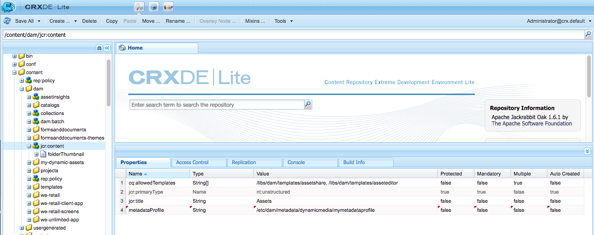

# [!DNL Assets]中元数据功能的配置和管理 {#config-metadata}

| 版本 | 文章链接 |
| -------- | ---------------------------- |
| AEM as a Cloud Service | [单击此处](https://experienceleague.adobe.com/docs/experience-manager-cloud-service/content/assets/manage/metadata-profiles.html?lang=en) |
| AEM 6.5 | 本文 |

<!-- Scope of metadata articles:
* metadata.md: The scope of this article is basic metadata updates, changes, and so on, operations that end-users can do.
* metadata-concepts.md: All conceptual information. Minor instructions are OK but it is an FYI article about support and standards.
* metadata-config.md: New article. Contains all configuration and administration how-to info related to metadata of assets.
-->

[!DNL Adobe Experience Manager Assets]保留每个资源的元数据。 它允许更轻松地分类和组织资产，并帮助查找特定资产的人员。 利用使用资源保留和管理元数据的功能，您可以根据资源的元数据自动组织和处理资源。 [!DNL Adobe Experience Manager Assets]允许管理员配置和自定义元数据功能，以修改默认的Adobe产品。

## 编辑元数据架构 {#metadata-schema}

有关详细信息，请参阅[编辑元数据架构表单](metadata-schemas.md#edit-metadata-schema-forms)。

## 在[!DNL Experience Manager]中注册自定义命名空间 {#registering-a-custom-namespace-within-aem}

您可以在[!DNL Experience Manager]中添加自己的命名空间。 正如预定义的命名空间（如`cq`、`jcr`和`sling`）一样，您也可以具有用于存储库元数据和XML处理的命名空间。

1. 访问节点类型管理页面`https://[aem_server]:[port]/crx/explorer/nodetypes/index.jsp`。
1. 要访问命名空间管理页面，请单击页面顶部的&#x200B;**[!UICONTROL 命名空间]**。
1. 要添加命名空间，请单击页面底部的&#x200B;**[!UICONTROL 新建]**。
1. 以XML命名空间约定指定自定义命名空间。 以URI的形式指定ID，并为ID指定关联的前缀。 单击&#x200B;**[!UICONTROL 保存]**。

## 配置批量元数据更新的限制 {#bulk-metadata-update-limit}

为了防止出现拒绝服务(DOS)情况，[!DNL Enterprise Manager]限制Sling请求中支持的参数数量。 一次性更新多个资源的元数据时，您可能会达到限制，并且元数据不会为更多资源更新。 Enterprise Manager在日志中生成以下警告：

`org.apache.sling.engine.impl.parameters.Util Too many name/value pairs, stopped processing after 10000 entries`

要更改限制，请访问&#x200B;**[!UICONTROL 工具]** > **[!UICONTROL 操作]** > **[!UICONTROL Web控制台]**，更改&#x200B;**[!UICONTROL Apache SlingPOST参数处理]** OSGi配置中的&#x200B;**[!UICONTROL 最大请求参数]**&#x200B;的值。

## 元数据配置文件 {#metadata-profiles}

元数据配置文件允许您将默认元数据应用到文件夹中的资源。 创建元数据配置文件并将其应用到文件夹。 您以后上传到文件夹的任何资源都会继承您在元数据配置文件中配置的默认元数据。

### 添加元数据配置文件 {#adding-a-metadata-profile}

1. 导航到&#x200B;**[!UICONTROL 工具]** > **[!UICONTROL Assets]** > **[!UICONTROL 元数据配置文件]**，然后单击&#x200B;**[!UICONTROL 创建]**。
1. 输入配置文件的标题，例如`Sample Metadata`，然后单击&#x200B;**[!UICONTROL 创建]**。 此时将显示元数据配置文件的[!UICONTROL 编辑表单]。

   

1. 单击组件并在&#x200B;**[!UICONTROL 设置]**&#x200B;选项卡中配置其属性。 例如，单击&#x200B;**[!UICONTROL Description]**&#x200B;组件并编辑其属性。

   

   编辑&#x200B;**[!UICONTROL Description]**&#x200B;组件的以下属性：

   * **[!UICONTROL 字段标签]**：元数据属性的显示名称。 仅供用户参考。

   * **[!UICONTROL 映射到属性]**：此属性的值提供资产节点在存储库中保存的相对路径或名称。 该值应始终以`./`开头，因为它指示路径在资产的节点下。

   

   您为&#x200B;**[!UICONTROL 映射到属性]**&#x200B;指定的值作为属性存储在资产的元数据节点下。 例如，如果您指定`./jcr:content/metadata/dc:desc`作为&#x200B;**[!UICONTROL 映射到属性]**&#x200B;的名称，[!DNL Assets]会在资产的元数据节点存储值`dc:desc`。 Adobe建议您将一个字段仅映射到元数据架构中的给定属性。 否则，系统会选取映射到属性的最新添加字段。

   * **[!UICONTROL 默认值]**：使用此属性为元数据组件添加默认值。 例如，如果您指定“我的描述”，则此值将分配给资产元数据节点上的属性`dc:desc`。

   

   >[!NOTE]
   >
   >向新元数据属性（在`/jcr:content/metadata`节点中不存在）添加默认值在默认情况下不会在资产的[!UICONTROL 属性]页面上显示该属性及其值。 要在资产的[!UICONTROL 属性]页面上查看新属性，请修改相应的架构表单。

1. （可选）在&#x200B;**[!UICONTROL 构建表单]**&#x200B;选项卡中，向[!UICONTROL 编辑表单]添加更多组件，并在&#x200B;**[!UICONTROL 设置]**&#x200B;选项卡中配置其属性。 **[!UICONTROL 生成表单]**&#x200B;选项卡中有以下属性可用：

| 组件 | 属性 |
| ----------------------------- | ----------------------------------------------------------------------- |
| [!UICONTROL 节标题] | 字段标签， 描述 |
| [!UICONTROL 单行文本] | 字段标签， 映射到属性， 默认值 |
| [!UICONTROL 多值文本] | 字段标签， 映射到属性， 默认值 |
| [!UICONTROL 数字] | 字段标签， 映射到属性， 默认值 |
| [!UICONTROL 日期] | 字段标签， 映射到属性， 默认值 |
| [!UICONTROL 标准标记] | 字段标签， 映射到属性， 默认值， 描述 |

1. 单击&#x200B;**[!UICONTROL 完成]**。 元数据配置文件已添加到&#x200B;**[!UICONTROL 元数据配置文件]**&#x200B;页面的配置文件列表中。 

   

### 复制元数据配置文件 {#copying-a-metadata-profile}

1. 从&#x200B;**[!UICONTROL 元数据配置文件]**&#x200B;页面中，选择一个元数据配置文件以制作其副本。

   

1. 单击工具栏中的&#x200B;**[!UICONTROL 复制]**。
1. 在&#x200B;**[!UICONTROL 复制元数据配置文件]**&#x200B;对话框中，输入元数据配置文件新副本的标题。
1. 单击&#x200B;**[!UICONTROL 复制]**。 元数据配置文件的副本将显示在&#x200B;**[!UICONTROL 元数据配置文件]**&#x200B;页面的配置文件列表中。

   

### 删除元数据配置文件 {#deleting-a-metadata-profile}

1. 从&#x200B;**[!UICONTROL 元数据配置文件]**&#x200B;页面中，选择要删除的配置文件。

1. 单击工具栏中的&#x200B;**[!UICONTROL 删除元数据配置文件]**。
1. 在对话框中，单击&#x200B;**[!UICONTROL 删除]**&#x200B;以确认删除操作。 元数据配置文件将从列表中删除。

<!-- TBD: Revisit to find out the correct config. and update these steps. When fixed, also o
These steps have been carried forward from old AEM versions. See https://helpx.adobe.com/experience-manager/6-2/assets/using/metadata-profiles.html#ApplyingaMetadataProfiletoFolders

### Configuration to apply a metadata profile globally {#apply-a-metadata-profile-globally}

In addition to applying a profile to a folder, you can also apply one globally so that any content uploaded into [!DNL Experience Manager] assets in any folder has the selected profile applied.

You can reprocess assets in a folder that already has an existing metadata profile that you later changed. See [Reprocessing assets in a folder after you have edited its processing profile](processing-profiles.md#reprocessing-assets).

To apply a metadata profile globally, follow these steps:

* Navigate to `https://[aem_server]:[port]/mnt/overlay/dam/gui/content/assets/foldersharewizard.html/content/dam` and apply the appropriate profile and click **[!UICONTROL Save]**.

  

* In CRXDE Lite, navigate to the following node: `/content/dam/jcr:content`. Add the property `metadataProfile:/etc/dam/metadata/dynamicmedia/<name of metadata profile>` and click **[!UICONTROL Save All]**.

  
-->

## 文件夹的元数据架构 {#folder-metadata-schema}

[!DNL Adobe Experience Manager Assets]允许您为资源文件夹创建元数据架构，这些文件夹定义文件夹属性页面中显示的布局和元数据。

### 添加文件夹元数据架构表单 {#add-a-folder-metadata-schema-form}

使用文件夹元数据架构Forms编辑器创建和编辑文件夹的元数据架构。

1. 在[!DNL Experience Manager]界面中，转到&#x200B;**[!UICONTROL 工具]** > **[!UICONTROL Assets]** > **[!UICONTROL 文件夹元数据架构]**。
1. 在[!UICONTROL 文件夹元数据架构Forms]页面上，单击&#x200B;**[!UICONTROL 创建]**。
1. 指定表单的名称，然后单击&#x200B;**[!UICONTROL 创建]**。 新的架构表单列在[!UICONTROL 架构Forms]页面中。

### 编辑文件夹元数据架构表单 {#edit-folder-metadata-schema-forms}

您可以编辑新添加或现有元数据架构表单，其中包含以下内容：

* 选项卡
* 选项卡中的表单项目。

您可以将这些表单项目映射/配置到CRX存储库中元数据节点内的字段。 您可以将新选项卡或表单项添加到元数据架构表单。

1. 在“架构Forms”页面中，选择您创建的表单，然后从工具栏中选择&#x200B;**[!UICONTROL 编辑]**&#x200B;选项。
1. 在“文件夹元数据架构编辑器”页中，单击`+`以向表单添加选项卡。 要重命名选项卡，请单击默认名称，并在&#x200B;**[!UICONTROL 设置]**&#x200B;下指定新名称。

   

   要添加更多选项卡，请单击`+`。 若要删除，请单击选项卡上的`X`。

1. 在活动选项卡中，从&#x200B;**[!UICONTROL 构建表单]**&#x200B;选项卡添加一个或多个组件。

   

   如果创建多个选项卡，请单击特定选项卡以添加组件。

1. 要配置组件，请选择该组件并在&#x200B;**[!UICONTROL 设置]**&#x200B;选项卡中修改其属性。

   如有必要，请从&#x200B;**[!UICONTROL 设置]**&#x200B;选项卡中删除组件。

   

1. 要保存更改，请从工具栏中选择&#x200B;**[!UICONTROL 保存]**。

#### 用于构建表单的组件 {#components-to-build-forms}

**[!UICONTROL 构建表单]**&#x200B;选项卡列出了您在文件夹元数据架构表单中使用的表单项。 **[!UICONTROL 设置]**&#x200B;选项卡显示您在&#x200B;**[!UICONTROL 构建表单]**&#x200B;选项卡中选择的每个项目的属性。 以下是&#x200B;**[!UICONTROL 生成表单]**&#x200B;选项卡中可用的表单项列表：

| 组件名称 | 描述 |
|---|---|
| [!UICONTROL 节标题] | 为常用组件列表添加章节标题。 |
| [!UICONTROL 单行文本] | 添加单行文本属性。 它存储为字符串。 |
| [!UICONTROL 多值文本] | 添加多值文本属性。 它存储为字符串数组。 |
| [!UICONTROL 数字] | 添加一个数值组件。 |
| [!UICONTROL 日期] | 添加一个日期组件。 |
| [!UICONTROL 下拉列表] | 添加一个下拉列表。 |
| [!UICONTROL 标准标记] | 添加标记。 |
| [!UICONTROL 隐藏字段] | 添加隐藏字段。 在保存资源时，它将作为POST参数发送。 |

#### 编辑表单项目 {#editing-form-items}

要编辑表单项的属性，请单击该组件，然后在&#x200B;**[!UICONTROL 设置]**&#x200B;选项卡中编辑以下所有属性或属性子集。

**[!UICONTROL 字段标签]**：在文件夹的属性页面上显示的元数据属性的名称。

**[!UICONTROL 映射到属性]**：此属性指定保存它的CRX存储库中文件夹节点的相对路径。 它以“**”开头。/**”，这表示路径在文件夹的节点下。

以下是此属性的有效值：

* `./jcr:content/metadata/dc:title`：将该值作为属性`dc:title`存储在文件夹的元数据节点中。

* `./jcr:created`：在文件夹的节点上显示JCR属性。 如果您在CRXDE中配置这些属性，Adobe建议您将它们标记为“禁用编辑”，因为它们是受保护属性。 否则，在保存资产的属性时出现错误“`Asset(s) failed to modify`”。

要确保组件在元数据架构表单中正确显示，请不要在属性路径中包含空格。

**[!UICONTROL JSON路径]**：使用它指定JSON文件的路径，在该路径中为选项指定键值对。

**[!UICONTROL 占位符]**：使用此属性指定与元数据属性相关的占位符文本。

**[!UICONTROL 选项]**：使用此属性指定列表中的选项。

**[!UICONTROL 描述]**：使用此属性为元数据组件添加简短描述。

**[!UICONTROL 类]**：与属性关联的对象类。

### 删除文件夹元数据架构表单 {#delete-folder-metadata-schema-forms}

您可以从“文件夹元数据架构Forms”页面中删除文件夹元数据架构表单。 要删除表单，请选择该表单，然后单击工具栏中的删除选项。

### 分配文件夹元数据架构 {#assign-a-folder-metadata-schema}

您可以从文件夹元数据架构Forms页面或在创建文件夹时，将文件夹元数据架构分配给文件夹。

如果为文件夹配置元数据架构，则架构表单的路径将存储在`./jcr:content`下的文件夹节点的`folderMetadataSchema`属性中。

#### 从“文件夹元数据架构”页分配给架构 {#assign-to-a-schema-from-the-folder-metadata-schema-page}

1. 在[!DNL Experience Manager]界面中，转到&#x200B;**[!UICONTROL 工具]** > **[!UICONTROL Assets]** > **[!UICONTROL 文件夹元数据架构]**。
1. 从文件夹元数据架构Forms页面中，选择要应用于文件夹的架构表单。
1. 在工具栏中，单击&#x200B;**[!UICONTROL 应用到文件夹]**。

1. 选择要应用架构的文件夹，然后单击&#x200B;**[!UICONTROL 应用]**。 如果元数据架构已应用于文件夹，则会显示一条警告消息，告知您即将覆盖现有的元数据架构。 单击&#x200B;**[!UICONTROL 覆盖]**。
1. 打开将元数据架构应用到的文件夹的元数据属性。

   

   要查看文件夹元数据字段，请单击&#x200B;**[!UICONTROL 文件夹元数据]**&#x200B;选项卡。

   

#### 创建文件夹时分配架构 {#assign-a-schema-when-creating-a-folder}

您可以在创建文件夹时分配文件夹元数据架构。 如果系统中至少存在一个文件夹元数据架构，则&#x200B;**[!UICONTROL 创建文件夹]**&#x200B;对话框中会显示一个额外的列表。 您可以选择所需的架构。 默认情况下，未选择架构。

1. 在[!DNL Experience Manager Assets]用户界面中，单击工具栏中的&#x200B;**[!UICONTROL 创建]**。
1. 指定文件夹的标题和名称。
1. 从文件夹元数据架构列表中，选择所需的架构。 然后，单击&#x200B;**[!UICONTROL 创建]**。

   

1. 打开将元数据架构应用到的文件夹的元数据属性。
1. 要查看文件夹元数据字段，请单击&#x200B;**[!UICONTROL 文件夹元数据]**&#x200B;选项卡。

### 使用文件夹元数据架构 {#use-the-folder-metadata-schema}

打开使用文件夹元数据架构配置的文件夹属性。**[!UICONTROL 文件夹元数据]**&#x200B;选项卡显示在文件夹[!UICONTROL 属性]页面中。 要查看文件夹元数据架构表单，请选择此选项卡。

在各个字段中输入元数据值，然后单击&#x200B;**[!UICONTROL 保存]**&#x200B;以存储这些值。 您指定的值存储在CRX存储库的文件夹节点中。

## 提示和限制 {#best-practices-limitations}

* 要在自定义命名空间上导入元数据，请先注册命名空间。
* 属性选取器显示架构编辑器和搜索表单中使用的属性。 属性选取器不从资产中选取元数据属性。
* 在升级到[!DNL Experience Manager] 6.5之前，您可能已经存在元数据配置文件。升级后，如果在[!UICONTROL 元数据配置文件]选项卡的文件夹[!UICONTROL 属性]中应用此类配置文件，则不会显示元数据表单字段。 但是，如果应用新创建的元数据配置文件，则表单字段会显示，但会按预期不可用。 不会丢失任何功能，但如果您希望查看（不可用）表单字段，请编辑并保存现有的元数据配置文件。

>[!MORELIKETHIS]
>
>* [元数据概念和了解](metadata-concepts.md)。
>* [编辑多个收藏集的元数据属性](manage-collections.md#editing-collection-metadata-in-bulk)。
>* 在Experience Manager Assets中[元数据导入和导出](https://experienceleague.adobe.com/docs/experience-manager-learn/assets/metadata/metadata-import-export.html)。
>* [用于处理元数据、图像和视频的配置文件](processing-profiles.md)。
>* [组织数字资产以使用处理配置文件的最佳实践](/help/assets/organize-assets.md)。
>* [XMP写回](/help/assets/xmp-writeback.md)。
