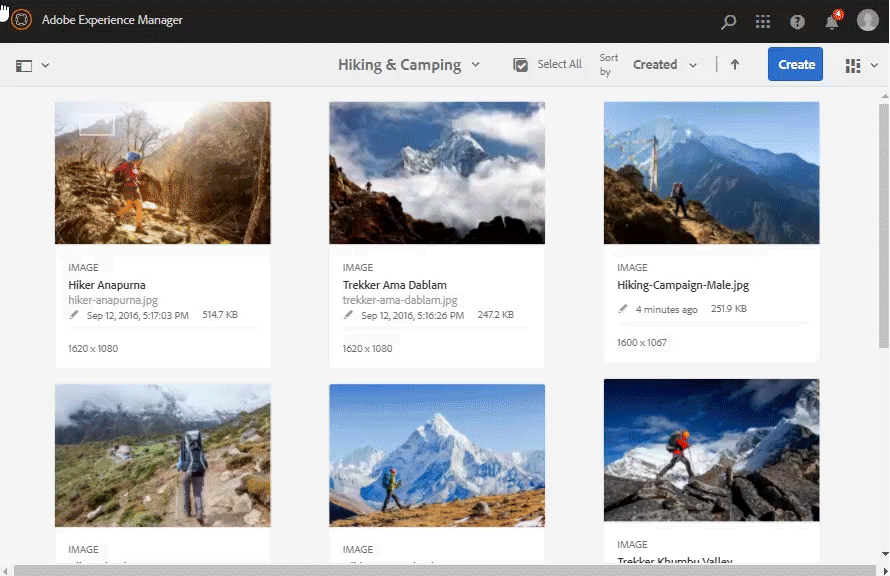

# 管理数字资源的元数据 {#managing-metadata-for-digital-assets}

| 版本 | 文章链接 |
| -------- | ---------------------------- |
| AEM as a Cloud Service | [单击此处](https://experienceleague.adobe.com/docs/experience-manager-cloud-service/content/assets/manage/manage-metadata.html?lang=en) |
| AEM 6.5 | 本文 |

<!-- Scope of metadata articles:
* metadata.md: The scope of this article is basic metadata updates, changes, and so on, operations that end-users can do.
* metadata-concepts.md: All conceptual information. Minor instructions are OK but it is an FYI article about support and standards.
* metadata-config.md: New article. Contains all configuration and administration how-to info related to metadata of assets.
-->

[!DNL Adobe Experience Manager Assets]保留每个资源的元数据。 它允许更轻松地分类和组织资产，并帮助查找特定资产的人员。 由于能够从上载到[!DNL Experience Manager Assets]的文件中提取元数据，因此元数据管理与创意工作流集成。 利用使用资源保留和管理元数据的功能，您可以根据资源的元数据自动组织和处理资源。

## 元数据及其来源 {#how-to-edit-or-add-metadata}

元数据是可搜索的资产的其他相关信息。 它会被添加到资源，并在您上传资源时在[!DNL Experience Manager]中进行处理。 您可以编辑现有元数据，将新的元数据属性添加到现有字段中。 组织需要可控且可靠的元数据词汇。 因此，[!DNL Experience Manager Assets]不允许按需添加新元数据属性。 只有管理员和开发人员可以添加包含元数据的新属性或字段。 用户可以使用元数据填充现有字段。

以下方法可用于向数字资源添加元数据：

* 首先，创建资产的本机应用程序向其添加一些元数据。 例如，[Acrobat将一些元数据](https://helpx.adobe.com/acrobat/using/pdf-properties-metadata.html)添加到PDF文件，或者相机将一些基本元数据添加到照片。 在生成资源时，可以将元数据添加到本机应用程序本身。 例如，您可以在Adobe Lightroom[中](https://helpx.adobe.com/lightroom-classic/help/metadata-basics-actions.html)添加IPTC元数据。

* 在将资源上传到[!DNL Experience Manager]之前，您可以使用用于创建资源的本机应用程序或使用其他元数据编辑应用程序来编辑和修改元数据。 将资源上传到Experience Manager时，将处理元数据。 例如，在[中查看如何 [!DNL Adobe Bridge]在](https://helpx.adobe.com/bridge/user-guide.html/bridge/using/metadata-adobe-bridge.ug.html) [中使用元数据并查看 [!DNL Adobe Bridge]](https://exchange.adobe.com/creativecloud.details.20009.aem-tags-panel-for-bridge-cc.html)的[!DNL Adobe Exchange]标记面板。

* 在[!DNL Experience Manager Assets]中，您可以在[!UICONTROL 属性]页面中手动添加或编辑资源的元数据。

* 在将资源上传到DAM时，您可以使用[的](/help/assets/metadata-config.md#metadata-profiles)元数据配置文件[!DNL Experience Manager Assets]功能自动添加元数据。

## 在[!DNL Experience Manager Assets]中添加或编辑元数据 {#add-edit-metadata}

要在[!DNL Assets]用户界面中编辑资源的元数据，请执行以下步骤：

1. 执行下列操作之一：

   * 从[!DNL Assets]界面中，选择资产并单击工具栏中的&#x200B;**[!UICONTROL 查看属性]**。
   * 从资产缩略图中，选择&#x200B;**[!UICONTROL 查看属性]**&#x200B;快速操作。
   * 在资源页面中，单击工具栏中的&#x200B;**[!UICONTROL 查看属性]** 。

   资源页面显示资源的所有元数据。 在将资产上传（引入）到[!DNL Experience Manager]中时，将提取元数据。

   

   *图：在资源[!UICONTROL 属性]页面上编辑或添加元数据。*

1. 根据需要，在各个选项卡下对元数据进行编辑，完成后，单击工具栏中的&#x200B;**[!UICONTROL 保存]**&#x200B;以保存更改。 单击&#x200B;**[!UICONTROL 关闭]**&#x200B;以返回[!DNL Assets] Web界面。

   >[!NOTE]
   >
   >如果文本字段为空，则不存在现有的元数据集。 您可以在字段中输入值并将其保存以添加该元数据属性。

对资源元数据所做的任何更改都将作为其XMP数据的一部分写回原始二进制文件。 元数据回写工作流将元数据添加到原始二进制文件。 对现有属性（如`dc:title`）所做的更改将被覆盖，并且新属性（包括自定义属性，如`cq:tags`）将添加到架构中。

对于[技术要求中描述的平台和文件格式，支持并启用了XMP回写。](/help/sites-deploying/technical-requirements.md)

## 编辑多个资源的元数据属性 {#editing-metadata-properties-of-multiple-assets}

[!DNL Adobe Enterprise Manager Assets]允许您同时编辑多个资源的元数据，以便快速将常见的元数据更改批量传播到资源。 您还可以批量编辑多个收藏集的元数据。 使用“属性”页可对多个资源或收藏集执行元数据更改：

* 将元数据属性更改为通用值
* 添加或修改标记

要自定义元数据属性页面，包括添加、修改和删除元数据属性，请使用[架构编辑器](metadata-config.md#folder-metadata-schema)。

>[!NOTE]
>
>批量编辑方法适用于文件夹或收藏集中可用的资产。 对于跨文件夹可用的资源或与通用条件匹配的资源，可在搜索[后](search-assets.md#metadataupdates)批量更新元数据。

1. 在[!DNL Assets]用户界面中，导航到要编辑的资源的位置。
1. 选择要编辑其公共属性的资源。
1. 在工具栏中，单击&#x200B;**[!UICONTROL 属性]**&#x200B;以打开选定资产的属性页面。
1. 在各种选项卡下修改所选资源的元数据属性。
1. 要查看特定资源的元数据，请取消选择列表中剩余的资源。 如果在[!UICONTROL 属性]页面上取消选择一些资源，则这些资源的元数据不会更新。
1. 要为资源选择其他元数据架构，请在工具栏中单击&#x200B;**[!UICONTROL 设置]**，然后选择架构。 单击&#x200B;**[!UICONTROL 保存并关闭]**。
1. 要将新元数据与现有元数据追加到包含多个值的字段中，请选择&#x200B;**[!UICONTROL 追加模式]**。如果不选中此选项，则新元数据将替换字段中的现有元数据。单击&#x200B;**[!UICONTROL “提交”。]**

>[!CAUTION]
>
>对于单值字段，即使选择&#x200B;**[!UICONTROL 追加模式]**，新元数据也不会追加到字段中的现有值中。

## 导入元数据 {#import-metadata}

[!DNL Assets]允许您使用CSV文件批量导入资源元数据。 您可以通过导入CSV文件，对最近上传的资源或现有资源进行批量更新。 您还可以以CSV格式从第三方系统批量摄取资源元数据。

元数据导入是异步的，不会妨碍系统性能。 如果选中工作流标志，则由于XMP写回活动，同时更新多个资源的元数据可能会占用大量资源。 在使用精益服务器期间规划此类导入，以便不影响其他用户的性能。

>[!NOTE]
>
>要在自定义命名空间上导入元数据，请先注册命名空间。

1. 导航到[!DNL Assets]用户界面，然后单击工具栏中的&#x200B;**[!UICONTROL 创建]**。
1. 从菜单中选择&#x200B;**[!UICONTROL 元数据]**。
1. 在&#x200B;**[!UICONTROL 元数据导入]**&#x200B;页面中，单击&#x200B;**[!UICONTROL 选择文件]**。 选择包含元数据的 CSV 文件。
1. 指定以下参数。 在[metadata-import-sample-file.csv](/help/assets/assets/metadata-import-sample-file.csv)处查看示例CSV文件。

   | 元数据导入参数 | 描述 |
   |:---|:---|
   | [!UICONTROL 批次大小] | 要为其导入元数据的批次中的资源数。 默认值为50。 最大值为100。 |
   | [!UICONTROL 字段分隔符] | 默认值为`,` （逗号）。 您可以指定任何其他字符。 |
   | [!UICONTROL 多值分隔符] | 元数据值的分隔符。 默认值为`\|`。 |
   | [!UICONTROL 启动工作流] | 默认为False。 当设置为`true`时，默认设置对[!UICONTROL DAM元数据写回]工作流(将元数据写入二进制XMP数据)有效。 启用工作流会减慢系统速度。 |
   | [!UICONTROL 资源路径列名称] | 定义包含资产的CSV文件的列名称。 |

1. 单击工具栏中的&#x200B;**[!UICONTROL 导入]**。 导入元数据后，[!UICONTROL 通知]收件箱中将显示通知。

1. 要验证是否正确导入，请导航到资产的[!UICONTROL 属性]页面，并验证字段中的值。

要在导入元数据时添加日期和时间戳，请使用`YYYY-MM-DDThh:mm:ss.fff-00:00`格式表示日期和时间。 日期和时间由`T`分隔，`hh`是24小时格式的小时，`fff`是纳秒，`-00:00`是时区偏移。 例如，`2020-03-26T11:26:00.000-07:00`是2020年3月26日上午11:26:00.000 PST时间。

>[!CAUTION]
>
>如果日期格式与`YYYY-MM-DDThh:mm:ss.fff-00:00`不匹配，则不会设置日期值。 导出的元数据CSV文件的日期格式为`YYYY-MM-DDThh:mm:ss-00:00`。 如果要导入它，请通过添加`fff`表示的nanoseconds值将其转换为可接受的格式。

## 导出元数据 {#export-metadata}

您可以以CSV格式导出多个资源的元数据。 元数据是异步导出的，不会影响系统性能。 要导出元数据，[!DNL Experience Manager]遍历资产节点`jcr:content/metadata`及其子节点的属性，并将元数据属性导出为CSV文件。

批量导出元数据的几个用例包括：

* 迁移资产时，在第三方系统中导入元数据。
* 与范围更广的项目团队共享资源元数据。
* 测试或审核元数据是否符合合规性。
* 将元数据外部化以单独对其进行本地化。

1. 选择包含要导出元数据的资源的资源文件夹。 从工具栏中选择&#x200B;**[!UICONTROL 导出元数据]**。

1. 在[!UICONTROL 元数据导出]对话框中，指定CSV文件的名称。 要导出子文件夹中资源的元数据，请选择&#x200B;**[!UICONTROL 包含子文件夹中的资源]**。

   

1. 选择所需的选项。 提供文件名和（如果需要）日期。

1. 在&#x200B;**[!UICONTROL 要导出的属性]**&#x200B;字段中，指定是要导出所有属性还是特定属性。 如果您选择要导出的选择性属性，请添加所需的属性。

1. 在工具栏中，单击&#x200B;**[!UICONTROL 导出]**。 将显示一条消息，确认元数据已导出。 关闭消息。

1. 打开导出作业的收件箱通知。选择作业，然后单击工具栏中的&#x200B;**[!UICONTROL 打开]**。要下载包含元数据的CSV文件，请单击工具栏中的&#x200B;**[!UICONTROL CSV下载]**。 单击&#x200B;**[!UICONTROL 关闭]**。

   

   *图：用于下载包含批量导出的元数据的CSV文件的对话框。*

## 编辑收藏集的元数据 {#collections-metadata}

有关详细信息，请参阅[查看和编辑收藏集元数据](/help/assets/manage-collections.md#view-edit-collection-metadata)和[批量编辑多个收藏集的元数据](/help/assets/manage-collections.md#editing-collection-metadata-in-bulk)。

## 将元数据配置文件应用到文件夹 {#applying-a-metadata-profile-to-folders}

<!-- TBD: Review this overview.
-->

将元数据配置文件分配给文件夹时，任何子文件夹都会自动从其父文件夹继承配置文件。 这意味着您只能将一个元数据配置文件分配给文件夹。 因此，请仔细考虑上传、存储、使用和存档资产的文件夹的结构。

如果为文件夹分配了不同的元数据配置文件，则新配置文件将覆盖以前的配置文件。 以前存在的文件夹资产保持不变。 新配置文件将应用于稍后添加到该文件夹的资源。

为其分配了配置文件的文件夹在用户界面中由卡片名称中显示的配置文件名称指示。

您可以将元数据配置文件应用到特定文件夹，或全局应用到所有资源。

如果文件夹已具有您后来更改的现有元数据配置文件，您可以重新处理该文件夹中的资产。 查看编辑文件夹中用于处理资产的配置文件后[重新处理该文件夹中的资产](processing-profiles.md#reprocessing-assets)。

您可以从&#x200B;**[!UICONTROL 工具]**&#x200B;菜单中将元数据轮廓应用到文件夹，或者如果您在文件夹中，也可以直接从&#x200B;**[!UICONTROL 属性]**&#x200B;中应用。本节将介绍如何通过这两种方式将元数据轮廓应用到文件夹。

如果文件夹已经分配了轮廓，则文件夹名称正下方会显示轮廓的名称。

如果文件夹已具有您后来更改的现有视频配置文件，您可以重新处理该文件夹中的资产。 查看编辑文件夹中用于处理资产的配置文件后[重新处理该文件夹中的资产](processing-profiles.md#reprocessing-assets)。

### 将元数据配置文件从[!UICONTROL 配置文件]用户界面应用到文件夹 {#applying-metadata-profiles-to-folders-from-profiles-user-interface}

按照以下步骤应用元数据配置文件：

1. 单击[!DNL Experience Manager]徽标并导航到&#x200B;**[!UICONTROL 工具]** > **[!UICONTROL Assets]** > **[!UICONTROL 元数据配置文件]**。
1. 选择要应用于一个或多个文件夹的元数据配置文件。
1. 单击&#x200B;**[!UICONTROL 将元数据配置文件应用到文件夹]**，然后选择一个或多个用于接收新上传资源的文件夹，然后单击&#x200B;**[!UICONTROL 完成]**。 如果文件夹已经分配了轮廓，则文件夹名称正下方会显示轮廓的名称。

### 将元数据配置文件应用到[!UICONTROL 属性]中的文件夹 {#applying-metadata-profiles-to-folders-from-properties}

1. 在左边栏中，单击&#x200B;**[!UICONTROL Assets]**，然后导航到要将元数据配置文件应用到其中的文件夹。
1. 在文件夹上，单击复选标记将其选中，然后单击&#x200B;**[!UICONTROL 属性]**。

1. 选择&#x200B;**[!UICONTROL 元数据配置文件]**&#x200B;选项卡，然后从弹出菜单中选择配置文件，然后单击&#x200B;**[!UICONTROL 保存]**。

如果文件夹已经分配了轮廓，则文件夹名称正下方会显示轮廓的名称。

<!-- TBD: Commenting as the topic in metadata-config.md is incomplete.

### Apply metadata profile globally {#metadata-profile-global}

For details, see [configuration to apply metadata profile globally](/help/assets/metadata-config.md#apply-a-metadata-profile-globally). -->

### 从文件夹中删除元数据配置文件 {#removing-a-metadata-profile-from-folders}

从文件夹中删除元数据配置文件时，所有子文件夹都会自动从其父文件夹中删除该配置文件。 但是，在文件夹中进行的任何文件处理操作将保持不变。

您可以从&#x200B;**[!UICONTROL 工具]**&#x200B;菜单中的文件夹或文件夹中的&#x200B;**[!UICONTROL 属性]**&#x200B;中删除元数据配置文件。

#### 通过“配置文件”用户界面从文件夹中删除元数据配置文件 {#removing-metadata-profiles-from-folders-via-profiles-user-interface}

1. 单击[!DNL Experience Manager]徽标并导航到&#x200B;**[!UICONTROL 工具]** > **[!UICONTROL Assets]** > **[!UICONTROL 元数据配置文件]**。
1. 选择要从一个或多个文件夹中删除的元数据配置文件。
1. 单击&#x200B;**[!UICONTROL 从文件夹中删除元数据配置文件]**，然后选择一个或多个要从中删除配置文件的文件夹，然后单击&#x200B;**[!UICONTROL 完成]**。

   您可以确认元数据配置文件不再应用于文件夹，因为该名称不再出现在文件夹名称下方。

#### 通过属性从文件夹中删除元数据配置文件 {#removing-metadata-profiles-from-folders-via-properties}

1. 单击[!DNL Experience Manager]徽标并导航&#x200B;**[!UICONTROL Assets]**，然后找到要删除元数据配置文件的文件夹。
1. 在文件夹上，单击复选标记将其选中，然后单击&#x200B;**[!UICONTROL 属性]**。
1. 选择&#x200B;**[!UICONTROL 元数据轮廓]**&#x200B;选项卡，并从下拉菜单中选择&#x200B;**[!UICONTROL 无]**，然后单击&#x200B;**[!UICONTROL 保存]**。如果文件夹已经分配了轮廓，则文件夹名称正下方会显示轮廓的名称。

## 提示和限制 {#best-practices-limitations}

* 通过用户界面进行元数据更新会更改`dc`命名空间中的元数据属性。 通过HTTP API所做的任何更新都会更改`jcr`命名空间中的元数据属性。 请参阅[如何使用HTTP API更新元数据](/help/assets/mac-api-assets.md#update-asset-metadata)。

* 用于导入资源元数据的CSV文件的格式非常特定。 要节省工作量和时间并避免意外错误，您可以使用导出的CSV文件格式开始创建CSV。

* 使用CSV文件导入元数据时，所需的日期格式为`YYYY-MM-DDThh:mm:ss.fff-00:00`。 如果使用任何其他格式，则不会设置日期值。 导出的元数据CSV文件的日期格式为`YYYY-MM-DDThh:mm:ss-00:00`。 如果要导入它，请通过添加`fff`表示的nanoseconds值将其转换为可接受的格式。

>[!MORELIKETHIS]
>
>* [元数据概念和了解](metadata-concepts.md)。
>* [编辑多个收藏集的元数据属性](manage-collections.md#editing-collection-metadata-in-bulk)
>* 在Experience Manager Assets中[元数据导入和导出](https://experienceleague.adobe.com/docs/experience-manager-learn/assets/metadata/metadata-import-feature-video-use.html)

<!-- TBD: Try filling the available information in these topics to the extent possible. As and when complete, publish the sections live.

## Where to find metadata of an asset or folder {#find-metadata}

What all methods to access asset Properties. More Details option in column view. Select asset and click Properties. Keyboard shortcut `p`. What else?

## Understand metadata handling in Experience Manager {#metadata-possibilities-with-aem}

Describe the journey of an assets' metadata. What all happens to metadata when an asset is added to Experience Manager.

## Add metadata to your digital assets {#add-metadata}

* To begin with, assets come with some metadata. The applications that create digital assets add some metadata to the assets created. Before uploading an asset to Experience Manager, you can edit and modify metadata using either the native application used to create an asset or using some other metadata editing application. When you upload an asset to Experience Manager, the metadata is processed.

* Link to PS, ID, AI, PDF, and so on, metadata-related help articles.

* Link to XMP writeback.

* Manually add (or edit) metadata in AEM in Properties page.

* Metadata profiles

* Any workflows related to metadata?

* Advanced topic: Add, edit, modify, process and writeback metadata of subassets.

## Metadata of assets, folders, and collections {#metadata-of-assets-folders-collections}

Similarities and differences between metadata of asset and folder. 

Link to metadata handling of collections.

## Modify metadata of an asset, folder, or collection {#modify-metadata}

* While creating assets: Native application.

* Before ingesting assets: Metadata editors

* After ingesting assets: Properties of an asset, folder, collection, and so on.

* Any supported programmatic method to bulk edit metadata directly in JCR?

## Modify metadata in bulk {#modify-metadata-in-bulk}

[!DNL Adobe Enterprise Manager Assets] lets you edit the metadata of multiple assets simultaneously so you can quickly propagate common metadata changes to assets in bulk. You can also edit the metadata for multiple collections in bulk.

Use the properties page to perform metadata changes on multiple assets or collections:

* Change metadata properties to a common value

* Add or modify tags

To customize the metadata properties page, including adding, modifying, deleting metadata properties, use the schema editor.

>[!NOTE]
>
>The bulk editing methods work for assets available in a folder or a collection. For the assets that are available across folders or match a common criteria, it is possible to [bulk update the metadata after searching](search-assets.md#metadataupdates).

1. In the [!DNL Assets] user interface, navigate to the location of the assets you want to edit.
1. Select the assets for which you want to edit common properties.
1. From the toolbar, click **[!UICONTROL Properties]** to open the properties page for the selected assets.

   >[!NOTE]
   >
   >When you select multiple assets, the lowest common parent form is selected for the assets. In other words, the properties page only displays metadata fields that are common across the properties pages of all the individual assets.

1. Modify the metadata properties for selected assets under the various tabs.
1. To view the metadata editor for a specific asset, deselect the remaining assets in the list. The metadata editor fields are populated with the metadata for the particular asset.

   >[!NOTE]
   >
   >* In the Properties page, you can remove assets from the asset list by deselecting them. The asset list has all the assets selected by default. The metadata for assets that you remove from the list is not updated.
   >
   >* At the top of assets list, select the check box near **[!UICONTROL Title]** to toggle between selecting the assets and clearing the list.

1. To select a different metadata schema for the assets, click **[!UICONTROL Settings]** from the toolbar, and select the desired schema.
1. Save the changes.
1. To append the new metadata with the existing metadata in fields that contain multiple values, select **[!UICONTROL Append mode]**. If you do not select this option, the new metadata replaces the existing metadata in the fields. click **[!UICONTROL Submit]**.

   >[!CAUTION]
   >
   >For single-value fields, the new metadata is not appended to the existing value in the field even if you select **[!UICONTROL Append mode]**.

-->
