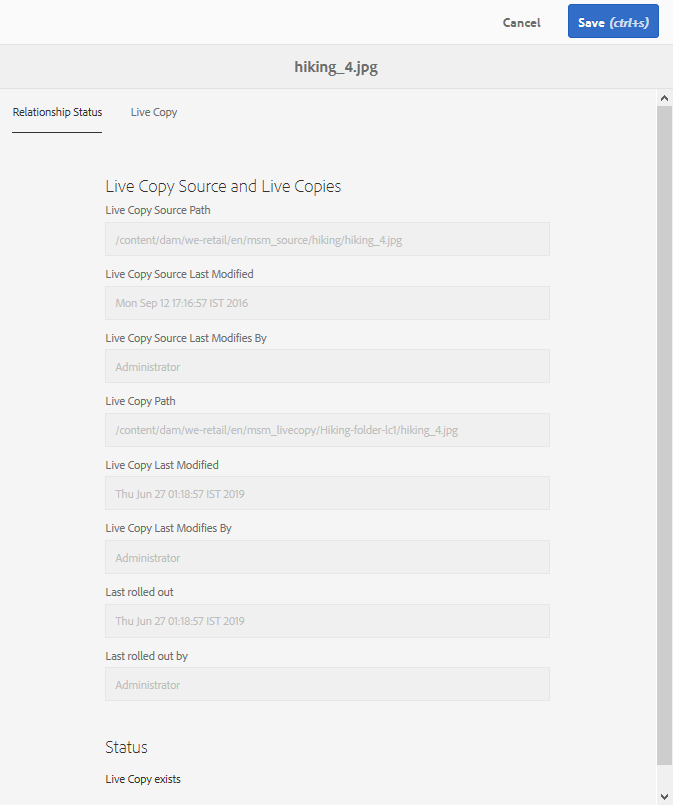

# 使用MSM对重用资源 [!DNL Assets] {#reuse-assets-using-msm-for-assets}

| 版本 | 文章链接 |
| -------- | ---------------------------- |
| AEM as a Cloud Service | [单击此处](https://experienceleague.adobe.com/docs/experience-manager-cloud-service/content/assets/manage/reuse-assets-using-msm.html?lang=en) |
| AEM 6.5 | 本文 |

中的多站点管理器(MSM)功能 [!DNL Adobe Experience Manager] 使用户能够重复使用一次创作并在多个Web位置重复使用的内容。 对于数字资产，此功能与MSM一样适用，适用于 [!DNL Assets] 功能。 将MSM用于 [!DNL Assets]，您可以：

* 只需创建资产一次，然后制作这些资产的副本以供在站点的其他区域重复使用。
* 使多个副本保持同步，并更新一次原始主副本，以将更改推送到子副本。
* 通过暂时或永久暂停父资产与子资产之间的链接来进行本地更改。

## 前提条件 {#prereq}

要将MSM用于 [!DNL Assets]，至少安装 [!DNL Experience Manager] 6.5 Service Pack 1. 有关更多信息，请参阅 [最新Service Pack的发行说明](/help/release-notes/release-notes.md).

## 了解优势和概念 {#concepts}

### 它的工作原理及其好处 {#how-it-works-and-the-benefits}

要了解在多个Web位置中重用相同内容（文本和资产）的使用方案，请参阅 [可能的MSM方案](/help/sites-administering/msm.md). [!DNL Experience Manager] 维护原始资产与其链接副本之间的链接，称为活动副本(LC)。 维护的链接允许将集中更改推送到多个活动副本。 这样可以在消除管理重复副本的限制的同时实现更快的更新。 变化的传播是无差错的，并且是集中化的。 该功能为仅限选定活动副本的更新留出了空间。 用户可以分离链接（即中断继承），并进行本地编辑，在下次更新主副本并转出更改时不会覆盖本地编辑。 可以为几个选定的元数据字段或整个资源执行分离。 它允许灵活地在本地更新最初从主副本继承的资产。

MSM维护源资产与其活动副本之间的实时关系，以便：

* 对源资产所做的更改也将应用（转出）到活动副本，即活动副本与源同步。
* 您可以通过暂停实时关系来更新实时副本，也可以删除几个有限字段的继承。 对源的修改将不再应用于Live Copy。

### 的MSM术语表 [!DNL Assets] 术语 {#glossary}

**来源：** 原始资源或文件夹。 从中派生活动副本的主副本。

**Live Copy：** 与其源同步的源资产/文件夹的副本。 活动副本可以是更多活动副本的来源。 了解如何创建LC。

**继承：** Live Copy资产/文件夹及其源之间的链接/引用，系统使用它来记住将更新发送到何处。 元数据字段的继承在粒度级别存在。 可以删除选择性元数据字段的继承，同时保留源及其Live Copy之间的实时关系。

**转出：** 一个操作，用于将对源所做的修改推送到其活动副本的下游。 可以使用转出操作一次性更新一个或多个活动副本。 请参阅转出。

**转出配置：** 确定同步哪些属性、同步方式和时间的规则。 这些配置在创建活动副本时应用；可以稍后编辑；并且子项可以从其父资产继承转出配置。 对于MSM，用于 [!DNL Assets]，则仅使用标准转出配置。 其他转出配置不适用于MSM的 [!DNL Assets].

**同步：** 除了转出之外，另一项操作通过将更新从源发送到活动副本来实现源与其Live Copy之间的对等性。 为特定Live Copy启动同步，该操作从源中提取更改。 使用此操作时，只能更新其中一个活动副本。 请参阅同步操作。

**暂停：** 暂时删除Live Copy与其源资产/文件夹之间的实时关系。 您可以恢复关系。 请参阅暂停操作。

**继续：** 恢复实时关系，以便Live Copy再次开始从源接收更新。 请参阅恢复操作。

**重置：** 重置操作通过覆盖任何本地更改再次将Live Copy作为源的复制副本。 它还删除继承取消并重置所有元数据字段的继承。 以后要进行本地修改，必须再次取消特定字段的继承。 请参阅对LC的本地修改。

**分离：** 不可撤消地删除Live Copy资产/文件夹的实时关系。 分离操作后，活动副本将无法接收来自源的更新，并且它不再是Live Copy。 请参阅删除关系。

## 创建资产的Live Copy {#createlc}

要从一个或多个源资产或文件夹创建Live Copy，请遵循以下任一操作：

* 方法1：选择源资源并单击 **[!UICONTROL 创建]** > **[!UICONTROL Live Copy]** 从顶部的工具栏中。
* 方法2：输入 [!DNL Experience Manager] 用户界面，单击 **[!UICONTROL 创建]** > **[!UICONTROL Live Copy]** 从界面的右上角。

您可以一次创建一个资产或文件夹的活动副本。 您可以创建派生自作为Live Copy本身的资产或文件夹的Live Copy。 用例不支持内容片段(CF)。 在尝试创建活动副本时，CF将按原样复制，而不与任何关系。 复制的CF是及时快照，更新原始CF时不会更新。

要使用第一种方法创建活动副本，请执行以下步骤：

1. 选择源资源或文件夹。 在工具栏中，单击 **[!UICONTROL 创建]** > **[!UICONTROL Live Copy]**.

   ![创建Live Copy来源 [!DNL Experience Manager] 界面](assets/create_lc1.png)

   *图：从创建Live Copy [!DNL Experience Manager] 界面。*

1. 选择目标文件夹。 单击&#x200B;**[!UICONTROL 下一步]**。
1. 提供标题和名称。 资产没有子项。 创建文件夹的Live Copy时，您可以选择包含或排除子项。
1. 选择转出配置。 单击&#x200B;**[!UICONTROL 创建]**。

要使用第二种方法创建活动副本，请执行以下步骤：

1. In [!DNL Experience Manager] 界面，从右上角，单击 **[!UICONTROL 创建]** > **[!UICONTROL Live Copy]**.

   ![创建Live Copy来源 [!DNL Experience Manager] 界面](assets/create_lc2.png)

   *图：从创建Live Copy [!DNL Experience Manager] 界面。*

1. 选择源资源或文件夹。 单击&#x200B;**[!UICONTROL 下一步]**。
1. 选择目标文件夹。 单击&#x200B;**[!UICONTROL 下一步]**。
1. 提供标题和名称。 资产没有子项。 创建文件夹的Live Copy时，您可以选择包含或排除子项。
1. 选择转出配置。 单击&#x200B;**[!UICONTROL 创建]**。

>[!NOTE]
>
>移动源或Live Copy时，将保留关系。 删除Live Copy时，将删除关系。

## 查看源和Live Copy的各种属性和状态 {#properties}

您可以从Live Copy的各个区域查看信息以及与MSM相关的状态，例如关系、同步、转出等 [!DNL Experience Manager] 用户界面。

以下两种方法适用于资源和文件夹：

* 选择Live Copy资产并在其“属性”页面中找到该信息。
* 选择源文件夹并从中找到每个Live Copy的详细信息 [!UICONTROL Live Copy控制台].

>[!TIP]
>
>要检查几个单独活动副本的状态，请使用第一种方法检查 **[!UICONTROL 属性]** 页面。 要检查多个活动副本的状态，请使用第二种方法检查 **[!UICONTROL 关系状态]** 页面。

### Live Copy的信息和状态 {#statuslcasset}

要检查Live Copy资产或文件夹的信息和状态，请执行以下步骤。

1. 选择Live Copy资产或文件夹。 单击 **[!UICONTROL 属性]** 工具栏中。 或者，使用键盘快捷键 `p`.
1. 单击 **[!UICONTROL Live Copy]**. 您可以检查源的路径、暂停状态、同步状态、上次转出日期以及执行上次转出的用户。

   

   *图： Live Copy信息和状态。*

1. 如果子资产借用Live Copy配置，则可以启用或禁用。

1. 您可以为Live Copy选择选项以从父项继承转出配置或更改配置。

### 文件夹所有活动副本的信息和状态 {#status-lc-folder}

[!DNL Experience Manager] 提供了一个控制台来检查源文件夹的所有活动副本的状态。 此控制台显示所有子资产的状态。

1. 选择源文件夹。 单击 **[!UICONTROL 属性]** 工具栏中。 或者，使用键盘快捷键 `p`.
1. 单击 **[!UICONTROL Live Copy 源]**。要打开控制台，请单击 **[!UICONTROL Live Copy 概述]**。此功能板提供所有子资产的顶级状态。

   

   *图：在中查看活动副本的状态 [!UICONTROL Live Copy控制台] 来源。*

1. 要查看 Live Copy 文件夹中每个资产的详细信息，请选择一个资产，然后单击工具栏中的&#x200B;**[!UICONTROL 关系状态]**。

   

   文件夹中Live Copy子资产的详细信息和状态

>[!TIP]
>
>您可以快速查看其他文件夹的活动副本的状态，而无需浏览太多内容。 将文件夹从 **[!UICONTROL Live Copy概述]** 界面。

### 源的“引用”边栏中的快速操作 {#refrailsource}

对于源资源或文件夹，您可以查看以下信息并直接从引用边栏执行以下操作：

* 查看活动副本的路径。
* 在中打开或显示特定Live Copy [!DNL Experience Manager] 用户界面。
* 将更新同步到特定Live Copy。
* 暂停特定Live Copy的关系或更改转出配置。
* 访问live copy概述控制台。

选择源资源或文件夹，打开左边栏，然后单击 **[!UICONTROL 引用]**. 或者，选择一个资产或文件夹，然后使用键盘快捷键 `Alt + 4`。

*图：所选源的“引用”边栏中可用的操作和信息。*

对于特定的Live Copy，请单击 **[!UICONTROL 编辑Live Copy]** 以暂停关系或更改转出配置。

*图：暂停关系或更改特定Live Copy的转出配置。*

### Live Copy的“引用”边栏中的快速操作 {#ref-rail-lc}

对于Live Copy资产或文件夹，您可以查看以下信息并直接从引用边栏执行以下操作：

* 查看其源的路径。
* 在中打开或显示特定Live Copy [!DNL Experience Manager] 用户界面。
* 转出更新。

选择 Live Copy 资产或文件夹，打开左边栏，然后单击&#x200B;**[!UICONTROL 引用]**。或者，选择一个资产或文件夹，然后使用键盘快捷键 `Alt + 4`。

*图：所选Live Copy的“引用”边栏中可用的操作。*

## 将修改从源传播到活动副本 {#rolloutsync}

修改源后，可以使用同步操作或转出操作将更改传播到活动副本。 要了解这两个操作之间的差异，请参阅 [术语表](#glossary).

### 转出操作 {#rollout}

您可以从源资产中启动转出操作，并更新所有或几个选定的活动副本。

1. 选择Live Copy资产或文件夹。 单击 **[!UICONTROL 属性]** 工具栏中。 或者，使用键盘快捷键 `p`.
1. 单击 **[!UICONTROL Live Copy 源]**。单击 **[!UICONTROL 转出]** 工具栏中。
1. 选择要更新的活动副本。 单击 **[!UICONTROL 转出]**.
1. 要转出对子资产所做的更新，请选择 **[!UICONTROL 转出源和所有子项]**.

   

   *图：将源的修改转出到几个或全部活动副本。*

>[!NOTE]
>
>在源资产中所做的修改仅会转出到直接相关的活动副本。 如果Live Copy是从另一个Live Copy派生的，则修改不会转出到派生的Live Copy。

或者，您可以在选择特定Live Copy后，从“引用”边栏启动转出操作。 有关更多信息，请参阅 [Live Copy的“引用”边栏中的快速操作](#ref-rail-lc). 在此转出方法中，仅更新选定的Live Copy及其子项（可选）。

*图：将源的修改转出到选定的Live Copy。*

### 关于同步操作 {#about-sync}

同步操作仅将修改从源拉入到选定的Live Copy。 同步操作会遵循并保留在取消继承后完成的本地修改。 不会覆盖本地修改，也不会重新建立已取消的继承。 可以通过三种方式启动同步操作。

| 位置 [!DNL Experience Manager] 界面 | 使用的时间和原因 | 使用方法 |
|---|---|---|
| [!UICONTROL 引用] 边栏 | 选择源后快速同步。 | 参见 [源的“引用”边栏中的快速操作](#refrailsource) |
| 工具栏中的 [!UICONTROL 属性] 页面 | 在已打开Live Copy属性时启动同步。 | 参见 [同步Live copy](#sync-lc) |
| [!UICONTROL Live Copy概述] 控制台 | 在选择了源文件夹或时，快速同步多个资产（不一定是全部） [!UICONTROL Live Copy概述] 控制台已打开。 一次启动一个资产的同步操作，但可以更快速地一次性同步多个资产。 | 参见 [对Live Copy文件夹中的许多资产执行的操作](#bulk-actions) |

### 同步Live copy {#sync-lc}

要开始同步操作，请打开Live **[!UICONTROL Copy的]** “属性”页，单击 **[!UICONTROL Live Copy]** ，然后单击工具栏中所需的操作。

要查看与同步操作相关的状态和信息，请参 [阅Live Copy的信息和状态](#statuslcasset) ，以 [及文件夹所有Live Copy的信息和状态](#status-lc-folder)。

*图：同步操作会提取对源所做的更改。*

>[!NOTE]
>
>如果关系已暂停，则同步操作在工具栏中不可用。 虽然同步操作在引用边栏中可用，但即使成功转出，修改也不会传播。

## 暂停和恢复关系 {#suspend-resume}

您可以临时暂停关系，以阻止Live Copy接收对源资产或文件夹所做的修改。 也可以恢复Live Copy的关系，以开始从源接收修改。

要暂停或继续，请打 **[!UICONTROL 开Live Copy的]** “属性”页面，单击 **[!UICONTROL Live Copy]** ，然后从工具栏中单击所需的操作。

或者，您也可以从 **[!UICONTROL Live Copy 概述]**&#x200B;控制台快速暂停或恢复 Live Copy 文件夹中多个资产的关系。请参阅[对 Live Copy 文件夹中的许多资产执行操作](#bulk-actions)。

## 对Live Copy进行本地修改 {#local-mods}

Live Copy是创建时原始源的复制副本。 Live Copy的元数据值继承自源。 元数据字段单独维护与源资产的相应字段的继承。

但是，您可以灵活地对Live Copy进行本地修改，以更改一些选定的属性。 要进行本地修改，请取消所需属性的继承。 取消一个或多个元数据字段的继承后，资产的实时关系和其他元数据字段的继承将保留。 任何同步或转出不会覆盖本地修改。 要执行此操作，请打开 **[!UICONTROL 属性]** 页面，单击 **[!UICONTROL 取消继承]** 元数据字段旁边的选项。

您可以撤消所有本地修改，并将资源恢复到其源的状态。 重置操作不可撤销并立即覆盖所有本地修改并重新建立所有元数据字段的继承。 要恢复，请从 **[!UICONTROL 属性]** 页面，单击 **[!UICONTROL 重置]** 工具栏中。

*图：重置操作会覆盖本地编辑，并会将Live Copy与其源进行部分合并。*

## 删除实时关系 {#detach}

您可以使用“分离”操作完全删除源与Live Copy之间的关系。 Live Copy在分离后会成为独立的资产或文件夹。 它会显示为中的新资产，位于 [!DNL Experience Manager] 界面，在分离后立即执行。 要将Live Copy与其源分离，请执行以下步骤。

1. 选择Live Copy资源或文件夹。 单击 **[!UICONTROL 属性]** 工具栏中。 或者，使用键盘快捷键 `p`.

1. 单击 **[!UICONTROL Live Copy]**. 单击 **[!UICONTROL 分离]** 工具栏中。 单击 **[!UICONTROL 分离]** 从显示的对话框中。

   

   *图：分离操作完全删除源和Live Copy之间的关系。*

   >[!CAUTION]
   >
   >当您单击时，关系会立即删除 **[!UICONTROL 分离]** 从对话框中。 无法通过单击来撤消此操作 **[!UICONTROL 取消]** 在属性页面上。

或者，您也可以从 **[!UICONTROL Live Copy概述]** 控制台。 请参阅[对 Live Copy 文件夹中的许多资产执行操作](#bulk-actions)。

## Live Copy文件夹中的批量操作 {#bulk-actions}

如果您的Live Copy文件夹中包含多个资产，则对每个资产启动操作可能会非常繁琐。 您可以从以下位置对许多资源快速启动基本操作 [!UICONTROL Live Copy控制台]. 上述方法继续适用于单个资产。

1. 选择源文件夹。 单击 **[!UICONTROL 属性]** 工具栏中。 或者，使用键盘快捷键 `p`.
1. 单击 **[!UICONTROL Live Copy 源]**。要打开控制台，请单击 **[!UICONTROL Live Copy 概述]**。
1. 在此功能板中，从 Live Copy 文件夹中选择 Live Copy 资产。单击工具栏中的所需操作。可用的操作有&#x200B;**[!UICONTROL 同步]**、**[!UICONTROL 重置]**、**[!UICONTROL 暂停]**&#x200B;和&#x200B;**[!UICONTROL 分离]**。您可以对任意数量的Live Copy文件夹中的任意资产快速启动这些操作，这些文件夹与选定的源文件夹处于实时关系。

   

   *图：从轻松更新Live Copy文件夹中的许多资产 [!UICONTROL Live Copy概述] 控制台。*

## 扩展MSM [!DNL Assets] {#extend-api}

[!DNL Experience Manager] 允许您使用MSM Java API扩展功能。 对象 [!DNL Assets]，则扩展的工作方式与它与MSM的相同， [!DNL Sites]. 有关详细信息，请参阅 [扩展MSM](/help/sites-developing/extending-msm.md) 和以下内容，以了解有关特定任务的信息：

* [API概述](/help/sites-developing/extending-msm.md#overview-of-the-java-api)
* [创建同步操作](/help/sites-developing/extending-msm.md#creating-a-new-synchronization-action)
* [创建转出配置](/help/sites-developing/extending-msm.md#creating-a-new-rollout-configuration)
* [创建并使用简单的LiveActionFactory类](/help/sites-developing/extending-msm.md#creating-and-using-a-simple-liveactionfactory-class)

>[!NOTE]
>
>* MSM中的Blueprint用于 [!DNL Sites] 在MSM中称为Live Copy源 [!DNL Assets].
>* MSM不支持删除创建站点向导中的章节步骤 [!DNL Assets].
>* MSM不支持在页面属性（触屏UI）上配置MSM锁定 [!DNL Assets].

## 资产管理任务对活动副本的影响 {#manage-assets}

活动副本和源是可在某种程度上作为数字资源管理的资源或文件夹。 中的一些资源管理任务 [!DNL Experience Manager] 对活动副本具有特定影响。

* 在复制Live Copy时，会创建与第一个Live Copy具有相同源的Live Copy资产。
* 当您移动源或其Live Copy时，实时关系将保留。
* 编辑操作不适用于Live Copy资产。 如果Live Copy的源本身是Live Copy，则编辑操作不适用于它。
* 签出操作不适用于Live Copy资产。
* 对于源文件夹，可以使用创建审阅任务的选项。
* 在列表视图和列视图中查看资产列表时，Live Copy资产或文件夹会对其显示“Live Copy”。 它可帮助您轻松识别文件夹中的活动副本。

## 比较MSM [!DNL Assets] 和 [!DNL Sites] {#comparison}

在更多方案中，MSM用于 [!DNL Assets] 匹配MSM for Sites功能的行为。 需要注意的一些主要区别包括：

* MSM中的Blueprint用于 [!DNL Sites] 在MSM中称为Live Copy源 [!DNL Assets].
* 在Sites中，您可以比较Blueprint及其Live Copy，但无法在中比较 [!DNL Assets] 以将源与其Live Copy进行比较。
* 您无法在中编辑Live Copy [!DNL Assets].
* 站点通常有子项，但是 [!DNL Assets] 不要。 创建单个资产的活动副本时，不包括或排除子项的选项不存在。
* MSM不支持删除创建站点向导中的章节步骤 [!DNL Assets].
* 不支持在的MSM中配置页面属性上的MSM锁定（触屏UI） [!DNL Assets].
* 对于MSM，用于 [!DNL Assets]，仅使用 **[!UICONTROL 标准转出配置]**. 其他转出配置不适用于MSM的 [!DNL Assets].

## 最佳实践 {#best-practices}

MSM的一些最佳实践包括：

* 在开始实施之前，规划资产和内容流的父子关系。

## MSM的限制和已知问题 [!DNL Assets] {#limitations}

以下是MSM对的限制 [!DNL Assets].

* 用例不支持内容片段(CF)。 在尝试创建活动副本时，CF将按原样复制，而不与任何关系。 复制的CF是及时快照，更新原始CF时不会更新。

* MSM不适用于已启用元数据写回的情况。 在写回时，继承中断。
