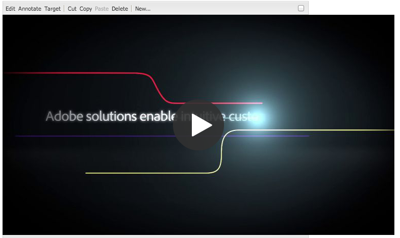

# 将Dynamic Media Classic功能添加到页面 {#adding-scene-features-to-your-page}

[Adobe Dynamic Media Classic](https://experienceleague.adobe.com/docs/dynamic-media-classic/using/home.html)是一个托管解决方案，用于管理、增强、发布富媒体资产，并将其交付给Web、移动设备、电子邮件和连接到Internet的显示和打印。

您可以在各种查看器中查看在Dynamic Media Classic中发布的Experience Manager资源：

* 缩放
* 弹出
* 视频
* 图像模板
* 图像

您可以将数字资源直接从Experience Manager发布到Dynamic Media Classic，也可以将数字资源从Dynamic Media Classic发布到Experience Manager。

本文档介绍如何将数字资源从Experience Manager发布到Dynamic Media Classic或反之。 还详细介绍了查看器。 有关配置Dynamic Media ClassicExperience Manager的信息，请参阅[将Dynamic Media Classic与Experience Manager集成](/help/sites-administering/scene7.md)。

另请参阅[添加图像映射](image-maps.md)。

有关在Experience Manager中使用视频组件的详细信息，请参阅[视频](video.md)。

>[!NOTE]
>
>如果Dynamic Media Classic资源显示不正确，请确保Dynamic Media已[禁用](config-dynamic.md#disabling-dynamic-media)，然后刷新页面。

## 从Assets手动发布到Dynamic Media Classic {#manually-publishing-to-scene-from-assets}

您可以按如下方式将数字资源发布到Dynamic Media Classic：

* [在Assets控制台的经典用户界面中](/help/sites-classic-ui-authoring/manage-assets-classic-s7.md#publishing-from-the-assets-console)
* [在资产的经典用户界面中](/help/sites-classic-ui-authoring/manage-assets-classic-s7.md#publishing-from-an-asset)
* [在CQ Target文件夹外部的经典用户界面中](/help/sites-classic-ui-authoring/manage-assets-classic-s7.md#publishing-assets-from-outside-the-cq-target-folder)

>[!NOTE]
>
>Experience Manager以异步方式发布到Dynamic Media Classic。 选择&#x200B;**[!UICONTROL Publish]**&#x200B;后，需要几秒钟才能将资源发布到Dynamic Media Classic。
>

## Dynamic Media Classic组件 {#scene-components}

Experience Manager中提供了以下Dynamic Media Classic组件：

* 缩放
* 弹出（缩放）
* 图像模板
* 图像
* 视频

>[!NOTE]
>
>这些组件在默认情况下不可用，在使用之前必须在&#x200B;**[!UICONTROL 设计]**&#x200B;模式下选择。

在&#x200B;**[!UICONTROL 设计]**&#x200B;模式下提供组件后，您可以像添加任何其他Experience Manager组件一样将这些组件添加到您的页面。 如果位于同步文件夹或页面上，或者使用Assets云配置，则尚未发布到Dynamic Media Classic的Dynamic Media Classic将被发布到Dynamic Media Classic。

>[!NOTE]
>
>如果您正在创建和开发自定义查看器并使用“内容查找器”，则必须显式添加`allowfullscreen`参数。

### Flash查看器生命周期终止通知 {#flash-viewers-end-of-life-notice}

自2017年1月31日起，Adobe Dynamic Media Classic停止支持Flash查看器平台。

### 将Dynamic Media Classic (Scene7)组件添加到页面 {#adding-a-scene-component-to-a-page}

将Dynamic Media Classic (Scene7)组件添加到页面与将组件添加到任何页面相同。 以下部分详细介绍了Dynamic Media Classic组件。

**要将Dynamic Media Classic (Scene7)组件添加到页面，请执行以下操作：**

1. 在Experience Manager中，打开要添加&#x200B;**[!UICONTROL Dynamic Media Classic (Scene7)]**&#x200B;组件的页面。

1. 如果没有可用的Dynamic Media Classic组件，请选择&#x200B;**[!UICONTROL 设计]**&#x200B;模式，选择带有蓝色边框的任何组件，选择&#x200B;**[!UICONTROL 父项]**&#x200B;图标，然后选择&#x200B;**[!UICONTROL 配置]**&#x200B;图标。 在&#x200B;**[!UICONTROL Parsys （设计）]**&#x200B;中，选择所有Dynamic Media Classic组件以使它们可用，然后选择&#x200B;**[!UICONTROL 确定]**。

   

1. 选择&#x200B;**[!UICONTROL 编辑]**，以便返回&#x200B;**[!UICONTROL 编辑]**&#x200B;模式。

1. 将组件从sidekick中的Dynamic Media Classic组拖动到页面上的所需位置。

1. 选择&#x200B;**[!UICONTROL 配置]**&#x200B;图标以打开该组件。

1. 根据需要编辑该组件并选择&#x200B;**[!UICONTROL 确定]**&#x200B;以保存更改。
1. 将图像或视频从内容浏览器拖动到您添加到页面的Dynamic Media Classic组件上。

   >[!NOTE]
   >
   >仅在触屏UI中，您必须将图像或视频拖放到放到页面上放置的Dynamic Media Classic组件上。 不支持选择和编辑Dynamic Media Classic组件，然后选择资源。

### 向响应式网站添加交互式查看体验 {#adding-interactive-viewing-experiences-to-a-responsive-website}

资产的响应式设计意味着您的资产会根据显示位置进行相应调整。 通过响应式设计，可以在多个设备上有效地显示相同的资产。

另请参阅[网页的响应式设计](/help/sites-developing/responsive.md)。

**若要向响应式网站添加交互式观看体验：**

1. 登录到Experience Manager，并确保您已[配置Adobe Dynamic Media ClassicCloud Service](/help/sites-administering/scene7.md#configuring-scene-integration)并且Dynamic Media Classic组件可用。

   >[!NOTE]
   >
   >如果Dynamic Media Classic组件不可用，请确保[通过设计模式启用它们](/help/sites-authoring/default-components-designmode.md)。

1. 在启用了&#x200B;**[!UICONTROL Dynamic Media Classic]**&#x200B;组件的网站中，将&#x200B;**[!UICONTROL Image]**&#x200B;组件拖动到页面。
1. 选择组件，然后选择配置图标。
1. 在&#x200B;**[!UICONTROL Dynamic Media Classic设置]**&#x200B;选项卡中，调整断点。

   

1. 确认查看者正在响应式地调整大小，并且所有交互都已针对桌面、平板电脑和移动设备进行了优化。

### 所有Dynamic Media Classic组件的通用设置 {#settings-common-to-all-scene-components}

尽管配置选项各不相同，但以下内容对于所有[!UICONTROL Dynamic Media Classic]组件都是通用的：

* **[!UICONTROL 文件引用]** — 浏览到要引用的文件。 文件引用显示资源URL，不一定是完整的Dynamic Media Classic URL，包括URL命令和参数。 您无法在此字段中添加Dynamic Media Classic URL命令和参数。 相反，您可以通过组件中的相应功能添加它们。
* **[!UICONTROL 宽度]** — 允许您设置宽度。
* **[!UICONTROL 高度]** — 允许您设置高度。

您可以通过打开（双击）Dynamic Media Classic组件来设置这些配置选项，例如，在打开&#x200B;**[!UICONTROL 缩放]**&#x200B;组件时：

### 缩放 {#zoom}

按&#x200B;**[!UICONTROL +]**&#x200B;按钮时，HTML5缩放组件显示较大的图像。

资产底部有缩放工具。 如果要放大，请选择&#x200B;**[!UICONTROL +]**；如果要缩小，请选择&#x200B;**[!UICONTROL -]**。 点按&#x200B;**[!UICONTROL x]**&#x200B;或重置缩放箭头可将图像恢复到导入图像的原始大小。 选择对角线箭头，以便全屏显示。 选择&#x200B;**[!UICONTROL 编辑]**，以便配置该组件。 使用此组件，您可以配置所有[!UICONTROL Dynamic Media Classic]组件[&#128279;](#settings-common-to-all-scene-components)共有的设置。

### 弹出 {#flyout}

在HTML5 **[!UICONTROL 弹出]**&#x200B;组件中，资源显示为分屏；将资源左移为指定大小；显示右侧的缩放部分。 选择&#x200B;**[!UICONTROL 编辑]**，以便配置该组件。 通过此组件，您可以配置所有Dynamic Media Classic组件通用的[设置](#settings-common-to-all-scene-components)。

>[!NOTE]
>
>如果您的&#x200B;**[!UICONTROL 弹出]**&#x200B;组件使用自定义大小，则会使用该自定义大小并禁用该组件的响应式设置。
>
>如果您的&#x200B;**[!UICONTROL 弹出]**&#x200B;组件使用默认大小（如&#x200B;**[!UICONTROL 设计视图]**&#x200B;中所设置），则使用默认大小，组件将展开以适应已启用组件响应设置的页面布局大小。 组件的响应式设置存在限制。 在响应设置中使用&#x200B;**[!UICONTROL 弹出]**&#x200B;组件时，请勿将其用于全页延伸。 否则，**[!UICONTROL 弹出]**&#x200B;将超出页面的右边框。

### 图像 {#image}

Dynamic Media Classic **[!UICONTROL 图像]**&#x200B;组件允许您向图像添加Dynamic Media Classic功能，如Dynamic Media Classic修饰符、图像或查看器预设以及锐化。 Dynamic Media Classic **[!UICONTROL 图像]**&#x200B;组件与Experience Manager中的其他图像组件类似，具有特殊的Dynamic Media Classic功能。 在此示例中，图像应用了Dynamic Media Classic URL修饰符`&op_invert=1`。

**[!UICONTROL 标题，替换文本]** — 在&#x200B;**[!UICONTROL 高级]**&#x200B;选项卡中，为已关闭图形的用户添加标题和替换文本。

**[!UICONTROL URL，在]**&#x200B;中打开 — 您可以从中设置资产以打开链接。 设置&#x200B;**[!UICONTROL URL]**，在&#x200B;**[!UICONTROL 在]**&#x200B;中打开指示您希望它是在同一窗口中打开还是在新窗口中打开。

**[!UICONTROL 查看器预设]** — 从下拉菜单中选择现有的查看器预设。 如果您要查找的查看器预设不可见，则必须使其可见。 请参阅[管理查看器预设](/help/assets/managing-viewer-presets.md)。 如果您使用的是图像预设，则无法选择查看器预设，反之亦然。

**[!UICONTROL Dynamic Media Classic配置]** — 选择要用于从SPS获取活动图像预设的Dynamic Media Classic配置。

**[!UICONTROL 图像预设]** — 从下拉菜单中选择现有的图像预设。 如果您要查找的图像预设不可见，则必须使其可见。 请参阅[管理图像预设](/help/assets/managing-image-presets.md)。 如果您使用的是图像预设，则无法选择查看器预设，反之亦然。

**[!UICONTROL 输出格式]** — 选择图像的输出格式，例如jpeg。 根据您选择的输出格式，还有其他配置选项。 请参阅[图像预设最佳实践](/help/assets/managing-image-presets.md#image-preset-options)。

**[!UICONTROL 锐化]** — 选择要如何锐化图像。 在[图像预设最佳实践](/help/assets/managing-image-presets.md#image-preset-options)和[锐化最佳实践](/help/assets/assets/sharpening_images.pdf)中对锐化进行了详细解释。

**[!UICONTROL URL修饰符]** — 您可以通过提供其他Dynamic Media Classic图像命令来更改图像效果。 [图像预设](/help/assets/managing-image-presets.md)和[命令引用](https://experienceleague.adobe.com/docs/dynamic-media-developer-resources/image-serving-api/image-serving-api/http-protocol-reference/command-reference/c-command-reference.html)中介绍了这些命令。

**[!UICONTROL 断点]** — 如果您的网站有响应，则要调整断点。 断点必须以逗号( 、 )分隔。

### 图像模板 {#image-template}

[Dynamic Media Classic图像模板](https://experienceleague.adobe.com/docs/dynamic-media-classic/using/template-basics/quick-start-template-basics.html)是导入到Dynamic Media Classic的分层Photoshop内容，其中内容和属性已参数化为可变性。 通过&#x200B;**[!UICONTROL 图像模板]**&#x200B;组件，您可以导入图像并在Experience Manager中动态更改文本。 此外，您可以将&#x200B;**[!UICONTROL 图像模板]**&#x200B;组件配置为使用来自客户端上下文的值，以便每个用户以个性化的方式体验图像。

如果要配置该组件，请选择&#x200B;**[!UICONTROL 编辑]**。 您可以配置所有Dynamic Media Classic组件通用的[设置](#settings-common-to-all-scene-components)以及本节中描述的其他设置。

**[!UICONTROL 文件引用、宽度、高度]** — 查看所有ScDynamic Media Classicene7组件通用的设置。

>[!NOTE]
>
>Dynamic Media Classic URL命令和参数不能直接添加到文件引用URL。 它们只能在&#x200B;**[!UICONTROL 参数]**&#x200B;面板的组件UI中定义。

**[!UICONTROL 标题，替换文本]** — 在Dynamic Media Classic的“图像模板”选项卡中，为已关闭图形的用户添加标题和替换文本。

**[!UICONTROL URL，在]**&#x200B;中打开 — 您可以从中设置资产以打开链接。 在的“打开”中设置URL并指示您是要在同一窗口中打开还是要在新窗口中打开。

**[!UICONTROL 参数面板]** — 导入图像时，使用图像中的信息预填充参数。 如果没有可动态更改的内容，则此窗口为空。

#### 动态更改文本 {#changing-text-dynamically}

若要动态更改文本，请在字段中输入新文本并选择&#x200B;**[!UICONTROL 确定]**。 在此示例中，**[!UICONTROL 价格]**&#x200B;现在为$50，运费为99美分。

图像中的文本会更改。 您可以通过点按字段旁边的&#x200B;**[!UICONTROL 重置]**，将文本重置回原始值。

#### 更改文本以反映客户端上下文值的值 {#changing-text-to-reflect-the-value-of-a-client-context-value}

要将字段链接到客户端上下文值，请选择&#x200B;**[!UICONTROL 选择]**&#x200B;以打开客户端上下文菜单，选择客户端上下文，然后选择&#x200B;**[!UICONTROL 确定]**。 在此示例中，根据将名称与配置文件中的格式化名称之间的链接，名称会发生更改。

该文本反映当前登录用户的名称。 您可以通过单击字段旁边的&#x200B;**[!UICONTROL 重置]**，将文本重置回原始值。

#### 将Dynamic Media Classic图像模板设为链接 {#making-the-scene-image-template-a-link}

1. 在具有Dynamic Media Classic **[!UICONTROL 图像模板]**&#x200B;组件的页面上，选择&#x200B;**[!UICONTROL 编辑]**。
1. 在&#x200B;**[!UICONTROL URL]**&#x200B;字段中，输入用户点击图像时前往的URL。 在&#x200B;**[!UICONTROL 在]**&#x200B;中打开字段中，选择要打开目标（新窗口还是同一窗口）。

   

1. 选择&#x200B;**[!UICONTROL 确定]**。

### 视频组件 {#video-component}

Dynamic Media Classic **[!UICONTROL 视频]**&#x200B;组件(可在sidekick的Dynamic Media Classic部分中使用)使用设备和带宽检测将正确的视频提供给每个屏幕。 此组件是一个HTML5视频播放器；它是一个可用于跨渠道的单个查看器。

它可用于自适应视频集、单个MP4视频或单个F4V视频。

有关视频如何与Dynamic Media Classic集成配合使用的详细信息，请参阅[视频](s7-video.md)。 此外，请参阅[Dynamic Media Classic视频组件与Foundation视频组件](s7-video.md)。

### 视频组件的已知限制 {#known-limitations-for-the-video-component}

AdobeDAM和WCM会显示是否上传了主源视频。 它们不显示这些代理资源：

* Dynamic Media Classic编码呈现版本
* Dynamic Media Classic自适应视频集

在将自适应视频集与Dynamic Media Classic视频组件结合使用时，必须调整组件大小以适合视频的尺寸。

## Dynamic Media Classic内容浏览器 {#scene-content-browser}

Dynamic Media Classic内容浏览器允许您直接在Experience Manager中查看Dynamic Media Classic中的内容。 要访问内容浏览器，请在&#x200B;**[!UICONTROL 内容查找器]**&#x200B;中，选择触控优化用户界面中的&#x200B;**[!UICONTROL Dynamic Media Classic]**&#x200B;或传统用户界面中的&#x200B;**[!UICONTROL S7]**&#x200B;图标。 两个用户界面之间的功能相同。

如果您有多个配置，默认情况下Experience Manager会显示[默认配置](/help/sites-administering/scene7.md#configuring-a-default-configuration)。 您可以直接在Dynamic Media Classic内容浏览器的下拉菜单中选择其他配置。

>[!NOTE]
>
>* 按需文件夹中的Assets不会出现在Dynamic Media Classic内容浏览器中。
>* 启用[安全预览](/help/sites-administering/scene7.md#configuring-the-state-published-unpublished-of-assets-pushed-to-scene)后，Dynamic Media Classic上已发布和未发布的资源都会出现在Dynamic Media Classic内容浏览器中。
>* 如果您在内容浏览器中未看到&#x200B;**[!UICONTROL Dynamic Media Classic]**&#x200B;或&#x200B;**[!UICONTROL S7]**&#x200B;图标作为选项，则必须[配置Dynamic Media Classic以使用Experience Manager](/help/sites-administering/scene7.md)。
>* 对于视频，Dynamic Media Classic内容浏览器支持：
>
>   * 自适应视频集：包含跨多个屏幕无缝播放所需的所有视频演绎版的容器
>   * 单个MP4视频
>   * 单个F4V视频

### 在触屏优化UI中浏览内容 {#browsing-content-in-the-touch-optimized-ui}

您可以在触控优化或经典UI中访问内容浏览器。 目前，触控优化具有以下限制：

* 不支持来自Dynamic Media Classic的FXG和Flash资源。

从第三个下拉菜单中选择&#x200B;**[!UICONTROL Dynamic Media Classic]**，以浏览Dynamic Media Classic资源。 如果您未配置Dynamic Media Classic/Dynamic Media Classic集成，则Experience Manager不会显示在列表中。

>[!NOTE]
>
>* Dynamic Media Classic内容浏览器加载大约100个资源，并按名称对它们进行排序。
>* 如果您设置了安全预览服务器，则浏览器将使用该预览服务器渲染缩略图和资产。
>

此外，您还可以将鼠标悬停在浏览器中的资产上，以浏览分辨率信息、大小、自修改以来的天数以及文件名。

* 对于自适应视频集和模板，不会为缩略图生成大小信息。
* 对于自适应视频集，不会为缩略图生成分辨率。

### 使用内容浏览器搜索Dynamic Media Classic资源 {#searching-for-scene-assets-with-the-content-browser}

在Dynamic Media Classic中搜索资源与在Experience Manager Assets中搜索资源类似。 但是，当您搜索时，您实际上会在Dynamic Media Classic系统中看到资源的远程视图，而不是直接将资源导入Experience Manager。

您可以使用经典UI或触屏优化UI来查看和搜索资产。 根据界面，您的搜索方式会略有不同。

在任一UI中搜索时，您可以按以下条件进行筛选（如触屏优化UI中所示）：

**[!UICONTROL 输入关键字]** — 您可以按名称搜索资源。 搜索时，您输入的关键字是文件名开头的。 例如，键入“swimming”将查找任何以相应顺序的字母开头的资产文件名。 在键入搜索词以查找资源后，请务必按Enter键。

**[!UICONTROL 文件夹/路径]** — 所看到的文件夹名称基于您选择的配置。 您可以通过点按文件夹图标并选择子文件夹，然后点按复选标记以将其选中来向下钻取到更低级别。

如果输入关键字并选择文件夹，则Experience Manager将搜索该文件夹及其所有子文件夹。 但是，如果在搜索时未输入任何关键字，则选择该文件夹只会显示该文件夹中的资源，不包括任何子文件夹。

默认情况下，Experience Manager会搜索选定的文件夹和所有子文件夹。

**[!UICONTROL 资源类型]** — 选择&#x200B;**[!UICONTROL Dynamic Media Classic]**&#x200B;以浏览Dynamic Media Classic内容。 此选项仅在配置了Dynamic Media Classic后才可用。

**[!UICONTROL 配置]** — 如果您在[!UICONTROL Cloud Service]中定义了多个Dynamic Media Classic配置，则可以在此处选择它。 因此，文件夹会根据您选择的配置进行更改。

**[!UICONTROL 资源类型]** — 在Dynamic Media Classic浏览器中，您可以筛选结果以包含以下任一项：图像、模板、视频和自适应视频集。 如果未选择任何资源类型，默认情况下，Experience Manager将搜索所有资源类型。

>[!NOTE]
>
>* 在经典UI中，您还可以搜索&#x200B;**Flash**&#x200B;和&#x200B;**FXG**。 不支持在触屏优化UI中筛选这些类型。
>
>* 搜索视频时，您将搜索单个演绎版。 结果会返回原始演绎版（仅&amp;amp；ast；.mp4）和编码的演绎版。
>* 搜索自适应视频集时，您将搜索文件夹和所有子文件夹，但前提是已向搜索添加了关键词。 如果尚未添加关键字，则Experience Manager不会搜索子文件夹。
>

**[!UICONTROL Publish状态]** — 您可以根据发布状态筛选资源： **[!UICONTROL 已取消发布]**&#x200B;或&#x200B;**[!UICONTROL 已发布]**。 如果您未选择任何&#x200B;**[!UICONTROL Publish状态]**，则默认情况下Experience Manager将搜索所有发布状态。

