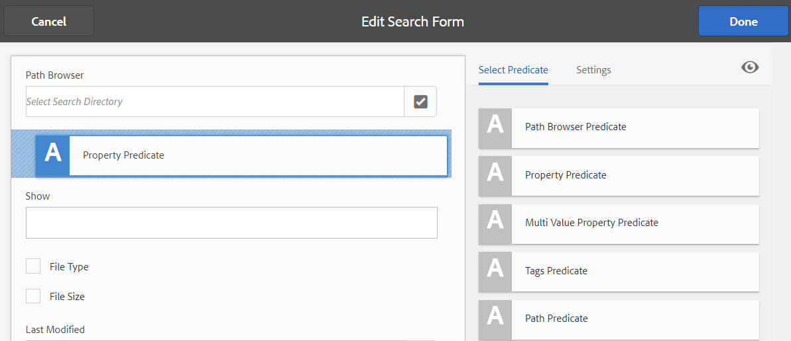

# 搜索 Facet {#search-facets}

| 版本 | 文章链接 |
| -------- | ---------------------------- |
| AEM as a Cloud Service | [单击此处](https://experienceleague.adobe.com/docs/experience-manager-cloud-service/content/assets/admin/search-facets.html?lang=en) |
| AEM 6.5 | 本文 |
| AEM 6.4 | [单击此处](https://experienceleague.adobe.com/docs/experience-manager-64/assets/administer/search-facets.html?lang=en) |

的企业范围部署 [!DNL Adobe Experience Manager Assets] 有能力存储许多资产。 有时，如果只使用的一般搜索功能，则查找正确的资产可能会很费时费力 [!DNL Experience Manager].

在“筛选器”面板中使用搜索Facet为您的搜索体验添加更多粒度，并使搜索功能更高效、更通用。 搜索Facet会添加多个维度（谓词），使您能够执行更复杂的搜索。 “筛选器”面板包含几个标准Facet。 您还可以添加自定义搜索彩块化。

总之，通过搜索彩块化，您可以通过多种方式搜索资产，而不是按单一、预先确定的分类顺序搜索。 您可以轻松地深入到所需的详细级别以进行更集中的搜索。

例如，如果您要查找图像，则可以选择是要位图还是矢量图像。 通过为图像指定MIME类型，可以进一步缩小搜索范围。 同样，在搜索文档时，可以指定格式，例如PDF或MS Word。

## 添加谓词 {#adding-a-predicate}

“筛选器”面板中显示的搜索Facet是使用谓词在基础搜索表单中定义的。 要显示更多或不同的Facet，请将谓词添加到默认表单中，或者使用包含所选Facet的自定义表单。

对于全文搜索，请添加 **[!UICONTROL 全文]** 表单谓词。 使用属性谓词可搜索与您指定的单个属性匹配的资产。 使用“选项”谓词可搜索与特定属性的一个或多个值匹配的资产。 添加日期范围谓词以搜索在指定日期范围内创建的资源。

1. 单击 [!DNL Experience Manager] 徽标，然后转到 **[!UICONTROL 工具]** > **[!UICONTROL 常规]** > **[!UICONTROL 搜索Forms]**.
1. 从 [!UICONTROL 搜索Forms] 页面，选择 **[!UICONTROL 资产管理搜索边栏]**，然后单击 **[!UICONTROL 编辑]** .

   >[!NOTE]
   >
   >使用预配置的文件夹搜索功能 [!DNL Assets] 管理搜索边栏（早期版本），请执行以下步骤：
   >
   >1. 导航到 `/conf/global/settings/dam/search/facets/assets/jcr:content/items` 在CRXDE中。
   >1. 删除 `type` 节点。
   >1. 从路径 `/libs/settings/dam/search/facets/assets/jcr:content/items`，复制节点 `asset`， `directory`， `typeor`， `excludepaths`、和 `searchtype` 到步骤1中提到的路径。
   >1. 保存更改。


1. 在 [!UICONTROL 编辑搜索Forms] 页面，从拖动谓词 **[!UICONTROL 选择谓词]** 制表符进入主窗格。 例如，拖动 **[!UICONTROL 属性谓词]**.

   

   *图：选择并移动谓词以自定义搜索过滤器。*

1. 在 [!UICONTROL 设置] 选项卡，输入字段标签、占位符文本和谓词说明。 为要与谓词关联的元数据属性指定有效名称。 中的标题标签 [!UICONTROL 设置] 选项卡标识所选谓词的类型。

1. 在[!UICONTROL 属性名称]字段中，为要与谓词关联的元数据属性指定有效名称。该名称是执行搜索时所依据的名称。例如，输入 `jcr:content/metadata/dc:description` 或 `./jcr:content/metadata/dc:description`。

   也可以从选择对话框中选择现有节点。

   

   在属性名称字段中将元数据属性与谓词关联

1. 单击 **[!UICONTROL 预览]**  以生成过滤器面板在添加谓词后显示的预览。
1. 在“预览”模式下查看谓词的布局。

   

   在提交更改之前预览搜索表单

1. 要关闭预览，请单击 **[!UICONTROL 关闭]**  在预览的右上角。
1. 单击&#x200B;**[!UICONTROL 完成]**&#x200B;以保存设置。
1. 导航到 [!DNL Assets] 用户界面。 属性谓词将添加到面板中。
1. 在文本框中输入对要搜索的资产的描述。例如，输入 `Adobe`. 执行搜索时，具有描述匹配的资产 `Adobe` 将在搜索结果中列出。

## 添加选项谓词 {#adding-an-options-predicate}

选项谓词允许您在“筛选器”面板中添加多个搜索选项。 您可以在“筛选器”面板中选择一个或多个选项来搜索资产。 例如，要根据文件类型搜索资产，请在搜索表单中配置选项，如“图像”、“多媒体”、“文档”和“存档”。 配置这些选项后，当您在“筛选器”面板中选择“图像”选项时，将会对GIF、JPEG、PNG等类型的资源执行搜索。

要将选项映射到相应的属性，请为选项创建节点结构，并在Options谓词的Property Name属性中提供父节点的路径。 父节点应为类型 `sling`： `OrderedFolder`. 选项应属于类型 `nt:unstructured`. 选项节点应具有属性 `jcr:title` 和 `value` 已配置。

此 `jcr:title` 属性是显示在过滤器面板上的选项的用户友好名称。 `value` 字段会用在查询中以匹配指定的属性。

当您选择一个选项时，会根据该选项节点及其子节点（如果有）的 `value` 属性来执行搜索。系统会遍历该选项节点下的整个树，并通过使用 OR 运算将每个子节点的 `value` 属性组合到一起，以构成搜索查询。

例如，如果您为文件类型选择“图像”，则资产的搜索查询将通过使用 OR 操作组合 `value` 属性来构建。**********`jcr:content/metadata/dc:format`


文件类型的值属性（如CRXDE中所示）用于搜索查询运行

您无需为CRXDE存储库中的选项手动创建节点结构，而是可以通过指定相应的键值对在JSON文件中定义选项。 在&#x200B;**[!UICONTROL 属性名称]**&#x200B;字段中指定 JSON 文件的路径。例如，您可以定义键值对、`image/bmp`、`image/gif`、`image/jpeg` 和 `image/png`，并指定它们的值，如以下示例 JSON 文件中所示。在 **[!UICONTROL 属性名称]** 字段，则可以为此文件指定CRXDE路径。

```json
{
    "options" :
 [
          {"value" : "image/bmp","text" : "BMP"},
          {"value" : "image/gif","text" : "GIF"},
          {"value" : "image/jpeg","text" : "JPEG"},
          {"value" : "image/png","text" : "PNG"}
 ]
}
```

如果要使用现有节点，请使用“选择”对话框指定该节点。

>[!NOTE]
>
>选项谓词是一个自定义包装器，其中包含用于演示所描述行为的属性谓词。 目前，没有 REST 端点可在本机支持该功能。

1. 单击 [!DNL Experience Manager] 徽标，然后转到 **[!UICONTROL 工具]** > **[!UICONTROL 常规]** > **[!UICONTROL 搜索Forms]**.
1. 从 **[!UICONTROL 搜索Forms]** 页面，选择 **[!UICONTROL 资产管理搜索边栏]**，然后单击 **[!UICONTROL 编辑]**.
1. 在“编 **[!UICONTROL 辑搜索表单]** ”页中，将“选 **[!UICONTROL 项谓词]** ”从“选 **** 择谓词”选项卡拖至主窗格。
1. 在&#x200B;**[!UICONTROL 设置]**&#x200B;选项卡中，输入属性的标签和名称。例如，要根据资产的格式搜索资产，请为标签指定用户友好名称，例如&#x200B;**[!UICONTROL 文件类型]**。在属性字段中指定执行搜索时所依据的属性，例如 `jcr:content/metadata/dc:format.`
1. 执行下列操作之一：

   * 在 **[!UICONTROL 属性名称]** 字段中，提及JSON文件的路径，在该路径中为选项定义节点并指定相应的键值对。
   * 单击 `+` “选项”字段旁边的符号，用于为要在“筛选器”面板中提供的选项指定显示文本和值。 要添加其他选项，请单击 `+` 符号并重复该步骤。

1. 确保取消选中&#x200B;**[!UICONTROL 单选]**，以允许用户一次为文件类型选择多个选项（例如，“图像”、“文档”、“多媒体”和“存档”）。如果选中&#x200B;**[!UICONTROL 单选]**，则用户一次只能为文件类型选择一个选项。

   

   选项谓词中的可用字段

1. 在&#x200B;**[!UICONTROL 描述]**&#x200B;字段中，输入可选描述，然后单击&#x200B;**[!UICONTROL 完成]**。
1. 导航到“搜索”面板。“选项”谓词将添加到 **搜索** 面板。 的选项 **[!UICONTROL 文件类型]** 显示为复选框。

## 添加多值属性谓词 {#adding-a-multi-value-property-predicate}

使用多值属性谓词，可在资产中搜索多个值。 考虑以下情景：您在中拥有多个产品的图像 [!DNL Assets] 并且每个图像的元数据包括与产品相关联的SKU号。 您可以使用此谓词根据多个SKU编号搜索产品图像。

1. 单击 [!DNL Experience Manager] 徽标，然后转到 **[!UICONTROL 工具]** > **[!UICONTROL 常规]** > **[!UICONTROL 搜索Forms]**.
1. 在“搜索Forms”页面上，选择 **[!UICONTROL 资产管理搜索边栏]**，然后单击 **[!UICONTROL 编辑]** .
1. 在“编辑搜索表单”页中，将&#x200B;**[!UICONTROL 多值属性谓词]**&#x200B;从&#x200B;**[!UICONTROL 选择谓词]**&#x200B;选项卡拖到主窗格。
1. 在 **[!UICONTROL 设置]** 选项卡，输入谓词的标签和占位符文本。 在属性字段中指定执行搜索时所依据的属性名称，例如 `jcr:content/metadata/dc:value`. 也可以使用“选择”对话框选择节点。
1. 确保选中&#x200B;**[!UICONTROL 分隔符支持]**。在&#x200B;**[!UICONTROL 输入分隔符]**&#x200B;字段中，指定要用于分隔各个值的分隔符。默认情况下，指定逗号为分隔符。您可以指定其他分隔符。
1. 在&#x200B;**描述**&#x200B;字段中，输入可选描述，然后单击&#x200B;**[!UICONTROL 完成]**。
1. 导航到 [!DNL Assets] 用户界面。 **[!UICONTROL 多值属性]**&#x200B;谓词已添加到面板。
1. 在多值字段中指定多个值（用分隔符分隔），然后执行搜索。 谓词会获取与您指定的值完全匹配的文本。

## 添加标记谓词 {#adding-a-tags-predicate}

利用标记谓词，可对资源执行基于标记的搜索。 默认情况下， [!DNL Assets] 根据您指定的标记，在资产中搜索一个或多个标记匹配项。 换句话说，搜索查询使用指定的标记执行OR操作。 但是，您可以使用匹配所有标记选项来搜索包含您指定的所有标记的资产。

1. 单击 [!DNL Experience Manager] 徽标，然后转到 **[!UICONTROL 工具]** > **[!UICONTROL 常规]** > **[!UICONTROL 搜索Forms]**.
1. 在“搜索Forms”页面中，选择 **[!UICONTROL 资产管理搜索边栏]** 然后单击 **[!UICONTROL 编辑]** .
1. 在“编辑搜索表单”页中，拖动 **[!UICONTROL 标记谓词]** 从“选择谓词”选项卡转到主窗格。
1. 在设置选项卡中，输入谓词的占位符文本。 在属性字段中指定执行搜索时所依据的属性名称，例如 *jcr：content/metadata/cq：tags*. 或者，您也可以从选择对话框中选择CRXDE中的节点。
1. 配置此谓词的根标记路径属性，以填充“标记”列表中的各种标记。
1. 选择&#x200B;**[!UICONTROL 显示“匹配所有标记”选项]**，以搜索包含您指定的所有标记的资产。

1. 在&#x200B;**[!UICONTROL 描述]**&#x200B;字段中，输入可选描述，然后单击&#x200B;**[!UICONTROL 完成]**。
1. 导航到“搜索”面板。 此 **[!UICONTROL 标记]** 谓词将添加到“搜索”面板。
1. 指定要基于其搜索资产的标记或从建议列表中选择。

1. 选择 **[!UICONTROL 全部匹配]** 以搜索包含您指定的所有标记的匹配项。

## 添加其他谓词 {#adding-other-predicates}

按照与添加“属性”谓词或“选项”谓词相似的方法，您还可以将以下谓词添加到“搜索”面板：

| 谓词名称 | 描述 | 属性 |
|---|---|---|
| [!UICONTROL 全文] | 搜索谓词，对整个资源节点执行全文搜索。 它通过jcr：contains运算符进行映射。 如果要对资源节点的特定部分执行全文搜索，则可以指定相对路径。 | <ul><li>标签</li><li>占位符</li><li>属性名称</li><li>描述</li></ul> |
| [!UICONTROL 路径浏览器] | 搜索谓词，以按预配置的根路径搜索文件夹和子文件夹中的资产 | <ul><li>占位符</li><li>根路径</li><li>描述</li></ul> |
| [!UICONTROL 路径] | 使用它可按位置筛选结果。 您可以将不同的路径指定为选项。 | <ul><li>标签</li><li>路径</li><li>描述</li></ul> |
| [!UICONTROL 发布状态] | 此搜索谓词用于根据资产的发布状态搜索资产 | <ul><li>标签</li><li>属性名称</li><li>描述</li></ul> |
| [!UICONTROL 相对日期] | 此搜索谓词用于根据创建资产的相对日期搜索资产. 例如，您可以配置选项，如2个月前、3周前等。 | <ul><li>标签</li><li>属性名称</li><li>相对日期</li></ul> |
| [!UICONTROL 范围] | 此搜索谓词用于搜索特定范围内的资产。在“搜索”面板中，可以指定范围的最小值和最大值。 | <ul><li>标签</li><li>属性名称</li><li>描述</li></ul> |
| [!UICONTROL 日期范围] | 此搜索谓词用于搜索在日期属性的指定范围内创建的资产。在“搜索”面板中，您可以使用日期选取器指定开始日期和结束日期。 | <ul><li>标签</li><li>占位符</li><li>属性名称</li><li>范围文本（始于）</li><li>范围文本（止于）</li><li>描述</li></ul> |
| [!UICONTROL 日期] | 此搜索谓词用于根据日期属性进行基于滑块的资产搜索。 | <ul><li>标签</li><li>属性名称</li><li>描述</li></ul> |
| [!UICONTROL 文件大小] | 此搜索谓词用于根据资产的大小搜索资产. 它是一个基于silder的谓词，您可以从可配置的节点中选择滑块选项。 默认选项在CRXDE存储库的/libs/dam/options/predicates/filesize中定义。 文件大小以字节为单位。 | <ul><li>标签</li><li>属性名称</li><li>路径</li><li>描述</li></ul> |
| [!UICONTROL 上次修改的资源] | 搜索谓词以搜索最近修改的资产 | <ul><li>属性名称</li><li>属性值</li><li>描述</li></ul> |
| [!UICONTROL 发布状态] | 搜索谓词，以基于资产的发布状态搜索资产 | <ul><li>标签</li><li>属性名称</li><li>描述</li></ul> |
| [!UICONTROL 评级] | 搜索谓词，以基于资产的平均评分进行搜索 | <ul><li>标签</li><li>属性名称</li><li>选项路径</li><li>描述</li></ul> |
| [!UICONTROL 到期状态] | 搜索谓词，以根据资产的到期状态搜索资产 | <ul><li>标签</li><li>属性名称</li><li>描述</li></ul> |
| [!UICONTROL 隐藏] | 定义隐藏字段属性以搜索资产的搜索谓词 | <ul><li>属性名称</li><li>属性值</li><li>描述</li></ul> |

## 恢复默认搜索Facet {#restoring-default-search-facets}

默认情况下，锁图标  显示于之前 **[!UICONTROL 资产管理搜索边栏]** 在 **[!UICONTROL 搜索Forms]** 页面。 “搜索Forms”页面上的某个选项的“锁定”图标表示默认设置保持不变，且未进行自定义。 图标  如果将搜索Facet添加到表单，则表明默认表单已被修改，则会消失。


要恢复默认搜索Facet，请执行以下步骤：

1. 选择 **[!UICONTROL 资产管理搜索边栏]** 在 **[!UICONTROL 搜索Forms]** 页面。
1. 单击 **[!UICONTROL 删除]**  工具栏中。
1. 在确认对话框中，单击 **[!UICONTROL 删除]** 以删除自定义更改。

   删除对搜索Facet的自定义更改后，锁图标  在此之前重新显示 **[!UICONTROL 资产管理搜索边栏]** 在 **[!UICONTROL 搜索Forms]** 页面。

## 用户权限 {#user-permissions}

如果您未分配管理员角色，请访问以下列表，了解执行涉及搜索Facet的编辑、删除和预览操作所需的权限。

| 操作 | 权限 |
| ------------------- | ---------------------------------------------------------------- |
| [!UICONTROL 编辑] | 的读写权限 `/apps` CRXDE中的节点 |
| [!UICONTROL 删除] | 对的读取、写入和删除权限 `/apps` CRXDE中的节点 |
| [!UICONTROL 预览] | 对的读取、写入和删除权限 `/var/dam/content` CRXDE中的节点。 另外，对的读取和写入权限 `/apps` 节点。 |

>[!MORELIKETHIS]
>
>* [扩展资源搜索功能](searchx.md)
>* [搜索资产](search-assets.md)

