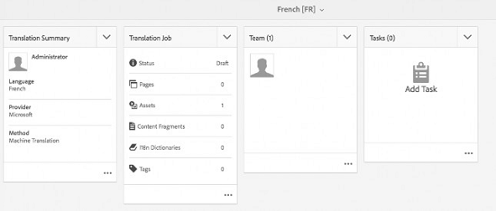

# 创建翻译项目 {#creating-translation-projects}

要创建语言副本，请触发用户界面中“引用”边栏下提供的以下语言副本工作流之 [!DNL Experience Manager] 一。

* **创建和翻译**:在此工作流中，要翻译的资产会被复制到您要翻译的语言的语言的语言根目录中。 此外，根据您选择的选项，系统会在“项目”控制台中为资产创建一个转换项目。 根据设置，可以手动启动翻译项目，也可以允许翻译项目在创建后立即自动运行。

* **更新语言副本**:运行此工作流以翻译另一组资产，并将其包含在特定区域设置的语言副本中。 在这种情况下，已翻译的资产会添加到已包含先前已翻译资产的目标文件夹中。

>[!NOTE]
>
>仅当翻译服务提供商支持二进制的翻译时，资产二进制才进行翻译。

>[!NOTE]
>
>如果您为复杂资产（如PDF和InDesign文件）启动翻译工作流，则不会提交其子资产或演绎版（如果有）以进行翻译。

## 创建和翻译工作流 {#create-and-translate-workflow}

您首次使用创建和翻译工作流为特定语言生成语言副本。 该工作流提供以下选项：

* 只创建结构.
* 创建新翻译项目.
* 添加到现有翻译项目.

### 只创建结构 {#create-structure-only}

使用“ **[!UICONTROL 仅创建结构]** ”选项可在目标语言根目录中创建目标文件夹层次结构，以匹配源语言根目录中源文件夹的层次结构。 在这种情况下，源资产会复制到目标文件夹。 但是，不会生成翻译项目。

1. 在界 [!DNL Assets] 面中，选择要在目标语言根目录中创建结构的源文件夹。
1. 打开&#x200B;**[!UICONTROL 引用]**&#x200B;窗格，然后单击/点按&#x200B;**[!UICONTROL 副本]**&#x200B;下的&#x200B;**[!UICONTROL 语言副本]**。

   

1. 单击／点按 **[!UICONTROL 底部的创建]** 和翻译。

   

1. From the **[!UICONTROL Target Languages]** list, select the language for which you want to create a folder structure.

   

1. 从&#x200B;**[!UICONTROL 项目]**&#x200B;列表中，选择&#x200B;**[!UICONTROL 仅创建结构]**。

   

1. 单击/点按&#x200B;**[!UICONTROL 创建]**。目标语的新结构列在“语言副本” **[!UICONTROL 下]**。

   

1. 单击／点按列表中的结构，然后单击／点按资产中的 **[!UICONTROL 显示]** ，以导航到目标语言中的文件夹结构。

   

### 创建新翻译项目 {#create-a-new-translation-project}

如果您使用此选项，则要翻译的资产将复制到您要翻译的语言的语言的语言根目录中。 根据您选择的选项，系统会在“项目”控制台中为资产创建一个翻译项目。 根据设置，可以手动启动翻译项目，或在创建翻译项目后自动运行。

1. 在资产UI中，选择要为其创建语言副本的源文件夹。
1. 打开&#x200B;**[!UICONTROL 引用]**&#x200B;窗格，然后单击/点按&#x200B;**[!UICONTROL 副本]**&#x200B;下的&#x200B;**[!UICONTROL 语言副本]**。

   

1. 单击／点按 **[!UICONTROL 底部的创建]** 和翻译。

   

1. 从&#x200B;**[!UICONTROL 目标语言]**&#x200B;列表中，选择要为其创建文件夹结构的语言。

   

1. 在“项 **[!UICONTROL 目]** ”列表中 **[!UICONTROL ，选择]**“创建新翻译项目”。

   

1. 在&#x200B;**[!UICONTROL 项目标题]**&#x200B;字段中，输入项目标题。

   

1. 单击/点按&#x200B;**[!UICONTROL 创建]**。源文件夹中的资产将复制到步骤4中所选区域设置的目标文件夹。

   

1. 要导航到文件夹，请选择语言副本，然后单击“在资 **[!UICONTROL 产中显示”]**。

   

1. 导航到项目控制台。 翻译文件夹会被复制到项目控制台。

   

1. 打开文件夹以视图翻译项目。

   

1. 单击／点按项目以打开详细信息页面。

   

1. 要视图翻译作业的状态，请单击“翻译作业”拼贴底部的省略 **[!UICONTROL 号]** 。

   

   有关作业状态的更多详细信息，请 [参阅监视翻译作业的状态](/help/sites-administering/tc-manage.md#monitoring-the-status-of-a-translation-job)。

1. 导航到资产UI，然后打开每个已翻译资产的“属性”页面以视图已翻译的元数据。

   

   *图：资产属性页面中的已翻译元数据。*

   >[!NOTE]
   >
   >此功能适用于资产和文件夹。 选择资产而不是文件夹后，系统会复制到语言根目录下的整个文件夹层次结构，为资产创建语言副本。

### 添加到现有翻译项目 {#add-to-existing-translation-project}

如果您使用此选项，则在运行以前的翻译工作流之后，将为添加到源文件夹的资产运行翻译工作流。 只有新添加的资产才会复制到包含先前已翻译资产的目标文件夹。 在这种情况下，不会创建新的翻译项目。

1. 在资产UI中，导航到包含未翻译资产的源文件夹。
1. 选择要翻译的资产，然后打开&#x200B;**[!UICONTROL “引用”窗格]**。**[!UICONTROL 语言副本]**&#x200B;部分显示当前可用的翻译副本数。
1. 单击/点按&#x200B;**[!UICONTROL 副本]**&#x200B;下的&#x200B;**[!UICONTROL 语言副本]**。此时将显示可用翻译副本列表。
1. 单击／点按 **[!UICONTROL 底部的创建]** 和翻译。

   

1. 从&#x200B;**[!UICONTROL 目标语言]**&#x200B;列表中，选择要为其创建文件夹结构的语言。

   

1. 从“项 **[!UICONTROL 目]** ”列表中，选择 **[!UICONTROL 添加到现有翻译项目]** ，以在文件夹上运行翻译工作流。

   

   >[!NOTE]
   >
   >如果选择“ **[!UICONTROL 添加到现有翻译项目”选项]** ，则只有在项目设置与现有项目的设置完全匹配时，翻译项目才会添加到预先存在的项目。 否则，将创建新项目。

1. 从“现 **[!UICONTROL 有翻译项目]** ”列表中，选择要添加要翻译的资产的项目。

   

1. 单击/点按&#x200B;**[!UICONTROL 创建]**。要翻译的资产将添加到目标文件夹。更新的文件夹列在&#x200B;**[!UICONTROL 语言副本]**&#x200B;部分下。

   

1. 导航到项目控制台，然后打开您添加到的现有翻译项目。
1. 单击／点按项目详细信息页面视图的翻译项目。

   

1. Click/tap the ellipsis at the bottom of the **Translation Job** tile to view the assets in the translation workflow. 转换作业列表还显示资产元数据和标记的条目。 这些条目指示资产的元数据和标记也会被翻译。

   >[!NOTE]
   >
   >如果删除标记或元数据的条目，则不会为任何资产转换标记或元数据。

   >[!NOTE]
   >
   >如果使用机器翻译，则资产二进制文件不会翻译。

   >[!NOTE]
   >
   >如果您添加到翻译作业的资产包含子资产，请选择子资产并删除这些子资产，以便翻译继续，而不会出现任何故障。

1. 要开始资产的翻译，请单击／点按翻译作业拼贴上的箭头 **[!UICONTROL ，然后从列表]** 中选择 **[!UICONTROL 开始]** 。

   

   系统会显示一条消息，通知翻译作业的开始。

   

1. 要视图翻译作业的状态，请单击／点按翻译作业拼贴底部的 **[!UICONTROL 省略号]** 。

   

   有关详细信息，请 [参阅监视翻译作业的状态](/help/sites-administering/tc-manage.md#monitoring-the-status-of-a-translation-job)。

1. 翻译完成后，状态将变为“准备审阅”。 导航到资产UI，然后打开每个已翻译资产的“属性”页面以视图已翻译的元数据。

## 更新语言副本 {#update-language-copies}

运行此工作流以翻译任何其他资产集，并将其包含在特定区域设置的语言副本中。 在这种情况下，已翻译的资产会添加到已包含先前已翻译资产的目标文件夹中。 根据选项的选择，系统会创建翻译项目或更新新资产的现有翻译项目。 更新语言副本工作流包含以下选项：

* 创建新翻译项目
* 添加到现有翻译项目

### 创建新翻译项目 {#create-a-new-translation-project-1}

如果您使用此选项，则会为要更新语言副本的一组资产创建一个翻译项目。

1. 从资产UI中，选择您添加资产的源文件夹。
1. 打开&#x200B;**[!UICONTROL 引用]**&#x200B;窗格，然后单击/点按&#x200B;**[!UICONTROL 副本]**&#x200B;下的&#x200B;**[!UICONTROL 语言副本]**，以显示语言副本列表。
1. 选中&#x200B;**[!UICONTROL 语言副本]**&#x200B;前面的复选框，然后选择相应区域设置的目标文件夹。

   

1. 单击／点按 **[!UICONTROL 底部的“更新语言副本]** ”。

   

1. 从“项 **[!UICONTROL 目]** ”列表中，选 **[!UICONTROL 择“创建新翻译项目”]**。

   

1. 在&#x200B;**[!UICONTROL 项目标题]**&#x200B;字段中，输入项目标题。

   

1. 单击／点按 **[!UICONTROL 开始]**。
1. 导航到项目控制台。 翻译文件夹会被复制到项目控制台。

   

1. 打开文件夹以视图翻译项目。

   

1. 单击／点按项目以打开详细信息页面。

   

1. 要开始资产的翻译，请单击“翻译作业”拼贴上的 **[!UICONTROL 箭头]** ，然后从列表 **[!UICONTROL 中选择]** 开始。

   

   系统会显示一条消息，通知翻译作业的开始。

   

1. 要视图翻译作业的状态，请单击／点按翻译作业拼贴底部的 **[!UICONTROL 省略号]** 。

   

   有关作业状态的更多详细信息，请 [参阅监视翻译作业的状态](../sites-administering/tc-manage.md#monitoring-the-status-of-a-translation-job)。

1. 导航到资产UI，然后打开每个已翻译资产的“属性”页面以视图已翻译的元数据。

### 添加到现有翻译项目 {#add-to-existing-translation-project-1}

如果您使用此选项，则资产集会添加到现有翻译项目中，以更新您选择的区域设置的语言副本。

1. 从资产UI中，选择您添加资产文件夹的源文件夹。
1. 打开&#x200B;**[!UICONTROL 引用]**&#x200B;窗格，单击/点按&#x200B;**[!UICONTROL 副本]**&#x200B;下的&#x200B;**[!UICONTROL 语言副本]**，以显示语言副本列表。

   

1. 选中&#x200B;**[!UICONTROL 语言副本]**&#x200B;前面的复选框，这将选择所有语言副本。除与您要翻译的区域设置对应的语言副本外，取消选择其他副本。

   

1. 单击／点按 **[!UICONTROL 底部的“更新语言副本]** ”。

   

1. 从“项 **[!UICONTROL 目]** ”列表中 **[!UICONTROL ，选择“]**&#x200B;添加到现有翻译项目”。

   

1. 从“现 **[!UICONTROL 有翻译项目]** ”列表中，选择要添加要翻译的资产的项目。

   

1. 单击／点按 **[!UICONTROL 开始]**。
1. 请参阅添加到现有翻译 [项目中的步骤](translation-projects.md#add-to-existing-translation-project) 9-14以完成其余步骤。

## 创建临时语言副本 {#creating-temporary-language-copies}

运行翻译工作流以使用已编辑版本的原始资产更新语言副本时，将保留现有语言副本，直到您批准已翻译的资产。 [!DNL Adobe Experience Manager Assets] 在您明确批准资产后，将新翻译的资产存储在临时位置并更新现有语言副本。 如果您拒绝资产，则语言副本将保持不变。

1. Click/tap the source root folder under **[!UICONTROL Language Copies]** for which you already created a language copy, and then click/tap **[!UICONTROL Reveal in Assets]** to open the folder in [!DNL Experience Manager Assets].

   

1. 在界面 [!DNL Assets] 中，选择已翻译的资产，然后单击／点按工具栏中的编辑图 **[!UICONTROL 标]** ，以在编辑模式下打开资产。
1. 编辑资产，然后保存更改。
1. 执行添加到现有翻译项目 [过程的步骤](#add-to-existing-translation-project) 2-14以更新语言副本。
1. 单击／点按翻译作业拼贴底部的 **[!UICONTROL 省略号]** 。 从“转换作业”页面中的 **[!UICONTROL 资产列表]** ，您可以清楚地视图存储资产翻译版本的临时位置。

   

1. 选中“标题”旁边的复 **[!UICONTROL 选框]**。
1. 在工具栏中，单击/点按&#x200B;**[!UICONTROL 接受翻译]**，然后单击/点按对话框中的&#x200B;**[!UICONTROL 接受]**，以使用已编辑资产的已翻译版本覆盖目标文件夹中的已翻译资产。

   

   >[!NOTE]
   >
   >要启用翻译工作流来更新目标资产，请接受资产和元数据。

   单击／点按 **[!UICONTROL 拒绝翻译]** ，以在目标区域设置根目录中保留资产的最初翻译版本并拒绝编辑的版本。

   

1. 要视图已翻译的元数据，请导航到控 [!DNL Assets] 制台，然后打开每个已 [!UICONTROL 翻译资产的] “属性”页面。

>[!MORELIKETHIS]
>
>* [高效翻译元数据的提示](https://blogs.adobe.com/experiencedelivers/experience-management/translate_aemassets_metadata/)。

