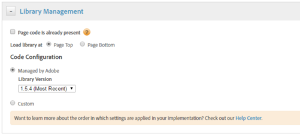

# 通过DTM启用Assets分析 {#enable-asset-insights-through-dtm}

AdobeDynamic Tag Management是一款可激活您的数字营销工具的工具。 Adobe Analytics客户可以免费使用。 您可以自定义跟踪代码以使第三方CMS解决方案能够使用Assets Insights，也可以使用DTM插入Assets Insights标记。 仅支持图像并提供见解。

>[!CAUTION]
>
>已弃用AdobeDTM以支持[!DNL Adobe Experience Platform]，其生命周期即将结束[&#128279;](https://medium.com/launch-by-adobe/dtm-plans-for-a-sunset-3c6aab003a6f)。 Adobe建议您[使用 [!DNL Adobe Experience Platform] 进行资产分析](https://experienceleague.adobe.com/docs/experience-manager-learn/assets/advanced/asset-insights-launch-tutorial.html)。

执行这些步骤可通过DTM启用Assets Insights。

1. 单击Experience Manager徽标，然后转到&#x200B;**[!UICONTROL 工具]** > **[!UICONTROL Assets]** > **[!UICONTROL 分析配置]**。
1. [使用DTMCloud Service配置Experience Manager部署](/help/sites-administering/dtm.md)

   一旦登录到[https://dtm.adobe.com](https://dtm.adobe.com/)并访问用户配置文件中的&#x200B;**[!UICONTROL 帐户设置]**，API令牌即可使用。 从Assets Insights的角度来看，此步骤不是必需的，因为Experience Manager Sites与Assets Insights的集成仍在进行中。

1. 登录到[https://dtm.adobe.com](https://dtm.adobe.com/)，并根据需要选择一个公司。
1. 创建或打开现有Web属性

   * 选择&#x200B;**[!UICONTROL Web属性]**&#x200B;选项卡，然后单击&#x200B;**[!UICONTROL 添加属性]**。

   * 更新相应的字段，然后单击&#x200B;**[!UICONTROL 创建属性]**。 请参阅[文档](https://experienceleague.adobe.com/docs/experience-manager-learn/getting-started-wknd-tutorial-develop/overview.html?lang=zh-Hans)。

   

1. 在&#x200B;**[!UICONTROL 规则]**&#x200B;选项卡中，从导航窗格中选择&#x200B;**[!UICONTROL 页面加载规则]**，然后单击&#x200B;**[!UICONTROL 创建新规则]**。

   

1. 展开&#x200B;**[!UICONTROL JavaScript /第三方标记]**。 然后在&#x200B;**[!UICONTROL 连续HTML]**&#x200B;选项卡中单击&#x200B;**[!UICONTROL 添加新脚本]**&#x200B;以打开“脚本”对话框。

   

1. 单击Experience Manager徽标，然后转到&#x200B;**[!UICONTROL 工具]** > **[!UICONTROL Assets]**。
1. 单击&#x200B;**[!UICONTROL 分析页面跟踪器]**，复制该跟踪器代码，然后将其粘贴到您在步骤6中打开的脚本对话框中。 保存更改。

   >[!NOTE]
   >
   >* `AppMeasurement.js`已删除。 它应通过DTM的Adobe Analytics工具提供。
   >* 对`assetAnalytics.dispatcher.init()`的调用已删除。 DTM的Adobe Analytics工具完成加载后，预计会调用函数。
   >* 根据托管Assets Insights页面跟踪器的位置(例如，Experience Manager、CDN等)，可能需要更改脚本源的来源。
   >* 对于Experience Manager托管的页面跟踪器，源应使用调度程序实例的主机名指向发布实例。

1. 访问`https://dtm.adobe.com`。 单击Web属性中的&#x200B;**[!UICONTROL 概述]**，然后单击&#x200B;**[!UICONTROL 添加工具]**&#x200B;或打开现有的Adobe Analytics工具。 在创建工具时，您可以将&#x200B;**[!UICONTROL 配置方法]**&#x200B;设置为&#x200B;**[!UICONTROL 自动]**。

   

   根据需要选择暂存/生产报表包。

1. 展开&#x200B;**[!UICONTROL 库管理]**，并确保&#x200B;**[!UICONTROL 加载位于]**&#x200B;的库设置为&#x200B;**[!UICONTROL 页面顶部]**。

   

1. 展开&#x200B;**[!UICONTROL 自定义页面代码]**，然后单击&#x200B;**[!UICONTROL 打开编辑器]**。

   

1. 将以下代码粘贴到窗口中：

   ```Java
   var sObj;
   
   if (arguments.length > 0) {
     sObj = arguments[0];
   } else {
     sObj = _satellite.getToolsByType('sc')[0].getS();
   }
   _satellite.notify('in assetAnalytics customInit');
   (function initializeAssetAnalytics() {
     if ((!!window.assetAnalytics) && (!!assetAnalytics.dispatcher)) {
       _satellite.notify('assetAnalytics ready');
       /** NOTE:
           Copy over the call to 'assetAnalytics.dispatcher.init()' from Assets Pagetracker
           Be mindful about changing the AppMeasurement object as retrieved above.
       */
       assetAnalytics.dispatcher.init(
             "",  /** RSID to send tracking-call to */
             "",  /** Tracking Server to send tracking-call to */
             "",  /** Visitor Namespace to send tracking-call to */
             "",  /** listVar to put comma-separated-list of Asset IDs for Asset Impression Events in tracking-call, for example, 'listVar1' */
             "",  /** eVar to put Asset ID for Asset Click Events in, for example, 'eVar3' */
             "",  /** event to include in tracking-calls for Asset Impression Events, for example, 'event8' */
             "",  /** event to include in tracking-calls for Asset Click Events, for example, 'event7' */
             sObj  /** [OPTIONAL] if the webpage already has an AppMeasurement object, include the object here. If unspecified, Pagetracker Core shall create its own AppMeasurement object */
             );
       sObj.usePlugins = true;
       sObj.doPlugins = assetAnalytics.core.updateContextData;
       assetAnalytics.core.optimizedAssetInsights();
     }
     else {
       _satellite.notify('assetAnalytics not available. Consider updating the Custom Page Code', 4);
     }
   })();
   ```

   * DTM中的页面加载规则仅包含`pagetracker.js`代码。 任何`assetAnalytics`字段都视为默认值的覆盖。 默认情况下，它们不是必需的。
   * 在确保`_satellite.getToolsByType('sc')[0].getS()`已初始化并且`assetAnalytics,dispatcher.init`可用之后，代码调用`assetAnalytics.dispatcher.init()`。 因此，可跳过在步骤11中添加缩览图。
   * 如分析页面跟踪器代码(**[!UICONTROL 工具> Assets > Insights页面跟踪器]**)中的注释所示，当页面跟踪器未创建`AppMeasurement`对象时，前三个参数（RSID、跟踪服务器和访客命名空间）无关。 而是传递空字符串以突出显示此内容。\
     其余参数对应于“Insights配置”页面中配置的参数(**[!UICONTROL 工具> Assets > Insights配置]**)。
   * 通过查询所有可用AppMeasurement引擎的`satelliteLib`来检索SiteCatalyst对象。 如果配置了多个标记，请相应地更改阵列选择器的索引。 数组中的条目按照DTM界面中提供的SiteCatalyst工具进行排序。

1. 保存并关闭代码编辑器窗口，然后在工具配置中保存更改。
1. 在&#x200B;**[!UICONTROL 审批]**&#x200B;选项卡中，审批两个待处理的审批。 DTM标记已准备好插入到您的网页中。
