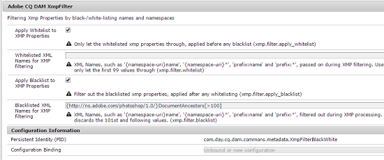

# XMP写回到演绎版 {#xmp-writeback-to-renditions}

| 版本 | 文章链接 |
| -------- | ---------------------------- |
| AEM as a Cloud Service | [单击此处](https://experienceleague.adobe.com/en/docs/experience-manager-cloud-service/content/assets/admin/xmp-metadata) |
| AEM 6.5 | 本文 |

[!DNL Adobe Experience Manager Assets]中的此XMP写回功能将元数据更改复制到原始资源的演绎版。 当您从Assets中更改资源的元数据或上传资源时，所做的更改最初存储在资源层次结构的元数据节点中。

通过XMP写回功能，可将元数据更改传播到资源的所有或特定演绎版。 该功能仅写回那些使用已注册命名空间的元数据属性，即写回名为`dc:title`的属性，但不写回名为`mytitle`的属性。

考虑将标题为`Classic Leather`的资源的[!UICONTROL Title]属性修改为`Nylon`的方案。

在本例中，[!DNL Experience Manager Assets]将更改保存到资源层次结构中存储的资源元数据的`dc:title`参数中的&#x200B;**[!UICONTROL Title]**&#x200B;属性。

但是，[!DNL Experience Manager Assets]不会自动将任何元数据更改传播到资源的演绎版。 请参阅[如何启用XMP写回](#enable-xmp-writeback)。

## 启用XMP写回 {#enable-xmp-writeback}

若要在上传资产时允许将元数据更改传播到资产的演绎版，请在Configuration Manager中修改&#x200B;**[!UICONTROL Adobe CQ DAM Rendition Maker]**&#x200B;配置。

1. 要打开配置管理器，请访问`https://[aem_server]:[port]/system/console/configMgr`。
1. 打开&#x200B;**[!UICONTROL Adobe CQ DAM Rendition Maker]**&#x200B;配置。
1. 选择&#x200B;**[!UICONTROL 传播XMP]**&#x200B;选项，然后保存更改。

   

## 为特定呈现版本启用XMP写回 {#enabling-xmp-writeback-for-specific-renditions}

要让XMP写回功能将元数据更改传播到选择演绎版，请将这些演绎版指定到[!UICONTROL DAM元数据写回]工作流的XMP写回进程工作流步骤。 默认情况下，此步骤使用原始演绎版进行配置。

要让XMP写回功能将元数据传播到演绎版缩略图140.100.png和319.319.png，请执行以下步骤。

1. 在Experience Manager界面中，导航到&#x200B;**[!UICONTROL 工具]** > **[!UICONTROL 工作流]** > **[!UICONTROL 模型]**。
1. 从“模型”页面中，打开&#x200B;**[!UICONTROL DAM元数据写回]**&#x200B;工作流模型。
1. 在“ **[!UICONTROL DAM元数据写回]** ”属性页中，打开“ **[!UICONTROL XMP写回进程”步骤]** 。
1. 在[!UICONTROL 步骤属性]对话框中，单击&#x200B;**[!UICONTROL 进程]**&#x200B;选项卡。
1. 在&#x200B;**参数**&#x200B;框中，添加`rendition:cq5dam.thumbnail.140.100.png,rendition:cq5dam.thumbnail.319.319.png`，然后单击&#x200B;**[!UICONTROL 确定]**。

   

1. 保存更改。
1. 要使用新属性重新生成[!DNL Dynamic Media]图像的金字塔TIFF呈现，请将&#x200B;**[!UICONTROL Dynamic Media流程图像Assets]**&#x200B;步骤添加到[!UICONTROL DAM元数据写回]工作流。

   PTIFF 呈现仅在 Dynamic Media Hybrid 实施中本地创建和存储。

1. 保存工作流。

元数据更改将传播到资源的演绎版thumbnail.140.100.png和thumbnail.319.319.png ，而不是其他内容。

>[!NOTE]
>
>有关支持的平台，请参阅[XMP元数据回写先决条件](/help/sites-deploying/technical-requirements.md#requirements-for-aem-assets-xmp-metadata-write-back)。

## 筛选XMP元数据 {#filtering-xmp-metadata}

[!DNL Experience Manager Assets]支持对从资源二进制文件读取并在引入资源时存储在JCR中的XMP元数据的属性/节点进行阻止列表和允许列表筛选。

使用阻止列表进行筛选时，您可以导入所有XMP元数据属性，但为排除项指定的属性除外。 但是，对于具有大量XMP元数据的资源类型（例如，具有10,000个属性的1000个节点），并不总是预先知道要过滤的节点的名称。 如果使用阻止列表进行筛选，则允许导入大量包含许多XMP元数据的资源，则[!DNL Experience Manager]部署可能会遇到稳定性问题，例如，观察队列拥塞。

通过允许列表过滤XMP元数据通过允许您定义要导入的XMP属性来解决此问题。 这样，任何其他或未知的XMP资产都将被忽略。 为了向后兼容，您可以将其中某些属性添加到使用阻止列表的过滤器中。

>[!NOTE]
>
>过滤仅适用于从资产二进制文件中的XMP源派生的属性。 对于从非XMP源(如EXIF和IPTC格式)派生的属性，筛选不起作用。 例如，资源创建日期存储在EXIF TIFF中名为`CreateDate`的属性中。 Experience Manager将此值存储在名为`exif:DateTimeOriginal`的元数据字段中。 由于源是非XMP源，因此对此资产无法进行筛选。

1. 要打开配置管理器，请访问`https://[aem_server]:[port]/system/console/configMgr`。
1. 打开&#x200B;**[!UICONTROL Adobe CQ DAM XmpFilter]**&#x200B;配置。
1. 要通过允许列表列入允许列表应用筛选，请选择&#x200B;**[!UICONTROL 将应用于XMP属性]**，然后在&#x200B;**[!UICONTROL XMP筛选的XML名称允许]**&#x200B;框中指定要导入的属性。

   

1. 要在通过允许列表应用过滤后过滤掉阻止的XMP属性，请在&#x200B;**[!UICONTROL 用于XMP过滤的阻止XML名称]**&#x200B;框中指定这些属性。

   >[!NOTE]
   >
   >默认情况下已选中&#x200B;**[!UICONTROL 将阻止列表应用到XMP属性]**&#x200B;选项。 换言之，默认情况下启用使用阻止列表进行筛选。 列入阻止列表要禁用此类筛选，请取消选择&#x200B;**[!UICONTROL 将应用于XMP属性]**&#x200B;选项。

1. 保存更改。
