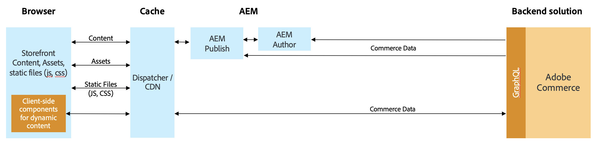

# 使用Commerce integration framework集成AEM和Adobe Commerce(Magento) {#aem-commerce-framework}

使用Commerce integration framework(CIF)可无缝集成Experience Manager和Adobe Commerce。 CIF使AEM能够使用Adobe Commerce的[GraphQL API](https://devdocs.magento.com/guides/v2.4/graphql/)直接访问商务实例并与之通信。

>[!NOTE]
>
>支持的最低GraphQL API版本为2.3.5。仅在较新版本或仅在Adobe Commerce版本中支持某些功能。

## 架构概述 {#overview}

整体架构如下：

在CIF中，支持服务器端和客户端通信模式。
服务器端API调用是结合使用内置、通用[GraphQL客户端](https://github.com/adobe/commerce-cif-graphql-client)和为商业GraphQL架构生成的[数据模型集](https://github.com/adobe/commerce-cif-magento-graphql)实现的。 此外，还可以使用GQL格式的任何GraphQL查询或突变。

对于使用[React](https://reactjs.org/)生成的客户端组件，使用[Apollo客户端](https://www.apollographql.com/docs/react/)。

## AEM CIF核心组件架构 {#cif-core-components}

[AEM CIF核心组件](https://github.com/adobe/aem-core-cif-components)遵循与[AEM WCM核心组件](https://github.com/adobe/aem-core-wcm-components)非常相似的设计模式和最佳实践。

在Sling模型中实现与AEM CIF核心组件的Adobe Commerce的业务逻辑和后端通信。 如果必须自定义此逻辑以满足项目特定的要求，可以使用Sling模型的委托模式。

>[!TIP]
>
>“[自定义AEM CIF核心组件](../customizing/customize-cif-components.md)”页面提供了有关如何自定义CIF核心组件的详细示例和最佳实践。

在项目中，AEM CIF核心组件和自定义项目组件可以通过Sling上下文感知配置，轻松检索与AEM页面关联的Adobe Commerce应用商店的配置客户端。
