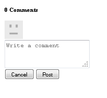

# 添加Clientlibs {#add-clientlibs}

## 添加ClientLibraryFolder (clientlibs) {#add-a-clientlibraryfolder-clientlibs}

创建一个名为`clientlibs`的ClientLibraryFolder，其中包含用于呈现网站页面的JavaScript (JS)和层叠样式表(CSS)。

为此客户端库提供的`categories`属性值是用于直接从内容页面包含此clientlib或将其嵌入其他clientlib的标识符。

1. 使用&#x200B;**CRXDE Lite**，展开`/etc/designs`

1. 右键单击`an-scf-sandbox`并选择`Create Node`

   * 名称：`clientlibs`
   * 类型： `cq:ClientLibraryFolder`

1. 单击&#x200B;**确定**


在新`clientlibs`节点的&#x200B;**属性**&#x200B;选项卡中，输入&#x200B;**类别**&#x200B;属性：

* 名称：**类别**
* 类型： **字符串**
* 值： **apps.an-scf-sandbox**
* 单击&#x200B;**添加**
* 单击&#x200B;**全部保存**

注意：在类别值前面加上“apps”。 是一个用于将“拥有的应用程序”标识为/apps文件夹中的约定，而不是/libs中的约定。 重要：添加占位符`js.tx`t和&#x200B;**`css.txt`**&#x200B;文件。 （正式来说，它不是cq：ClientLibraryFolder，没有它们。）

1. 右键单击&#x200B;**`/etc/designs/an-scf-sandbox/clientlibs`**
1. 选择&#x200B;**创建文件……**
1. 输入&#x200B;**名称：** `css.txt`
1. 选择&#x200B;**创建文件……**
1. 输入&#x200B;**名称：** `js.txt`
1. 单击&#x200B;**全部保存**


css.txt和js.txt的第一行标识了找到以下文件列表的基本位置。

尝试将css.txt的内容设置为

```
#base=.
 style.css
```

然后，在clientlibs下创建一个名为style.css的文件，并将内容设置为

`body {`

`background-color: #b0c4de;`

`}`

### 嵌入SCF Clientlibs {#embed-scf-clientlibs}

在`clientlibs`节点的&#x200B;**属性**&#x200B;选项卡中，输入多值字符串属性&#x200B;**embed**。 这会为SCF组件](/help/communities/client-customize.md#clientlibs-for-scf)嵌入必要的[客户端库(clientlibs)。 在本教程中，添加了社区组件所需的许多clientlibs。

这可能是也可能不是用于生产站点的所需方法，因为需要考虑方便性相对于为每个页面下载的clientlibs的大小/速度。

如果在一个页面上仅使用一个功能，则可以直接在页面上包括该功能的完整clientlib，例如，

`% ui:includeClientLib categories=cq.social.hbs.forum" %`

在这种情况下，请包括所有客户端，因此首选的是更基本的SCF clientlibs，即创作clientlibs：

* 名称：**`embed`**
* 类型： **`String`**
* 单击&#x200B;**`Multi`**
* 值： **`cq.social.scf`**

   * 它会弹出一个对话框，
在每个条目后单击**`+`**&#x200B;以添加以下clientlib类别：

      * **`cq.ckeditor`**
      * **`cq.social.author.hbs.comments`**
      * **`cq.social.author.hbs.forum`**
      * **`cq.social.author.hbs.rating`**
      * **`cq.social.author.hbs.reviews`**
      * **`cq.social.author.hbs.voting`**
      * 单击&#x200B;**确定**

* 单击&#x200B;**全部保存**


`/etc/designs/an-scf-sandbox/clientlibs`现在应这样显示在存储库中：


### 在PlayPage模板中包含Clientlibs {#include-clientlibs-in-playpage-template}

如果页面上不包含`apps.an-scf-sandbox` ClientLibraryFolder类别，则SCF组件将无法正常运行，也无法设置样式，因为必要的JavaScript和CSS样式将不可用。

例如，如果不包含clientlibs，SCF注释组件将无样式显示：



包含apps.an-scf-sandbox clientlibs后，SCF注释组件显示为已设置样式：


Include语句属于`html`脚本的`head`部分。 默认&#x200B;**`foundation head.jsp`**&#x200B;包含可覆盖的脚本： **`headlibs.jsp`**。

**复制headlibs.jsp并包含clientlibs：**

1. 使用&#x200B;**CRXDE Lite**，选择&#x200B;**`/libs/foundation/components/page/headlibs.jsp`**

1. 右键单击并选择&#x200B;**复制**（或从工具栏中选择“复制”）
1. 选择&#x200B;**`/apps/an-scf-sandbox/components/playpage`**
1. 右键单击并选择&#x200B;**粘贴**（或从工具栏中选择“粘贴”）
1. 双击&#x200B;**`headlibs.jsp`**&#x200B;以将其打开
1. 将以下行附加到文件末尾
   **`<ui:includeClientLib categories="apps.an-scf-sandbox"/>`**

1. 单击&#x200B;**全部保存**

```xml
<%@ page session="false" %><%
%><%@include file="/libs/foundation/global.jsp" %><%
%><ui:includeClientLib categories="cq.foundation-main"/><%
%>
<cq:include script="/libs/cq/cloudserviceconfigs/components/servicelibs/servicelibs.jsp"/>
<% currentDesign.writeCssIncludes(pageContext); %>
<ui:includeClientLib categories="apps.an-scf-sandbox"/>
```

在浏览器中加载您的网站，然后查看背景是否不是蓝色阴影。

[https://localhost:4502/content/an-scf-sandbox/en/play.html](https://localhost:4502/content/an-scf-sandbox/en/play.html)


### 目前保存您的工作 {#saving-your-work-so-far}

此时，存在一个极简主义的沙箱。 可能值得另存为软件包，这样在播放时，如果您的存储库损坏并且您想要重新开始，则可以关闭服务器。 然后重命名或删除文件夹crx-quickstart/ ，打开服务器，上传并安装此保存的包，而不必重复这些最基本的步骤。

此包存在于[创建示例页面](/help/communities/create-sample-page.md)教程中，供无法等待跳入并开始播放的用户使用。

要创建包，请执行以下操作：

* 在CRXDE Lite中，单击[包图标](https://localhost:4502/crx/packmgr/)
* 单击&#x200B;**创建包**

   * 包名称： an-scf-sandbox-minimal-pkg
   * 版本：0.1
   * 组： `leave as default`
   * 单击&#x200B;**确定**

* 单击&#x200B;**编辑**

   * 选择&#x200B;**筛选器**&#x200B;选项卡

      * 单击&#x200B;**添加筛选器**
      * 根路径：浏览到`/apps/an-scf-sandbox`
      * 单击&#x200B;**完成**
      * 单击&#x200B;**添加筛选器**
      * 根路径：浏览到`/etc/designs/an-scf-sandbox`
      * 单击&#x200B;**完成**
      * 单击&#x200B;**添加筛选器**
      * 根路径：浏览到`/content/an-scf-sandbox**`
      * 单击&#x200B;**完成**

   * 单击&#x200B;**保存**

* 单击&#x200B;**生成**

现在，您可以选择&#x200B;**下载**&#x200B;以将其保存到磁盘，选择&#x200B;**将包上载到其他位置**，然后选择&#x200B;**更多>复制**&#x200B;以将沙盒推送到本地主机发布实例以扩展沙盒领域。
