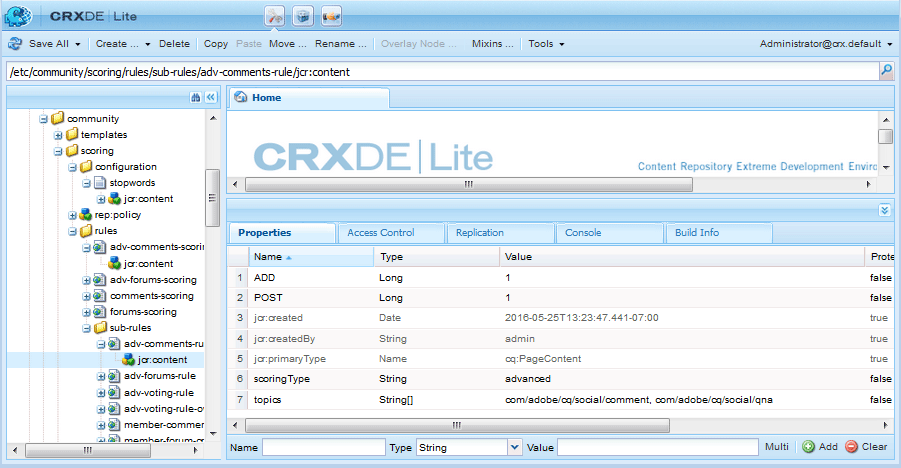

# 高级评分和徽章{#advanced-scoring-and-badges}

## 概述 {#overview}

高级评分允许授予徽章，将成员识别为专家。 高级评分根据数量分配分数 *和* 成员创建的内容质量，而基本评分根据创建的内容量分配点数。

造成这种差异的原因是，评分引擎用于计算得分。 基本的评分引擎应用了简单的数学运算。 高级评分引擎是一种自适应算法，通过主题的自然语言处理(NLP)推断，奖励贡献有价值和相关内容的活跃成员。

除了内容相关性之外，评分算法还会考虑成员活动，如投票和回答百分比。 虽然基本评分包括量化评分，但高级评分通过算法使用它们。

因此，高级评分引擎需要足够的数据才能使分析具有意义。 随着算法不断根据创建的内容数量和质量进行调整，会不断重新评估成为专家的成就门槛。 还有一个概念 *衰减* 成员较旧的职位。 如果专家成员在某个预先确定的时间停止参与他们获得专家身份的主题(见 [评分引擎配置](#configurable-scoring-engine))他们可能会失去专家身份。

设置高级评分与基本评分几乎相同：

* 基本和高级评分和徽章规则包括 [应用于内容](/help/communities/implementing-scoring.md#apply-rules-to-content) 同样的方式。

   * 基本和高级评分和徽章规则可应用于相同内容。

* [启用组件的徽章](/help/communities/implementing-scoring.md#enable-badges-for-component) 通用。

设置评分和徽章规则的区别在于：

* 可配置的高级评分引擎
* 高级评分规则：

   * `scoringType` 设置为 `advanced`
   * 需要 `stopwords`

* 高级徽章规则：

   * `badgingType` 设置为 `advanced`
   * `badgingLevels` 设置为 **要授奖的专家人数**
   * 需要 `badgingPaths` 徽章的数组，而不是阈值数组，将点映射到徽章。

>[!NOTE]
>
>要使用高级评分和徽章功能，请安装 [专家识别包](https://experience.adobe.com/#/downloads/content/software-distribution/en/aem.html?package=%2Fcontent%2Fsoftware-distribution%2Fen%2Fdetails.html%2Fcontent%2Fdam%2Faem%2Fpublic%2Fadobe%2Fpackages%2Fcq610%2Fsocial%2Ffeaturepack%2Fcq-social-expert-identification-pkg).

## 可配置的评分引擎 {#configurable-scoring-engine}

高级评分引擎提供了OSGi配置，其中包含影响高级评分算法的参数。


* **评分权重**

  对于主题，指定在计算得分时应获得最高优先级的动词。 可以输入一个或多个主题，但仅限于 **每个主题一个动词**. 请参阅 [主题和动词](/help/communities/implementing-scoring.md#topics-and-verbs).
输入为 `topic,verb` 用逗号转义。 例如：
  `/social/forum/hbs/social/forum\,ADD`
对于QnA和论坛组件，默认设置为ADD动词。

* **评分范围**

  高级分数的范围由此值定义（最大分数）和0（最低分数）。

  默认值为100，因此评分范围为0至100。

* **实体衰减时间间隔**

  此参数表示所有实体得分在此小时数之后发生衰退的小时数。 这要求不再将旧内容包含在社区站点的分数中。

  默认值为216000小时（~24年）。

* **评分增长率**
这会指定得分在0分范围之间，如果超出该范围，增长将会减慢，从而限制专家数量。

  默认值为 50。

## 高级评分规则 {#advanced-scoring-rules}

在基本评分中，获得徽章所需的数量是已知的。

在高级评分中，所需的数量会根据系统内的质量数据量不断进行调整。 以类似于钟形曲线的方式持续地计算评分。

如果某个成员在不活跃的主题上获得了专家徽章，则他们可能会由于随着时间的推移而衰退而失去徽章。

### scoringType {#scoringtype}

评分规则是一组评分子规则，每个子规则均声明 `scoringType`.

要调用高级评分引擎，请 `scoringType`应设置为 `advanced`.

请参阅 [评分子规则](/help/communities/implementing-scoring.md#scoring-sub-rules).



### 停用词 {#stopwords}

高级评分包将安装一个包含停用词文件的配置文件夹：

* `/libs/settings/community/scoring/configuration/stopwords`

高级评分算法使用非索引字文件中包含的单词列表来识别在内容处理期间被忽略的常见英语单词。

不期望会修改此文件。

如果缺少停用词文件，则高级评分引擎会出错。

## 高级徽章规则 {#advanced-badging-rules}

高级徽章规则属性与 [基本徽章规则属性](/help/communities/implementing-scoring.md#badging-rules).

无需将点与徽章图像相关联，只需确定允许的专家数量和要授予的徽章图像。


<table>
 <tbody>
  <tr>
   <th>属性</th>
   <th>类型</th>
   <th>值说明</th>
  </tr>
  <tr>
   <td>徽章路径</td>
   <td>String[]</td>
   <td><em>（必需）</em> 徽章图像的多值字符串，最大数量为badgingLevels。 必须订购徽章图像路径，以便将第一个授予最高的专家。 如果badgingLevels指示的徽章较少，则数组中的最后一个徽章将填充数组的其余部分。 示例条目：<br /> <code>/libs/settings/community/badging/images/expert-badge/jcr:content/expert.png</code></td>
  </tr>
  <tr>
   <td>badgingLevels</td>
   <td>长</td>
   <td><em>（可选）</em> 指定要授予的专业知识级别。 例如，如果应该有一个 <code>expert </code>和 <code>almost expert</code> （两个徽章），则值应设置为2。 badgingLevel应与badgingPath属性中列出的专家相关徽章图像数量相对应。 默认值为1。</td>
  </tr>
  <tr>
   <td>徽章类型</td>
   <td>字符串</td>
   <td><em>（必需）</em> 将评分引擎标识为“基本”或“高级”。 设置为“高级”，否则默认值为“基本”。</td>
  </tr>
  <tr>
   <td>评分规则</td>
   <td>String[]</td>
   <td><em>（可选）</em> 一个多值字符串，用于限制标记规则只查看由列出的一个或多个评分规则标识的评分事件。<br /> 示例条目：<br /> <code>/libs/settings/community/scoring/rules/adv-comments-scoring</code><br /> 默认值为无限制。</td>
  </tr>
 </tbody>
</table>

## 包含的规则和徽章 {#included-rules-and-badge}

### 包含的徽章 {#included-badge}

此Beta版本中包含一个基于奖励的专家徽章：

* `expert`

  `/libs/settings/community/badging/images/expert-badge/jcr:content/expert.png`


为了让专家徽章显示为活动的奖励，请确保：

* `Badges` 为功能（如论坛或QnA组件）启用。

* 高级评分和徽章规则应用于放置组件的页面（或祖先）

请参阅以下内容的基本信息：

* [为组件启用徽章](/help/communities/implementing-scoring.md#enableforcomponent)
* [应用规则](/help/communities/implementing-scoring.md#applytopage)

### 包含评分规则和子规则 {#included-scoring-rules-and-sub-rules}

测试版中包括的两个高级评分规则， [论坛功能](/help/communities/functions.md#forum-function) （论坛和评论部分各一个）：

1. `/libs/settings/community/scoring/rules/adv-comments-scoring`

   ```
   subRules[] =
   /libs/settings/community/scoring/rules/sub-rules/adv-comments-rule
   /libs/settings/community/scoring/rules/sub-rules/adv-voting-rule-owner
   /libs/settings/community/scoring/rules/sub-rules/adv-voting-rule
   ```

1. `/libs/settings/community/scoring/rules/adv-forums-scoring`

   ```
   subRules[] =
   /libs/settings/community/scoring/rules/sub-rules/adv-forums-rule
   /libs/settings/community/scoring/rules/sub-rules/adv-comments-rule
   /libs/settings/community/scoring/rules/sub-rules/adv-voting-rule-owner
   ```

**注释：**

* 两者 `rules` 和 `sub-rules` 节点的类型为 `cq:Page`.
* `subRules` 是字符串类型的属性`[]` 在规则的 `jcr:content` 节点。
* `sub-rules` 可以在各种评分规则之间共享。
* `rules` 应位于存储库位置，且每个人都具有读取权限。
* 无论位置如何，规则名称都必须是唯一的。

### 包含的徽章规则 {#included-badging-rules}

此版本中包含两个高级徽章规则，它们与 [高级论坛和评论评分规则](#included-scoring-rules-and-sub-rules).

* `/libs/settings/community/badging/rules/adv-comments-badging`
* `/libs/settings/community/badging/rules/adv-forums-badging`

**注释：**

* `rules` 节点的类型为cq：Page。
* `rules` 应位于存储库位置，且每个人都具有读取权限。
* 无论位置如何，规则名称都必须是唯一的。
