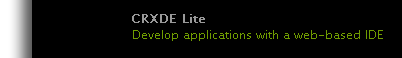

# 创建SCF沙盒  {#create-an-scf-sandbox}

从AEM 6.1 Communities开始，快速创建沙盒的最简单方法是创建社区站点。 请参阅[AEM Communities快速入门](getting-started.md)。

另一个对开发人员有用的工具是[社区组件指南](components-guide.md)，该指南允许探索和快速制作社区组件和功能的原型。

创建网站的练习对于了解AEM网站的结构非常有用，该网站可能包括Communities功能，同时还提供了一些简单页面，可在其上探索使用[社交组件框架(SCF)](scf.md)。

本教程主要面向不熟悉AEM且有兴趣使用SCF组件的开发人员。 它介绍如何创建SCF沙盒站点，与[如何创建功能完善的Internet网站](../../help/sites-developing/website.md)的教程类似，该教程侧重于站点上的结构，如导航、徽标、搜索、工具栏和列出子页面。

开发发生在作者实例上，而试验网站最适合在发布实例上进行。

本教程中的步骤包括：

* [设置网站结构](setup-website.md)
* [初始沙盒应用程序](initial-app.md)
* [初始沙盒内容](initial-content.md)
* [开发沙盒应用程序](develop-app.md)
* [添加Clientlibs](add-clientlibs.md)
* [开发沙盒内容](develop-content.md)

>[!CAUTION]
>
>本教程不会使用使用[社区站点控制台](sites-console.md)创建的功能来创建社区站点。 例如，本教程未介绍如何设置登录、自我注册、[社交登录](social-login.md)、消息传送、个人资料等。
>
>如果首选简单社区站点，请按照[创建示例页面](create-sample-page.md)教程操作。

## 先决条件 {#prerequisites}

本教程假定您安装了一个AEM作者和一个AEM发布实例，该实例具有[最新版本](deploy-communities.md#latest-releases)的社区。

以下是一些对于不熟悉AEM平台的开发人员有用的链接：

* [快速入门](../../help/sites-deploying/deploy.md#getting-started)：用于部署AEM实例。

   * [基础知识](../../help/sites-developing/the-basics.md)：适用于网站和功能的开发人员。
   * [作者的首要步骤](../../help/sites-authoring/first-steps.md)：创作页面内容。

## 使用CRXDE Lite开发环境 {#using-crxde-lite-development-environment}

AEM开发人员在[CRXDE Lite](../../help/sites-developing/developing-with-crxde-lite.md)开发环境中将大部分时间花在创作实例上。 CRXDE Lite提供对CRX存储库的限制较少的访问。 经典UI工具和触屏优化UI控制台提供了对CRX存储库特定部分的更结构化访问。

使用管理权限登录后，可通过多种方式访问CRXDE Lite：

1. 从全局导航中，选择导航&#x200B;**[!UICONTROL 工具>CRXDE Lite]**。

   

2. 从[经典UI欢迎页面](http://localhost:4502/welcome.html)，向下滚动，然后单击右侧面板中的&#x200B;**[!UICONTROL CRXDE Lite]**。

   

3. 直接浏览到`CRXDE Lite`： `<server>:<port>/crx/de`

   例如，在本地创作实例上：[http://localhost:4502/crx/de](http://localhost:4502/crx/de)

要使用CRXDE Lite功能，您必须使用开发人员或管理员权限登录。 对于默认的localhost实例，您可以登录使用

* `username: admin`
* `password: admin`

此登录超时，您必须使用CRXDE Lite工具栏右端的下拉菜单定期重新登录。

如果未登录，您将无法导航JCR存储库或执行任何编辑/保存操作。

***如有疑问，请重新登录！***

