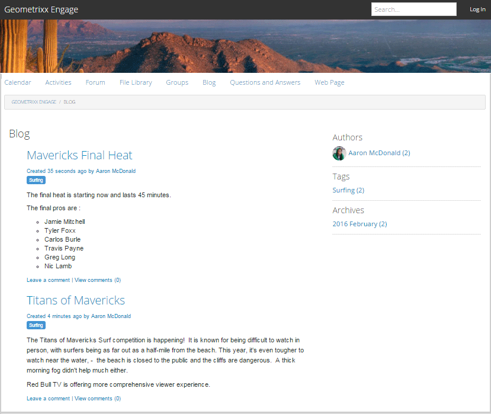

# 博客功能 {#blog-feature}

## 简介 {#introduction}

AEM Communities的博客功能已从创作活动转变为在Publish环境中发生的真实社区活动。

博客功能支持以日志格式提供社区信息。 博客条目由授权成员（已注册、已登录的用户）在Publish环境中创建。

博客功能提供：

* 在Publish端创建博客文章和评论
* 富文本编辑
* 内联图像（支持拖放）
* 嵌入式社交网络内容（[o嵌入支持](/help/communities/blog-developer-basics.md#allowing-rich-media)）
* 草稿模式
* 计划发布
* 代表撰写（具有[权限的成员](/help/communities/users.md#privileged-members-group)可以代表其他社区成员创建内容）
* [在上下文中和批量审核](/help/communities/moderate-ugc.md)博客文章和评论

此文档的此部分描述了：

* 将博客功能添加到AEM站点
* 博客组件的配置设置

>[!NOTE]
>
>组件`Journal`和`Journal Sidebar`的标题为`Blog`和`Blog Sidebar`。
>
>现已删除AEM 6.0及更早版本中的博客功能。 它基于模板，仅允许作者在创作环境中创建内容。

## 将博客组件添加到页面 {#adding-blog-components-to-a-page}

如果需要在创作模式下将博客添加到页面，请使用组件浏览器来查找

* `Communities / Blog`
* `Communities / Blog Sidebar`

并将它们拖动到应显示博客的页面上。

有关必要的信息，请访问[社区组件基础知识](/help/communities/basics.md)。

当包含[所需的客户端库](/help/communities/blog-developer-basics.md#essentials-for-client-side)时，`Blog`组件显示如下：

### 配置博客 {#configuring-blog}

选择放置的`Blog`组件，以便您可以访问并选择用于打开“编辑”对话框的`Configure`图标。

#### “设置”选项卡 {#settings-tab}

在&#x200B;**设置**&#x200B;选项卡下，指定博客的基本功能：

* **允许附件缩略图**

  如果选中，则会创建附加图像的缩略图。

* **附加缩略图大小上限**

  附件缩略图图像的最大尺寸（以像素为单位）。 默认值为800 x 800。

* 缩略图的最小图像大小&#x200B;**分钟**

  用于为内嵌图像生成缩略图的图像最小尺寸（以字节为单位）。 默认值为100000字节(100 kb)。

* **最大缩略图大小**

  内嵌图像的缩略图图像的最大尺寸（以像素为单位）。 默认值为800 x 800。

* **允许拥有权限的成员**

  如果选中，则仅允许拥有权限的成员创建内容。

* **允许拥有权限的成员**

  添加有权创建内容的成员。

* **在作者编辑模式下阻止用户生成的内容**

  如果启用，则在创作模式下编辑时会阻止用户生成的内容。

* **日志标题**

  要在页面上显示的博客标题。

>[!NOTE]
>
>日志标题用于自动创建博客的URL。
>
>从您在此处指定的日志标题中最多使用50个字符（额外使用5个字符作为唯一性）来创建博客的URL。

* **日志描述**

  博客说明。

* 每页&#x200B;**个主题**

  定义每个页面显示的博客条目/评论数。 默认值为10。

* **已审核**

  如果选中，在博客条目和评论出现在已发布的站点上之前，必须批准它们的发布。 默认值为未选中。

* **已关闭**

  如果选中，博客将针对新的博客条目和评论关闭。 默认值为未选中。

* **富文本编辑器**

  如果选中，则可以使用标记输入博客条目和评论。 默认值为选中。

* **允许标记**

  如果选中，则允许成员向其帖子添加标记标签（请参阅&#x200B;**标记字段**&#x200B;选项卡）。 默认值为未选中。

* **允许文件上传**

  如果选中，则允许将文件附件添加到博客条目或评论中。 默认值为未选中。

* **最大文件大小**

  仅在选中`Allow File Uploads`时才相关。 此字段限制已上传文件的大小（以字节为单位）。 默认值为104857600 (10 Mb)。

* **允许的文件类型**

  仅在选中`Allow File Uploads`时才相关。 包含“点”分隔符的逗号分隔文件扩展名列表。 例如： .jpg、.jpeg、.png、.doc、.docx、.pdf。 如果指定了任何文件类型，则无法上载未指定这些文件类型。 默认值为无指定以便允许所有文件类型。

* **附加图像文件大小上限**

  仅在选中允许文件上传时才相关。 上传的图像文件可以包含的最大字节数。 默认值为2097152 (2 Mb)。

* **允许回复**

  如果选中，则允许对发布到博客条目的评论进行回复。 默认值为未选中。

* **允许投票**

  如果选中，请包含投票功能以及博客条目。 默认值为未选中。

* **允许用户删除评论和主题**

  如果选中，则允许成员删除他们发布的评论和博客条目。 默认值为未选中。

* **允许关注**

  如果选中，请为博客文章加入以下功能，以便成员能够[收到新帖子的通知](/help/communities/notifications.md)。 默认值为未选中。

* **允许电子邮件订阅**

  如果选中，则允许成员通过电子邮件接收新帖子的通知（[订阅](/help/communities/subscriptions.md)）。 需要检查`Allow Following`并配置[电子邮件](/help/communities/email.md)。 默认值为未选中。

* **显示徽章**

  如果选中，则使用成员的博客条目显示已获得和分配的[徽章](/help/communities/implementing-scoring.md)。 默认值为未选中。

* **列表页上未收到回复**

* **允许精选内容**

  如果选中，则该创意被标识为[精选内容](/help/communities/featured.md)。 默认值为未选中。

* **启用提及功能**

  如果启用，则允许注册社区用户标识其他注册成员（使用名字、姓氏、用户名），并使用通用@user-name语法标记它们。 标记的用户会收到有关其自己提及的通知。

* **最大提及次数**

  限制帖子中允许的最多提及次数。 默认值为10。

* **UI提及模式**

  指定允许的样式字符串以在帖子中标记(@mention)已注册用户。 例如：`~{{familyName}}{{givenName}}`。

#### “用户审核”选项卡 {#user-moderation-tab}

在&#x200B;**用户审核**&#x200B;选项卡下，指定审核设置：

* **拒绝帖子**

  如果选中，则允许受信任的成员版主拒绝帖子，并阻止帖子出现在公共论坛中。 默认值为未选中。

* **关闭/重新打开主题**

  如果选中，受信任成员审查方可以关闭主题以进一步编辑和注释，也可以重新打开主题。 默认值为未选中。

* **标记帖子**

  如果选中，则允许成员将其他人的主题或评论标记为不适当。 默认值为未选中。

* **标记原因列表**

  如果选中，则允许成员从下拉列表中选择将主题或评论标记为不适当的原因。 默认值为未选中。

* **自定义标记原因**

  如果选中，则允许成员输入将主题或评论标记为不适当的原因。 默认值为未选中。

* **审核阈值**

  输入在通知版主之前，主题或评论必须由成员标记的次数。 默认值为1（一次）。

* **标记限制**

  输入在将主题或评论从公开视图隐藏之前必须对其标记的次数。 如果设置为–1，则标记的主题或评论永远不会从公共视图中隐藏。 否则，此数字必须大于或等于审核阈值。 默认值为5。

#### “标记字段”选项卡 {#tag-field-tab}

在&#x200B;**标记字段**&#x200B;选项卡下，指定在&#x200B;**设置**&#x200B;选项卡上选中&#x200B;**允许标记**&#x200B;时可以应用的标记：

* **允许的命名空间**

  如果在&#x200B;**设置**&#x200B;选项卡下选中`Allow Tagging`，则相关。 可以应用的标记仅限于所检查的命名空间类别中的这些标记。 命名空间列表包括“标准标记”（默认命名空间）和“包括所有标记”。 默认设置为“无”复选框，这意味着允许使用所有命名空间。

* **建议限制**

  输入要显示为向论坛发布成员建议的标记数。 值为–1表示无限制。 默认值为0。

### 配置博客侧栏 {#configuring-blog-sidebar}

双击`Blog Sidebar`组件时，将打开编辑对话框。

在&#x200B;**日志侧栏设置**&#x200B;选项卡下，指定存档的日期格式以及要在侧栏中显示的条目类型：

* **日期格式**

  用于显示博客条目存档的格式。 该格式遵循Java™约定使用占位符。

   * yyyy ：全年，如“2015”
   * yy ：短年，如“15”
   * MMMM ：整月，如6月
   * MMM ：简短月份，如Jun
   * MM ：月份数字，如06

  默认值为“yyyy MMMMM”，例如，将显示“2015年6月”

* **查看类型**

  要显示在侧栏中的博客条目的标题和类型。 选择介于

   * 作者
   * 类别
   * 归档

* **博客组件路径**

  *（可选）*&#x200B;从中列出博客文章的博客资源的位置。 如果保留为空，则它会使用同一页面上显示的resourceType `social/journal/components/hbs/journal`组件。

   * 例如，`/content/sites/engage/en/blog/jcr:content/content/primary/blog`

* **建议限制**

  要显示的博客文章数。 值为–1表示无限制。 默认值为–1。

## 网站访客体验 {#site-visitor-experience}

在发布环境中，博客功能按创建顺序显示最近的博客文章，其后是较早的博客文章。 博客侧栏允许网站访客应用过滤器以限制显示的博客文章的选择。

博客文章后跟一个链接，用于发表或查看评论。

选择博客文章后，将显示博客文章和评论（如果已启用）。

其他功能取决于网站访客是审查方、管理员、社区成员、拥有权限的成员还是匿名用户。

### 使用文章 {#working-with-articles}

创建博客文章时，可以选择执行以下操作：

1. 立即Publish
1. Publish a草稿
1. 在计划的日期和时间执行Publish

博客文章会显示在相应的选项卡（“已发布”、“草稿”或“已计划”）下，供成员在发布时创作。

#### 审查方和管理员 {#moderators-and-administrators}

当登录用户具有审阅人或管理员权限时，他们能够对发布到博客的所有博客文章和评论执行[审阅任务](/help/communities/moderate-ugc.md)（组件配置允许）。

#### 成员 {#members}

当登录用户是社区成员或[特权成员](/help/communities/users.md#privileged-members-group)（取决于配置）时，他们能够选择`New Article`来创建和发布新的博客文章。

具体而言，他们可以：

* 创建博客文章
* Post代表其他成员发表一篇新的博客文章
* Post对博客文章的评论
* 编辑他们自己的博客文章或评论
* 删除他们自己的博客文章或评论
* 标记其他人的博客文章或评论

#### 匿名 {#anonymous}

未登录的网站访客只能阅读已发布的博客文章和评论（如果支持），但不得添加博客文章或评论，也不得标记他人的文章或评论。

## 附加信息 {#additional-information}

在开发人员的[博客要点](/help/communities/blog-developer-basics.md)页面上可找到更多信息。

要审核博客条目和评论，请参阅[审核用户生成的内容](/help/communities/moderate-ugc.md)。

有关标记博客条目和评论，请参阅[标记用户生成的内容](/help/communities/tag-ugc.md)。

有关博客条目和评论的翻译，请参阅[翻译用户生成的内容](/help/communities/translate-ugc.md)。
