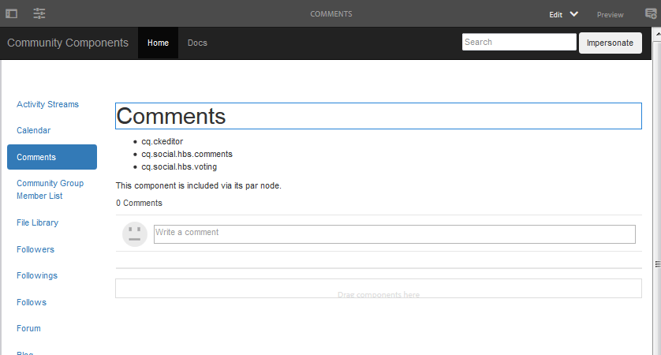

# 社区组件指南  {#community-components-guide}

社区组件指南是[社交组件框架(SCF)](scf.md)的交互式开发工具。 它提供了可用Adobe Experience Manager (AEM) Communities组件的列表，或由多个组件构建的更复杂功能的列表。

除了每个组件的基本信息外，本指南还允许试验SCF组件/功能的工作方式以及配置或自定义它们的方法。

有关与每个组件相关的开发必需项的信息，请参阅[功能和组件必需项](essentials.md)。

## 快速入门 {#getting-started}

本指南适用于创作实例(localhost：4502)和发布实例(localhost：4503)的开发安装。

通过浏览到，可访问社区组件站点

* [https://&lt;服务器>：&lt;端口>/content/community-components/en.html](http://localhost:4502/content/community-components/en.html)

与社区组件的交互方式因以下因素而异：

* 服务器（创作或发布）。
* 网站访客是否已登录。
* 如果登录，则为成员分配权限。
* 是否正在使用默认SRP [JSRP](jsrp.md)。

在作者上，要进入编辑模式，请在服务器名称后插入`editor.html`或`cf#`作为第一个路径段：

* 标准UI：

  [https://&lt;服务器>：&lt;端口>/editor.html/content/community-components/en.html](http://localhost:4502/editor.html/content/community-components/en.html)

* 经典UI：

  [https://&lt;服务器>：&lt;端口>/cf#/content/community-components/en.html](http://localhost:4502/cf#/content/community-components/en.html)

>[!NOTE]
>
>在编辑模式下进行创作时，页面上的链接无效。
>
>要导航到组件页面，请首先选择预览模式以激活链接。
>
>在浏览器中显示组件页面后，返回到编辑模式以打开组件的编辑对话框。
>
>有关一般创作信息，请查看[页面创作快速指南](../../help/sites-authoring/qg-page-authoring.md)。
>
>如果不熟悉AEM，请查看有关[基本处理](../../help/sites-authoring/basic-handling.md)的文档。

### 主页 {#home-page}

该指南在页面左侧提供了可用于预览和原型制作的SCF组件列表。

在编辑模式下在创作实例上查看的组件指南：

## 组件页面 {#component-pages}

从页面上左侧的列表中选择一个组件。

此时将显示指南的主体：

1. 标题：所选组件的名称
1. [客户端库](#client-side-libraries)：包含一个或多个所需类别的列表
1. [可包含](scf.md#add-or-include-a-communities-component)：如果组件可以动态包含，则可以在创作编辑模式下切换状态：

   * 如果添加，则显示文本为：“此组件通过其par节点包括在内。”
   * 如果包括，则显示的文本为：“此组件是动态包括的。”
   * 如果不可包含，则不会显示任何文本

1. 示例元件或特征：元件或特征的活动实例。 如果是一个组件，则它可能会随对选项卡部分中提供的模板、CSS和数据所做的更改而发生更改。

>[!NOTE]
>
>从左侧进行选择后，如果浏览器窗口太窄，组件将显示在组件列表的下方，而不是旁边。

### 作者交互 {#author-interactions}

在创作实例上使用指南时，可以通过打开组件对话框来体验配置组件的过程。 在文档的[组件和Feature Essentials](essentials.md)部分中为开发人员提供了信息，而对话框设置则在供作者使用的[社区组件](author-communities.md)部分中进行了说明。

对于社区组件指南，某些组件对话框设置使用[Inclustable](scf.md#add-or-include-a-communities-component)切换状态覆盖。 要在使用现有资源或动态包含的资源之间进行切换，请在编辑模式下同时选择组件和可包含的文本，然后双击以打开编辑对话框：

在&#x200B;**模板**&#x200B;选项卡下：

* **包含具有sling：include**&#x200B;的子组件

  如果未选中，《组件指南》将使用存储库中的现有资源（一个jcr节点，它是par节点的子节点）。

   * 显示的文本为：“此组件通过其par节点包括在内。”

  如果选中，组件指南会使用sling动态包含子节点的resourceType（非现有资源）的组件。

   * 显示的文本为：“此组件是动态包含的。”

  默认值为未选中。

### Publish交互 {#publish-interactions}

在发布实例上使用本指南时，能够以网站访客（未登录）以及登录时具有各种权限的成员身份体验组件和功能。

>[!NOTE]
>
>请注意，如果SRP默认为[JSRP](jsrp.md)，则发布实例上输入的UGC将仅在发布中可见，并且&#x200B;*不会*&#x200B;在创作实例上的[审核](moderate-ugc.md)控制台中可见。

## 客户端库 {#client-side-libraries}

为每个组件列出的客户端库(clientlibs)是将组件放置到页面上时要引用的&#x200B;*必需*。 clientlibs提供了一种方法，用于管理和优化在浏览器中呈现组件的JavaScript和CSS的下载。

有关详细信息，请访问[社区组件的Clientlibs](clientlibs.md)。

## 模拟 {#impersonation}

在作者实例（通常以管理员或开发人员身份登录）上，要以其他用户身份体验组件登录，请使用&#x200B;**[!UICONTROL 模拟]**&#x200B;按钮左侧的文本框键入用户名或从下拉列表中选择，然后单击该按钮。 单击还原以注销并结束模拟。

无需模拟发布实例。 只需使用“登录/注销”链接来模拟各种用户，如[演示用户](tutorials.md#demo-users)。

## 自定义 {#customization}

启用后，每个SCF组件都可通过暂时修改组件的模板、CSS和数据来构建可能自定义项的原型。

### 启用自定义 {#enabling-customization}

>[!NOTE]
>
>**此工具是只读的**。 对模板、CSS或数据所做的任何编辑都不会保存到存储库中。

要快速试验自定义项，必须将`scg:showIde`属性添加到组件页面的内容JCR节点并设置为true。

以注释组件为例，在创作或发布实例上使用管理员权限登录：

1. 浏览[CRXDE Lite](../../help/sites-developing/developing-with-crxde-lite.md)

   例如，[http://localhost:4503/crx/de](http://localhost:4503/crx/de)

1. 选择组件的`jcr:content`节点

   例如，`/content/community-components/en/comments/jcr:content`

1. 添加属性

   * **名称** `scg:showIde`
   * **类型** `String`
   * **值** `true`

1. 选择&#x200B;**[!UICONTROL 全部保存]**
1. 重新加载指南中的“评论”页面

   [http://localhost:4503/content/community-components/en/comments.html](http://localhost:4503/content/community-components/en/comments.html)

1. 请注意，现在有三个选项卡：“模板”、“CSS”和“数据”。

### “模板”选项卡 {#templates-tab}

选择模板选项卡可查看与组件关联的模板。

使用模板编辑器，可以编译本地编辑并将其应用于页面顶部的示例组件实例，而不会影响存储库中的组件。

在本地编辑时运行编译将突出显示任何错误，方法是将圆点放在沟渠中并将文本标记为红色。

### CSS选项卡 {#css-tab}

选择CSS选项卡可查看与组件关联的CSS。

如果某个组件是由多个组件组成的组合，则某些CSS可能会列在其他组件之一下。

CSS编辑器允许修改CSS并将其应用于页面顶部的示例组件实例。

可以通过单击沟渠中的规则旁边来选择一个规则，以突出显示使用该规则的DOM部分。

### “数据”选项卡 {#data-tab}

选择“数据”选项卡以显示.social.json端点数据。 此数据可编辑，并应用于示例组件实例。

语法错误可能会在gutter中标记并在编辑器中突出显示。
