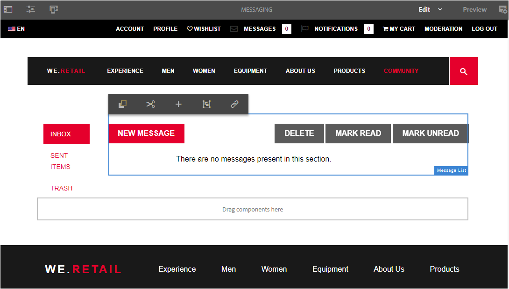

# 消息传送功能 {#messaging-feature}

除了在论坛和评论中发生的公开可见的交互之外，AEM Communities的消息传送功能还允许社区成员更私密地相互交互。

创建[社区站点](/help/communities/overview.md#communitiessites)时可包含此功能。

利用消息传送功能，可执行以下操作：

**A** — 向一个或多个社区成员发送消息

**B** — 以[批量方式向社区成员组发送私信](/help/communities/messaging.md#group-messaging)

**C** — 发送带有附件的邮件

**D** — 转发消息

**E** — 回复邮件

**F** — 删除邮件

**G** — 还原已删除的邮件

要启用和修改消息传送功能，请参阅：

* [为管理员配置消息](/help/communities/messaging.md)
* 面向开发人员的[消息传送要点](/help/communities/essentials-messaging.md)

>[!NOTE]
>
>不支持将`Compose Message, Message, or Message List`组件（位于`Communities`组件组中）添加到创作编辑模式下的页面。

## 配置消息组件 {#configure-messaging-components}

为社区站点启用消息传送后，将进行设置，无需进一步配置。 如果需要更改默认配置，则会提供此信息。

### 配置消息列表（消息框） {#configure-message-list-message-box}

要修改消息传送功能的&#x200B;**收件箱**、**已发送项目**&#x200B;和&#x200B;**垃圾桶**&#x200B;页面的消息列表的配置，请在[作者编辑模式](/help/communities/sites-console.md#authoring-site-content)中打开该站点。

1. 在`Preview`模式下，选择&#x200B;**消息**&#x200B;链接以打开主消息页面。 然后选择&#x200B;**收件箱**、**已发送邮件**&#x200B;或&#x200B;**垃圾桶**&#x200B;以配置该邮件列表的组件。

1. 在`Edit`模式下，选择页面上的组件。
1. 要访问配置对话框，请选择`link`图标以取消继承。
取消继承后，可以选择配置图标以打开配置对话框。

1. 配置完成后，需要通过选择`broken link`图标来恢复继承。

#### “基本”选项卡 {#basic-tab}

* **服务选择器**

  （*必需*）从[AEM Communities消息传送操作服务](/help/communities/messaging.md#messaging-operations-service)将此值设置为属性&#x200B;**`serviceSelector.name`**&#x200B;的值。

* **撰写页面**

  （*必需*）成员单击&#x200B;**`Reply`**&#x200B;按钮时要打开的页面。 目标页面应包含&#x200B;**撰写消息**&#x200B;表单。

* **回复/查看资源**

  如果选中，回复URL和查看URL将引用资源，否则数据将作为URL中的查询参数传递。

* **个人资料显示表单**

  用于显示发件人配置文件的配置文件表单。

* **垃圾文件夹**

  如果选中，此消息列表组件仅显示标记为已删除（垃圾桶）的消息。

* **文件夹路径**

  （*必需*）引用[AEM Communities邮件操作服务](/help/communities/messaging.md#messaging-operations-service)中为&#x200B;**inbox.path.name**&#x200B;和&#x200B;**sentitems.path.name**&#x200B;设置的值。 配置`Inbox`时，使用&#x200B;**inbox.path.name**&#x200B;的值添加一个条目。 配置`Outbox`时，使用&#x200B;**sentitems.path.name**&#x200B;的值添加一个条目。 为`Trash`配置时，添加两个同时具有这两个值的条目。

#### “显示”选项卡 {#display-tab}

* **标记读取按钮**

  如果选中，则显示`Read`按钮，以便将消息标记为已读。

* **标记未读按钮**

  如果选中，则显示`Mark Unread`按钮以允许将消息标记为已读。

* **删除按钮**

  如果选中，则显示`Delete`按钮以允许将消息标记为已读。 如果还选中&#x200B;**`Message Options`**，则复制删除功能。

* **消息选项**

  如果选中，则显示&#x200B;**`Reply`**、**`Reply All`**、**`Forward`**&#x200B;和&#x200B;**`Delete`**&#x200B;按钮，这些按钮允许重新发送或删除消息。 如果还选中&#x200B;**`Delete Button`**，则复制删除功能。

* 每页&#x200B;**条消息**

  指定的数字是分页方案中每页显示的最大消息数。 如果未指定数字（留空），则会显示所有消息并且没有分页。

* **时间戳模式**

  为一种或多种语言提供时间戳模式。 对于en、de、fr、it、es、ja、zh_CN、ko_KR，默认值为。

* **显示用户**

  选择&#x200B;**`Sender`**&#x200B;或&#x200B;**`Recipients`**，以便您能够确定是否显示发件人或收件人。

### 配置撰写消息 {#configure-compose-message}

要修改撰写消息页面的配置，请在[作者编辑模式](/help/communities/sites-console.md#authoring-site-content)下打开该站点。

* 在`Preview`模式下，选择&#x200B;**消息**&#x200B;链接以打开主消息页面。 然后选择“新建消息”按钮，以打开`Compose Message`页面。

* 在`Edit`模式下，选择包含消息正文的页面上的主组件。
* 要访问配置对话框，请选择`link`图标以取消继承。
取消继承后，可以选择配置图标以打开配置对话框。

* 配置完成后，需要通过选择`broken link`图标来恢复继承。

#### “基本”选项卡 {#basic-tab-1}

* **重定向URL**

  输入发送消息后显示的页面URL。 例如：`../messaging.html`。

* **取消URL**

  输入发送者取消邮件时显示的页面URL。 例如：`../messaging.html`。

* **邮件主题的最大长度**

  主题字段中允许的最大字符数。 例如，500。 默认值为无限制。

* **邮件正文的最大长度**

  内容字段中允许的最大字符数。 例如，10000。 默认值为无限制。

* **服务选择器**

  （*必需*）从[AEM Communities消息传送操作服务](/help/communities/messaging.md#messaging-operations-service)将此值设置为属性&#x200B;**`serviceSelector.name`**&#x200B;的值。

#### “显示”选项卡 {#display-tab-1}

* **显示主题字段**

  如果选中，则显示`Subject`字段并启用向邮件添加主题。 默认未选中。

* **主题标签**

  输入要显示在`Subject`字段旁边的文本。 默认值为`Subject`。

* **显示附加文件字段**

  如果选中，则显示`Attachment`字段并启用向邮件添加文件附件。 默认未选中。

* **附加文件标签**

  输入要显示在`Attachment`字段旁边的文本。 默认值为&#x200B;**`Attach File`**。

* **显示内容字段**

  如果选中，则显示`Content`字段并启用添加消息正文。 默认未选中。

* **内容标签**

  输入要显示在`Content`字段旁边的文本。 默认值为&#x200B;**`Body`**。

* **使用富文本编辑器**

  如果选中，则表示使用具有自己的富文本编辑器的自定义内容文本框。 默认未选中。

* **时间戳模式**

  为一种或多种语言提供时间戳模式。 对于en、de、fr、it、es、ja、zh_CN、ko_KR，默认值为。
