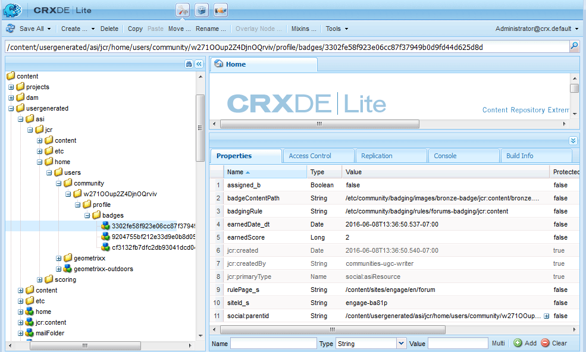

# 评分和徽章要点 {#scoring-and-badges-essentials}

AEM Communities评分和徽章功能可识别并奖励社区成员。

有关设置该功能的详细信息，请参阅

* [社区评分和徽章](/help/communities/implementing-scoring.md)

此页面包含其他技术详细信息：

* 如何[将徽章](#displaying-badges)显示为图像或文本
* 如何打开大量[调试日志记录](#debug-log-for-scoring-and-badging)
* 如何[访问与评分和徽章相关的UGC](#ugc-for-scoring-and-badging)

>[!CAUTION]
>
>在CRXDE Lite中可见的实施结构可能会发生更改。

## 显示徽章 {#displaying-badges}

在HBS模板的客户端上，将控制徽章显示为文本还是图像。

例如，在`/libs/social/forum/components/hbs/topic/list-item.hbs`中搜索`this.isAssigned`：

```
{{#each author.badges}}

  {{#if this.isAssigned}}

    <div class="scf-badge-text">

      {{this.title}}

    </div>

  {{/if}}

{{/each}}

{{#each author.badges}}

  {{#unless this.isAssigned}}

    

  {{/unless}}

{{/each}}
```

如果为true，`isAssigned`表示该徽章已分配给角色，并且该徽章应显示为文本。

如果为false，`isAssigned`则表示已授予徽章以获得得分，并且该徽章应显示为图像。

对此行为的任何更改都应在自定义脚本中进行（覆盖或叠加）。 请参阅[客户端自定义](/help/communities/client-customize.md)。

## 评分和徽章的调试日志 {#debug-log-for-scoring-and-badging}

为了帮助调试评分和徽章，可以设置自定义日志文件。 如果功能出现问题，可以将该日志文件的内容提供给客户支持。

有关详细说明，请访问[创建自定义日志文件](/help/sites-deploying/monitoring-and-maintaining.md#create-a-custom-log-file)。

要快速设置slinglog文件：

1. 例如，访问&#x200B;**Adobe Experience Manager Web控制台日志支持**

   * https://localhost:4502/system/console/slinglog

1. 选择&#x200B;**添加新记录器**

   1. 为&#x200B;**日志级别**&#x200B;选择`DEBUG`

   1. 输入&#x200B;**日志文件**&#x200B;的名称，例如

      * logs/scoring-debug.log

   1. 输入两个&#x200B;**Logger** （类）条目（使用`+`图标）

      * `com.adobe.cq.social.scoring`
      * `com.adobe.cq.social.badging`

   1. 选择&#x200B;**保存**


要查看日志条目，请执行以下操作：

* 从Web控制台

   * 在&#x200B;**状态**&#x200B;菜单下
   * 选择&#x200B;**日志文件**
   * 搜索您的日志文件名，如`scoring-debug`

* 在服务器的本地磁盘上

   * 日志文件位于&lt;*server-install-dir*>/crx-quickstart/logs/&lt;*log-file-name*>.log

   * 例如，`.../crx-quickstart/logs/scoring-debug.log`


## 评分和徽章的UGC {#ugc-for-scoring-and-badging}

当所选的SRP是JSRP或MSRP，而不是ASRP时，可以查看与评分和徽章相关的UGC。 （如果不熟悉这些术语，请参阅[社区内容存储](/help/communities/working-with-srp.md)和[存储资源提供程序概述](/help/communities/srp.md)。）

用于访问评分和徽章数据的描述使用JSRP，因为使用[CRXDE Lite](/help/sites-developing/developing-with-crxde-lite.md)可轻松访问UGC。

作者上的&#x200B;**JSRP**：在作者环境中进行试验会导致UGC只在作者环境中可见。

发布&#x200B;**上的** JSRP：同样，如果在发布环境中进行测试，则必须在发布实例上访问具有管理权限的CRXDE Lite。 如果发布实例在[生产模式](/help/sites-administering/production-ready.md) （nosamplecontent运行模式）下运行，则需要[启用CRXDE Lite](/help/sites-administering/enabling-crxde-lite.md)。

JSRP上UGC的基本位置为`/content/usergenerated/asi/jcr/`。

### 评分和徽章API {#scoring-and-badging-apis}

以下API可供使用：

* [com.adobe.cq.social.scoring.api在6.3中](https://experienceleague.adobe.com/docs/experience-manager-release-information/aem-release-updates/previous-updates/aem-previous-versions.html)
* [com.adobe.cq.social.badging.api（在6.3中）](https://experienceleague.adobe.com/docs/experience-manager-release-information/aem-release-updates/previous-updates/aem-previous-versions.html)

开发人员可以从Adobe存储库中找到已安装功能包的最新Javadoc。 请参阅[使用Maven for Communities ： Javadocs](/help/communities/maven.md#javadocs)。

**存储库中UGC的位置和格式可能会发生更改，而不会出现警告**。

### 示例设置 {#example-setup}

存储库数据的屏幕截图来自为两个不同AEM站点上的论坛设置评分和徽章：

1. 具有&#x200B;*唯一ID的AEM站点*（使用向导创建的社区站点）：

   * 使用在[入门教程](/help/communities/getting-started.md)期间创建的入门教程(engage)网站
   * 找到论坛页面节点

     `/content/sites/engage/en/forum/jcr:content`

   * 添加评分和徽章属性

   ```
   scoringRules = [/libs/settings/community/scoring/rules/comments-scoring,
   /libs/settings/community/scoring/rules/forums-scoring]
   ```

   ```
   badgingRules =[/libs/settings/community/badging/rules/comments-scoring,
   /libs/settings/community/badging/rules/forums-scoring]
   ```

   * 找到论坛组件节点

     `/content/sites/engage/en/forum/jcr:content/content/primary/forum`
(`sling:resourceType = social/forum/components/hbs/forum`)

   * 要显示徽章，请添加属性

     `allowBadges = true`

   * 用户登录、创建论坛主题并获得“铜牌”

1. 没有&#x200B;*唯一ID的AEM网站*：

   * 使用[社区组件指南](/help/communities/components-guide.md)
   * 找到论坛页面节点

     `/content/community-components/en/forum/jcr:content`

   * 添加评分和徽章属性

   ```
   scoringRules = [/libs/settings/community/scoring/rules/comments-scoring,
   /libs/settings/community/scoring/rules/forums-scoring]
   ```

   ```
   badgingRules =[/libs/settings/community/badging/rules/comments-badging,
   /libs/settings/community/badging/rules/forums-badging]
   ```

   * 找到论坛组件节点

     `/content/community-components/en/forum/jcr:content/content/forum`
(`sling:resourceType = social/forum/components/hbs/forum`)

   * 要显示徽章，请添加属性

     `allowBadges = true`

   * 用户登录、创建论坛主题并获得“铜牌”

1. 已使用cURL为用户分配了审查方徽章：

   ```shell
   curl -i -X POST -H "Accept:application/json" -u admin:admin -F ":operation=social:assignBadge" -F "badgeContentPath=/libs/settings/community/badging/images/moderator/jcr:content/moderator.png" https://localhost:4503/home/users/community/w271OOup2Z4DjnOQrviv/profile.social.json
   ```

   由于用户已获得两个铜牌徽章并获得了版主徽章，因此该用户将以下列方式显示其论坛条目：

   

>[!NOTE]
>
>此示例不遵循以下最佳实践：
>
>* 评分规则名称应具有全局唯一性；它们不应以相同的名称结尾。
>
>  *不*&#x200B;执行的操作的示例：
>
>  /libs/settings/community/scoring/rules/site1/forums-scoring
>  /libs/settings/community/scoring/rules/site2/forums-scoring
>
>* 为不同的AEM站点创建唯一的徽章图像

### 访问得分UGC {#access-scoring-ugc}

首选使用[API](#scoring-and-badging-apis)。

出于调查目的，以JSRP为例，包含分数的基本文件夹为

* `/content/usergenerated/asi/jcr/scoring`

`scoring`的子节点是评分规则名称。 因此，最佳做法是服务器上的评分规则名称具有全局唯一性。

对于GeometrixxEngage站点，用户及其分数位于使用评分规则名称、社区站点的站点ID ( `engage-ba81p`)、唯一ID和用户的ID构建的路径中：

* `.../scoring/forums-scoring/engage-ba81p/6d179715c0e93cb2b20886aa0434ca9b5a540401/riley`

对于社区组件指南站点，用户及其分数位于使用评分规则名称、默认ID ( `default-site`)、唯一ID和用户ID构建的路径中：

* `.../scoring/forums-scoring/default-site/b27a17cb4910a9b69fe81fb1b492ba672d2c086e/riley`

得分存储在属性`scoreValue_tl`中，该属性可能仅包含值或间接引用atomicCounter。


### 访问徽章UGC {#access-badging-ugc}

首选使用[API](#scoring-and-badging-apis)。

出于调查目的，以JSRP为例，包含有关已分配或已授予徽章的信息的基本文件夹为

* `/content/usergenerated/asi/jcr`

后跟用户配置文件的路径，以徽章文件夹结尾，例如：

* `/home/users/community/w271OOup2Z4DjnOQrviv/profile/badges`

#### 已授予的徽章 {#awarded-badge}



#### 已分配的徽章 {#assigned-badge}


## 附加信息 {#additional-information}

要根据点显示已排序的成员列表，请执行以下操作：

* [排行榜功能](/help/communities/functions.md#leaderboard-function)包含在社区站点或组模板中。
* 用于页面创作的[排行榜组件](/help/communities/enabling-leaderboard.md)，该组件是排行榜功能的特色组件。
