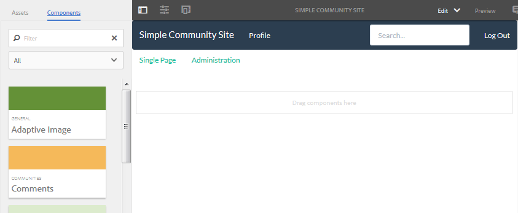

# 创建示例页面 {#create-a-sample-page}

自AEM 6.1 Communities起，创建示例页面的最简单方法是创建一个简单的社区站点，其中只包含一个Page函数。

这包含一个parsys组件，以便您可以 [为创作启用组件](basics.md#accessing-communities-components).

使用示例组件进行探索的另一个选项是使用 [社区组件指南](components-guide.md).

## 创建社区站点 {#create-a-community-site}

这与创建中所述的站点类似 [AEM Communities快速入门](getting-started.md).

主要区别在于，本教程将创建一个仅包含 [Page函数](functions.md#page-function) 创建简单的社区站点。 它不使用其他功能（除了所有社区站点均通用的预布线功能之外）。

### 创建新站点模板 {#create-new-site-template}

要开始配置，请创建一个 [社区站点模板](sites.md).

在创作实例的全局导航中，选择 **[!UICONTROL 工具]** > **[!UICONTROL Communities]** > **[!UICONTROL 站点模板]**.

* 选择 `Create button`
* 基本信息

   * `Name`：单页模板
   * `Description`：由单页函数组成的模板。
   * 选择 `Enabled`

* 结构

   * 拖动 `Page` 函数到模板生成器
   * 有关配置功能详细信息，请输入

      * `Title`：单页
      * `URL`: page

* 选择 **`Save`** 对于配置
* 选择 **`Save`** 对于站点模板

### 创建新社区站点 {#create-new-community-site}

现在，基于简单站点模板创建一个社区站点。

创建站点模板后，从全局导航中选择 **[!UICONTROL 社区>站点]**.

* 选择 **`Create`** 图标

* 步骤 `1 - Site Template`

   * `Title`：简单社区站点
   * `Description`：由用于试验的单个页面组成的社区站点。
   * `Community Site Root: (leave blank)`
   * `Community Site Base Language: English`
   * `Name`：示例

      * url = http://localhost:4502/content/sites/sample

      * `Template`：选择 `Single Page Template`

     

* 选择 `Next`
* 步骤 `2 - Design`

   * 选择任意设计

* 选择 `Next`
* 选择 `Next`

  （接受所有默认设置）

* 选择 `Create`

  

## 发布站点 {#publish-the-site}

从 [社区站点控制台](sites-console.md)，选择发布图标以发布站点，默认情况下为http://localhost:4503。

## 在编辑模式下在作者上打开站点 {#open-the-site-on-author-in-edit-mode}

选择打开站点图标，以便您可以在编辑模式下查看站点。

URL为 [http://localhost:4502/editor.html/content/sites/sample/en.html](http://localhost:4502/editor.html/content/sites/sample/en.html)

在简单的主页上，可以看到通过社区功能和模板预先连接的内容，并可以在添加和配置社区组件方面有所作为。

## 在发布时查看站点 {#view-site-on-publish}

发布页面后，在 [发布实例](http://localhost:4503/content/sites/sample/en.html) 以匿名网站访客、已登录成员或管理员身份尝试这些功能。 在创作环境中可见的管理链接不会出现在发布环境中，除非管理员登录。
