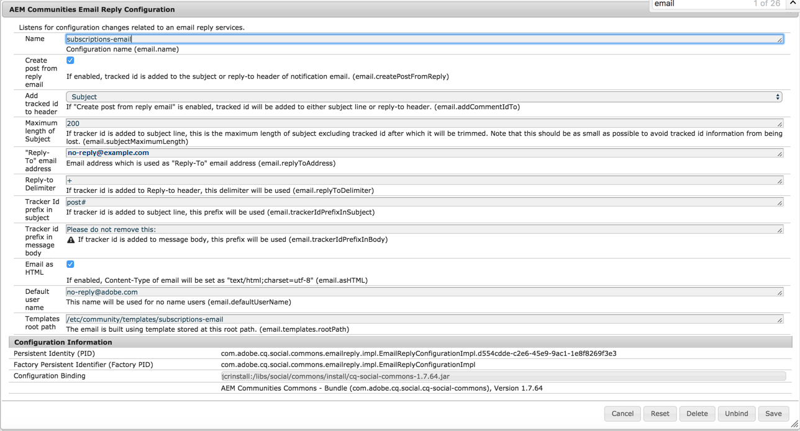
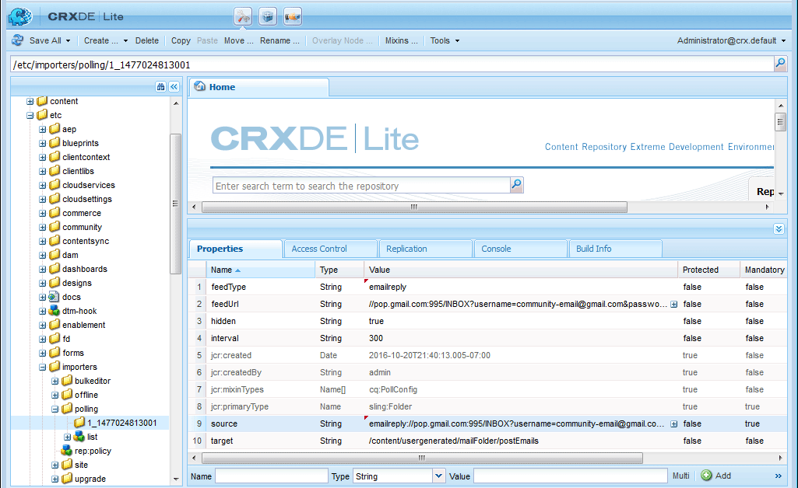

# 配置电子邮件 {#configuring-email}

AEM Communities使用电子邮件执行以下操作：

* [社区通知](notifications.md)
* [Communities 订阅](subscriptions.md)

默认情况下，电子邮件功能不起作用，因为它需要SMTP服务器和SMTP用户的规范。

>[!CAUTION]
>
>仅必须在[主发布者](deploy-communities.md#primary-publisher)上配置通知和订阅的电子邮件。

## 默认邮件服务配置 {#default-mail-service-configuration}

通知和订阅都需要使用默认邮件服务。

* 以管理员权限登录到主发布服务器，并访问[Web控制台](../../help/sites-deploying/configuring-osgi.md)：

   * 例如，[http://localhost:4503/system/console/configMgr](http://localhost:4503/system/console/configMgr)

* 找到`Day CQ Mail Service`。
* 选择编辑图标。

这是基于[配置电子邮件通知](../../help/sites-administering/notification.md)的文档，但不同之处在于字段`"From" address`是&#x200B;*不需要*，应留空。

例如（填充的值仅用于说明目的）：

* **[!UICONTROL SMTP服务器主机名]**

  *（必需）*&#x200B;要使用的SMTP服务器。

* **[!UICONTROL SMTP服务器端口]**

  *（必需）* SMTP服务器端口必须为25或更高。

* **[!UICONTROL SMTP用户]**

  *（必需）* SMTP用户。

* **[!UICONTROL SMTP密码]**

  *（必需）* SMTP用户的密码。

* **[!UICONTROL “发件人”地址]**

  留空
* **[!UICONTROL SMTP使用SSL]**

  如果选中，它将发送安全电子邮件。 确保端口设置为465或SMTP服务器所需的端口。
* **[!UICONTROL 调试电子邮件]**

  如果选中，这将启用SMTP服务器交互的日志记录。

## AEM Communities电子邮件配置 {#aem-communities-email-configuration}

配置[默认邮件服务](#default-mail-service-configuration)后，发行版中包含的`AEM Communities Email Reply Configuration` OSGi配置的两个现有实例将开始正常工作。

在允许通过电子邮件回复时，只能进一步配置订阅的实例。

1. [电子邮件](#configuration-for-notifications)实例：

   对于通知，不支持回复电子邮件，不应对其进行更改。

1. [订阅 — 电子邮件](#configuration-for-subscriptions)实例：

   需要配置才能完全启用通过回复电子邮件创建帖子。

要访问社区电子邮件配置实例，请执行以下操作：

* 以管理员权限登录到主发布服务器，并访问[Web控制台](../../help/sites-deploying/configuring-osgi.md)

   * 例如，[http://localhost:4503/system/console/configMgr](http://localhost:4503/system/console/configMgr)

* 找到`AEM Communities Email Reply Configuration`。

### 通知配置 {#configuration-for-notifications}

`AEM Communities Email Reply Configuration` OSGi配置的实例（具有“名称”电子邮件）是forthenotifications功能。 此功能不包括电子邮件回复。

请勿更改此配置。

* 找到`AEM Communities Email Reply Configuration`。
* 选择编辑图标。
* 验证&#x200B;**Name**&#x200B;是否为`email`。

* 验证&#x200B;**通过回复电子邮件**&#x200B;创建帖子`unchecked`。

### 订阅的配置 {#configuration-for-subscriptions}

对于Communities订阅，可以通过回复电子邮件来启用或禁用成员发布内容的功能。

* 找到`AEM Communities Email Reply Configuration`。
* 选择编辑图标。
* 验证&#x200B;**Name**&#x200B;是否为`subscriptions-email`。

  

* **[!UICONTROL 名称]**

  *（必需）* `subscriptions-email`。 请勿编辑。

* **[!UICONTROL 通过回复电子邮件创建帖子]**

  如果选中，订阅电子邮件的收件人可以通过发送回复来发布内容。 默认值为选中。
* **[!UICONTROL 将跟踪的ID添加到标头]**

  默认值为`Reply-To`。

* **[!UICONTROL 主题的最大长度]**

  如果将跟踪器ID添加到主题行，这是主题（不包括跟踪的ID）的最大长度，过了这个长度后，将裁切主题。 该值应尽可能小，以避免跟踪的id信息丢失。 默认值为200。

* **[!UICONTROL “回复”电子邮件地址]**

  用作“回复”电子邮件地址的地址。 默认值为`no-reply@example.com`。

* **[!UICONTROL 回复分隔符]**

  如果将跟踪器ID添加到回复标头，则使用此分隔符。 默认值为`+` （加号）。

* **[!UICONTROL 主题中的跟踪器ID前缀]**

  如果将跟踪器ID添加到主题行，则使用此前缀。 默认值为`post#`。

* 邮件正文中的&#x200B;**[!UICONTROL 跟踪器ID前缀]**

  如果将跟踪器ID添加到消息正文，则使用此前缀。 默认值为`Please do not remove this:`。

* **[!UICONTROL 作为HTML的电子邮件]**：如果选中，则将电子邮件的Content-Type设置为`"text/html;charset=utf-8"`。 默认值为选中。

* **[!UICONTROL 默认用户名]**

  此名称不用于名称用户。 默认值为`no-reply@example.com`。

* **[!UICONTROL 模板根路径]**

  电子邮件是使用存储在此根路径中的模板生成的。 默认值为`/etc/community/templates/subscriptions-email`。

## 配置轮询导入程序 {#configure-polling-importer}

要将电子邮件放入存储库，必须手动配置轮询导入程序并在存储库中配置其属性。

### 添加新的轮询导入程序 {#add-new-polling-importer}

* 使用管理员权限登录到主发布服务器，并浏览到轮询导入程序控制台：

  例如，[http://localhost:4503/etc/importers/polling.html](http://localhost:4503/etc/importers/polling.html)

* 选择&#x200B;**[!UICONTROL 添加]**

  

* **[!UICONTROL 类型]**

  *（必需）*&#x200B;下拉以选择`POP3 (over SSL)`。

* **[!UICONTROL URL]**

  *（必需）*&#x200B;出站邮件服务器。 例如：`pop.gmail.com:995/INBOX?username=community-emailgmail.com&password=**&#x200B;**`。

* **[!UICONTROL 导入到路径]**&amp;amp；ast；

  *（必需）*&#x200B;设置为`/content/usergenerated/mailFolder/postEmails`
浏览到`postEmails`文件夹并选择&#x200B;**确定**。

* **[!UICONTROL 以秒为单位的更新时间间隔]**

  *（可选）*&#x200B;为默认邮件服务配置的邮件服务器可能具有有关更新间隔值的要求。 例如，Gmail可能需要间隔`300`。

* **[!UICONTROL 登录]**

  *（可选）*

* **[!UICONTROL 密码]**

  *（可选）*

* 选择&#x200B;**[!UICONTROL 确定]**。

### 调整新轮询导入程序的协议 {#adjust-protocol-for-new-polling-importer}

保存新的轮询配置后，必须进一步修改订阅电子邮件导入程序的属性，以将协议从`POP3`更改为`emailreply`。

使用[CRXDE Lite](../../help/sites-developing/developing-with-crxde-lite.md)：

* 使用管理员权限登录到主发布服务器，并浏览到[https://&lt;server>：&lt;port>/crx/de/index.jsp#/etc/importers/polling](http://localhost:4503/crx/de/index.jsp#/etc/importers/polling)。
* 选择新创建的配置并修改以下属性：

   * **feedType**：将`pop3s`替换为&#x200B;**`emailreply`**
   * **源**：将源的协议`pop3s://`替换为&#x200B;**`emailreply://`**

红色三角形表示修改的属性。 请务必保存更改：

* 选择&#x200B;**[!UICONTROL 全部保存]**。
