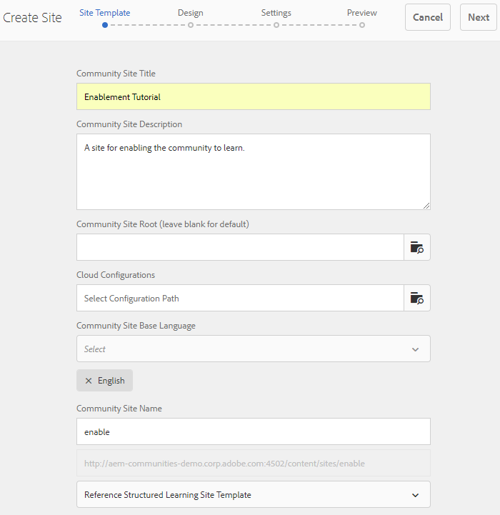

# 为Enablement创作新社区站点 {#author-a-new-community-site-for-enablement}

## 创建社区站点 {#create-community-site}

[“社区站点创建](/help/communities/sites-console.md) ”使用向导来指导您完成创建社区站点的各个步骤。 在最后一步中提交站点之 `Next` 前，可 `Back` 以前进到步骤或前一步。

要开始创建新社区站点，请执行以下操作：

使用作 [者实例](https://localhost:4502/)

* 以管理员权限登录
* 导航到“社 **[!UICONTROL 区”>“站点”]**

* Select **Create**

### 第1步：站点模板 {#step-site-template}

在“站 **点模板** ”步骤中，输入标题、说明、URL的名称，然后选择社区站点模板，例如：

* **社区站点标题**: `Enablement Tutorial`

* **社区站点描述**: `A site for enabling the community to learn.`

* **社区站点根目录**:(默认根目录留空 `/content/sites`)

* **云配置**:（如果未指定云配置，则留空）提供指向指定云配置的路径。
* **社区站点基本语言**:(对于单种语言，请保持不变：英语)使用下拉框从可用语言中选择一 *种或多种基本语言* -德语、意大利语、法语、日语、西班牙语、葡萄牙语（巴西）、繁体中文和简体中文。 将根据多语言站点翻译内容中所述的最佳实践，为添加的每种语言创建一个社区站点，并且该站点将存 [在于同一站点文件夹中](/help/sites-administering/translation.md)。 每个站点的根页面将包含一个子页面，该子页面由所选语言之一的语言代码命名，如英语为“en”或法语为“fr”。

* **社区站点名称**: `enable`

   * 初始URL将显示在“社区站点名称”下方
   * 对于有效的URL，请附加基本语言代码+ &quot;。html&quot;
      *例如*,https://localhost:4502/content/sites/ `enable/en.html`

* **引用站点模板**:下拉选择 `Reference Structured Learning Site Template`

Select **Next**

### 第2步：设计 {#step-design}

设计步骤分为两部分，用于选择主题和品牌横幅：

#### COMMUNITY SITE THEME {#community-site-theme}

选择要应用到模板的所需样式。 选择后，主题将覆盖一个复选标记。

#### COMMUNITY SITE BRANDING {#community-site-branding}

（可选）上传要在网站页面中显示的横幅图像。 横幅被固定到浏览器的左边缘，位于社区站点标题和菜单（导航链接）之间。 横幅高度会被裁剪为120像素。 横幅的大小不会调整为适合浏览器的宽度和120像素高。

 

选择&#x200B;**下一步**。

### 第3步：设置 {#step-settings}

在设置步骤中，在选择之前 `Next`，请注意有七个部分提供对涉及用户管理、标记、角色、协调、分析、翻译和启用的配置的访问。

#### USER MANAGEMENT {#user-management}

建议将启用社 [区设为](/help/communities/overview.md#enablement-community) 私有。

当匿名网站访客被拒绝访问、不能自行注册或不能使用社交登录时，社区站点是私有的。

确保取消选中“用户管理”的大 [多数复选框](/help/communities/sites-console.md#user-management) :

* 不允许站点访客自行注册
* 不允许匿名网站访客视图网站
* 是否允许社区成员之间的消息传递是可选的
* 不允许使用Facebook登录
* 不允许使用Twitter登录

#### TAGGING {#tagging}

可以通过选择之前通过标记控制台定义的AEM命名空间(如教程命名空间)来控制可应用于社 [区内容的标](/help/sites-administering/tags.md#tagging-console) 记 。

此外，为社区站点选择标记命名空间会限制在定义目录和启用资源时显示的选择。 有关重 [要信息，请参阅标记启用资源](/help/communities/tag-resources.md) 。

使用预先键入搜索可轻松查找命名空间。 例如，

* 类型 `tut`
* 选择 `Tutorial`

### ROLES {#roles}

[社区成员角色](/help/communities/users.md) ，通过“角色”部分中的设置进行分配。

要让社区成员（或成员组）以社区管理者的身份体验站点，请使用“预先键入”搜索并从下拉框的选项中选择成员或用户组名称。

例如，

* 类型 `q`
* 选择 [奎恩·哈珀](/help/communities/enablement-setup.md#publishcreateenablementmembers)

>[!NOTE]
>
>[隧道服务](/help/communities/deploy-communities.md#tunnel-service-on-author) ，允许选择仅在发布环境中存在的成员和组。

#### MODERATION {#moderation}

接受审核用户生成的内 [容](/help/communities/sites-console.md#moderation) (UGC)的默认全局设置。

#### ANALYTICS {#analytics}

从下拉列表中，选择为此社区站点配置的Analytics云服务框架。

屏幕截图中显示的选 `Communities`择是配置文档中的框 [架示例。](/help/communities/analytics.md#aem-analytics-framework-configuration)

#### TRANSLATION {#translation}

“翻 [译设置](/help/communities/sites-console.md#translation) ”指定UGC是否可以翻译，如果可以，则指定翻译到哪种语言。

* 选中“ **允许机器翻译”**
* 使用默认设置

#### ENABLEMENT {#enablement}

对于支持社区，必须识别一个或多个社区支持管理者。

* **Enablement Managers**（必需）可选择用 `Community Enablement Managers` 于管理此社区站点的组成员。

   * 类型 `s`
   * 选择 `Sirius Nilson`

* **Marketing Cloud组织Id** （可选）在启用报告中包括视频心率分析时必需的Adobe Analytics帐户ID。

选择&#x200B;**下一步**。

### 第4步：创建社区站点 {#step-create-community-site}

Select **Create.**

完成该过程后，新站点的文件夹会显示在“社区”>“站点”控制台中。

### 发布新社区站点 {#publish-the-new-community-site}

创建的站点应从社区——站点控制台进行管理，该控制台与创建新站点的控制台相同。

选择社区站点的文件夹后，将指针悬停在站点图标上，以显示四个操作图标：

选择省略号图标（更多操作图标）时，将显示“导出站点”和“删除站点”选项。

从左至右为：

* **打开站点**

   选择铅笔图标以在创作编辑模式下打开社区站点，以添加和／或配置页面组件

* **编辑站点**

   选择属性图标以打开社区站点以修改属性，如标题或更改主题

* **发布站点**

   选择“世界”图标以发布社区站点（默认为localhost:4503）

* **导出站点**

   选择导出图标以创建存储在包管理器中和已下载的社区站点 [的包](/help/sites-administering/package-manager.md) 。
请注意，UGC未包含在站点包中。

* **删除站点**

   要删除社区站点，请选择将鼠标悬停在Communities站点控制台中站点上时显示的“删除站点”图标。 此操作将删除与站点关联的所有项目，如UGC、用户组、资产和数据库记录。

#### Select Publish {#select-publish}

选择“世界”图标以发布社区站点。

将显示该网站已发布的迹象。

## 社区用户和用户组 {#community-users-user-groups}

### 注意新社区用户组 {#notice-new-community-user-groups}

与新社区站点一起，会创建新用户组，这些用户组具有针对各种管理功能设置的相应权限。 有关详细信息，请 [访问社区站点的用户组](/help/communities/users.md#usergroupsforcommunitysites)。

对于此新社区站点，如果在步骤1中给定站点名称“enable”，则可以从“社区成员和组”控制台中查看发布环境中存在的新 [用户组](/help/communities/members.md#groups-console) :

### 将成员分配到社区启用成员组 {#assign-members-to-community-enable-members-group}

在创作时，启用通道服务后，可以将在初始设置期间创建 [的用户分配给新创建的社区站点的](/help/communities/enablement-setup.md#publishcreateenablementmembers) “社区成员”组。

使用“社区组”控制台，可以单独添加成员或通过组中的成员关系添加成员。

在此示例中，将 `Community Ski Class` 组添加为组的成员 `Community Enable Members` 和成员 `Quinn Harper`。

* 导航到“社 **区”、“组”控制台**
* 选择 *社区启用成员* 组
* 在“将成员添加到组”搜 **索框中输入** “ski”
* 选择 *社区滑雪课* （学员组）
* 在搜索框中输入“quinn”
* 选择 *Quinn Harper* （启用资源联系人）

* Select **Save**

## 发布时的配置 {#configurations-on-publish}

`https://localhost:4503/content/sites/enable/en.html {#http-localhost-content-sites-enable-en-html}`

### 配置身份验证错误 {#configure-for-authentication-error}

将站点配置并推送到发布后，在发 [布实例上配置登录映射](/help/communities/sites-console.md#configure-for-authentication-error) ( `Adobe Granite Login Selector Authentication Handler`)。 优点是，当未正确输入登录凭据时，身份验证错误将重新显示社区站点的登录页面并显示错误消息。

添加为 `Login Page Mapping`

* `/content/sites/enable/en/signin:/content/sites/enable/en`

### （可选）更改默认主页 {#optional-change-the-default-home-page}

当出于演示目的使用发布站点时，将默认主页更改为新站点可能很有用。

为此，需要使 [用CRX|DE](https://localhost:4503/crx/de) Lite在发布时编 [辑资源映射](/help/sites-deploying/resource-mapping.md) 表。

开始

1. 在发布时，访问CRXDE并使用管理员权限登录

   * 例如，浏览至https://localhost:4503/crx/de  ，然后使用 `admin/admin`

1. 在项目浏览器中，展开 `/etc/map`
1. 选择节 `http` 点

   * 选择 **创建节点**

      * **名称** localhost.4503

         (不 *要使用* &#39;:&#39;)

      * **Type** [sling:Mapping](https://sling.apache.org/documentation/the-sling-engine/mappings-for-resource-resolution.html)

1. 选择新创建 `localhost.4503` 的节点

   * 添加属性

      * **名称** sling:match
      * **Type** String
      * **值** localhost.4503/$
   （必须以“$”字符结尾）

   * 添加属性

      * **名称** sling:internalRedirect
      * **Type** String
      * **值** /content/sites/enable/en.html

1. 选择 **全部保存**
1. （可选）删除浏览历史记录
1. 浏览至https://localhost:4503/

   * 请访问https://localhost:4503/content/sites/enable/en.html

>[!NOTE]
>
>要禁用该功能，只需在属性 `sling:match` 值前添加一个“x” - `xlocalhost.4503/$` —— 和 **全部保存**。

#### 疑难解答：保存映射时出错 {#troubleshooting-error-saving-map}

如果无法保存更改，请确保节点名称为“点”分隔符， `localhost.4503`而不是“冒号”分隔符，因为这不是 `localhost:4503``localhost` 有效的命名空间前缀。

#### 疑难解答：重定向失败 {#troubleshooting-fail-to-redirect}

常规表达式字符&#x200B;**串结尾的“$**`sling:match``https://localhost:4503/` ”至关重要，因此只能精确映射，否则重定向值会被置于URL中server:port之后可能存在的任何路径的前面。 因此，当AEM尝试重定向到登录页面时，它将失败。

## 修改社区站点 {#modifying-the-community-site}

最初创建站点后，作者可以使用“打开站点”图 [标来执行标准](/help/communities/sites-console.md#authoring-site-content) AEM创作活动。

此外，管理员还可以使 [用“编辑站点](/help/communities/sites-console.md#modifying-site-properties) ”图标来修改站点的属性，如标题。

在进行任何修改后，请记 **住保存** ，然后重&#x200B;**新发布站点** 。

>[!NOTE]
>
>如果不熟悉AEM，请视图有关基本操作 [的文档](/help/sites-authoring/basic-handling.md) ，以 [及页面创作快速指南](/help/sites-authoring/qg-page-authoring.md)。

### 添加目录 {#add-a-catalog}

为此社区站点选择的社区站点模板应包含目录功能。

否则，可轻松添加目录功能。 这将允许未分配给启用资源或学习路径的社区的其他成员从目录中选择启用资源。

如果站点结构中已包含目录功能，则可以更改其标题。

要修改站点的结构，请导航到 **Communities, Sites** （社区）控制台，打开文 `enable` 件夹，然后选择 **Edit Site** （编辑站点）图标以访问其属性 `Enablement Tutorial`。

选择“结构”面板以添加目录或修改现有目录：

* **标题**: `Ski Catalog`

* **URL**: `catalog`

* **选择所有命名空间**:保留为默认值。
* select **Save**

使用“位置图标”将“目录”功能移至“任务”后的第二个位置。

选择 **右上角的** “保存”，将更改保存到社区站点。

然后重新&#x200B;**发布** 站点。

