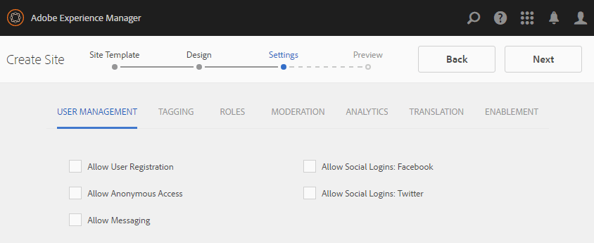

# 创作新的社区站点以进行启用 {#author-a-new-community-site-for-enablement}

## 创建社区站点 {#create-community-site}

[社区站点创建](/help/communities/sites-console.md) 使用向导引导您完成创建社区站点的步骤。 可以前进到 `Next` 步骤或 `Back` 到上一步，然后再在最后一步中提交站点。

要开始创建新社区站点，请执行以下操作：

使用 [创作实例](https://localhost:4502/)

* 使用管理员权限登录并导航到 **[!UICONTROL Communities]** > **[!UICONTROL 站点]**.

* 选择&#x200B;**创建**。

### 步骤1 ：站点模板 {#step-site-template}

在 **站点模板** 步骤，输入URL的标题、描述和名称，然后选择社区站点模板，例如：

* **社区站点标题**: `Enablement Tutorial`.

* **社区站点描述**: `A site for enabling the community to learn.`

* **社区站点根目录**：(对于默认根，保留为空 `/content/sites`)

* **云配置**：（如果未指定云配置，则保留为空）提供指向指定云配置的路径。
* **社区站点基本语言**：（对于单语言，保持不变：英语）使用下拉菜单选择一种语言 *或更多* 可用语言的基础语言 — 德语、意大利语、法语、日语、西班牙语、葡萄牙语（巴西）、繁体中文、简体中文。 将为每种添加的语言创建一个社区站点，并按照中所述的最佳实践存在于同一站点文件夹中 [翻译多语言站点的内容](/help/sites-administering/translation.md). 每个站点的根页面将包含一个由所选语言之一的语言代码命名的子页面，例如“en”表示英语，“fr”表示法语。

* **社区站点名称**: `enable`

   * 初始URL将显示在社区站点名称下方
   * 对于有效的URL，请附加基本语言代码+ &quot;。html&quot;
      *例如*， https://localhost:4502/content/sites/ `enable/en.html`

* **引用站点模板**：下拉菜单以选择 `Reference Structured Learning Site Template`

选择&#x200B;**下一步**。

### 第2步：设计 {#step-design}

“设计”步骤分为两个部分，用于选择主题和品牌推广横幅：

#### 社区站点主题 {#community-site-theme}

选择要应用于模板的所需样式。 选中后，主题将覆盖一个复选标记。

#### 社区站点品牌化 {#community-site-branding}

（可选）上传横幅图像以在网站页面上显示。 横幅将固定到浏览器的左边缘，位于社区网站标题和菜单（导航链接）之间。 横幅高度将裁剪为120像素。 不会调整横幅大小以适合浏览器的宽度和120像素高度。

选择&#x200B;**下一步**。

### 步骤3 ：设置 {#step-settings}

在设置步骤中，选择之前 `Next`，请注意分为七个部分，提供了对涉及用户管理、标记、角色、审核、分析、翻译和支持的配置的访问权限。

#### 用户管理 {#user-management}

建议 [启用社区](/help/communities/overview.md#enablement-community) 私密。

当匿名网站访客被拒绝访问时，社区网站是私有的，不能自行注册，也不能使用社交登录。

确保取消选中大多数复选框 [User Management](/help/communities/sites-console.md#user-management) ：

* 不允许网站访客自行注册。
* 不允许匿名网站访客查看网站。
* 是否允许社区成员之间发送消息的可选方式。
* 不允许使用Facebook登录。
* 不允许使用Twitter登录。

#### 标记 {#tagging}

AEM可以应用于社区内容的标记可通过选择之前通过 [标记控制台](/help/sites-administering/tags.md#tagging-console) (例如 [教程命名空间](/help/communities/enablement-setup.md#create-tutorial-tags))。

此外，为社区站点选择标记命名空间会限制在定义目录和启用资源时显示的选择。 参见 [标记启用资源](/help/communities/tag-resources.md) 以获取重要信息。

使用预输入搜索可以轻松查找命名空间。 例如，

* 类型 `tut`
* 选择 `Tutorial`

### 角色 {#roles}

[社区成员角色](/help/communities/users.md) 通过“角色”部分中的设置进行分配。

要允许社区成员（或成员组）以社区管理员身份体验站点，请使用预输入搜索并从下拉菜单中的选项中选择成员或组名称。

例如，

* 类型 `q`
* 选择 [奎恩·哈珀](/help/communities/enablement-setup.md#publishcreateenablementmembers)

>[!NOTE]
>
>[通道服务](/help/communities/deploy-communities.md#tunnel-service-on-author) 允许选择仅存在于发布环境中的成员和组。

#### 审核 {#moderation}

接受默认全局设置 [审核](/help/communities/sites-console.md#moderation) 用户生成内容(UGC)。

#### ANALYTICS {#analytics}

从下拉列表中，选择为此社区站点配置的Analytics Cloud Service框架。

在荧幕截图上看到的选择， `Communities`，是中的框架示例 [配置文档。](/help/communities/analytics.md#aem-analytics-framework-configuration)

#### 翻译 {#translation}

此 [翻译设置](/help/communities/sites-console.md#translation) 指定是否可以翻译UGC以及可以翻译成哪种语言（如果可以）。

* Check **允许机器翻译**
* 使用默认设置

#### 启用 {#enablement}

对于支持社区，必须确定一个或多个社区支持管理员。

* **启用管理器**
（必填）董事会成员 
`Community Enablement Managers` 可以选择组来管理此社区站点。

   * 类型 `s`
   * 选择 `Sirius Nilson`

* **Marketing Cloud组织ID**
（可选）Adobe Analytics帐户的ID，在包括以下ID时必需： [视频心率分析](/help/communities/analytics.md#video-heartbeat-analytics) 在启用报表中。

选择&#x200B;**下一步**。

### 步骤4 ：创建社区站点 {#step-create-community-site}

选择 **创建。**

当该过程完成时，新站点的文件夹会显示在社区>站点控制台中。

### 发布新社区站点 {#publish-the-new-community-site}

应从“社区 — 站点”控制台管理已创建的站点，该控制台与可能创建新站点的主控台相同。

选择社区站点的文件夹后，将鼠标悬停在站点图标上，以便显示四个操作图标：

选择省略号图标（“更多操作”图标）时，将显示导出站点和删除站点选项。

从左到右分别是：

* **打开站点**

   选择铅笔图标以在作者编辑模式下打开社区站点，以添加和/或配置页面组件。

* **编辑站点**

   选择属性图标以打开社区站点来修改属性，例如标题或更改主题。

* **发布站点**

   选择世界图标以发布社区站点（默认为localhost：4503）。

* **导出站点**

   选择导出图标以创建同时存储在中的社区站点资源包 [包管理器](/help/sites-administering/package-manager.md) 并下载。
请注意，UGC未包含在站点包中。

* **删除站点**

   要删除社区站点，请选择将鼠标悬停在社区站点控制台中的站点上时显示的删除站点图标。 此操作删除与站点关联的所有项目，例如UGC、用户组、资源和数据库记录。

   

#### 选择发布 {#select-publish}

选择世界图标以发布社区站点。

将显示站点已发布的指示。

## 社区用户和用户组 {#community-users-user-groups}

### 注意新的社区用户组 {#notice-new-community-user-groups}

除了新社区站点外，还创建了新的用户组，这些用户组具有针对各种管理功能设置的相应权限。 有关详细信息，请访问 [社区站点的用户组](/help/communities/users.md#usergroupsforcommunitysites).

对于此新社区站点，假定在步骤1中站点名称为“enable”，则可以从以下位置查看发布环境中存在的新用户组： [社区成员和组控制台](/help/communities/members.md#groups-console)：

### 将成员分配到社区启用成员组 {#assign-members-to-community-enable-members-group}

对于作者，启用隧道服务后，可以分配 [在初始设置期间创建的用户](/help/communities/enablement-setup.md#publishcreateenablementmembers) 添加到新创建的社区站点的社区成员组。

使用“社区组”控制台，可以单独添加成员，也可以通过组成员身份添加成员。

在此示例中，组 `Community Ski Class` 添加为组的成员 `Community Enable Members` 以及成员 `Quinn Harper`.

* 导航到 **社区、组** 控制台
* 选择 *社区启用成员* 群组
* 将“ski”输入 **将成员添加到组** 搜索框
* 选择 *社区滑雪课程* （学习者组）
* 在搜索框中输入“quinn”
* 选择 *奎恩·哈珀* （启用资源联系人）

* 选择 **保存**

## 发布配置 {#configurations-on-publish}

`https://localhost:4503/content/sites/enable/en.html {#http-localhost-content-sites-enable-en-html}`

### 配置身份验证错误 {#configure-for-authentication-error}

配置站点并将其推送到发布后， [配置登录映射](/help/communities/sites-console.md#configure-for-authentication-error) ( `Adobe Granite Login Selector Authentication Handler`)。 好处是，如果未正确输入登录凭据，则身份验证错误将重新显示社区站点的登录页面，并显示错误消息。

添加 `Login Page Mapping` 作为：

* `/content/sites/enable/en/signin:/content/sites/enable/en`

### （可选）更改默认主页 {#optional-change-the-default-home-page}

在使用发布站点进行演示时，将默认主页更改为新站点可能很有用。

为此，需要使用 [CRX|DE](https://localhost:4503/crx/de) 精简以编辑 [资源映射](/help/sites-deploying/resource-mapping.md) 发布时显示的表。

要开始使用，请执行以下操作：

1. 发布时，访问CRXDE并使用管理员权限登录

   * 例如，浏览到 [https://localhost:4503/crx/de](https://localhost:4503/crx/de) 并登录 `admin/admin`

1. 在项目浏览器中，展开 `/etc/map`
1. 选择 `http` 节点

   * 选择 **创建节点**

      * **名称** localhost.4503

         (do *非* 使用“：”)

      * **类型** [sling：Mapping](https://sling.apache.org/documentation/the-sling-engine/mappings-for-resource-resolution.html)

1. 包含新创建的 `localhost.4503` 已选择节点

   * 添加属性

      * **名称** sling：match
      * **类型** 字符串
      * **值** localhost.4503/$

   （必须以“$”字符结尾）

   * 添加属性

      * **名称** sling：internalRedirect
      * **类型** 字符串
      * **值** /content/sites/enable/en.html

1. 选择 **全部保存**
1. （可选）删除浏览历史记录
1. 浏览https://localhost:4503/

   * 到达https://localhost:4503/content/sites/enable/en.html

>[!NOTE]
>
>要禁用，只需预挂 `sling:match` 带有“x”的属性值 —  `xlocalhost.4503/$`  — 和 **全部保存**.

#### 疑难解答：保存映射时出错 {#troubleshooting-error-saving-map}

如果无法保存更改，请确保节点名称为 `localhost.4503`，且使用“点”分隔符，而不是 `localhost:4503` 带有“冒号”分隔符， `localhost` 不是有效的命名空间前缀。

#### 故障排除：无法重定向 {#troubleshooting-fail-to-redirect}

“**$**&#39;位于正则表达式末尾 `sling:match` 字符串是至关重要的，因此只有它 `https://localhost:4503/` ，否则重定向值将附加到URL中server：port之后可能存在的任何路径之前。 因此，当AEM尝试重定向到登录页面时，它会失败。

## 修改社区站点 {#modifying-the-community-site}

最初创建站点后，作者可以使用 [“打开站点”图标](/help/communities/sites-console.md#authoring-site-content) 执行标准AEM创作活动。

此外，管理员可以使用 [“编辑站点”图标](/help/communities/sites-console.md#modifying-site-properties) 修改站点的属性，如标题。

进行任何修改后，请记住 **保存** 并重新&#x200B;**Publish** 网站。

>[!NOTE]
>
>如果不熟悉AEM，请查看文档 [基本处理](/help/sites-authoring/basic-handling.md) 和 [页面创作快速指南](/help/sites-authoring/qg-page-authoring.md).

### 添加目录 {#add-a-catalog}

为此社区站点选择的社区站点模板应包含目录功能。

如果不能，则可以轻松添加目录功能。 这将允许未分配到启用资源或学习路径的社区其他成员从目录中选择启用资源。

如果站点结构已包含目录功能，则可以更改其标题。

要修改站点的结构，请导航到 **[!UICONTROL Communities]** > **[!UICONTROL 站点]** 控制台，打开 `enable` 文件夹，然后选择 **编辑站点** 图标以访问 `Enablement Tutorial`.

选择“结构”面板以添加目录或修改现有目录：

* **标题**: `Ski Catalog`

* **URL**: `catalog`

* **选择所有命名空间**：保留为默认值。

* 选择&#x200B;**保存**。

使用“职位”图标将“目录”功能移动到分配之后的第二个职位。

选择 **保存** 以保存对社区站点的更改。

然后重新 — **Publish** 网站。
