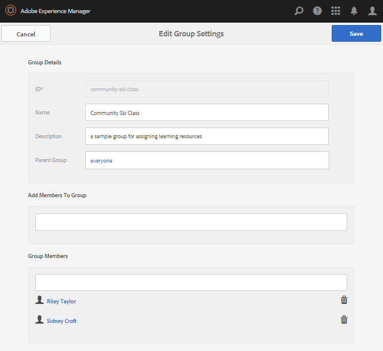

# Enablement {#initial-setup-for-enablement}的初始设置

## 开始作者实例和发布实例{#start-author-and-publish-instances}

出于开发和演示目的，需要运行一个作者和一个发布实例。

按照基本的AEM [快速入门](../../help/sites-deploying/deploy.md#getting-started)说明操作，这将导致

* [localhost:4502](http://localhost:4502/)上的作者环境
* 在[localhost:4503](http://localhost:4503/)上发布环境

对于AEM Communities,

* 作者环境适用于：

   * 开发站点、模板、组件、支持资源和学习路径。
   * 为支持资源和学习路径分配成员和成员组。
   * 生成有关任务、视图和帖子的报告。
   * 管理和配置任务。

* 发布环境适用于：

   * 根据由Enablement Manager管理的主题进行学习／培训。
   * 评论和评级资源以及学习路径。
   * 联系资源联系人。

>[!NOTE]
>
>如果不熟悉AEM，请视图有关[基本操作](../../help/sites-authoring/basic-handling.md)和[页面创作快速指南的文档。](../../help/sites-authoring/qg-page-authoring.md)

## 安装最新的Communities版本{#install-latest-communities-release}

本教程创建[启用社区站点](overview.md#enablement-community)。 要确保安装了最新的功能包，请访问：

* [最新版本](deploy-communities.md#latest-releases)

有关创建[参与社区站点](overview.md#engagement-community)的教程，请访问[AEM Communities](getting-started.md)入门。

## 配置Enablement Features {#configure-enablement-features}

要遵循本教程，必须正确安装和配置enablement[，这需要第三方产品，如MySQL和FFmpeg。](enablement.md)

## 配置 Analytics {#configure-analytics}

为社区站点](analytics.md)配置[Adobe Analytics时，在根据分配给社区成员（学员）的启用资源和学习路径生成的[报告](reports.md)中，可获取更多信息。

## 为通知配置电子邮件{#configure-email-for-notifications}

默认情况下，通知功能可用于使用`Communities Sites`控制台创建的所有站点，它为通知提供电子邮件渠道。

必须为站点正确配置电子邮件。

请参阅[配置电子邮件](email.md)。

## 启用隧道服务{#enable-the-tunnel-service}

在创作环境中创建社区站点时，隧道服务可以创建和管理在发布环境（成员）中注册的用户和用户组，为受信任的社区成员分配角色，以及为学员分配内容。

有关详细信息，请参阅[管理用户和用户组](users.md)。

有关启用隧道服务的简单说明，请参阅[隧道服务](deploy-communities.md#tunnel-service-on-author)。

## 创建教程标记{#create-tutorial-tags}

使用`Tutorial`的标记命名空间创建用于参与和启动教程的标记。

使用[标记控制台](../../help/sites-administering/tags.md#tagging-console)创建以下标记：

* `Tutorial: Sports / Baseball`
* `Tutorial: Sports / Gymnastics`
* `Tutorial: Sports / Skiing`
* `Tutorial: Arts / Visual`
* `Tutorial: Arts / Auditory`
* `Tutorial: Arts / History`

然后，按照说明操作：

1. [设置标记权限](../../help/sites-administering/tags.md#setting-tag-permissions)
1. [发布标记](../../help/sites-administering/tags.md#publishing-tags)

为AEM Communities入门Tutorials创建的标记包示例

[获取文件](assets/communities_tutorialtags-10.zip)

## 创建Enablement Members和Group {#create-enablement-members-and-groups}

对于启用社区站点，站点访客不能[自注册或使用社交登录](sites-console.md#user-management)。

相反，启用[隧道服务](#enable-the-tunnel-service)后，[成员控制台](members.md)将用于在发布环境中注册新成员。

在本教程中，将在发布环境中创建三个成员。 两个成员将成为分配到学习路径的用户组的成员，而第三个成员将成为支持资源联系人。

第四个用户在创作环境中创建，并分配了Communities Administrator和Community Enablement Manager的角色。

>[!NOTE]
>
>创建&#x200B;*Enablement Tutorial*&#x200B;社区站点之前即创建这些成员。
>
>如果在创建之后创建了这些教程，则在创建成员时可以将它们添加为&#x200B;*Enablement Tutorial成员组*&#x200B;的成员。
>
>相反，稍后会将它们分配给成员组[。](enablement-create-site.md#assignuserstocommunityenablemembersgroup)

### Riley Taylor —— 登记者{#riley-taylor-enrollee}

[创建将](members.md#create-new-member) 添加到学员组（社区滑雪课组）的成员。

* **ID**:莱
* **电子邮件**:riley.taylor@mailinator.com
* **密码**:口令
* **确认密码**:口令
* **名字**:莱利
* **姓氏**:泰勒

### Sidney Croft —— 登记者{#sidney-croft-enrollee}

[创建将添](members.md#create-new-member) 加到“社区滑雪课”组的第二个成员。

* **ID**:西德
* **电子邮件**:sidney.croft@mailinator.com
* **密码**:口令
* **确认密码**:口令
* **名字**:西德尼
* **姓氏**:克罗夫特

### Quinn Harper - Enablement Resource联系人和版主{#quinn-harper-enablement-resource-contact-and-moderator}

[创建一](members.md#create-new-member) 个会员，创建站点后，该成员将添加到社区站点的成员组。此会员资格允许在为站点创建启用资源时将该成员分配为启用[资源联系人](resources.md#settings)。

* **ID**:奎恩
* **电子邮件**:quinn.harper@mailinator.com
* **密码**:口令
* **确认密码**:口令
* **名字**:奎恩
* **姓氏**:哈珀

### 添加用户组——社区滑雪类{#add-a-user-group-community-ski-class}

[添加一个名](members.md#create-new-group) 为“社区滑雪课”的新组。

* **ID**:社区滑雪课
* **名称**:社区滑雪课
* **描述**:分配启动资源的示例组
* **将成员添加到组** “添加”:

   * 莱
   * 西德

* 选择&#x200B;**[!UICONTROL 保存]**

### 社区滑雪类属性{#community-ski-class-properties}

>[!NOTE]
>
>在创建社区站点期间，可以将现有成员和组添加到社区站点的成员组。

## 社区管理员角色{#community-administrator-role}

社区管理员组的成员可以创建社区站点、管理站点、管理成员（他们可以禁止社区成员）以及审核内容。

### 创建用户 {#create-user}

在&#x200B;*author*&#x200B;上创建一个用户，该用户被分配为社区管理员的角色：

* 在创作实例上

   * 例如，[http://localhost:4502/](http://localhost:4503/)

* 以管理员权限登录

   * 例如，用户名“admin”/密码“admin”

* 在主控制台中，导航到&#x200B;**[!UICONTROL 工具]** > **[!UICONTROL 操作]** > **[!UICONTROL 安全]** > **[!UICONTROL 用户]**。
* 从&#x200B;**[!UICONTROL 编辑]**&#x200B;菜单中，选择&#x200B;**[!UICONTROL 添加用户]**。

* 在`Create New User`对话框中，输入：

   * **ID(&amp;A);**:天狼星
   * **电子邮件地址**:sirius.nilson@mailinator.com
   * **口令(&amp;A);**:口令
   * **确认口令(&amp;A);**:口令
   * **名字**:天狼星
   * **姓氏(&amp;A);**:尼尔森

### 将Sirius分配给社区管理员组{#assign-sirius-to-community-administrators-group}

向下滚动到`Add User to Groups`:

* 输入“C”以搜索

   * 选择 `Community Administrators`
   * 选择 `Community Enablement Managers`

* 选择&#x200B;**[!UICONTROL 保存]**

