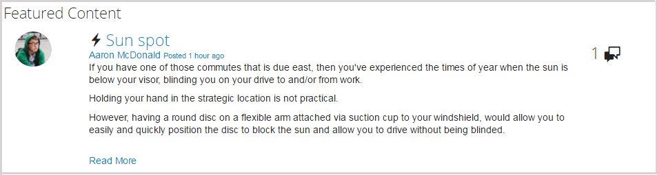

# 特色内容功能 {#featured-content-feature}

## 简介 {#introduction}

特色内容功能为发布环境中的登录站点访客（社区成员）提供了一个区域，用于突出显示以下内容：

* [博客](blog-feature.md)
* [日历](calendar.md)
* [论坛](forum.md)
* [构思](ideation-feature.md)
* [问题与解答](working-with-qna.md)

将内容标记为特色内容后，即会在此组件中列出，这些内容可以放置在易于引起社区成员关注的特定登陆页面或区域中。

每个组件可能允许或不允许使用特征内容功能。

此文档的此部分描述了：

* 将精选内容添加到社区站点。
* `Featured Content`组件的配置设置。

## 将精选内容添加到页面 {#adding-featured-content-to-a-page}

要将`Featured Content`组件添加到创作模式下的页面，请使用组件浏览器来查找

* `Communities / Featured Content`

并将其拖动到应显示精选内容的页面上的适当位置。

有关必要的信息，请访问[社区组件基础知识](basics.md)。

当包含[所需的客户端库](essentials-featured.md#essentials-for-client-side)时，`Featured Content`组件的显示方式如下：

## 配置精选内容 {#configuring-featured-content}

选择放置的`Featured Content`组件，以便您可以访问并选择用于打开“编辑”对话框的`Configure`图标。

### “设置”选项卡 {#settings-tab}

在&#x200B;**[!UICONTROL 设置]**&#x200B;选项卡下，标识要使用的内容：

* **[!UICONTROL 显示名称]**

  特色内容列表的标题。 例如，`Featured Questions`或`Featured Ideas`。 如果留空，默认值为`Featured Content`。

* **[!UICONTROL 精选内容的位置]**

  *（必需）*&#x200B;浏览到包含可精选内容的页面（该页面的组件必须配置为允许精选内容）。 例如：`/content/sites/engage/en/forum`。

* **[!UICONTROL 显示限制]**

  可显示的最大特色内容数量。 默认值为5。

## 网站访客体验 {#site-visitor-experience}

要将内容标记为精选内容，需要拥有审查方权限。

当审阅人查看发布的内容时，他们可以访问上下文内审阅标记，其中包括新的`Feature`标记。

在标记为功能后，审核标记将变为`Unfeature`。

包含`Featured Content`组件的页面现在包含此帖子。

`Read More`链接到实际帖子。

## 附加信息 {#additional-information}

可在[精选内容](essentials-featured.md)页面上为开发人员找到更多信息。

若要将内容标记为精选，请参阅[审核用户生成的内容](moderate-ugc.md)。
