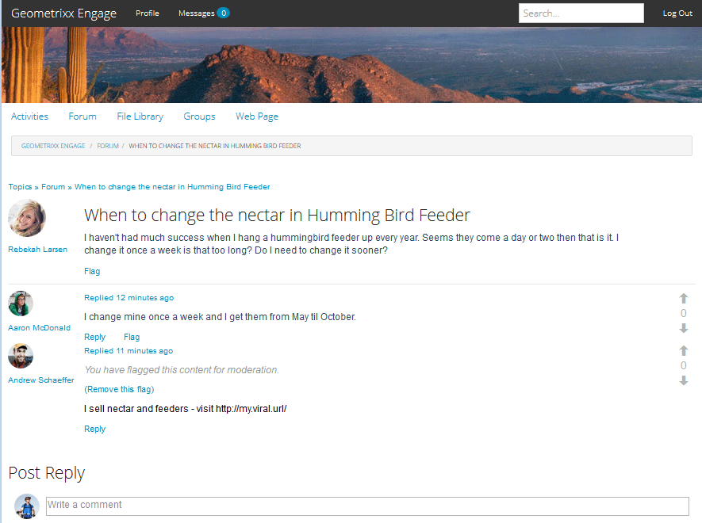

# 上下文审核 {#in-context-moderation}

对于AEM Communities，审核可由管理员和受信任的社区成员直接在发布社区内容的页面上执行。

使用 [审核控制台](moderation.md)，则显示的内容信息包括一个指向已发布页面的链接，以便访问审核上下文关联时可用的其他审核操作。

## 审核操作 {#moderation-actions}

有关的描述，请访问审核概述 [审核操作](moderate-ugc.md#moderation-actions).

## 审核UI {#moderation-ui}

发布实例上向审核者显示的UI包含在用于发布和管理用户生成内容(UGC)的对话框中。 UI的元素取决于网站访客的状态 — 无论它们是……

1. 发布内容的成员。
1. 受信任的成员审核者。
1. 管理员。
1. 已登录，但既不是管理员、审核者，也不是内容的作者。
1. 未登录。

## 示例 {#example}

使用 [Geometrixx参与](http://localhost:4503/content/sites/engage/en.html) 网站创建时 [开始使用AEM Communities](getting-started.md)，则可以在论坛中快速设置一个线程，以便在发布环境中体验各种审核活动，如下所示。

Aaron McDonald(aaron.mcdonald@mailinator.com)在创建网站时将他添加到社区参与审核者组，从而被确认为受信任的社区成员。

Rebekah Larsen(rebekah.larsen@trashymail.com)可以使用 [“成员”控制台](members.md).

有关社区用户组的更多信息，请访问 [管理用户和用户组](users.md).

### 创建论坛帖子 {#create-the-forum-posts}

* 以丽贝卡·拉森(rebekah.larsen@trashymail.com)的身份登录

   * 选择论坛
   * 选择新建帖子
   * 输入主题

      蜂鸟喂食器的花蜜何时换

   * 输入正文文本

      我每年在蜂鸟饲养器上挂一只蜂鸟，这样我就没什么成功。 看来他们来了一两天，就是这样。 我每周换一次，那么长吗？ 我需要更早吗？

   * 选择帖子
   * 选择注销

* 以Aaron McDonald的身份登录(aaron.mcdonald@mailinator.com)

   * 选择论坛
   * 对于“蜂鸟”主题，选择阅读更多
   * 输入帖子回复的评论

      我每周换一次，从5月到10月。

   * 选择回复
   * 选择注销

* 以Andrew Schaeffer(andrew.schaeffer@trashymail.com)的身份登录

   * 选择论坛
   * 对于“蜂鸟”主题，选择阅读更多
   * 输入帖子回复的评论

      我销售花蜜和饲料 — 请访问https://my.viral.url/

   * 选择回复
   * 选择注销

### 匿名网站访客(#5) {#anonymous-site-visitor}

以下是未登录(5)的网站访客查看的论坛视图。

匿名网站访客只能查看论坛，但我的访客不能发布任何内容，也不能执行任何审核操作。

### 新成员(#4) {#new-member}

在创作时，以管理员身份登录，并使用 [“成员”控制台](members.md)，然后注销。

在发布时，以Boyd Larsen身份登录，并通过选择 `Forum`，然后 `Read more` 蜂鸟的哨所。

通知:

* 博伊德没有参加论坛。
* Boyd无法删除任何内容。
* Boyd已登录，可以回复或标记内容。

让博伊德选择标志来标记Andrew发布的内容。

注销

### 管理员(#3) {#administrator}

以管理员（管理员）身份登录，通过选择论坛，然后阅读帖子的更多内容来访问该线程。

通知:

* 管理员可以标记、删除、编辑、拒绝、剪切、关闭、固定、功能。
* 管理员可以选择管理以访问审核控制台。

选择“管理”菜单项以访问 [审核控制台](moderation.md) 中。

请注意，对于管理员，所有可审核的内容都可见，而不仅仅是Geometrixx参与社区站点中的内容。

搜索筛选器是用于打开或关闭的侧面板。

注销.

### 社区主持人(#2) {#community-moderator}

以社区主持人Aaron McDonald(aaron.mcdonal@mailinator.com)的身份登录，通过选择论坛，然后为蜂鸟帖子阅读更多内容来访问主题。

通知:

* Aaron可以回复、删除、编辑或拒绝他自己的帖子。
* Aaron还可以标记/允许、回复、删除、编辑、拒绝其他内容。
* 亚伦可以剪掉论坛话题，将话题转移到他主持的另一个论坛。
* Aaron可以选择“管理”以访问审核控制台。

选择“管理”菜单项以访问 [审核控制台](moderation.md) 中。

请注意，对于社区主持人，只能看到“Geometrixx参与”社区站点中的可审核内容。

请注意，社区审查方具有与管理员相同的选项（图像在搜索侧栏处于关闭状态时），但无权访问其他AEM控制台。

注销.

### 内容作者(#1) {#content-author}

以Rebekah Larsen(rebekah.larsen@mailinator.com)的身份登录，他是社区成员，发起了主题，通过选择论坛访问主题，然后为蜂鸟帖子阅读更多内容。

通知:

* Rebekah可以删除或编辑她自己的帖子。
* Rebekah还可以回复或标记其他内容。
* Rebekah无法访问审核控制台。

