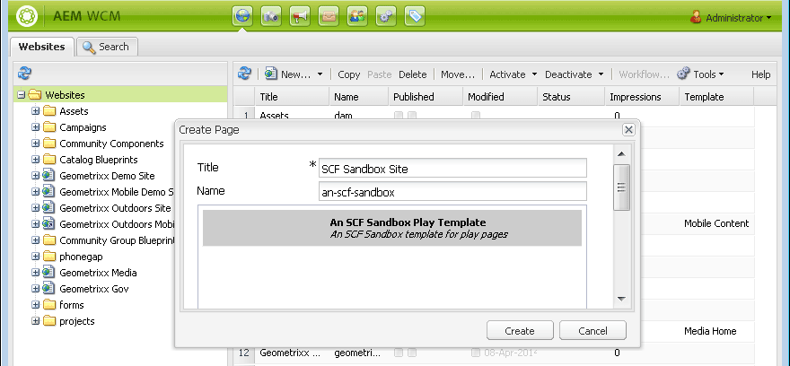

# 初始沙盒内容 {#initial-sandbox-content}

在此部分中，您将创建以下页面，所有这些页面均使用 [页面模板](initial-app.md#createthepagetemplate):

* SCF沙盒站点，该站点将重定向到主页的英文版本。

   * SCF沙盒 — 网站英文版本的主页。

   * SCF播放 — 要播放的主页的子项。

尽管本教程不深入 [语言副本](../../help/sites-administering/tc-prep.md)，因此根页面可以通过HTML标头对用户实施首选语言的检测，并重定向到相应的语言主页。 惯例是使用双字母国家/地区代码表示页面的节点名称，例如，“en”表示英语，“fr”表示法语，等等。

## 创建首页 {#create-first-pages}

现在有 [页面模板](initial-app.md#createthepagetemplate)，则可以在/content目录中建立网站的根页面。

1. 标准UI当前提供了创建站点的蓝图。 由于本教程将创建一个简单的站点，因此经典UI非常有用。

   要切换到经典UI，请选择全局导航，并将鼠标悬停在“项目”图标的右侧。 选择 *切换到经典UI* 图标：

   

   切换到经典UI的功能必须 [由管理员启用](../../help/sites-administering/enable-classic-ui.md).

1. 从 [经典UI欢迎页面](http://localhost:4502/welcome.html)，选择 **[!UICONTROL 网站]**.

   

   或者，浏览到 [/siteadmin。](http://localhost:4502/siteadmin)

1. 在资源管理器窗格中，选择 **[!UICONTROL 网站]** ，然后在工具栏中选择 **[!UICONTROL 新建]** > **[!UICONTROL 新页面]**.

   在 **[!UICONTROL 创建页面]** 对话框，输入以下内容：

   * 标题: `SCF Sandbox Site`
   * 名称: `an-scf-sandbox`
   * 选择 **[!UICONTROL SCF沙盒播放模板]**
   * 单击 **[!UICONTROL 创建]**

   

1. 在资源管理器窗格中，选择之前创建的页面， `/Websites/SCF Sandbox Site`，然后单击 **[!UICONTROL 新建]** > **[!UICONTROL 新页面]**:

   * 标题: `SCF Sandbox`
   * 名称: `en`
   * 选择 **[!UICONTROL SCF沙盒播放模板]**
   * 单击 **[!UICONTROL 创建]**

1. 在资源管理器窗格中，选择之前创建的页面， `/Websites/SCF Sandbox Site/SCF Sandbox`，然后单击 **[!UICONTROL 新建]** > **[!UICONTROL 新页面]**

   * 标题: `SCF Play`
   * 名称: `play`
   * 选择 **[!UICONTROL SCF沙盒播放模板]**
   * 单击 **[!UICONTROL 创建]**

1. 网站现在以此方式显示在“网站”控制台中。 请注意，在资源管理器窗格中选择的项目的子页面显示在可以管理这些子页面的右侧窗格中。

   

   这是使用网站工具和模板创建的内容的存储库视图：

   

## 添加设计路径 {#add-the-design-path}

When ` [/etc/designs/an-scf-sandbox](setup-website.md#setupthedesigntreeetcdesigns)` 是使用“工具”控制台的“设计”部分创建的，属性为“

* `cq:template="/libs/wcm/core/templates/designpage"`

定义了，该功能提供了在脚本中使用引用设计资产的可选功能 `currentDesign.getPath()`. 例如

* `% String favIcon = currentDesign.getPath() + "/favicon.ico"; %`

   * 名称: `cq:designPath`
   * 类型: `String`
   * 值: `/etc/designs/an-scf-sandbox`

* 单击绿色 `[+] Add`

存储库应如下所示：

* 单击 **[!UICONTROL 全部保存]**

如果在保存配置时遇到任何问题，请重新登录并再次配置。

>[!NOTE]
>
>的使用 `cq:designPath` 是可选的，且与 [clientlibs的使用](develop-app.md#includeclientlibsintemplate),SCF组件使用时基本上要求使用 [clientlibs](client-customize.md#clientlibs-for-scf) 以管理其JS和CSS。
