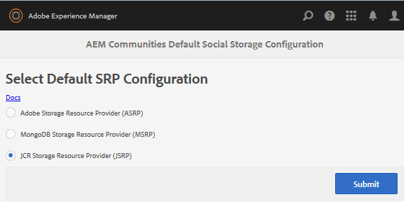

# JSRP - JCR存储资源提供程序 {#jsrp-jcr-storage-resource-provider}

## 关于JSRP {#about-jsrp}

当AEM Communities使用JSRP作为其存储选项（默认）时，社区内容存储在JCR中，并且用户生成的内容(UGC)只能从发布该内容的创作或发布实例中访问。

由于部署的简单性，JSRP最适合一个Publish实例和一个Author实例的演示或开发环境。

另请参阅[SRP选项的特性](working-with-srp.md#characteristics-of-srp-options)和[推荐的拓扑](topologies.md)。

## 配置 {#configuration}

### 选择JSRP {#select-jsrp}

默认情况下，JSRP是UGC的存储选项。

[存储配置控制台](srp-config.md)允许选择默认存储配置，该配置标识要使用的SRP实现。

在创作环境中，访问存储配置控制台

* 从全局导航： **[!UICONTROL 工具]** > **[!UICONTROL 社区]** > **[!UICONTROL 存储配置]**

* 选择&#x200B;**[!UICONTROL JCR存储资源提供程序(JSRP)]**

* 选择&#x200B;**[!UICONTROL 提交]**

### 发布配置 {#publishing-the-configuration}

虽然JSRP是默认配置，但为确保在发布环境中设置了相同的配置：

* 从全局导航： **[!UICONTROL 工具]** > **[!UICONTROL 部署]** > **[!UICONTROL 复制]**
* 选择&#x200B;**[!UICONTROL 激活树]** > **[!UICONTROL 开始路径]**：

   * 浏览到`/conf/global/settings/community/srpc/`

* 选择&#x200B;**[!UICONTROL 激活]**

## 管理用户数据 {#managing-user-data}

有关&#x200B;*用户*、*用户配置文件*&#x200B;和&#x200B;*用户组*&#x200B;的信息（通常在发布环境中输入），请访问：

* [用户同步](sync.md)
* [管理用户和用户组](users.md)

## 疑难解答 {#troubleshooting}

### UGC在JCR中不可见 {#ugc-not-visible-in-jcr}

通过检查存储选项的配置，确保JSRP已配置为默认提供程序。 默认情况下，存储资源提供程序为JSRP。

在所有Author和Publish AEM实例上，重新访问“存储配置”控制台，或检查AEM存储库：

* 在JCR中，如果[/conf/global/settings/community](http://localhost:4502/crx/de/index.jsp#/conf/global/settings/community)

   * 它不包含[srpc](http://localhost:4502/crx/de/index.jsp#/conf/global/settings/community/srpc)节点，这意味着存储提供程序是JSRP。
   * 如果srpc节点存在并且包含节点[defaultconfiguration](http://localhost:4502/crx/de/index.jsp#/conf/global/settings/community/srpc/defaultconfiguration)，则defaultconfiguration的属性应将JSRP定义为默认提供程序。

### UGC在创作实例上不可见 {#ugc-not-visible-on-author-instance}

这不是错误。 JSRP的一个特征是，在发布环境中输入的社区内容仅在Publish环境中可见。

### UGC在Publish实例上不可见 {#ugc-not-visible-on-publish-instance}

如果部署了单个Publish实例或发布群集，请按照[UGC Not Visible in JCR](#ugc-not-visible-in-jcr)中的说明操作。

如果部署了发布场，则JSRP的一个特征是社区内容仅在其发布到的Publish实例上可见。

要使任何Publish实例都可以看到UGC，需要发布集群。
