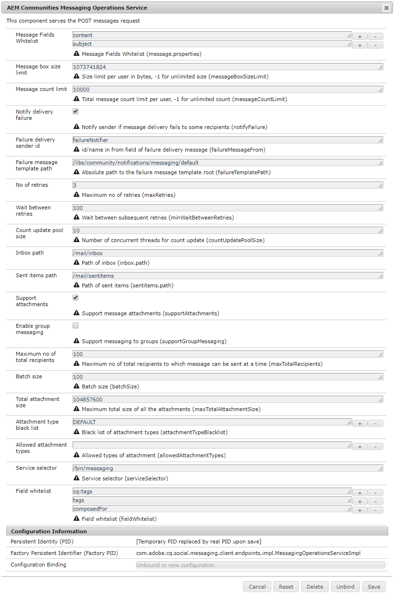

# 配置消息传送 {#configure-messaging}

## 概述 {#overview}

AEM Communities的消息传送功能允许登录的网站访客（成员）向彼此发送登录网站时可访问的消息。

通过在[社区站点创建](/help/communities/sites-console.md)期间选中复选框，为社区站点启用消息传送。

本页包含有关默认配置和可能调整的信息。

有关开发人员的详细信息，请参阅[消息传送Essentials](/help/communities/essentials-messaging.md)。

## 消息传送操作服务 {#messaging-operations-service}

配置[AEM Communities邮件操作服务](https://localhost:4502/system/console/configMgr/com.adobe.cq.social.messaging.client.endpoints.impl.MessagingOperationsServiceImpl)标识处理邮件相关请求的端点、服务应用于存储邮件的文件夹，以及如果邮件可能包含文件附件，则允许的文件类型。

对于使用`Communities Sites console`创建的社区站点，已存在服务的实例，收件箱设置为`/mail/inbox`。

### 社区消息传送运营服务 {#community-messaging-operations-service}

如下所示，使用[站点创建向导](/help/communities/sites-console.md)创建的站点存在服务的配置。 通过选择配置旁边的铅笔图标，可以查看或编辑配置。

### 添加新的配置 {#add-new-configuration}

要添加配置，请选择服务名称旁边的加号“**+**”图标：

* 列入允许列表 **消息字段**

  指定用户可以编辑并保留的撰写消息组件的属性。 如果添加了新表单元素，则必须添加元素ID（如果需要）以存储在SRP中。 默认值为两个条目：*subject*&#x200B;和&#x200B;*content*。

* **消息框大小限制**

  每个用户的消息框中的最大字节数。 默认值为&#x200B;*1073741824* (1 GB)。

* **邮件数限制**

  每个用户允许的消息总数。 值为–1表示允许消息数量不受限制，但受消息框大小限制。 默认值为&#x200B;*10000* (10k)。

* **通知投放失败**

  如果选中此选项，则在邮件发送给某些收件人失败时通知发件人。 默认值为&#x200B;*选中*。

* **失败传递发件人ID**

  投放失败消息中显示的发件人名称。 默认值为&#x200B;*failureNotifier*。

* **失败消息模板路径**

  投放失败消息模板根目录的绝对路径。 默认值为&#x200B;*/etc/notification/messaging/default*。

* **重试次数**

  尝试重新发送无法传递的消息的次数。 默认值为&#x200B;*3*。

* **在重试之间等待**

  发送失败时尝试重新发送消息之间等待的秒数。 默认值为&#x200B;*100*（秒）。

* **更新池大小计数**

  用于计数更新的并发线程数。 默认值为&#x200B;*10*。

* **收件箱路径**

  （*必需*）要用于`inbox`文件夹的相对于用户节点(/home/users/*username*)的路径。 路径不能以尾随正斜杠“/”结尾。 默认值为&#x200B;*/邮件/收件箱*。

* **发送项路径**

  （*必需*）要用于`sent items`文件夹的相对于用户节点(/home/users/*username*)的路径。 路径不能以尾随正斜杠“/”结尾。 默认值为&#x200B;*/mail/sentitems* 。

* **支持附件**

  如果选中，用户将能够向其邮件添加附件。 默认值为&#x200B;*选中*。

* **启用组消息**

  如果选定此选项，则注册的用户可以向一组成员发送批量消息。 默认值为&#x200B;*已取消选择*。

* **最大数量 收件人总数**

  如果启用了组消息，请指定一次可向其发送组消息的最大收件人数。 默认值为&#x200B;*100*。

* **批次大小**

  发送给大量收件人时要批处理在一起进行发送的消息数。 默认值为&#x200B;*100*。

* **附件总大小**

  如果选中supportAttachments ，此值指定所有附件允许的最大总大小（字节）。 默认值为&#x200B;*104857600* (100 MB)。

* 列入阻止列表 **附件类型**

  以“**”为前缀的文件扩展名阻止列表。**，已被系统拒绝。 如果未列入阻止列表，则允许扩展。 可以使用“**+**”和“**-**”图标添加或删除扩展。

* **允许的附件类型**

  **（*需要操作*）**&#x200B;文件扩展名的允许列表 列入阻止列表，与格式相反。 列入阻止列表要允许除那些文件扩展名之外的所有文件扩展名，请使用“**-**”图标删除单个空条目。

* **服务选择器**

  （*必需*）用来调用服务的绝对路径（终结点）（虚拟资源）。 所选路径的根必须包含在OSGi配置[`Apache Sling Servlet/Script Resolver and Error Handler`](https://localhost:4502/system/console/configMgr/org.apache.sling.servlets.resolver.SlingServletResolver)的&#x200B;*执行路径*&#x200B;配置设置中，如`/bin/`、`/apps/`和`/services/`。 要为站点的消息功能选择此配置，此终结点将作为`Message List and Compose Message components`的&#x200B;**`Service selector`**&#x200B;值提供（请参阅[消息功能](/help/communities/configure-messaging.md)）。

  默认值为&#x200B;*/bin/消息* 。

* 列入允许列表 **字段**

  列入允许列表使用&#x200B;**消息字段**。

>[!CAUTION]
>
>每次打开`Messaging Operations Service`配置进行编辑时，如果删除了`allowedAttachmentTypes.name`，则会读取空条目以使属性可配置。 单个空条目会有效地禁用文件附件。
>
>若要允许除已列入阻止列表文件扩展名之外的所有文件扩展名，请使用“**-**”图标，在单击“**保存**”之前（再次）删除单个空条目。

## 组消息 {#group-messaging}

若要允许注册用户将私信批量发送到用户组，请确保在&#x200B;**消息操作服务**&#x200B;配置的以下两个实例中&#x200B;**启用组消息传递**：

* `com.adobe.cq.social.messaging.client.endpoints.impl.MessagingOperationsServiceImpl~social-console`
* `com.adobe.cq.social.messaging.client.endpoints.impl.MessagingOperationsServiceImpl~social-messaging`

**消息传送操作服务：社交控制台**

**消息操作服务：社交消息**

## 疑难解答 {#troubleshooting}

解决问题的一种方法是在日志中启用[调试消息。](/help/sites-administering/troubleshooting.md)

另请参阅[单个服务的记录器和写入程序](/help/sites-deploying/configure-logging.md#loggers-and-writers-for-individual-services)。

要监视的包为`com.adobe.cq.social.messaging`。
